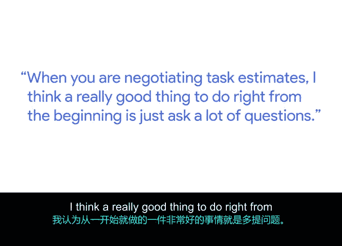

**谷歌项目管理专业证书：第6课：顶尖：在现实世界中应用项目管理课程 - P22：项目经理的同理心实践** 🧠

---

### **概述**
在本节课中，我们将探讨同理心在项目管理中的重要性，并学习项目经理托丽分享的实践经验。我们将了解如何通过理解团队成员和利益相关者的不同需求与沟通风格，来更有效地推动项目，并学习在任务估算和沟通中应用同理心的具体方法。

---

### **同理心在项目管理中的重要性**
同理心在项目管理中至关重要。项目经理经常需要与团队成员和利益相关者打交道，而这些人可能拥有不同的工作风格和沟通方式。因此，学会与不同风格的人沟通，并针对不同受众调整你的信息传递方式，是项目成功的关键。

能够理解他人的感受和偏好的沟通方式，有助于确保你以一种有效的方式传达项目目标和影响力。

---

### **实践同理心的一个案例**
上一节我们讨论了同理心的重要性，本节中我们来看看一个具体的实践案例。托丽分享了她作为项目经理时运用同理心的一次经历。

当时，她带领一个由五人组成的项目团队，遇到了一些错过截止日期的问题。为了解决这个问题，她与其中一位项目成员进行了沟通，试图了解情况背后的原因。

通过沟通，他们最终发现该成员遇到了一些个人事务。基于这个理解，团队最终调整了资源分配，并寻求了其他团队成员的帮助。

这个案例展示了如何“设身处地”地理解他人，认识到工作之外还有许多事情在发生。有时，你可以根据需要调整时间线和截止日期，或者在过程中寻求其他团队成员的帮助。

---

### **在任务估算中应用同理心**
在协商任务估算时，从一开始就采取正确的方法非常重要。以下是开始时可采取的有效步骤：

*   **多提问**：与团队中的不同成员交谈。
*   **借鉴经验**：如果你刚加入团队，可以向经验更丰富的同事请教。
*   **参考过往项目**：尝试寻找与你当前领导的项目相似的过往项目案例。
*   **研究不同时间线的项目**：查看其他时间线不同但可作参考的项目。

从一开始就提出大量问题，并尽可能收集数据和信息，这将对项目初期规划大有裨益。

---

### **总结**
本节课中，我们一起学习了同理心在项目管理中的核心作用。我们了解到，通过理解团队成员的个人情况和沟通偏好，项目经理可以更灵活地调整计划、分配资源，从而更有效地推动项目前进。关键在于积极沟通、收集信息，并在必要时展现灵活性。