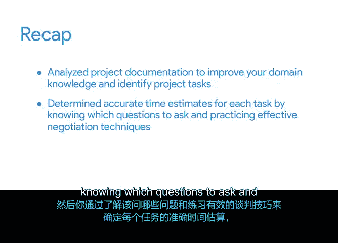

# 023：总结

在本节课中，我们将回顾并总结你在项目生命周期中从启动阶段过渡到规划阶段所完成的关键活动。你将看到如何将所学知识和技能应用于构建一个实际的项目计划。

## 📋 从启动到规划的过渡

上一节我们介绍了项目启动阶段的核心要素。本节中，我们来看看你在规划阶段完成的一系列活动。你成功地将项目从启动阶段推进到了规划阶段，并将你的知识和技能付诸实践，着手制定了一份详细的项目计划。

## 🔍 任务识别与分析

为了构建有效的计划，你首先需要识别所有必要的任务。以下是你在这一步骤中完成的工作：

*   **分析项目文档**：通过审阅现有文档，你加深了对项目领域的理解，并从中识别出了关键的项目任务。
*   **进行补充研究**：你通过在线调研，以及与项目团队和领域专家的关键沟通分析，发现了更多潜在的任务。

## ⏱️ 任务时间估算

识别任务后，下一步是为每项任务确定准确的时间估算。你掌握了以下核心方法：

*   **有效提问与协商**：你学会了通过提出正确的问题，并运用有效的谈判技巧，来获取更现实的时间估算。
*   **三点估算法的应用**：你使用**三点估算法**为估算添加了置信水平评级。该方法的公式为：
    `估算值 = (最乐观时间 + 4 * 最可能时间 + 最悲观时间) / 6`
*   **展现同理心**：在与团队成员讨论任务估算时，你学会了如何展现同理心，以促进更合作、更积极的沟通。

## 📈 项目计划的价值

你为“Sauce & Spoon”餐厅平板电脑推广项目所构建的项目计划，将成为你项目管理作品集的重要组成部分。这份计划展示了你的核心能力：

*   将大型项目分解为一系列可实现的、更小的任务。
*   在面试中，你可以利用这份计划来具体阐述你处理项目管理工作的思路和方法。

## 🚀 下一步：进入执行阶段

至此，我们已经完成了项目规划阶段的总结。接下来，我们将通过制定质量管理计划，为“Sauce & Spoon”项目进入执行阶段做好准备。

本节课中我们一起学习了如何从项目启动过渡到规划，掌握了通过文档分析、研究和沟通来识别任务，并运用提问、协商和三点估算法进行准确的时间估算。你所创建的项目计划是展示你项目管理能力的重要成果。

