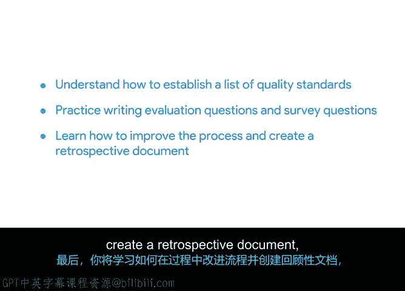

**谷歌项目管理专业证书：第6课：在现实世界中应用项目管理课程 - P24：24_03_01_引言：保持质量**

欢迎回来。到目前为止，你已经为“酱汁与勺子”餐厅的平板菜单推广项目完成了项目章程和项目计划。

接下来，我们将从项目生命周期的规划阶段，进入到执行阶段。

但在开始执行之前，你需要确保项目的质量管理计划已经制定完成。这样你才能确保交付的项目成果符合利益相关者的期望。

在接下来的视频和活动中，你将练习为项目定义质量标准。

然后，你将评估项目标准被满足的程度，并向利益相关者汇报你的发现。

你还将创建一份回顾文档。项目经理在讨论项目进展和需要进行的流程改进时，会使用这份文档。

在开始之前，我们先回顾一下本课程的项目场景。

“酱汁与勺子”是一个小型但正在发展的连锁餐厅，拥有五家分店。

他们聘请了Pi作为首位内部项目经理，负责在两家分店试点推出平板菜单。

在接下来的几个视频中，我将分享有用的信息，帮助你完成每个活动和评估。

我还会提供一些技巧，供你在完成本课程后继续使用。

当我们完成时，你将了解如何为“酱汁与勺子”项目的某个方面建立一份质量标准清单。

你还将练习编写评估问题和调查问题，以帮助你判断质量标准是否得到满足。

最后，你将学习如何在过程中改进流程，并创建一份回顾文档。

你可以将这份文档添加到你的项目管理文档组合中。

准备好开始了吗？我们下一个视频见，我们将开始制定你的质量管理计划。