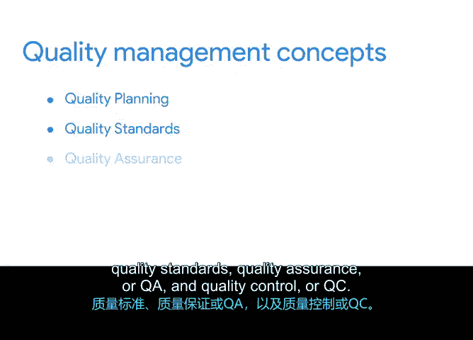

# 025：关键质量管理概念 🎯

在本节课程中，我们将学习项目质量管理中的核心概念，包括质量规划、质量标准、质量保证和质量控制。理解这些概念对于确保项目交付成果符合利益相关者的期望至关重要。

---

## 关键质量管理概念回顾 📚

在之前的课程中，我们已经介绍了质量管理的主要概念。本节将对这些概念进行快速回顾，并详细讨论维持项目质量的重要性与目的。

项目规划与执行的一个关键部分，是实施质量管理计划，并在整个项目过程中严格遵守它。

### 质量规划

质量规划是指项目经理或团队为识别和确定与项目整体相关的质量标准，以及如何满足这些标准而建立并遵循的过程。我们不能简单地启动一个项目并假设一切都会顺利。这就是为什么进行质量规划很重要。

拥有明确定义的标准、流程和评估方法，有助于你专注于项目是否成功推进，并提醒你需要进行哪些调整以保持项目正常进行。

请记住，作为项目经理，你负责项目的规划与执行，也负责项目的成功完成。质量规划与总体项目规划协同工作，并与整体项目流程、项目目标和成功标准保持一致。

以“酱料与勺子”平板项目为例，其质量管理计划的细节将侧重于质量标准、评估问题和反馈调查，以确保项目交付质量并产生期望的结果。

### 质量管理的益处

在项目中创建和维护质量管理有许多益处。

以下是其中一些主要益处：
*   **交付高质量产品**：确保最终成果符合预期标准。
*   **降低间接成本**：间接成本是“成本”的另一种说法。质量管理通过减少需要组织花费资金修复的错误数量，来帮助降低间接成本。
*   **增强协作与持续评审**：质量管理流程确保团队不断学习和提供反馈，这反过来又确保项目正朝着实现其预期成果的方向前进。

---

## 质量管理的核心组成部分 ⚙️

上一节我们介绍了质量规划及其益处，本节中我们来看看构成质量管理的几个核心概念。

### 质量标准

质量标准是用于确保材料、产品、流程和服务适合实现期望结果的要求、规范或指南。它们为评估项目输出提供了明确的基准。

### 质量保证

质量保证（QA）是一个评估过程，用于判断你的项目是否正在朝着交付高质量服务或产品的方向前进。它侧重于预防缺陷，通过改进过程来确保质量。

### 质量控制

质量控制（QC）是指在发现问题时，用于确保维持质量标准的技术。它侧重于识别缺陷，通过检查输出来确保质量。

在许多项目中，所有这些概念都会被整合到一个总体的质量管理计划中。该计划记录了在整个项目生命周期中有效管理质量所需的所有信息。

质量管理计划定义了项目质量的政策、程序和标准，以及执行这些政策的角色和职责。虽然开发和跟踪质量管理的方法多种多样，但构成质量管理体系的益处和核心概念是相同的。

---

## 总结与下一步 🚀

本节课中我们一起学习了项目质量管理的关键概念。我们回顾了质量管理的益处，包括交付高质量产品、降低间接成本以及增强协作与评审。我们也明确了质量管理的核心概念：质量规划、质量标准、质量保证（QA）和质量控制（QC）。理解这些益处和概念将帮助你确保交付的项目满足利益相关者的期望。

接下来，你将应用对质量管理的理解，为“酱料与勺子”平板试点项目制定质量标准。我们将在下一个视频中继续学习如何操作。