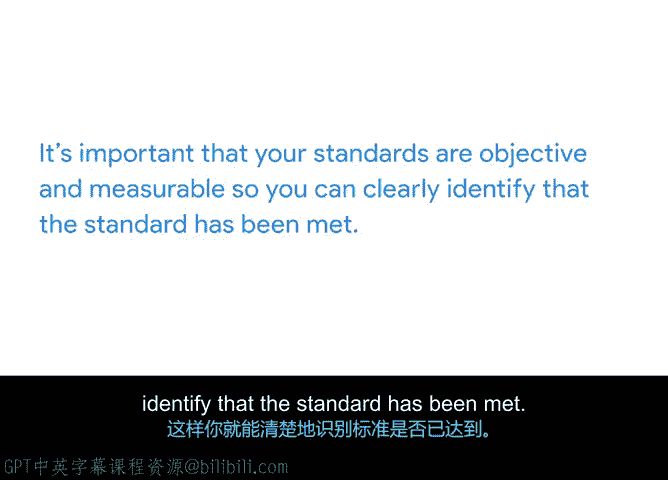

# 026：定义质量标准

在本节课中，我们将学习如何为项目定义质量标准。我们将探讨项目质量的含义，并介绍如何确定和评估这些标准，以确保项目目标的达成。

## 什么是项目质量？

上一节我们回顾了质量管理的好处和主要概念，本节中我们来看看如何定义质量标准。

项目质量意味着确保你交付了承诺的成果，并且尽可能高效地完成。按时且在预算内完成项目，并不一定意味着你达成了目标。你需要确保交付的项目满足利益相关者的需求。这就是为什么项目质量需要在项目的整个生命周期中被跟踪。

你可以通过为项目的各个方面定义质量标准来衡量项目质量，例如主要任务、里程碑和可交付成果。

## 理解质量标准

质量标准是您的产品或服务必须满足的要求和规范，以便被您的组织和客户视为成功。建立标准有助于您在规划和执行阶段，乃至项目启动后，找到测试和评估项目质量的方法。

如果项目的某个方面未能达到商定的标准，您就有机会调整项目计划以满足这些标准。

让我们以“Sauce and Spoon”餐厅的平板点餐项目为例。其中一个可交付成果是培训管理层、前台员工和后台员工。

您如何知道这个可交付成果是否成功完成？利益相关者对于满足此可交付成果的要求有何期望或标准？

请思考员工在培训结束后需要能够做什么或展示什么。每个员工小组是否需要接受相同的培训？管理层的培训要求是否与前台和后台员工不同？培训是否需要在特定的时间、预算或地理范围内完成才能被视为成功？

您对这些问题的回答将是制定此可交付成果质量标准的起点。

## 确定质量标准的资源

有多种资源可以帮助您确定项目的标准，并且标准会因项目类型而异。

以下是确定质量标准时可参考的主要资源：

*   **项目文件**：首先要查阅的是商业案例和项目章程等文件。这些文件阐明了项目的目标、范围、预算和其他细节，有助于明确项目的不同要求，确保其符合利益相关者的期望。
*   **与专家和利益相关者沟通**：就像您识别任务和估算时间时一样，如果您需要更多信息来确定质量标准，可以与专家和利益相关者进行沟通。
*   **行业研究**：在互联网上进行行业研究，看看您正在进行的项目类型是否有既定的质量标准。例如，软件和建筑行业在功能性、设计和安全性方面都有既定的质量标准。

您在许多行业中会发现的其他既定质量标准类别包括易用性、生产力、有效性和客户满意度。

## 确保标准的客观性与可衡量性

您的标准必须是客观且可衡量的，这样才能清楚地识别标准是否已满足。

在进行沟通和研究时，您可能会注意到利益相关者提到一个笼统的类别，比如“易用性”，但没有提供具体细节。作为项目经理，您应该通过提问来获取具体细节，例如：“平板电脑易于使用或难以使用的标志是什么？”您可能会得到这样的回答：“下单时间不应超过20秒”，或者“回头客反馈说，使用平板电脑比通过服务员点餐更快”。

现在，您就拥有了客观、可衡量的标准。

## 思考标准时的问题

当考虑各种标准时，您可以问自己几个问题来帮助明确目标。

如果标准与生产力和有效性相关，您可能会想问：

*   平板电脑的存在是否应该改变前台员工的工作方式？
*   它是否让他们更快，或者允许他们同时服务更多餐桌？

如果标准与客户满意度相关，您可以问：

*   平板电脑理想情况下会如何影响顾客的体验？
*   您希望顾客在使用平板电脑后做什么或说什么？

通过向自己或任务专家提出这类问题，您可以缩小范围，确定您旨在使其客观且可衡量的标准。

## 总结

本节课中我们一起学习了如何定义项目的质量标准。

*   **质量**意味着确保您交付承诺的成果，并尽可能高效地完成。
*   **质量标准**是您的产品或服务必须满足的要求和规范，以便被您的组织和客户视为成功。
*   有许多资源可以帮助您确定项目的标准，包括商业案例和项目章程等文件、与专家和利益相关者的对话以及行业研究。
*   来自不同行业的既定质量标准的常见类别包括功能性、设计、安全性、易用性、生产力和有效性。
*   最后，确保您的标准是**客观且可衡量**的至关重要，这样您才能清楚地识别标准是否已满足。

接下来，您将运用批判性思维技能为“Sauce and Spoon”平板项目的一部分确定质量标准。然后，您将学习如何根据您的标准进行评估，以确保项目达到所需的质量水平。