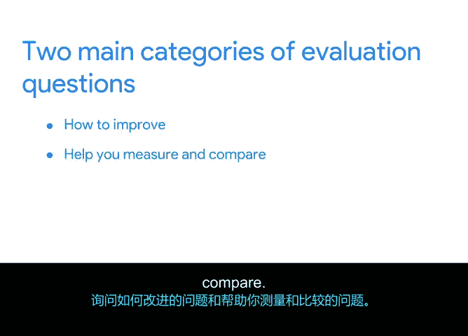

# 027：创建评估问题 📝

在本节课中，我们将学习如何为项目的质量管理计划创建评估问题。评估是质量保证过程的关键部分，它能帮助我们衡量项目是否达到了既定的质量标准，并为未来的改进提供依据。

上一节我们介绍了质量管理的主要概念，并定义了“酱汁与勺子”项目的质量标准。本节中，我们将探讨评估的重要性，并学习如何制定有效的评估问题。

## 评估的重要性与目的

评估是一种旨在促进学习和做出明智决策的研究形式。它提供问责制，并帮助你评估项目在多大程度上实现了其目标。通过评估，你能够改进、判断和了解项目的各个方面。

例如，在“酱汁与勺子”项目中，评估可以帮助你改进员工培训流程的实施效率，判断平板电脑是否按预期工作，或者评估项目是否产生了任何意外的负面影响。

## 评估过程：从“为什么”开始

为了确定你想了解项目的哪些信息，首先需要明确你进行评估的原因。你的“为什么”将决定你提出的问题类型。这可以归结为三个核心目的：**改进**、**判断**和**学习**。

你可以通过回顾项目目标和组织目标，并确定你所评估的方面如何与这些目标相关联，来缩小评估的焦点。

**示例**：“酱汁与勺子”项目刚刚完成了一个关键里程碑，涉及三个主要可交付成果：安装平板电脑、将平板电脑与销售点系统集成、培训员工使用平板电脑。项目经理彼得需要向利益相关者汇报项目进展并分享对此里程碑的评估。他的“为什么”是判断平板电脑的质量和性能，并找出改进培训流程的方法。

## 如何制定评估问题

一旦确定了评估的原因，你就可以开始撰写评估问题。评估问题是关于项目成果、影响和/或有效性的关键问题。

评估问题主要分为两大类：

以下是旨在帮助你**改进**项目的问题：
*   **如何改进？**
*   **哪些方面有效，哪些无效？**
*   **哪些目标正在实现？**
*   **谁在受益？**
*   **最常见的参与者反应是什么？**

以下是旨在帮助你**衡量和比较**，以便做出判断的问题：
*   **结果是什么？**
*   **是否存在意外结果？**
*   **成本和收益是什么？**
*   **有哪些经验教训？**
*   **我们应该继续吗？**

以“酱汁与勺子”项目为例，一个评估问题可能是：**平板电脑在多大程度上提高了员工的工作绩效？**

## 有效评估问题的标准

有效的评估问题需满足以下标准：
*   它们涉及利益相关者或用户的**价值观、兴趣和关注点**。
*   它们与**项目目的和评估目的**相关。
*   它们**值得回答**，并且对项目及未来具有重要意义。
*   它们**实用且可行**，能够利用现有资源进行回答。

## 总结与预告

本节课中，我们一起学习了评估在项目管理中的核心作用。我们了解到，评估是一种促进学习和决策的研究形式。评估问题是衡量项目成果的关键工具，主要分为改进型问题和衡量比较型问题。

在下一节视频中，我们将讨论如何为你的评估问题创建**评估指标**，这将帮助你聚焦于对项目最有用的反馈类型。在接下来的活动中，你将应用所学知识，通过审阅支持材料来撰写你自己的评估问题和指标。

我们下节课见。