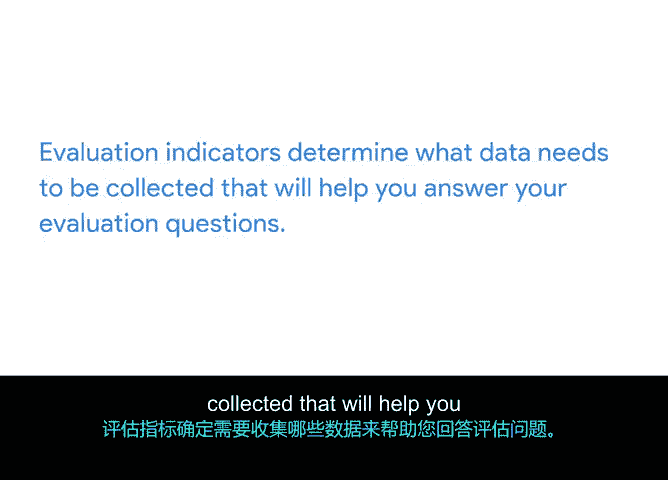

# 028：确定评估指标 📊

## 概述
在本节课程中，我们将学习如何确定评估指标。评估指标指明了为回答评估问题所需收集的具体数据类型，是衡量项目是否达到既定质量标准的关键。

上一节我们讨论了评估的重要性以及如何制定有效的评估问题。本节中，我们来看看如何将这些评估问题转化为可测量的具体指标。

## 什么是评估指标？
评估指标揭示了为帮助你回答评估问题而需要收集的具体数据类型。简单来说，指标说明了你想要衡量或评估的内容，例如：
*   某事物的数量。
*   满意度水平。
*   偏好。
*   年龄、性别、经验等人口统计信息。

类似于质量标准为你的可交付成果和目标增加了具体性，评估指标则根据你的评估问题，确定你所追求的具体回应类型。你需要这些信息来理解你的项目或流程是否达到了项目计划中商定的质量标准。

## 如何确定指标？
让我们回到“酱料与勺子”项目及其评估问题：“平板电脑在多大程度上提高了员工的工作绩效？”

要评估这一点，你必须问自己：你将如何衡量工作绩效？你必须确定工作绩效的指标，例如：
*   更快的餐桌周转率。
*   更高的小费平均值。
*   来自客户的更高质量评分。

考虑指标的另一种方式是，它们为回答你的评估问题提供了途径。指标证明了成果的达成，并提供了实现目标的可衡量证据。它们还包括可见的迹象，如测试分数、出勤率或观察到的行为。

“指示”一词意味着指出或显示。评估指标指出或显示了回答评估问题的方法。这可能包括员工使用新平板电脑工作方式的可见迹象。例如：
*   观察到的行为，如聚集在饮料站的员工减少或上班迟到减少，可能是生产力提高的指标。
*   超过90%的员工遵守平板电脑点餐流程，可能是点餐准确性的指标。

## 核心概念总结
**评估指标**决定了需要收集哪些数据来帮助你回答评估问题。这包括衡量项目某一方面并展示该方面与既定质量标准的接近程度的线索、迹象或标记。

## 后续步骤
在接下来的活动中，你将为你添加到“酱料与勺子”质量管理计划中的每个评估问题添加评估指标。完成后，我们将在下一个视频中见面，开始学习如何设计调查问题。