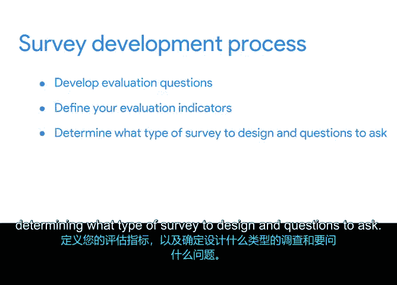

# 029：制定调查问卷 📝

在本节课程中，我们将学习如何为项目制定有效的调查问卷。调查是项目经理用来收集数据、评估项目质量的重要工具。我们将了解调查问题与评估问题的区别，并学习如何设计不同类型的调查问题。

## 课程概述

上一节我们介绍了如何为项目制定评估问题和指标。本节中，我们来看看如何将这些评估问题转化为具体的调查问卷，以收集所需的数据。

调查是项目经理用来获取评估问题答案的工具之一。在调查中，每位受访者回答一组明确定义的问题，收集到的数据经过分析后，可用于展示您为项目确定的评估指标的具体实例。

对于平板电脑推广项目，Peter决定创建客户调查，作为获取项目评估问题答案的一种方式。因此，在接下来的活动中，您将编写一组调查问题，并将其添加到质量管理计划中。

掌握制定调查和编写调查问题的能力非常重要，因为这体现了您理解项目目标、评估利益相关者和用户如何评价项目的能力。这有助于您确定是否达到了质量目标，以及需要在哪些方面进行调整。

## 调查问卷基础

让我们从简要回顾调查开始。调查是可用于评估和衡量项目过程、目标或可交付成果质量的工具。将调查纳入质量管理计划是帮助您了解哪些方面有效、哪些方面无效的一种方法。

调查评估您想要评估的标准，并为您提供数据，指出您是否达到了质量标准。设计一个能提供所需数据的有效调查是一项技能，并遵循一个战略性的开发过程。

## 调查开发流程

以下是制定调查问卷的战略性流程：

首先，您需要制定评估问题并定义评估指标，这一步您已经完成。然后，您可以确定要设计什么类型的调查以及提出什么问题，以获取回答评估问题所需的数据。

既然您已经提出了评估问题和指标，下一步就是确定要提出什么类型的调查问题。需要提醒的是，**调查问题**与**评估问题**是不同的。

*   **评估问题**是关于项目或计划的成果、影响和/或有效性的关键问题。
*   **调查问题**则旨在收集数据，帮助您回答评估问题。

换句话说，调查问题是对评估问题更直接的解读，旨在获取数据点。

让我们考虑一个具体例子。Sauce and Spoon 的评估问题是：“平板电脑在多大程度上提高了工作绩效？”

工作绩效的指标之一是员工在一个班次内能够完成多少辅助工作。一些相应的调查问题可能是：
*   平板电脑易于使用吗？
*   培训期间是否有足够的时间进行练习和提问？
*   平均而言，您在一个班次内能够完成多少项辅助工作任务？
*   自从使用平板电脑以来，您退回错误订单的频率有多高？

这些问题的答案将为您提供数据，以跟踪和回答您的评估问题。

## 如何编写有效的调查问题

那么，如何编写能够解决您试图评估内容的有效调查问题呢？您可以提出两种不同类型的调查问题：开放式问题和封闭式问题。

**开放式问题**需要不止一个词的答案，例如“是”或“否”。它们要求受访者用自己的话回答。例如：“演示过程中哪些方面进展顺利？”或“您觉得演示中最有用或最有趣的是什么？”关键在于受访者必须构建自己的答案，而不是从预定的答案列表中选择。

**封闭式问题**可以用单一回答来回答，例如“是”或“否”、“真”或“假”，或者从列表中选择一个答案。让我们更详细地研究三种类型的封闭式问题。

以下是三种主要的封闭式问题类型：

1.  **是非/真假型问题**：这类问题要求“是”、“否”或“真”、“假”类型的答案。例如：“您点了开胃菜吗？”或“您以前在这家餐厅吃过饭吗？”
2.  **多项选择题**：多项选择题有多个答案选项。通常指示您选择其中一个答案选项或选择所有适用的选项。例如：“您每月在这个地点用餐的频率如何？”然后是一系列答案选项，如“0到1次”、“2到3次”、“4到5次”和“5次或更多”。
3.  **量表式问题**：量表式问题提供两个以上的选项，但它们与多项选择不同，因为它们要求受访者按量表对答案进行评分。例如，某事发生的频率、他们喜欢或不喜欢某事的程度，或者他们认为某事的重要性。一个量表式问题的示例可能是：“在1到5的范围内，您如何评价您的整体用餐体验？其中1表示差，5表示优秀。”

## 编写优质调查问题的技巧

无论问题类型如何，创建好的调查问题都是一项需要一些练习的技能。以下是一些技巧：

*   **首要且最重要的是，确保您的问题问的是您想表达的意思。** 每个问题都应该是具体的，并且只涉及一个可衡量的方面。
*   **注意不要对受访者做出假设。** 例如，不要假设每个参与调查的人都了解或喜欢相同的事物，或者有相似的生活经历。提出问题和提供答案选项时，要允许人们根据他们的经历准确回答。
*   **同时，您要确保您的问题没有提供过多的细节或信息。** 如果这样做，您可能会影响受访者以某种特定方式回答，这可能会无意中造成偏见。

## 课程总结

本节课中，我们一起学习了调查问卷的制定。我们回顾了调查如何帮助确定是否达到质量目标以及需要调整的地方。调查还可以帮助了解哪些方面有效、哪些方面无效，评估想要评估的标准，并提供数据以指出是否达到了质量标准。

调查开发流程包括制定评估问题、定义评估指标，以及确定要设计什么类型的调查和提出什么问题。

在接下来的活动中，您将回顾您的质量管理计划，并为Sauce and Spoon的一个评估问题创建调查问题。然后，我将在下一个视频中与您讨论如何呈现从调查中收集到的数据。