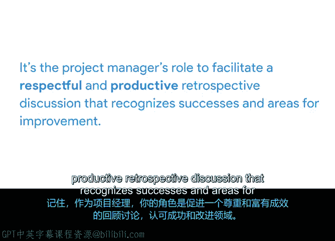

# 031：回顾会议的价值 🧐

在本节课程中，我们将学习回顾会议（Retrospective）的概念及其对项目团队的重要价值。我们将了解回顾会议的目的、益处，以及项目经理在其中的关键角色。

上一节我们练习了如何将数据整合为评估结果，并通过制作幻灯片向关键相关方展示。本节中，我们来看看如何通过回顾会议来反思项目过程，促进团队持续改进。

回顾会议是质量控制的一个实例，因为它帮助团队根据需要调整和改进流程。接下来，你将看到Peter如何引导一场回顾会议。我们将分解会议对话，提取关键信息，这些信息将用于构建回顾会议文档。

首先，我们来复习一下回顾会议。回顾会议（有时简称为“Retro”）是一种研讨会或会议，它为项目团队提供了反思项目的时间。回顾会议让你有机会讨论项目的成功与挫折，并从错误中学习。

尽管回顾会议通常在项目结束时举行，但它也是一种有用的过程改进工具，可以在整个项目生命周期中且应该被使用。例如，在达到项目里程碑后，尤其是在平板电脑实施完毕并与测试用户完成测试后，就是举行回顾会议的绝佳时机。

你可以庆祝项目迄今为止进展顺利的部分，并找出改进机会，以便项目朝着未来的里程碑推进。

回顾会议有许多益处。以下是其主要价值：

*   **鼓励团队建设**：为团队成员提供机会，理解团队内部的不同视角。
*   **促进未来项目的协作改进**：有助于提升团队在未来项目中的合作效率。
*   **推动未来程序和流程的积极变革**：能够促进工作方法和流程的优化。

因为回顾会议是一种特定类型的会议，所以制定议程来引导讨论、组织会议并记录学习成果至关重要。作为项目经理，你需要管理对话的基调，确保每位团队成员都感到被包容，并识别出需要记录在回顾会议文档中以供未来参考的细节。

换句话说，你的职责是引导一场尊重且富有成效的回顾讨论，既要肯定成功，也要识别改进领域。

让我们回顾一下核心要点。回顾会议是让项目团队有时间反思项目的研讨会或会议。回顾会议的三个主要目的是：鼓励团队建设、促进协作改进以及推动积极变革。请记住，作为项目经理，你的角色是引导一场尊重且富有成效的回顾讨论，既要肯定成功，也要识别改进领域。

在接下来的活动中，你将通过创建一个包含成功点和改进领域的列表来练习如何为回顾会议做准备。完成本视频后，你将观察Peter在主持回顾会议时如何与团队成员互动，并向你的文档中添加信息。

我们稍后见。