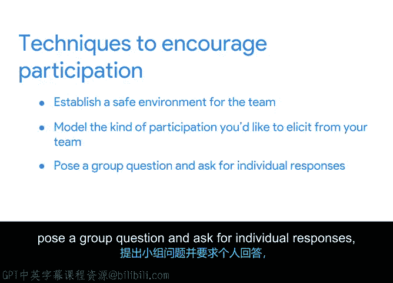

# 032：回顾会议鼓励参与技巧

## 概述

在本节课中，我们将学习如何在项目回顾会议中应对参与度不足的问题。回顾会议是团队反思项目成败、寻求改进的关键环节，但有时团队成员可能不愿坦诚分享。我们将探讨几种有效的技巧，帮助你营造安全的讨论氛围，鼓励团队成员积极贡献想法，从而确保回顾会议能真正推动有意义的流程改进。

---

上一节我们介绍了回顾会议的重要性。本节中，我们来看看如何应对回顾会议中可能出现的棘手情况——参与度不足。

参与度低会阻碍项目团队进行有意义的流程改进。但如果你掌握了一些可靠的方法来提升参与度，你就能更好地主持项目管理职业生涯中的任何回顾会议。

观看本视频后，你将通过辅助材料了解Pida如何处理回顾会议中的参与度问题。你将能够识别并向你的回顾会议文档添加若干新细节。

首先，需要承认的是，主持团队回顾会议时，你不仅会关注项目成功之处，也会聚焦于挑战，这有时会让人感到有些压力。如果团队对直言挑战感到不适，他们可能就不太愿意积极参与回顾讨论。

因此，在开始任何回顾会议之前，务必问自己：你的团队是否有可能为讨论做出贡献？如果你觉得答案可能是否定的，请跟随我们一起探讨谷歌常用的几种鼓励参与的有效技巧。

以下是几种鼓励参与的有效技巧：

**营造安全环境**
一种我经常用来鼓励参与的技巧是为团队创造一个安全的环境。为此，你可以在会议开始时采纳一项原则：“此处所言，留在此处；此处所学，带离此处。”提醒团队，回顾会议是没有利益相关者或客户在场的会议，是一个团队可以直接谈论问题的安全空间。

**以身作则**
为了帮助提高参与度，以身作则地展示你希望从团队中获得的参与类型也很有帮助。如果你想帮助团队在坦诚谈论项目成功与挑战时感到自在，你可以通过以分享自己的成功与挑战来开启讨论，从而定下基调。在会议前，尝试准备几个你知道本可以处理得更好的任务或流程的例子。如果你知道自己在某个项目任务上犯了错误，就大声说出来。例如，也许你犯了一个文书错误，导致平板电脑交付延迟了两个工作日。诚实地面对你的错误，并谈谈你将来如何避免类似的错误。当你承认自己的错误时，你也就让团队其他成员分享他们的错误变得可以接受。

**提出群体问题并寻求个人回答**
另一个鼓励参与的有效技巧是提出一个群体问题，并要求个人回答。例如，你可以要求每位团队成员各自思考一个截至目前项目中的成功之处和一个挑战，然后请每位团队成员分享他们的回答。如果你发现你提出的问题没有得到你希望的那种回应，尝试用不同的方式表述它。例如，如果像“什么进展顺利”和“出了什么问题”这样的问题没有得到你想要的回应，可以尝试替代问法。也许可以问：“关于这个项目，我们应该开始做什么、停止做什么、继续做什么？”

**回顾项目时间线**
最后，如果你的团队在参与，但只贡献了非常近期的成功与挑战，回顾项目时间线可能会有所帮助。这是一种鼓励团队成员回顾项目生命周期更早阶段，以识别成功与挑战的技巧。如果你提醒团队注意项目时间线，可以刷新他们的记忆，并引发更多关于整个项目的讨论。

---

## 总结

本节课中我们一起学习了如何应对回顾会议中参与度不足的挑战。我们探讨了四种核心技巧：**营造安全环境**、**以身作则**、**提出群体问题并寻求个人回答**以及**回顾项目时间线**。在接下来的活动中，你将通过复习辅助材料，观察Peterta如何处理回顾会议中的参与度问题，并向你的回顾会议文档添加内容。完成后，我们将在下一个视频中讨论鼓励问责制的技巧。