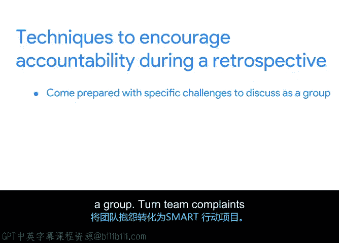

# 033：回顾会议促进问责 📝

在本节课中，我们将学习如何在项目回顾会议中有效促进问责制。问责制是回顾会议发挥改进作用的关键，它关乎团队对项目决策和结果的责任感，而非指责。我们将探讨具体技巧，帮助团队诚实面对问题、共同寻找解决方案，并最终提升未来项目的执行效果。

上一节我们探讨了如何应对回顾会议中参与度不足的问题。本节中，我们来看看如何鼓励团队在回顾会议中建立问责文化。

问责制指的是对与项目或任务相关的决策负责。它是高效回顾会议的重要组成部分。如果回顾会议旨在成为流程改进的有效工具，那么参与者就需要坦诚说明团队在哪些方面可以做得更好。只有这样，团队才能找到未来的改进方向。掌握如何推动团队对特定项目负责，将对您和您的职业生涯大有裨益。

在继续之前，需要明确一点：问责和指责是两件完全不同的事，只有问责制属于回顾会议的范畴。指责会让人沉默，而不是激励他们坦诚分享。问责制不涉及将错误归咎于特定的团队成员，而是鼓励团队整体性地思考错误和挑战，并为未来寻找解决方案。

问责制的另一个好处是能鼓励主人翁意识。当团队成员对项目的某个方面产生主人翁意识时，他们可能会在整个项目过程中更有动力，以确保该方面达到质量标准并帮助项目朝着目标推进。

以下是您可以在回顾会议中用来鼓励问责制的一些有效技巧。

**技巧一：准备具体的挑战供团队讨论**

我喜欢使用的一个技巧是，提前准备好具体的挑战供团队集体讨论。如果您发现团队只想讨论项目的成功之处，这个技巧尤其有用。为了鼓励问责，请将注意力引向一个具体的挑战。例如，酱料和汤匙餐厅的厨房经理反馈说，他们感觉被排除在总经理的决策之外。在回顾会议中，您可以与团队分享此反馈，并请团队帮助找出导致此反馈的问题根源。

**技巧二：将团队抱怨转化为SMART行动项**

您已经了解到项目目标应该是SMART的，即具体的、可衡量的、可实现的、相关的和有时限的。这里还有一个提示：行动项也可以是SMART的。如果您发现团队抱怨多于解决问题，可以选取一个抱怨并将其转化为SMART行动项。例如，回到厨房经理感觉被排除在常规决策之外的例子。作为项目经理，可以添加一个行动项：邀请厨房经理参加每周的员工检查会议。如果想更进一步，甚至可以添加一个五分钟的议程项目，让厨房经理讨论问题并获取反馈。然后可以制定计划，在两个月后跟进，了解他们是否仍有此感觉，或者是否感觉更受重视。通过向团队展示如何将抱怨转化为行动，可以帮助团队变得更加以解决方案为导向。

**技巧三：推动团队识别自身在制造挑战中的角色**

在鼓励问责制时，推动团队识别自身在制造特定挑战中所扮演的角色也是一个好方法。团队可能倾向于只关注他们认为无法控制或影响的挑战，例如平板电脑供应商延迟交货。在讨论团队似乎不愿承担责任的挑战时，您可以帮助团队思考导致该挑战的一系列事件。然后，您可以推动团队识别在这一系列事件中，他们错过了哪个可以识别和解决问题的机会。回到平板电脑供应商交货问题的例子。也许如果在项目早期，团队中有人被分配了管理平板电脑供应商的责任，他们可能会与供应商建立每周检查电话。这可能使餐厅有预见性地为延迟交货做好计划并找到应对方法。当您帮助团队识别自身在制造挑战中的角色时，您就在鼓励反思，这可能会带来有益的见解和流程改进的想法。

**技巧四：确保批评保持建设性，并将挑战与具体个人分离**

当团队讨论面临的各种挑战时，请确保批评保持建设性。建设性批评是一种尊重他人的反馈形式，旨在帮助接收方改进工作。如果对项目某部分的批评开始从建设性变得无益或苛刻，作为项目经理，您有责任引导对话。要改变话题，可以尝试将所讨论的挑战与房间里的任何特定个人分离开来。您可以通过将对话引向整个团队都可以从中学习的流程改进来实现这一点。

本节课中我们一起学习了回顾会议中促进问责制的核心概念与技巧。我们明确了问责与指责的本质区别，并掌握了四项实用技巧：准备具体挑战进行讨论、将抱怨转化为SMART行动项、推动团队识别自身在挑战中的角色，以及确保建设性批评并将问题与个人分离。接下来，您将在练习中观察Peta如何在回顾会议中鼓励问责，并继续完善您的回顾会议文档。完成练习后，我们将在下一个视频中讨论处理回顾会议中消极情绪的技巧。