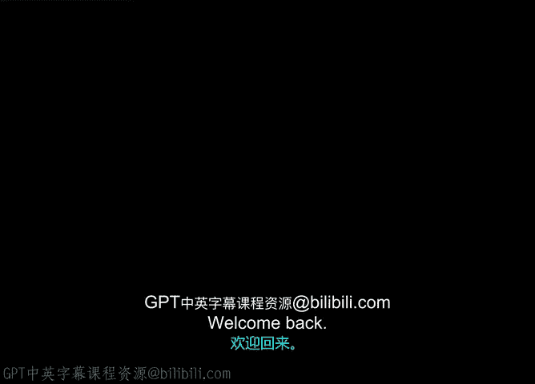
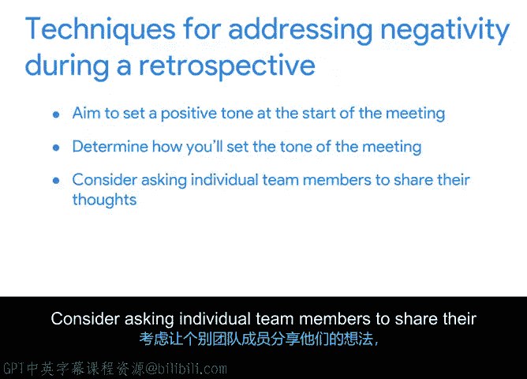

# 034：回顾会议中处理负面情绪 🧠

在本节课中，我们将学习如何在项目回顾会议中有效处理负面情绪。回顾会议是评估项目表现、识别改进机会的关键环节，但有时团队成员的负面情绪可能阻碍会议的成效。我们将探讨如何营造积极氛围、预见潜在问题，并在负面情绪出现时进行引导，以确保讨论保持建设性。

上一节我们讨论了如何在回顾会议中鼓励团队责任感。本节中，我们来看看当会议中出现负面情绪时，应如何应对。

## 理解负面情绪的根源

回顾会议旨在建立团队信任、坦诚和直接沟通。但需注意，如果团队环境缺乏心理安全感，会议很容易转向负面。负面情绪会使识别项目挑战解决方案的讨论难以进行。

在开始自己的回顾会议前，需自问：这次讨论是否可能让团队感到压力？有时答案是肯定的。

## 处理负面情绪的技巧

如果你在回顾讨论中察觉到微妙或明显的负面情绪，可以使用以下技巧来改变会议基调，引导团队转向更积极的视角。

以下是应对团队负面情绪的几个关键方法：

*   **设定积极基调**：会议开始时，通过强调项目成功来设定积极基调。例如，提及团队从利益相关者处获得的积极反馈，或感谢团队为实现重要里程碑付出的努力。
*   **确定设定基调的方式**：会议道具对此有帮助。例如，可以向每位参与者分发数量相等的绿色和红色索引卡，请他们在绿色卡片上写下成功之处，在红色卡片上写下挑战。分发绿色卡片可以微妙地鼓励团队在思考挑战的同时，也思考成功之处。
*   **考虑请团队成员逐一分享想法**：与其向整个小组提问，不如考虑请团队成员逐一分享想法。这样做有几个好处：为每个人提供分享挑战的空间；帮助他们为持有负面情绪的队友树立以解决方案为导向的思维模式；并防止负面情绪成员通过回应每个问题来主导对话。
*   **宣布会议休息**：暂停会议是帮助缓和局势的好方法。需要记住，没有一种技巧适用于所有场景。如何选择处理负面情绪取决于具体情况。

即使在整体氛围积极的团队中，也可能出现负面情绪。因此，在回顾会议前与团队成员进行一对一沟通，尝试预见任何潜在的负面情绪，可能是个好主意。

如果你感觉某位团队成员很可能将负面态度带入回顾会议，可以尝试问自己几个问题：此人是否对自己为团队带来的价值感到不安？此人是否在工作质量方面收到过负面反馈？理解负面情绪的根源有助于你找到方法，帮助此人以更积极的方式参与团队讨论。

例如，如果你察觉到此人感到不安，可以尝试肯定他们的价值。一个单独的负面声音可能使原本富有成效的讨论偏离轨道。作为回顾会议的主持人，当一个人的负面情绪主导对话时，介入是你的职责。

## 总结与预告

本节课中，我们一起学习了在项目回顾会议中处理负面情绪的方法。关键要点包括：通过设定积极基调预防负面情绪、使用技巧引导讨论回归建设性轨道，以及根据具体情况灵活选择应对策略。

在接下来的活动中，你将通过复习辅助材料，观察Peter在Sauce and Spoon团队回顾会议中如何应对负面情况。然后，你将完成自己版本的回顾会议文档。完成即将到来的活动后，我们将在下一个视频中再见。