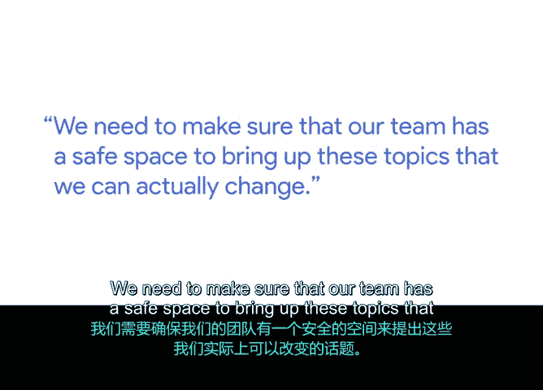

# 035：引导积极回顾会议 🧠

在本节课中，我们将学习如何引导一个积极、无责难的回顾会议，这是项目结束后或项目中期用于总结经验、持续改进的关键环节。我们将探讨回顾会议的核心原则、常见挑战以及如何为团队创造一个安全的发言环境。

## 什么是回顾会议？

回顾会议是我们在每个项目结束时进行的一个过程。它帮助我们回顾并了解项目中进展顺利的部分、出现问题的部分以及我们运气好的地方。这是一种让我们审视是否能将从一个项目中学到的经验教训，复用到下一个项目中的方法。

## 回顾会议的时机

最常见的是在项目结束时进行回顾。但有时，如果我们在项目中期发现自己需要做出决策，我们也会收集通常在项目结束时回顾会议中收集的数据，并在项目中期进行类似的回顾。

## 回顾会议的核心原则

典型的回顾会议必须是积极的、无责难的，其目标是持续改进我们自身、我们的团队以及我们的流程。

如果我们以正确的心态对待回顾会议，我们会询问所有参与项目的人员，他们对自己负责的部分以及整个项目有何个人看法。通常，这些人也将是下一个项目中与你共事的人。

## 回顾会议的常见挑战与应对

回顾会议的一种失败模式是人们不真正开口发言。我经常在冲刺回顾会议上看到这种情况，人们只是坐在那里，什么也不说，觉得一切都好。

这可能有两个主要原因：
1.  他们并不真正关心太多改进，因为现状“还可以”，他们能忍受，现状就是如此。
2.  第二个原因，也是我更关心的，是缺乏心理安全感。他们觉得自己无法真正说出想法，并让房间里的人全盘接受。

我们需要确保我们的团队有一个安全的空间来提出这些我们实际上可以改变的话题。

## 创造安全空间与持续改进

我们可以在日常工作中改变很多事情，包括项目管理方式、沟通方式，以及在持续进行规划时我们选择和决定哪些项目。

因此，确保这些（回顾）场合对我们的团队成员是可参与的，这在一定程度上能向他们保证，他们对接下来发生的事情有发言权，并且他们可以通过在后续部分中提出的意见产生影响。因为至少在团队范围内，我们会倾听，我们在乎，并且你可以带来改变。

---

**本节课总结**

本节课中，我们一起学习了回顾会议的定义、时机和核心原则。我们了解到，一个成功的回顾会议必须是积极且无责难的，旨在实现持续改进。关键在于为团队营造心理安全感，鼓励每位成员坦诚分享，确保他们的声音被倾听和重视，从而将经验教训有效应用于未来的项目，推动团队和流程不断优化。