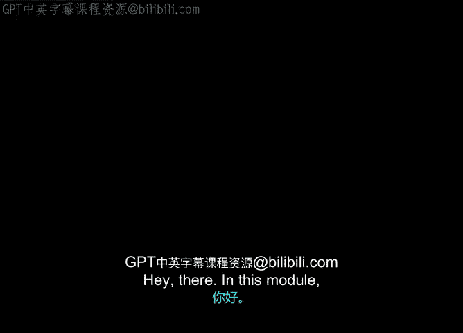
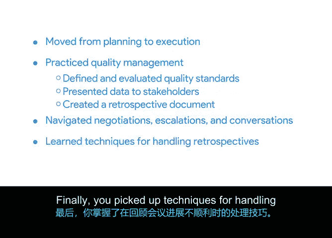

**谷歌项目管理专业证书：第6课：模块三总结**

在本模块中，我们共同完成了从项目生命周期的规划阶段到执行阶段的过渡。

上一节我们介绍了执行阶段的核心任务，本节中我们来回顾本模块所学到的关键技能与知识。

以下是本模块涵盖的主要内容：

*   **质量管理实践**：你练习了为项目定义质量标准，并评估了项目标准被满足的程度，最后将评估结果呈现给了相关方。
*   **创建回顾文档**：你创建了一份项目回顾文档，用于总结经验教训。
*   **深化概念与学习新方法**：我们深入探讨了之前学过的一些概念，并在此过程中引入了一些新的方法、技术和策略。
*   **处理复杂沟通**：你学习了如何在不同角色、不同优先级和不同个性的相关方之间进行谈判、升级问题以及开展有效对话。
*   **应对困难的回顾会议**：最后，你掌握了在回顾会议未按计划顺利进行时的处理技巧。你学会了如何应对**缺乏责任感**、**参与度不足**以及**消极态度**等问题，这帮助你为“Sauce & Spoon”项目起草了自己的回顾文档，并将其添加到你的项目成果作品集中。

做得非常出色。

现在，是时候学习更多知识了。我们下个课程模块再见。