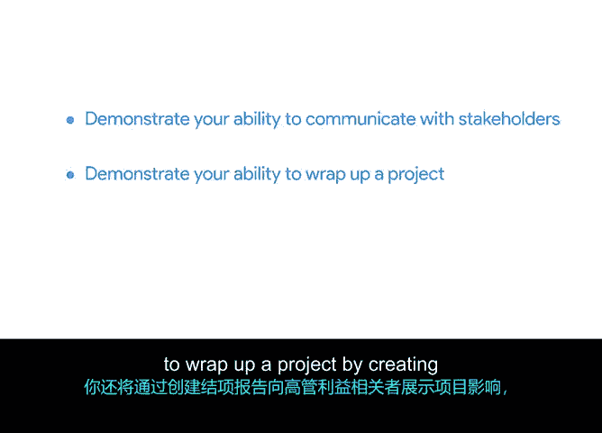

# 037：在现实世界中应用项目管理课程

## 🎯 概述

在本节课中，我们将继续项目执行阶段，并过渡到项目生命周期的收尾阶段。你将通过撰写一封关于项目问题的邮件给高级利益相关方，来展示与利益相关方沟通的能力。同时，你将通过创建一份项目收尾报告，向执行层利益相关方展示项目影响，来展示结束项目的能力。

## 🔗 沟通在项目管理中的核心作用

正如你在整个课程中所学到的，**沟通**是有效项目管理的关键组成部分。因此，在接下来的活动中，我们将让你练习观察“酱料与勺子”团队之间的沟通。基于这些观察，你将执行各种沟通技巧。

以下是本阶段你将实践的核心沟通任务：

*   **起草给利益相关方的邮件**：针对项目问题，进行清晰、专业的书面沟通。
*   **创建项目收尾报告**：系统性地总结项目成果与经验。
*   **撰写执行摘要**：提炼核心信息，向高层进行高效汇报。

在本课程结束时，你将运用所学知识，创建一份个人影响力报告，以反思你在此项目课程中的整体体验。

## 📧 聚焦：关于项目问题的沟通

上一节我们概述了本阶段的学习目标，本节中我们来看看具体的第一个任务：就项目问题进行沟通。

准备好开始了吗？让我们在下一个视频中见面，详细讨论如何就项目问题进行沟通。