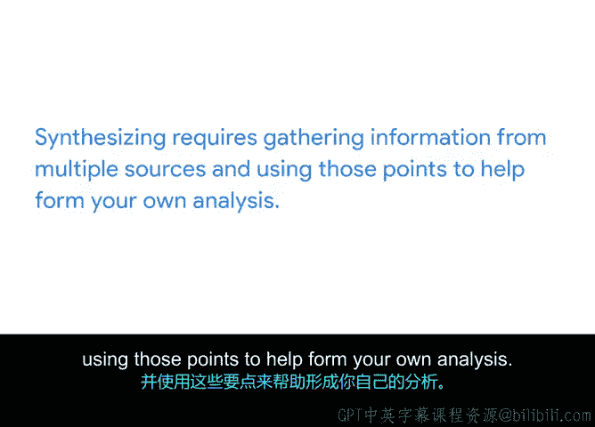

# 038：沟通项目问题 📢

在本节课中，我们将学习如何有效地沟通项目中出现的问题。作为项目经理，清晰、简洁地向上级利益相关者汇报问题是关键技能之一。我们将重点探讨如何从多个信息来源中提炼核心内容，并形成一句或两句的总结。

---

## 什么是项目问题沟通？ 🤔

到目前为止，在本课程中，你已经有机会练习沟通项目的关键方面，例如可交付成果、范围、时间表和预算。本节中，我们来看看如何沟通项目问题。

每个项目都会遇到问题，而沟通这些问题是你作为项目经理工作的一部分。通常，项目问题较小，可以在项目团队内部解决。但偶尔，你需要将问题及建议的解决方案上报给高级利益相关者，以获取他们的意见和下一步指导。

---

## 如何提炼问题总结？ ✍️

利益相关者不应为了理解项目问题而去阅读不同的项目文档或查阅多个电子邮件线程。相反，作为项目经理，你的责任是从多个来源中提炼相关信息，形成一个连贯的总结，清晰地传达问题。

要写出有效的一两句问题概述，你需要从各种来源（如电子邮件、演示文稿、会议记录等）中提炼信息。提炼信息需要从多个来源收集信息，并利用这些要点来帮助你形成自己的分析。

例如，仅仅向利益相关者发送项目计划的链接并无帮助，因为这无法让他们透彻理解问题所在。

为了确定哪些信息是相关的，并应包含在给利益相关者的一两句概述中，你可以问自己：**我如何以一种便于他们决策的方式来沟通这个决定？**

---

## 提炼与沟通的步骤 📋

以下是提炼和沟通项目问题的关键步骤：

1.  **收集信息**：从所有相关渠道（如邮件、会议、文档）收集关于问题的信息。
2.  **分析核心**：识别问题的根本原因、影响范围和潜在后果。
3.  **形成总结**：将分析结果浓缩为一到两句清晰的话，说明“**什么问题**”导致了“**什么后果**”。
4.  **提出建议**：在总结中或紧随其后，提供一个或多个建议的解决方案。

让我们通过一个例子来具体说明：

> **假设场景**：项目计划中有五项任务因供应商延迟而逾期，这可能最终影响项目的最终交付成果。你已经制定了一些缓解此问题的解决方案。

**不推荐的沟通方式**：向利益相关者发送项目计划链接，并指出所有逾期任务。

**推荐的沟通方式**：你可以这样总结问题：“由于供应商问题，多项任务已逾期。为确保按时交付，我们建议聘请第二家供应商。否则，我们将不得不推迟发布日期。”

通过这种方式，你向利益相关者简洁地呈现了问题并提供了解决方案。这使得利益相关者可以同意你的方案、不同意你的方案，或提出他们自己的方案。无论如何，你已经履行了作为项目经理的职责：沟通问题并提出解决方案。

---

## 总结与回顾 📚

本节课中，我们一起学习了如何沟通项目问题。

*   沟通项目问题是项目经理职责的一部分。
*   项目经理有责任从多个来源提炼相关信息，形成清晰传达问题的连贯总结。
*   提炼信息需要收集多方信息，并利用这些要点来形成自己的分析。

在接下来的活动中，你将通过为“Sauce and Spoonoon 平板试点项目”的问题撰写一两句概述，来练习沟通项目问题。你将利用从辅助材料中提炼的信息来完成这个概述。

完成活动后，我们将在下一个视频中继续探讨更多关于项目问题的内容。