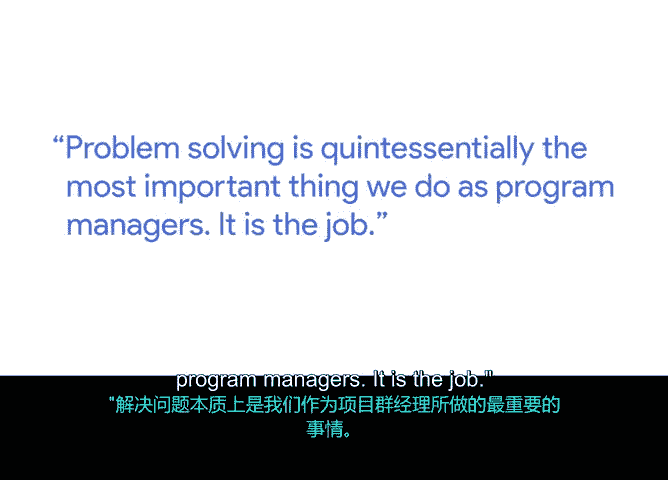

# 039：39_04_03_克里斯问题解决的艺术

## 概述
在本节课中，我们将跟随谷歌项目经理克里斯的分享，深入探讨**问题解决**在项目管理中的核心地位。我们将学习如何识别问题、分析根本原因、制定解决方案，并理解项目管理工具与解决实际问题之间的关系。

---

## 问题解决：项目经理的核心职责

我是克里斯，在谷歌担任项目经理，负责搜索业务。我管理的项目类型，特别是为全球数百万用户在各种平台、语言和信息需求上构建搜索功能。

我必须强调，**问题解决**是项目经理所做工作中最重要、最核心的部分。这就是我们的工作。无论是范围问题（例如，某些内容超出范围，或范围正在扩大或缩小）、预算问题（例如，资金不足或过多，人员不足或过多，人员技能不匹配），还是时间线问题，从根本上说，这些都是我们今天需要解决的问题。

因此，我们的工作是识别问题，围绕工具、流程和方法论建立一个框架，提出一个建议的解决方案，然后为该解决方案争取支持。

---

## 解决问题的关键步骤

以下是解决问题的关键步骤。

1.  **识别根本原因**：你唯一能成功做到上述步骤的方法是，运用原则性地组织这些工具和方法，始终尝试理解问题本身的**根本原因**。通常，你所经历的只是表面现象或潜在问题的结果。因此，始终深入挖掘初始的、系统性的问题，或流程问题、工具问题、技术问题等，才是真正的第一步。

2.  **制定客观计划**：一旦你能够识别问题并收集到足够的信息来了解问题是什么以及如何解决它，那么基于这些输入客观地制定计划，就是你做出决策的方式，这也是你的最终目标。

---

## 工具与工作的本质区别

上一节我们介绍了解决问题的步骤，本节中我们来看看项目管理工具的真正作用。

很多时候，我们作为日常工作一部分所创建或管理的这些章程、范围文档、会议记录、跟踪器或文档等“工件”，它们本身就是工作。但这实际上并非工作的全部，它们只是帮助你完成真正工作的机制、工具和方法。

真正的工作是管理范围、运行项目、说服他人、推动组织变革、解决战略计划。这些东西只是帮助你应对这些问题的要素，而不是问题本身。

我认为这是一个非常重要的要点。特别是在谷歌，我们最常实践的就是尝试在日常工作中解决更复杂、更具战略性、更全面、更大、更复杂的问题。

---

## 如何培养问题解决能力

如果你刚进入这个领域，还没有机会处理这些大问题，你该如何培养这种问题解决的专长呢？

以下是几种培养问题解决技能的途径。

*   **培养爱好**：无论是个人爱好，还是为朋友开发新软件。
*   **探索其他领域的热情**：你在其他行业拥有的任何热情。
*   **跨行业实践**：每个行业、每家企业都有问题，有很多方法可以解决这些问题并培养相关技能。

---

## 总结
本节课中，我们一起学习了问题解决在项目管理中的核心地位。我们明确了项目经理的职责是识别并解决范围、预算、时间线等各类问题。关键在于**深入挖掘根本原因**，而非停留在表面现象。我们理解了项目管理文档和工具是**辅助手段**，其最终目的是为了有效管理项目、推动变革和解决战略问题。最后，我们探讨了通过实践、爱好和跨领域探索来培养问题解决能力的多种途径。记住，**解决问题本身就是项目管理工作的本质**。