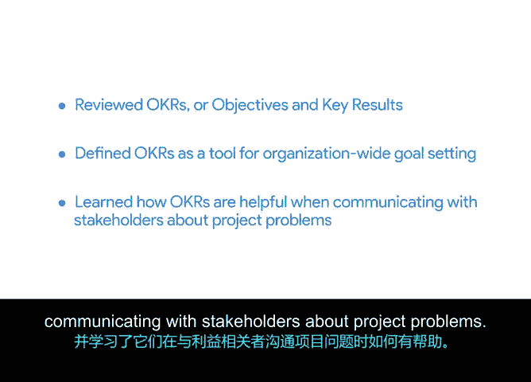

# 040：将项目问题与目标关联

在本节课程中，我们将学习如何将项目中发现的问题与组织的核心目标（OKRs）关联起来。理解这种关联能帮助你更有效地评估问题的风险与紧迫性，并在与利益相关者沟通时，清晰地阐明解决问题的必要性。

上一节我们练习了如何撰写项目问题摘要。本节中，我们将回顾一个之前课程中提到的概念：目标与关键成果（OKRs），并探讨它们与项目的联系。

## 📊 理解目标与关键成果（OKRs）

目标与关键成果（OKRs）是一种用于设定组织范围目标的工具。它将目标与衡量标准结合，以确定一个可衡量的成果。

让我们来分解一下OKRs：
*   **目标** 部分定义了需要实现的内容，类似于一个总体方向。
*   **关键成果** 部分则定义了组织、团队或个人将如何具体衡量在实现该目标上的成功。

例如，Sauce & Spoon餐厅的一个目标可能是“优先考虑客户的需求和期望”。那么，表明他们已达到此目标的关键成果可以是“在24小时内处理客户评论中的反馈”。

在本课程早期我们曾学到，在判断项目目标是否与组织需求相关时，OKRs是一个有用的参考点。如果一个项目及其目标有助于推动组织更宏观的OKRs，那通常表明你的项目具有相关性，并且值得投入完成它所需的时间和资金。

## 🔗 OKRs作为项目问题的沟通桥梁

OKRs可以成为组织内部的一种共同语言。例如在谷歌，无论项目大小，都旨在以某种具体方式为我们组织范围的OKRs做出贡献。如果一个项目难以确定如何帮助我们实现OKRs，这通常强烈暗示我们应该重新评估整个项目。

在与利益相关者沟通项目问题时，参考OKRs会非常有帮助。你可以通过指出具体问题可能如何影响组织更广泛的OKRs，来向利益相关者阐明为何需要解决某个特定问题。你还可以借此向利益相关者解释为何某个问题值得他们关注。

利益相关者，尤其是那些在组织内担任高级职位的人，通常有大量工作要处理，远不止你的项目。将问题的解决方案与公司的OKRs联系起来，可以吸引利益相关者有限的注意力。

以Sauce & Spoon的目标为例：“我们力求运行一个高效、盈利的商业模式”或“我们力求优先满足客户需求”。在你完善上一活动开始撰写的问题摘要时，可以添加一句话来解释该问题如何危及Sauce & Spoon运行高效商业模式和满足客户需求的使命。

## 📝 本节总结

在本视频中，我们回顾了目标与关键成果（OKRs），将其定义为一种用于组织范围目标设定的工具，并学习了它们在就项目问题与利益相关者沟通时为何如此有帮助。

在接下来的活动中，你将练习建立OKRs与项目问题之间的联系。你将运用从辅助材料中学到的知识，写一句话将你的问题摘要与Sauce & Spoon的OKRs关联起来。

完成活动后，我们将在下一个视频中会面，讨论如何撰写给高级利益相关者的电子邮件。