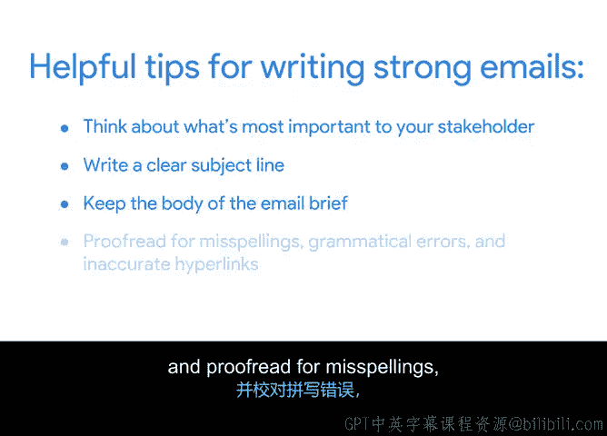

# 041：撰写问题升级邮件 📧

## 概述
在本节课中，我们将学习如何撰写一封有效的问题升级邮件，以获取利益相关者的决策支持。我们将回顾撰写此类邮件的核心最佳实践，并了解如何将项目问题与组织的目标与关键成果联系起来，以引起高级利益相关者的重视。

## 课程内容

上一节我们回顾了目标与关键成果，并讨论了将项目问题与组织的OKR联系起来如何有助于说服利益相关者认真对待问题。本节中，我们来看看撰写邮件以获取所需决策的几个最佳实践。

作为项目经理，识别和管理问题是工作的一部分。如果一个问题严重到需要升级给高级利益相关者，那么这很可能是一个你希望尽快解决的问题。邮件可以成为快速升级问题并请求利益相关者就后续步骤做出决策的有效工具。因此，确保你的邮件能有效吸引利益相关者的注意并获得所需回复至关重要。

以下是确保你的邮件不被忽视的几个最佳实践。

首先，思考对你的利益相关者而言最重要的是什么。通常，高级利益相关者更关心问题对组织的潜在影响，而非对单个项目的影响。这就是将项目问题与组织的OKR联系起来发挥作用的地方。识别问题将如何影响整个组织，并确保在邮件的前两句中清晰地传达这种影响。

一旦确定了利益相关者最关心的事项，你就能更好地准备起草一封有效的邮件。

记住要写一个清晰的主题行，简要说明邮件内容。在主题行中加入表明你希望利益相关者在阅读邮件后采取何种行动的语言也很有帮助。例如：
*   你需要他们审阅邮件附件吗？尝试在主题行中加入“请审阅”。
*   这是一封需要快速回复的紧急邮件吗？那么你可以在主题行中加入“紧急”一词。

利益相关者，尤其是组织内担任高级职位的人员，通常每天会收到大量邮件。在主题行中包含“紧急”、“及时”、“需要决策”或“请审阅”等术语有助于吸引他们对你的信息的注意，并明确你希望他们采取的行动。

同时，记住邮件正文也要简洁明了。在向繁忙的高级利益相关者沟通项目问题时，你的邮件应简要概述问题，解释它可能如何影响组织目标，并明确说明你需要利益相关者做出何种决策才能继续推进。仅此而已。用一两句话总结你的问题，再用一句话说明问题可能如何影响组织的OKR。

如果利益相关者需要审阅某些文件或额外信息才能做出明智决策，可以考虑在邮件中包含相关信息的超链接或附件。

写完邮件后，务必仔细校对，检查拼写错误、语法错误和不准确的超链接。使用邮件应用程序或在线工具的拼写检查和其他语法检查功能，确保一切无误。

让我们回顾一下。在给利益相关者写邮件时，请确保做到以下几点：
*   思考对你的利益相关者而言最重要的是什么。
*   撰写清晰的主题行。
*   保持邮件正文简洁。
*   校对拼写、语法错误和不准确的超链接。

## 总结
本节课中，我们一起学习了撰写问题升级邮件的关键技巧。未来，当你在实际工作中需要向利益相关者沟通问题时，你会发现管理、跟踪和沟通项目问题是运行项目的核心组成部分。在接下来的活动中，你将应用这些邮件撰写的最佳实践，为Sauce and Spoon的平板电脑项目利益相关者撰写一封邮件。