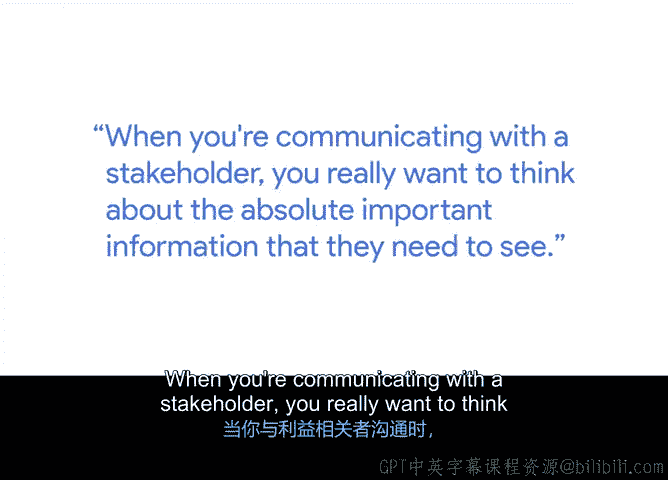
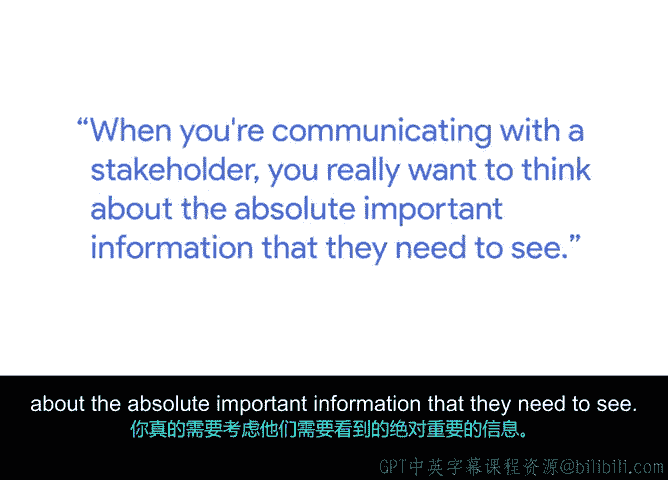
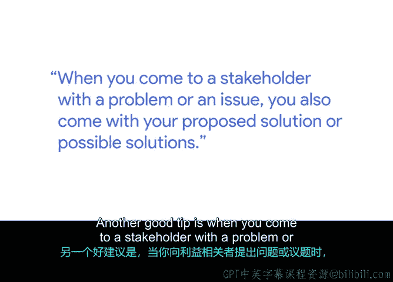
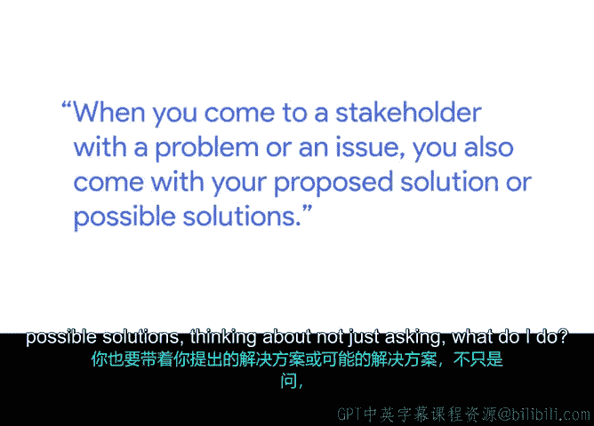
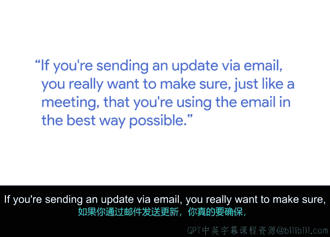
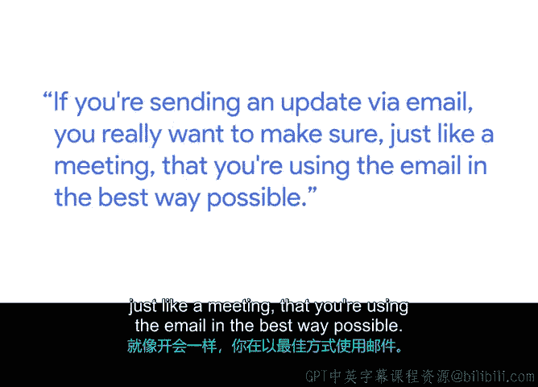
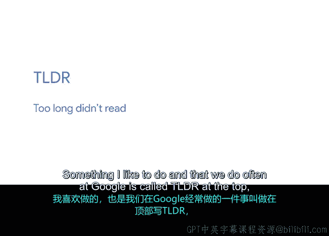

# 042：与利益相关方沟通的最佳实践 💬

在本节课中，我们将学习如何高效地与项目利益相关方进行沟通。有效的沟通是项目成功的关键，它能确保信息清晰传达、决策迅速做出，并建立良好的工作关系。

我是劳拉，谷歌的执行生产力顾问。我的职责是以教练的形式与高管们进行一对一合作，帮助他们进行时间管理、会议管理、有效的电子邮件沟通和组织工作。

## 沟通前的准备 🎯

上一节我们介绍了沟通的重要性，本节中我们来看看如何为沟通做好准备。当你需要与利益相关方沟通时，必须思考他们需要了解的绝对重要信息。

因此，在与同事或团队成员交谈时，你可能会提供更多细节。但在向高管做总结汇报时，必须确保内容简洁。你需要提前做一些工作，以找出向他们传递信息或获取决策的最佳方式。

以下是为此可以采取的一些有用步骤：

*   **询问沟通偏好**：询问他们的行政助理或曾与其合作过的人，了解他们偏好的沟通风格。
*   **了解信息呈现方式**：询问他们喜欢看到什么类型的演示文稿。
*   **明确决策所需信息**：了解他们通常需要哪些信息来做决策。

通过提前做这些功课并多方询问，你为自己奠定了成功的基础。特别是当你只有有限的时间或与利益相关方沟通的机会很短暂时，这一点尤为重要。

## 因人而异的沟通策略 👥

需要记住的是，虽然你面对多个利益相关方或不同的项目，但每个人喜欢沟通或接收信息的方式各不相同。

一个例子是，我曾与几位经理合作一个项目，他们都是利益相关方。其中一位非常健谈，喜欢通过头脑风暴来理清思路，他希望与我频繁开会，并希望敲定所有细节。另一位利益相关方则完全相反。

思考如何将相同的信息、相同的决策流程，量身定制给你需要获取信息的每个人或你正在合作的每个利益相关方，这是非常有帮助且重要的。

我喜欢在准备给利益相关方的演示文稿时，思考他们可能会问我的五个问题。然后，我会在附录中准备好这些额外的细节，以便能够充分利用他们的时间。

## 提出问题与提供方案 ⚙️

另一个好建议是，当你向利益相关方提出一个问题或议题时，同时带上你提议的解决方案或可能的解决方案。

思考的不仅仅是问“我该怎么办”，而是说“我认为也许我们应该做方案A，但我们也可以做方案B和C，您觉得呢？”这为他们提供了一个起点，让他们觉得你已经做了背景工作，并且非常了解问题。

## 高效的电子邮件沟通 📧

如果你通过电子邮件发送更新，就像组织会议一样，你确实需要确保以最佳方式使用电子邮件。

我喜欢做并且我们在谷歌经常使用的一个方法是在邮件顶部写上 **TLDR**，意思是“太长，没读”。这是一种有趣的说法，表示邮件可能有很多信息，但这是你需要从邮件中知道的一句话。

因此，在邮件顶部提供某种摘要，类似于说明“这是关于项目A的更新”、“需要决策”、“请求行动”或“截止日期”这类信息，能让利益相关方提前了解邮件内容。

接着，在撰写邮件时，你需要思考如何尽可能简洁。使用项目符号、高亮或加粗需要引起他们注意的内容。在邮件结尾重申你的请求，并包含任何截止日期，这非常有帮助。这样，如果人们快速浏览或稍后回头阅读你的邮件，他们就能获得所需的所有信息。

包括链接和附件，尽可能方便他们浏览你的邮件并回复你需要的信息。

## 总结 📝

本节课中，我们一起学习了与利益相关方沟通的核心原则。关键在于**提前准备、因人而异、简洁明了、并提供解决方案**。无论是面对面会议还是电子邮件，都要以对方最容易理解和行动的方式组织信息。记住，有效的沟通能节省所有人的时间，并推动项目顺利前进。