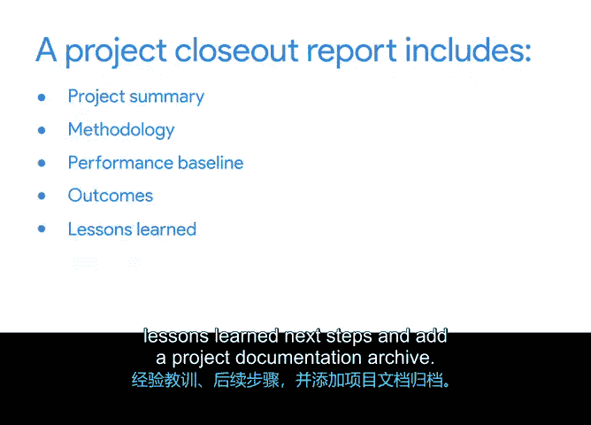

# 043：完成结项报告 📋

## 概述
在本节课中，我们将学习项目管理流程中的最后一个关键环节：项目收尾。我们将重点探讨如何创建一份有效的结项报告，这份报告对于总结项目成果、记录经验教训以及为未来的项目提供参考至关重要。

## 项目收尾的重要性
到目前为止，你已经跟随Peter学习了管理和交付项目的一些核心环节。你见证了她如何设定目标、规划流程、管理质量、向利益相关者上报问题等。出色的工作。

项目已经进展到这样一个阶段：Sauce and Spoon餐厅的平板电脑在通过质量标准后已经上线，项目经理的大部分工作已经完成。在本视频中，我们将讨论项目管理的最后环节之一：结束项目并展示其影响。

在Peter认为项目完成之前，她还有一些任务需要处理。其中一项任务是创建一份结项报告。结项报告是一个绝佳的机会，可以将所有链接和文档整理到一个地方，这种做法我们称之为良好的“项目卫生”。

结项报告也是反思团队表现的时刻，它能帮助团队确保每项任务都已完成。

## 结项报告的作用
一份结项报告能确认项目已完成，总结可交付成果、成功指标、反馈、经验教训和后续步骤，并作为组织的参考文档。

如果需要后续项目或启动类似项目，将这些成果集中存放将有助于这些未来项目顺利进行。

如果未来出现另一个类似项目，未来的项目经理如果拥有过去项目的详尽信息，他们将更容易取得成功。

一份有效的结项报告有助于确保每个人都对已完成的工作感到满意，最终确定团队的努力成果，让人们能够转向新的项目和任务，并通过与那些可能未深入参与项目的人员沟通，来扩大团队工作的影响力。

## 报告的目标读者
除了作为组织的参考文档外，项目结项报告是一份由项目经理为项目经理、未来的项目经理以及任何对项目要素和成果感兴趣的人创建的文档。

理想情况下，你希望任何不熟悉项目的人都能阅读它，并全面了解项目是什么、为什么进行以及项目进展如何。事实上，你将在本课程中完成的项目结项报告，应该能够独立作为你向潜在雇主展示的作品样本。

你应该能够将这份文档作为你工作的范例提供给他们。他们应该能够理解Sauce and Spoon平板电脑推广项目的背景，并看到你清晰综合和传达信息的能力。

## 结项报告的核心组成部分
在项目结项报告中，你将从添加项目摘要开始。以下是需要包含的主要部分：

**项目摘要**
在此部分，你需要包含项目目标。另一种思考方式是：这个项目的期望结果是什么。

**方法论或途径**
务必注明你的团队使用了哪种方法论或途径。你的团队是使用瀑布模型、敏捷、精益，还是这些方法的组合，或者其他方法。

**绩效基线**
结项报告最重要的方面之一是绩效基线。在这里，你将描述实际结果，并将其与规划和执行阶段设定的目标进行比较。

你将比较诸如**实际项目进度 vs. 计划项目进度**、**实际项目成本 vs. 计划项目成本**以及**计划范围 vs. 交付范围**等指标。报告甚至包含一个方便的备注栏，以便你解释出现的任何差异或问题。

**其余部分**
其余部分包括关键成就与成果、经验教训、后续步骤以及项目文档归档。在填写这些部分时，详尽是关键。我们已包含一些问题来指导你并确保你足够详细，但在你自己的结项报告中，可以更进一步，提供更具体的信息。

在填写这些部分时，请记住，结项的目的是汇编和归档项目最重要的方面。

## 总结
让我们回顾一下。在撰写项目结项报告时，请确保包含以下内容：项目摘要、方法论、绩效基线、成果、经验教训、后续步骤，并添加项目文档归档。

希望我已经解释了结项报告对一个项目有多么重要。如果一个项目被重复执行或启动了类似项目，这份包含你的学习和项目成果的重要文档，将为未来的项目经理奠定成功的基础。

在接下来的活动中，你将查阅支持材料，为Sauce and Spoon平板试点项目完成一份结项报告。