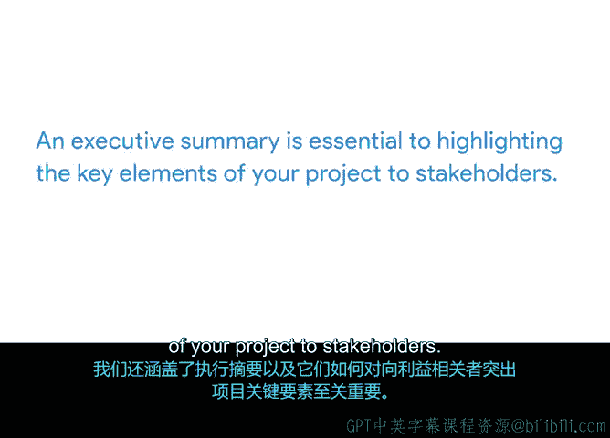

# 044：项目影响报告 📊

## 概述
在本节课中，我们将学习如何创建一份项目影响报告，并重点掌握其核心组成部分——执行摘要的撰写方法。我们将了解影响报告的目的、适用对象以及如何有效地向高级利益相关者展示项目的价值。

---

## 从项目收尾报告到影响报告
上一节我们介绍了通过创建项目收尾报告来保持良好的项目“卫生”。本节中，我们将讨论一个类似但侧重点不同的概念：影响报告。

影响报告的目的是向他人展示项目所增加的价值。它通常以演示文稿或幻灯片的形式呈现。

与为未来项目经理或关注项目细节的读者设计的详细收尾报告不同，影响报告通常是为未参与项目日常细节的高级利益相关者或项目发起人创建的。

---

## 为何报告项目影响至关重要
以下是报告项目影响至关重要的几个原因：
*   **分析结果**：帮助分析结果，以便调整和改进服务。
*   **激励团队**：通过庆祝成就来激励员工和高级利益相关者。
*   **建立信任**：与支持者、赞助商、资助方以及项目受益者建立信任和信誉。
*   **分享经验**：与类似组织分享经验教训。

---

## 影响报告的核心要素
一份影响报告应包含多个要素。其中最重要的部分之一是**执行摘要**。

执行摘要是用几句话到一个段落来描述项目目的和成果的部分。它提供了更长报告的要点概述，旨在分享给那些可能没有时间审阅整个报告的利益相关者。

可以将执行摘要视为项目的“精彩集锦”。其目的是向高级利益相关者提供对项目积极成果的简洁而有力的描述，既不过于冗长，也不过于模糊。

---

## 如何撰写执行摘要
在创建执行摘要时，可以问自己这个问题：如果一位高管没有时间阅读所有项目文档，而只能阅读这份执行摘要，他/她是否能理解项目的亮点？

你的执行摘要应旨在回答以下问题：
*   项目交付的效果如何？
*   我们从中学到了什么？

除了问自己一些基础问题外，回顾你的**SMART目标**、**商业论证**和**项目章程**也有助于撰写执行摘要。这些文件能帮助你反思并确定项目最重要的方面，这些方面通常与关键成就和积极成果相关。

一个有用的技巧是：先起草影响报告的其他部分。这有助于你提炼出最相关的信息，并将其纳入摘要中。

在影响报告模板中，你会看到关于**结果**、**成功之处**和**后续步骤**的幻灯片。在这些幻灯片中，你应该使用图表和图片等工具详细描述项目，以讲述项目成功的故事。这些部分写得越详细，就越容易提取和识别亮点，并将其添加到执行摘要中。

---

## 执行摘要应包含的内容
起草完影响报告的其他部分后，就可以起草执行摘要了。摘要中应包含以下信息要素：

以下是执行摘要应包含的核心内容：
*   **项目愿景**：在此说明报告的目的，以及项目旨在满足何种需求。
*   **关键成就**：这是讨论哪些活动、任务和里程碑帮助你定义成功的机会。影响报告中的主要亮点是什么？你的项目是否提高了盈利能力？项目增加了什么价值？在此处讨论这些。
*   **经验教训**：在此处讨论潜在的改进之处，以及未来将如何优化流程。

---

## 执行摘要示例分析
让我们探讨一个执行摘要的例子。假设你刚刚完成了一个项目，旨在推出一款新的省钱应用程序，该应用每月自动将用户支票账户中的资金转入指定的储蓄账户。

*   **项目愿景**：我们的目标是帮助用户在财务上取得进步，方法是创建一个基于算法的自动存款系统，将资金汇集到储蓄账户中。
*   **关键成就**：在准备发布期间，我们帮助了1000名测试版用户在短短六个月内节省了超过30万美元。这证明了我们应用程序的用例和需求。在财务亮点方面，我们可以说：通过向1000名用户每月收取3美元，我们在六个月内净收入18000美元。
*   **经验教训**：从测试中获得的主要反馈是，用户希望更频繁地更新关于资金何时被转移的信息。我们将在更新中添加此功能。

---

## 总结
本节课中，我们一起学习了项目影响报告。我们了解到，报告项目影响可以帮助分析结果、激励团队、建立信任并分享经验。我们还重点介绍了执行摘要，以及它如何对向利益相关者突出项目的关键要素至关重要。

---

## 实践任务
现在你已经更好地了解了影响报告可能包含的内容，是时候撰写你自己的执行摘要了。我们已经构建了一个影响报告框架，以便你了解典型报告的样子。你需要做的就是根据你新学到的知识填写执行摘要部分。