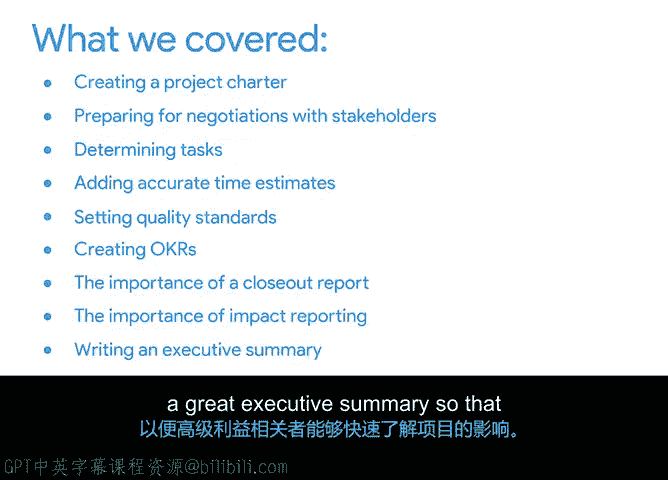

# 045：课程总结与回顾

在本节课中，我们将回顾并总结整个课程的核心内容，梳理你在项目管理生命周期各阶段所学到的关键技能。

---

## 课程内容回顾

首先，在项目启动阶段，你学习了如何创建项目章程，并确定了项目目标和可交付成果。你掌握了如何进行利益相关者分析，为后续的沟通与谈判做好准备。

上一节我们介绍了启动阶段，本节中我们来看看规划阶段。在规划阶段，你确定了为实现既定目标所需完成的任务。你认识到通过团队头脑风暴来确保任务完整性的价值，并且我们探讨了为每项任务创建准确时间估算的一些技巧。

从规划阶段过渡到执行阶段后，你开始执行任务，并进入了质量管理环节。在此环节中，你设定了质量标准，并通过用户调查来衡量质量。

接下来是收尾阶段。你学习了如何通过创建OKR（目标与关键成果）将问题与项目目标联系起来。同时，你也了解了收尾报告的重要性。

最后，你学习了影响力报告，以及如何撰写一份出色的执行摘要，以便高层利益相关者能够快速理解你项目的影响力。

---

## 核心概念与工具

以下是本课程中涉及的核心概念与工具总结：

*   **项目章程**：正式授权项目启动的文件。
*   **利益相关者分析**：识别并理解项目相关方及其需求和影响的过程。
*   **任务分解与估算**：将目标分解为具体任务，并估算所需时间。
*   **质量管理**：设定标准并衡量成果是否符合要求，例如通过 **用户满意度调查**。
*   **OKR（目标与关键成果）**：一种目标管理框架，用于连接日常工作和宏观目标。
*   **收尾报告**：总结项目成果、经验教训的文档。
*   **执行摘要**：一份简明的报告概述，突出项目的关键影响。

---

## 后续步骤

在下一个视频中，我们将对整个专业证书课程进行总结，并探讨如何运用你所学到的知识，在项目管理职业生涯中迈出下一步。

---

本节课中，我们一起回顾了项目管理的完整生命周期——从启动、规划、执行到收尾。你掌握了创建关键文档、进行有效分析、管理质量以及报告项目影响力的实用技能。这些是构建成功项目管理职业生涯的坚实基础。