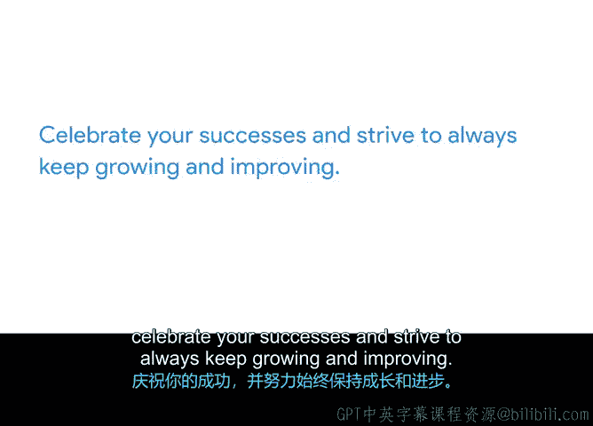

# 046：个人结项报告 📝

在本节课中，我们将学习如何完成一份个人结项报告。这份报告旨在帮助你回顾在整个项目管理证书课程中的学习历程、取得的成就以及未来的职业规划。通过系统地梳理这些信息，你可以清晰地看到自己的成长轨迹，并为下一步的职业发展做好准备。

---

## 回顾学习历程 🧭

你在本课程中已经取得了长足的进步。现在，让我们花点时间来庆祝你在成长和项目管理方面取得的成功。

这个过程被称为个人结项报告。它类似于你在整个课程中创建的回顾文档和结项报告。

让我们反思一下你刚刚完成的谷歌项目管理证书课程。

---

## 列出关键成就 🏆

首先，请列出你的关键成就。

请回想你最初开始学习本课程直到现在的整个过程。

在这个过程中，你克服了哪些挑战？

也许有一些特定的课程或概念，你曾认为自己永远无法理解，但最终弄明白时，你对自己感到惊讶。

也许你在学习本课程的同时，还克服了个人生活中的挑战。

如果你有一份全职工作，但仍然找到了完成本课程的时间，这本身就是一项重大的胜利。

花点时间写下其中的一些成就。

---

## 反思经验教训 📖

接下来，反思你学到的任何经验教训。

也许你曾度过非常忙碌的一周，觉得自己在某节课上投入的时间不够。

你可能希望更彻底地阅读它，因为你认为它很重要。

也许你发现自己喜欢管理利益相关者，但不太喜欢预算和采购。

请记下这些学习心得。

---

## 规划职业发展 🚀

然后，你需要思考从这里开始，可以采取哪些步骤来推进你的项目管理职业生涯。

这可能是联系招聘公司，或者请求你当前的老板给予你更多责任。

也许是设定一个目标，润色你的简历，并每周申请五个项目管理职位。

写下这些后续步骤。

更进一步，将这些目标添加到时间线中，就像它们是你在管理的项目的一部分。

正如我们一再强调的，项目管理是你日常生活的一部分。

---

## 撰写个人执行摘要 ✍️

最后，添加你自己的执行摘要。这不同于你之前学到的项目执行摘要，而是你在本课程中经历的个人总结。

在撰写你的执行摘要时，请整体描述你参与本课程的体验。

记录下你的成功之处，以及你计划如何推进未来的项目管理职业生涯。

这应该是一个鼓舞人心且有趣的过程。所以，请自由地包含各种亮点。

也许你在某个测验中取得了高分，你想为此表扬自己。

也许你能够将学到的一些概念应用到家庭聚会的规划中。

也许你对某个以前从未研究过的特定主题学到了很多，并且你真的很喜欢它。

无论是什么，请务必在这里突出它。

---

## 完成并运用报告 ✅

至此，你已经准备好完成你的个人结项报告了。

请将这份报告作为一份项目成果随身携带，以便回顾你与我们共同度过的这段学习经历。

就像你在项目结束时为你的团队所做的那样，庆祝你的成功，并努力保持不断成长和改进。

---

## 课程总结与展望 🌟

这标志着本课程的结束，但只是你项目管理旅程的开始。

花点时间庆祝你所取得的一切成就。

你不仅在寻求新信息和知识方面保持了勤奋，还拥有了一份可以向潜在雇主展示的作品集。

无论接下来发生什么，你都应该对自己拥有成为一名出色项目经理所需的技能充满信心。

我迫不及待地想看到你的成就。恭喜你，祝你好运。