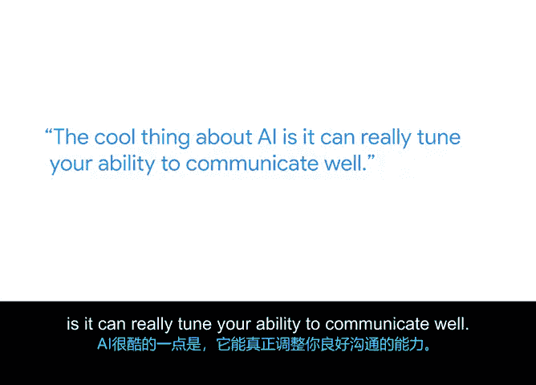

# 047：运用AI驱动职场影响力 🚀

在本节课中，我们将学习如何将人工智能（AI）工具应用于项目管理实践，以提升工作效率、沟通质量和问题解决能力。AI正在深刻改变我们的工作方式，掌握其应用方法对项目经理的成功至关重要。

## 引言

大家好，我是Ben，一名资深项目集经理。我最喜欢的工作部分是与强大的团队一起解决复杂问题。AI对我们即将进行的所有工作都是一场巨大的变革。关键在于要走在变革的前面。

## AI在项目管理中的核心价值

上一节我们提到了AI带来的变革，本节中我们来看看AI的具体价值。学习AI能做什么，以及它不能做什么，并真正理解这一点非常重要。例如，AI在某些特定事情上非常出色，但在其他地方可能行不通。了解AI的能力将帮助你作为项目经理取得更大的成功。

项目经理所做的许多事情，AI都能帮助你提升水平。AI的一个很酷的地方在于，它能真正调整你良好沟通的能力。

## AI的实际应用场景

以下是AI在项目经理日常工作中的几个具体应用方向。

### 1. 优化书面沟通
我经常使用AI，比如当我撰写复杂的邮件或面向高管的邮件时。我会用AI来双重检查内容、修改我的写作，或者提供更好的措辞。这使我交付的内容质量更高。

### 2. 辅助问题解决与创意生成
当我遇到难题、试图找出解决方案时，我通常会有很多想法，但这些想法可能不太合适，或者我需要找人讨论。当我的队友不在身边、无法讨论这些事情时，我可以求助AI。我可以向AI抛出这些想法，并说明：“我有这些想法，这是问题所在，这是我想解决的目标。”AI会反馈数十个有趣的想法，我可以将这些想法协同整合，构建出所需的优秀方案。

### 3. 提炼核心信息与电梯演讲
我使用生成式AI（Gen AI）做过一件有趣的事：当时我正在头脑风暴如何介绍我的项目集。我需要找到合适的措辞，构思电梯演讲，以及如何最好地呈现它。我有很多描述它的文字和段落，但我需要将其精简。这对我来说非常困难。于是我把这些内容输入AI引擎，并提示：“请用一句话完成，给我一个电梯演讲，要充满活力，确保能吸引注意力，并且不遗漏重要信息。”它反馈了多个示例。我随后调整了其中一个，得到了一个非常精炼的电梯演讲，每当向团队描述时我都能使用它。

## 给项目管理初学者的AI使用建议

对于任何开始在项目管理中使用AI的人，我建议考虑以下三点。

1.  **大胆实验**：尝试不同工具、不同方法、不同提示词。你会惊讶于自己发现的酷炫功能，有时它们可能无效，但有时效果会远超你的预期。
2.  **确保安全**：无论是你输入的内容还是你使用的验证方式，都要确保你做的是正确的事，输入正确的内容，并获取正确的输出。
3.  **与他人交流心得**：你会惊讶于能从同样在尝试AI的同事那里学到多少东西，以及他们能从你这里学到多少。你们可以基于彼此的经验共同进步。

## 总结

本节课中，我们一起学习了AI在项目管理中的强大应用。AI对任何商业人士，尤其是项目经理而言，都是一件大事。它不仅能在工作中帮助你，还是一个绝佳的伙伴，能帮助你发现和利用你从未想过的新见解。通过积极学习、安全实践和团队协作，你可以充分利用AI的力量，显著提升你的项目管理效能和职场影响力。