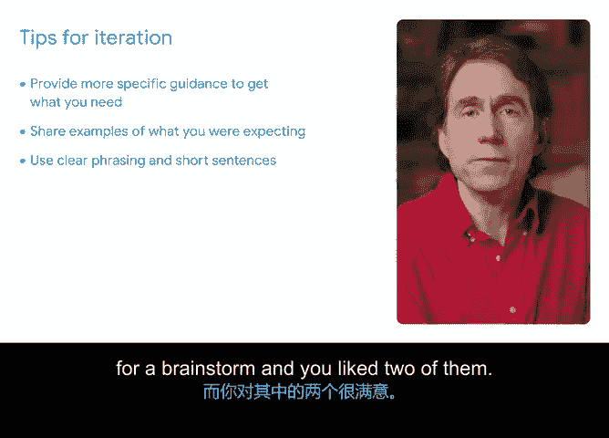

# 049：使用AI创建项目章程 🚀

在本节课中，我们将学习如何利用生成式AI工具来高效地创建项目章程。项目章程是定义项目目标、范围和关键细节的正式文件，是项目启动阶段的核心文档。我们将通过一个具体的例子，演示如何使用AI辅助完成这项工作，并探讨如何通过迭代优化来获得最佳结果。

想象一下，你想要建造一栋房子。你的第一步很可能不是直接拿起锤子和钉子。首先，你需要制定计划。你会设定预算，审查蓝图，并明确房子建成后的最终样貌。启动一个项目遵循相同的结构。在这个情境下，这份计划就被称为项目章程。

正如你所了解的，项目章程是一份正式文件，它明确定义项目，并概述实现项目目标所需的必要细节。生成式AI工具可以帮助你构建一份出色的项目章程，并节省你的时间。

## 开始尝试：构建初始提示 💡

让我们开始尝试。我的初始提示可以这样写：

> 扮演一个项目经理，构建一份项目章程，其中包含以下信息。对于任何缺失的信息，请添加占位符。

在这个例子中，我关于项目的详细信息存放在另一个文档里，包括项目描述、业务需求、可交付成果、项目相关方以及成功标准。我将把这些信息复制并粘贴到Gemini（或其他AI工具）中，为我的提示提供更多细节。

在提示中包含这些细节非常重要。我不仅仅是输入一个请求，同时还为AI提供了用于回应的关键信息。在这个案例中，就是关于我计划项目的详细信息。

## 评估与迭代：优化AI输出 ✨

AI生成的项目章程为我提供了一个良好的起点，但仍有工作要做。许多占位符需要扩展成完整的句子，并且我需要添加更多细节。不过，这已经是一个很棒的开端。请记住，我提供给AI的初始信息越多，它生成的项目章程就可能越完整。但这个输出为我提供了一个坚实的起点。

以下是借助生成式AI工具构建项目章程时需要牢记的几点：

首先，生成式AI可以非常快速地创建大量内容，并且能以不同格式呈现。当你作为项目经理需要创建像项目章程这样的文档时，这会非常有用。

其次，如果你有自己喜欢的现有项目章程模板，可以将其分享给AI。或者，你可以向AI提供关于你希望看到的章程格式的指导。例如，你可以指定希望包含的页数或章节数量。

请务必仔细阅读AI的回复。如果你只是粗略浏览输出，它可能看起来不错，但实际上可能包含了你意想不到的内容。AI可能承担了繁重的工作，但你仍然需要在这里进行深入的思考。回想一下我们之前讨论过的提示框架，这里就是“E”（评估）发挥作用的地方。

## 迭代技巧：完善你的提示与输出 🔄

你可以通过改变措辞和格式来尝试不同的提示。这种实验将极大地帮助你改进输出结果，并为你提供更多可用的选项。要乐于再次尝试，并有意识地调整你的指令。这就是我们框架中的“I”（迭代），即通过反复的测试和调整循环来改进你的AI提示和输出的过程。

你可以优化或调整提示，以获得最准确和有用的结果，并看看是否能得到你更喜欢的其他回复。说到这里，让我们花点时间更深入地探讨一下迭代。

以下是一些技巧：

*   **评估输出偏差**：当你评估你的提示时，是否发现输出有任何不符合你预期的领域？如果是这样，可能有机会为AI工具提供关于你需求的更具体指导。记住，AI工具只能根据你告诉它的内容来提供结果。因此，请确保你的提示有足够的细节来获得有用的回应。
*   **提供参考示例**：回想一下我们提示框架中的“R”（参考）。你能分享一个你期望的示例吗？在你的提示中提供示例可以帮助AI工具理解你想要什么。如果你希望找到特定的格式或分析类型，可以向AI工具展示一个例子。
*   **检查措辞清晰度**：你的表达尽可能清晰了吗？尝试将你的指令分解成更短的句子。这可以帮助你在下次改进输出。
*   **利用偏好反馈**：输出中有你喜欢的部分吗？例如，假设AI工具为你提供了五个头脑风暴的想法，而你对其中的两个很满意。在你的下一个提示中，解释你为什么喜欢这两个，并要求AI工具基于你的理由提供一个新的想法列表。你甚至可以指出你为什么不喜欢另外三个想法，并要求工具在下次生成时考虑到这一点。

## 应用迭代：以项目章程为例 📝

那么，让我们回顾一下使用AI帮助编写项目章程的例子。在这个特定场景中，我们如何进行迭代？

一种方法可能是提出后续提示，要求AI使用更少的专业术语。或者，我可以要求AI缩短或加长特定部分。我还可以要求AI帮助使项目章程更完整。例如，我可以询问，从我们最初提供的信息中，是否遗漏了任何重要的信息，这些信息将有助于创建一份更强大的项目章程。

要获得令你满意的结果可能需要一些练习。尝试和实验各种提示，是找出如何获得对你有用结果的最佳方式。有时，获得你想要的输出可能需要几个步骤，而达到目标的唯一方法就是让自己适应、探索并找到适合你的路径。

## 总结 🎯

本节课中，我们一起学习了如何利用生成式AI工具辅助创建项目章程。我们了解到，一个包含具体项目信息的清晰提示是成功的关键。AI生成的初稿是一个高效的起点，但必须经过仔细的评估和迭代优化。通过提供更具体的指导、参考示例，并基于反馈调整提示，我们可以引导AI产出更符合需求、更高质量的项目章程文档。现在，请尝试创建一份属于你自己的项目章程吧。