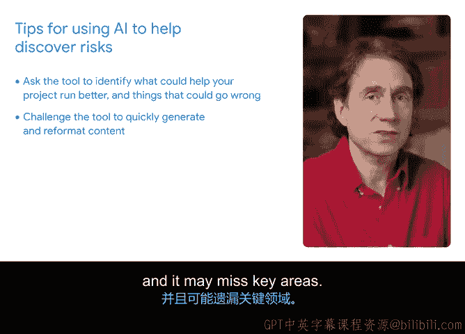

**谷歌项目管理专业证书：第6课：用生成式AI识别潜在项目风险**


在本节课中，我们将学习如何利用生成式AI工具（如Gemini）来系统性地识别项目中的潜在风险，从而为项目管理做好更充分的准备。

---

每个项目都存在风险。风险是指可能发生并影响项目成果的潜在事件。一个风险可能对一个或多个项目目标（如范围、进度、成本或质量）产生积极或消极的影响。在任何项目中，你都无法完全消除所有风险。但作为一名项目经理，如果你能明确了解风险是什么以及哪些需要优先处理，你就能更好地制定缓解策略。

你的项目章程可能只列出了少数几个项目风险。像Gemini这样的生成式AI工具可以帮助生成一份更详细的潜在风险清单，让你作为项目经理能做好充分准备。

### **实践示例：构建一款狗狗健康应用**

为了说明这个过程，我们假设正在开发一款狗狗健康应用。我们通过向Gemini输入项目场景和一些细节来设定背景。

首先，尝试输入如下提示：
```
我是一个项目经理，负责监督一款狗狗健康应用的开发。我们是一家提供遛狗、训练和宠物用品服务的中型公司。请根据以下项目细节，识别可能影响项目时间线或预算的主要风险。
```

接着，提供关于项目的详细背景信息。我们可以从项目章程中复制并粘贴信息，例如：
（此处可粘贴项目章程的具体内容，如项目目标、关键里程碑、预算限制、团队构成等。）

请注意，像Gemini Advanced这样的生成式AI工具允许直接上传文档。这意味着你可以将项目章程直接上传到工具中，而无需像我刚才那样复制粘贴信息。

现在，让我们查看Gemini的输出结果。获得这份长长的潜在风险清单令人兴奋。😊 我可能不会想到所有这些风险。同时，其中一些风险比较笼统，如果我们向Gemini提供了更多项目细节，它们可能并不适用。

一般来说，你在提示词中分享的信息越多，生成式AI工具的效果就越好。例如，我们可以尝试在提示词中添加关于以往项目中遇到的风险，或为本项目已识别的风险，看看是否能改善输出结果。

### **使用生成式AI识别风险时的注意事项**

以下是利用生成式AI工具帮助你发现潜在风险时需要记住的几点：

生成式AI工具非常擅长辅助头脑风暴。
一种有效利用它的方式是，不仅让它帮助你识别能让项目运行得更好的因素，也要让它思考可能出错的地方。

此外，生成式AI工具能快速生成内容和文本。
你可以要求它生成你想要的内容，并让它以不同的方式重新格式化，直到找到最适合你和团队的形式。

当然，获得一份长长的风险清单很有帮助，但它可能并不总是包含与你的项目或团队需求相关的条目，也可能遗漏关键领域。这时，你需要仔细审查清单并运用自己的判断。

最后，随着项目进展，当你识别出新风险时，可以带着这些具体信息回到Gemini，共同头脑风暴缓解计划。😊

---



就像人类一样，生成式AI无法阻止风险演变成导致项目脱轨的问题。但像Gemini这样的工具可以帮助你提前预见这些风险。这对于成为一名高效的项目经理至关重要。

在本节课中，我们一起学习了如何利用生成式AI工具来识别和梳理项目潜在风险，掌握了通过提供详细背景、迭代提示词以及结合自身判断来优化风险清单的方法。