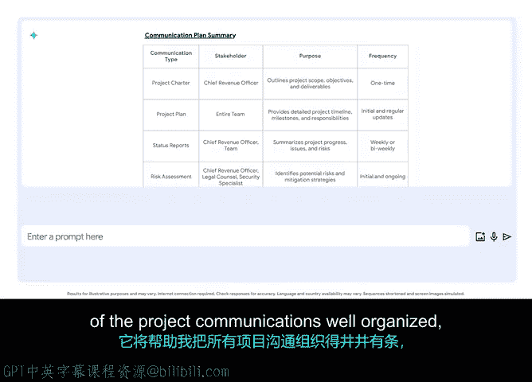

**谷歌项目管理专业证书：第6课：使用AI改进项目沟通**

在本节课中，我们将学习如何利用生成式人工智能工具来改进项目沟通。有效的沟通是项目成功的关键，而AI可以帮助我们规划、组织和起草各类沟通内容，从而节省时间并提高效率。

---

即使拥有最完善的计划、出色的项目章程和对风险的全面了解，如果缺乏一个关键要素，项目也无法成功。这个要素就是良好的沟通。

生成式人工智能工具有多种方式可以帮助进行项目沟通。让我们从宏观层面开始探讨。

上一节我们提到了沟通的重要性，本节中我们来看看AI如何帮助我们规划沟通。

生成式AI可以帮助生成一份清单，列出保持项目顺利运行可能需要进行的沟通。这些可能包括状态报告、利益相关者更新等。让我通过一个例子来演示。

我可以向Gemini这样的工具输入类似以下的提示：
`给定包含以下信息的项目章程，请以表格形式分享一份项目期间应准备的最重要沟通的摘要，并注明沟通类型和利益相关者。`

就像之前一样，我将复制并粘贴项目章程中的信息。例如：
`项目名称：网站重新设计；目标：提升用户体验和转化率；关键利益相关者：市场总监、技术主管、最终用户代表。`

Gemini为我创建了一个详细的表格，这将帮助我井井有条地管理所有项目沟通，并避免遗漏重要事项。

这个表格是一个有用的指南，能确保我有效地与正确的利益相关者互动，从而管理他们的期望并使项目保持在正轨上。

如果你想使用生成式AI来协助进行利益相关者沟通，以下是需要注意的几个要点。

以下是使用AI进行沟通规划的关键建议：
*   **指定输出格式**：生成式AI工具可以提供不同的输出格式，如表格或项目符号列表。因此，请在提示中明确指定你想要的格式，就像我们在这里要求表格一样。
*   **结合公司规范**：你的公司可能围绕沟通有标准的模板、方法，以及关于谁应接收不同信息的规范。请记住，在决定如何管理这些沟通方面，你扮演着重要角色，但生成式AI工具可以为你提供一个有用的起点。
*   **注意信息安全**：在提示中包含敏感或机密信息（如个人姓名）之前，务必查阅公司的相关政策，并尽可能避免输入此类信息。

在创建了利益相关者沟通计划之后，你可以继续使用生成式AI。

上一节我们规划了沟通，本节中我们来看看如何利用AI起草具体内容。

你可以利用生成式AI让这些沟通内容变得生动具体。例如，像Gemini这样的生成式AI工具可以帮助你撰写项目状态邮件的初稿，发送给项目的高级发起人。

使用生成式AI工具创建沟通草稿确实可以帮助你节省时间。因此，请亲自尝试一下，看看你能创造出什么。

---

本节课中，我们一起学习了如何运用生成式人工智能工具来改进项目沟通。我们从利用AI规划沟通清单和创建利益相关者沟通表开始，然后探讨了起草具体沟通内容（如状态邮件）的方法。记住，AI是一个强大的辅助工具，能提供起点并节省时间，但最终的沟通策略、内容审核以及与公司规范的结合，仍需项目经理的专业判断和主导。