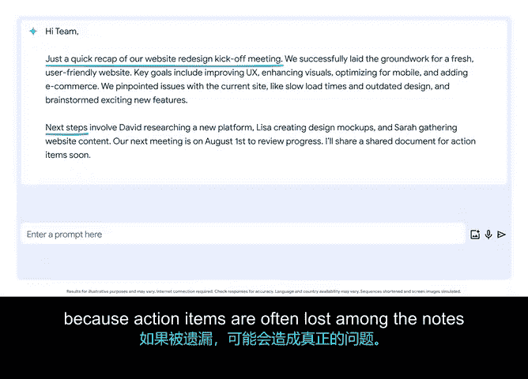

# 052：用AI更高效执行会议 🚀


在本节课中，我们将学习如何利用生成式AI工具，让项目会议变得更高效、更有成果。我们将重点探讨如何借助AI整理会议纪要、明确行动项，并确保会后跟进顺畅。

## 会议的重要性与挑战

在许多公司和团队中，你需要花费大量时间来准备和参加会议。会议对于推动工作进展固然重要，但如果管理不善，它们也可能令人沮丧。会议结束后发生的事情，往往是整个过程中最关键的部分。

我们都有过这样的经历：在与项目团队进行线上会议时，大家进行了精彩的讨论。然而，会议结束后，当大家各自散去，每个人接下来具体该做什么却变得模糊不清。

## AI如何提升会议效率

生成式AI工具可以帮助你让会议更富成效，并有效组织会后的跟进工作。让我们聚焦于一个常见的工作场景：我需要生成一份会议摘要并记录行动项，以便团队能够根据会议讨论内容采取行动。

我可以编写一个这样的提示词（Prompt）：
```text
请根据以下会议笔记，撰写一封简洁的两段式总结邮件，需明确关键点和行动项。邮件需包含友好的开头问候和温暖的结尾祝福。
```

接下来，我会打开我的会议笔记，复制它们，并将其粘贴到提示词中。这个过程非常便捷。AI工具将我原本有些杂乱的会议笔记，整理成了一份带有明确行动项的清晰摘要。

对于项目经理而言，这功能非常强大。因为行动项常常淹没在大量的笔记中，一旦被遗漏，就可能引发真正的问题。

## 有效使用AI的注意事项

为了让生成式AI帮助你更有效地组织会议，有几点需要注意。

首先，AI无法读懂你的心思。会议笔记通常比较简略，因此你需要确保你的笔记足够完整，能够涵盖所有重要内容。如果你在记录优质笔记方面有困难，一些视频会议软件甚至提供了获取会议文字记录的功能。

其次，请记住根据你的沟通目标，指定所需的输出格式。在上述案例中，我希望通过电子邮件向与会者发送一份简短的摘要。但试想一下，如果有几个人未能参加会议，在这种情况下，我可能就需要请求AI生成一份更详细的**会议回顾**，以便他们能全面了解所错过的内容。



## 总结与实践

谁不喜欢更高效、更有成果的会议呢？花点时间，从你的日程表上找一个即将到来的会议，尝试使用AI工具来优化它吧。


本节课中，我们一起学习了如何利用生成式AI工具来提升会议效率。核心在于通过清晰的提示词，让AI帮助我们整理会议纪要、提炼关键点并明确行动项，从而确保信息传达准确，会后跟进有力。记住，完整详细的原始笔记和明确的格式要求，是发挥AI效用的关键。