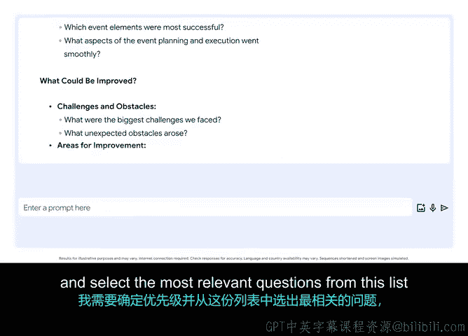

# 053：用AI规划迭代回顾会议 🧠

在本节课中，我们将学习如何利用生成式人工智能（Gen AI）来高效地规划项目迭代回顾会议。我们将了解回顾会议的价值，并掌握使用AI工具（如Gemini）生成会议问题、优化会议流程的具体方法。

你是否曾有过这样的经历：尝试了一个新菜谱或完成了一个家居改造项目后，心想“要是我在开始之前就知道这一点就好了”？你可能会在脑海中记下，或写个便条，提醒自己下次如何改进。

项目管理也是如此。回顾项目中进展顺利和不顺利的环节，能让下一个项目运行得更加顺畅。

## 回顾会议的价值

回顾会议对你运行的任何项目管理流程都很有价值，因为它提供了一个及时获取诚实反馈的机会。这些反馈可以帮助指导你的下一个冲刺阶段和未来的工作。

上一节我们探讨了回顾会议的重要性，本节中我们来看看如何具体规划一次高效的回顾会议。

## 利用AI生成会议问题

当需要规划下一次回顾会议时，我和Gen AI可以帮助你。你可以向Gemini这样的工具提供清晰、具体的项目细节，让它帮你构思在会议中可以提出的问题。

让我展示一个我可能会使用的提示词。到目前为止，我一直在向Gemini输入文字提示。但这里有一个专业技巧：你还可以激活麦克风功能。这让你能使用语音快速添加更多信息、开始一个新的提示，或对现有提示进行迭代。

例如，我可以使用麦克风功能向Gemini说出这个提示词：

> “我是一名项目经理，正准备为我的团队主持一场关于我们刚完成项目的、时长一小时的回顾会议。该项目涉及为当地一所学校举办一场有该地区企业和非营利组织参与的社区募捐活动。请分享一个能激发会议参与度、并引导我们讨论以发现哪些做得好、哪些下次可以改进的、丰富的问题库。”

Gemini会提供许多潜在的问题。这是一个很好的起点。在会议时间有限、参与人数众多的情况下，我会希望从这个列表中优先选择和筛选出与我的特定团队及项目目标最相关的问题。

## 筛选问题的考量因素

以下是你在缩小选择范围时可以考虑的因素：

*   **相关性**：问题是否直接针对刚结束的项目？
*   **影响力**：问题的答案能否对未来的工作产生实质性影响？
*   **参与度**：问题是否能鼓励所有团队成员开口发言？
*   **时间分配**：问题数量是否适合会议的时长？

## 使用AI准备回顾会议的额外建议

当使用Gen AI帮助你准备冲刺回顾会议时，还有几点需要记住：

1.  **融入文化与个人因素**：例如，在会议开始时，我通常会先感谢团队为项目成功付出的出色努力。我也可能想更新破冰活动，以更符合我的团队文化。
2.  **阐明会议目的**：许多参与回顾会议的人并不清楚这类会议的目的。在会议开始时简要解释其目的会很有帮助。冲刺回顾会议为你和你的团队提供了一个讨论哪些做法有效、哪些可以改进的机会。

当你使用Gen AI来协助准备时，你可以专注于只有你才能带来的独特见解和概念，而无需担心耗时的后勤准备工作。

## 总结与挑战

就像任何新技术一样，我们都需要尝试、测试和实践，以学会如何使用Gen AI。我很高兴能分享一些我作为项目经理在工作中使用Gen AI的方式，从帮助撰写项目章程到让会议更高效。

我希望这能帮助你在自己的角色中开始使用Gen AI。我给你的挑战是：思考你已经在做的工作。是否有某件事花费了大量时间？是否有一个项目你需要灵感来启动？承诺尝试将Gen AI用于那些能对你和你的工作产生真正改变的事情上。

在本节课中，我们一起学习了回顾会议的核心价值，并掌握了利用Gen AI工具（如通过语音或文字提示）来高效生成会议问题、筛选问题以及融入人文关怀的具体步骤。记住，AI是提升效率的助手，而你的经验和洞察才是会议成功的核心。