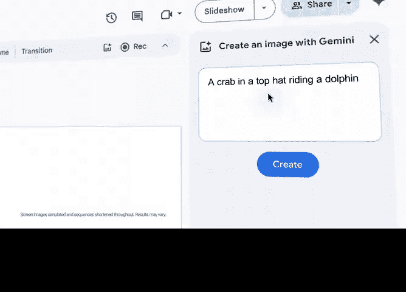

# 054：谷歌AI精要介绍

## 概述
在本节课中，我们将学习谷歌AI的核心概念。我们将了解人工智能的基本定义、机器学习的关键类型，并探讨如何将这些技术应用于项目管理等现实场景。

---

## 什么是人工智能？🤖
上一节我们概述了本课程的目标，本节中我们来看看人工智能的基本定义。

人工智能是计算机科学的一个分支。它致力于创建能够执行通常需要人类智能的任务的系统。这些任务包括学习、推理、问题解决、感知和理解语言。

人工智能的核心目标是使机器能够模仿人类的认知功能。

---

## 机器学习：AI的核心驱动力⚙️
理解了人工智能的广义概念后，我们进一步探讨其最重要的子领域——机器学习。

机器学习是人工智能的一种实现方法。它使计算机能够在没有明确编程的情况下从数据中学习和改进。其核心思想是使用算法解析数据，从中学习，然后对现实世界中的事件做出决定或预测。



机器学习的关键公式可以概括为：
**模型 = 算法 + 数据**

以下是机器学习的主要类型：

1.  **监督学习**：算法在带有标签的数据集上训练。每个训练样本都包含输入和对应的正确输出。目标是学习一个从输入到输出的映射函数。
    *   **示例代码（伪代码）**：
        ```
        输入：带有标签的历史项目数据（如“任务时长”->“是否延期”）
        过程：训练一个分类模型
        输出：预测新项目任务延期的可能性
        ```

2.  **无监督学习**：算法在没有标签的数据集中寻找模式或结构。系统试图自行理解数据的内在组织。
    *   **示例**：对项目风险因素进行聚类分析，发现未知的关联模式。


3.  **强化学习**：智能体通过与环境互动来学习。它通过尝试和错误，根据行动获得的奖励或惩罚来优化行为策略。
    *   **公式表示**：**智能体在状态 *s* 采取行动 *a*，获得奖励 *r*，并转移到新状态 *s'*，目标是最大化累积奖励。**

---

## AI在项目管理中的应用🚀
认识了机器学习的不同类型后，本节我们来看看它们如何在项目管理中发挥实际作用。

人工智能可以显著提升项目管理的效率和成功率。它通过处理大量数据并提供洞察，辅助项目经理进行决策。

以下是AI在项目管理中的几个关键应用方向：

*   **预测分析与风险管理**：利用历史项目数据，AI模型可以预测项目时间线、预算超支风险或资源冲突，帮助团队提前制定应对措施。
*   **资源优化与分配**：AI算法可以分析团队成员的技能、工作负荷和历史表现，为任务推荐最合适的人员，实现资源的最优配置。
*   **自动化日常任务**：AI可以处理状态报告更新、会议纪要生成、进度跟踪等重复性行政工作，让项目经理更专注于战略和沟通。


---

## 总结
本节课中我们一起学习了谷歌AI的精要介绍。我们首先定义了人工智能，然后深入探讨了其核心驱动力——机器学习，包括监督学习、无监督学习和强化学习三种主要类型。最后，我们了解了这些技术如何应用于项目管理实践，例如进行预测分析、优化资源分配和自动化任务。理解这些基础概念是未来在项目中有效利用AI工具的第一步。