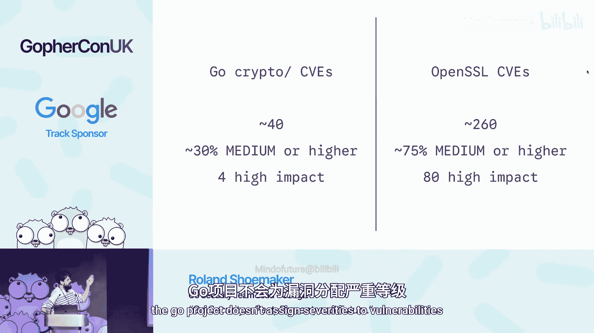

# 001：Go安全 – 过去、现在和未来 🛡️

在本节课中，我们将跟随Google Go安全团队的负责人Roland Shoemaker，一起回顾Go语言在安全方面的历史、当前团队的工作重点以及未来的发展方向。我们将了解Go安全团队如何运作，Go语言面临哪些类型的安全问题，以及团队如何通过设计、测试和社区协作来构建更安全的生态系统。

## 概述：Go安全团队简介

Go安全团队成立于2020年初，目前由五名工程师全职负责Go语言及其生态系统的安全工作。团队成立的背景是Go语言在行业内变得至关重要，被用于构建大量关键服务。确保Go语言本身及其标准库的安全，对于防止大规模安全事件至关重要。

团队的主要对外接口是邮箱 `security@golang.org`，用于接收安全报告。大多数安全问题并非由团队内部发现，而是来自外部安全研究人员。此外，报告者也可以通过Google的开源漏洞奖励计划提交报告并获得奖金。

团队负责维护Go标准库中被视为安全关键（security-critical）的包，主要包括：
*   **加密相关包**：`crypto/*` 目录下的所有算法（加密、哈希、TLS、X.509等）。
*   **关键网络服务栈**：如 `net/http`、`encoding/json`（常用于处理网络数据）。
*   **处理不可信用户输入的包**：如图像解析库、`archive/zip`、`archive/tar` 等。
*   **模块生态安全**：模块代理（module proxy）、校验和数据库（sum database）的安全方面。

## Go的安全历史与现状

上一节我们介绍了Go安全团队的职责，本节中我们来看看Go语言在安全方面的历史表现和当前面临的主要问题。

由于Go是一门内存安全的语言，它避免了C语言中常见的内存破坏类漏洞。根据CVE（公共漏洞枚举）数据统计，Go的漏洞数量远少于Python和Node.js。值得注意的是，在Go总共约160个CVE中，只有20个存在于Go工具链本身（如`go`命令），其余均位于庞大的标准库中。

在加密库方面，Go的表现尤为突出。与许多语言封装OpenSSL不同，Go拥有自研的、覆盖广泛的加密实现。通过有选择地仅实现实用且经过深思熟虑的算法，Go加密库的漏洞数量和严重性都远低于OpenSSL。一项内部评估显示，在Go加密库的约40个CVE中，只有4个被认为是高影响的（可能从根本上影响应用安全），而OpenSSL则有约80个高影响漏洞。

在Go中，安全漏洞主要分为两大类：
1.  **拒绝服务（Denial of Service）**：导致程序崩溃（panic）或消耗过多资源（内存、CPU）。这类漏洞在Go生态中通常影响较低，因为现代网络服务基础设施通常能从容应对单个实例的崩溃。
2.  **行为异常（Incorrect Behavior）**：即逻辑漏洞。这是更严重的一类，例如API行为与文档描述不符，或加密验证逻辑错误。这类漏洞可能彻底破坏程序的安全保证。

以下是导致拒绝服务漏洞的两种常见模式：
*   **切片越界或空指针引用**：基于不可信输入进行切片操作而未检查边界，或解引用空指针，会导致程序panic。
*   **基于不可信输入进行大内存分配**：例如，解析数据头时，使用其中未经校验的长度值来分配切片，可能导致程序分配巨大内存而停滞或崩溃。

行为异常漏洞则通常源于：
*   **规范模糊或缺失安全考量**：例如，HTTP/1.1或早期HTML规范在制定时未充分考虑安全边界（如请求头数量、正文长度、解析深度），导致实现时容易引入漏洞。
*   **实现不一致**：不同语言或不同实现之间，对同一规范的解释或实现存在差异，可能导致安全边界模糊，为数据走私等攻击创造条件。
*   **暴露不安全的底层API**：提供过于底层或危险的原语，要求使用者具备极高专业知识才能安全使用。例如，曾经公开的 `crypto/elliptic` 包中的底层数学运算，如果使用者未进行正确的标量归约检查，可能导致严重的签名验证绕过问题。
*   **汇编代码与Cgo的复杂性**：为追求性能，关键加密算法常使用汇编实现，但汇编代码难以审查、测试和保证覆盖。而Cgo则引入了C语言的内存安全问题，且编译/链接标志的传递可能被滥用，导致远程代码执行。

## 当前工作重点：修复与加固

了解了Go面临的安全挑战后，本节我们来看看安全团队当前正在采取哪些措施来修复历史问题并加固现有代码。

团队当前的首要任务之一是**弃用（Deprecate）过去设计不当的API**。由于Go的兼容性保证，这些API无法直接移除，但团队会为其添加明确的警告，提示用户除非确有必要且深知风险，否则不应使用。一个典型例子是 `crypto/rsa` 包中用于解密PKCS#1 v1.5会话密钥的函数，它设计复杂且极易误用。

与此相辅相成的是**添加更安全的API**。如今在设计新API时，团队首先考虑的是“用户可能如何误用此API？”以及“如何设计才能避免安全保证被意外破坏？”。尽管API设计是难题，但这是持续努力的方向。

另一项重要工作是**重构FIPS支持**。FIPS是美国政府的加密模块合规性框架。此前Go的FIPS实现基于BoringSSL（OpenSSL的分支），依赖Cgo，带来了前述的复杂性和风险。从Go 1.24开始，团队与第三方合作，开发了纯Go实现的FIPS模块，目前正在等待NIST认证。这将提供一个更安全、更易用的合规选项。

此外，团队还**聘请外部公司Trail of Bits对加密库进行了全面审计**。审计结果令人鼓舞，仅发现少数问题，其中只有一个被认为是严重的。这印证了Go团队在编写加密代码方面的高水准。

## 未来展望

回顾了当前工作后，让我们展望一下Go安全团队未来的计划。

未来的核心方向之一是**加强测试**。防止漏洞最有效的方法除了“不写有问题的代码”，就是“充分测试”。团队正在致力于：
*   为TLS、X.509等重要协议寻找和采用更全面的测试套件。
*   加强对汇编代码的测试，确保其恒定时间（constant-time）属性，并覆盖所有非分支路径。

其次，团队关注**提升Go模块生态系统的安全性**。目前尚未发生针对Go模块生态的重大攻击，但这可能只是时间问题。团队正在研究如何在模块代理（module proxy）层面增强防护，相关内部项目已在推进中。

**后量子密码学**也是未来的重点。随着量子计算的发展，当前广泛使用的加密算法可能在未来被破解。团队正在密切关注该领域，但倾向于等待相关协议实际采纳新算法后再将其引入标准库，以确保能设计出经过实践检验的安全API。

最后，团队计划**将`govulncheck`工具集成到`go`命令中**。`govulncheck`是一个用于在源代码中查找已知公共漏洞的工具，目前位于`golang.org/x/vuln`仓库。将其集成到原生工具链中将大大提高其使用率，帮助开发者更便捷地识别和修复依赖中的安全风险。

## 社区如何参与

安全离不开社区。作为开发者或安全研究人员，你可以通过以下方式帮助改进Go的安全：
*   **报告问题**：如果你发现Go语言或标准库的任何可疑行为，请发送邮件至 `security@golang.org`。
*   **使用奖励计划**：通过Google漏洞奖励计划提交安全报告，有机会获得奖金。
*   **分享经验**：如果你在编写Go代码时遇到了可能导致安全问题的模式，或者有关于更安全API设计的想法，请告知团队。
*   **持续使用Go**：广泛的使用和反馈是推动语言持续改进的最佳动力。

## 总结

本节课中我们一起学习了Go安全团队的职责、Go语言安全漏洞的特点、团队当前在修复历史问题和加固代码方面的工作，以及未来的重点方向，包括加强测试、提升模块生态安全、迎接后量子密码时代和集成安全工具。Go语言通过其内存安全特性、谨慎的加密实现和持续的安全投入，构建了一个相对坚固的基础。然而，安全是持续的过程，需要开发者、安全研究人员和语言维护者的共同努力。