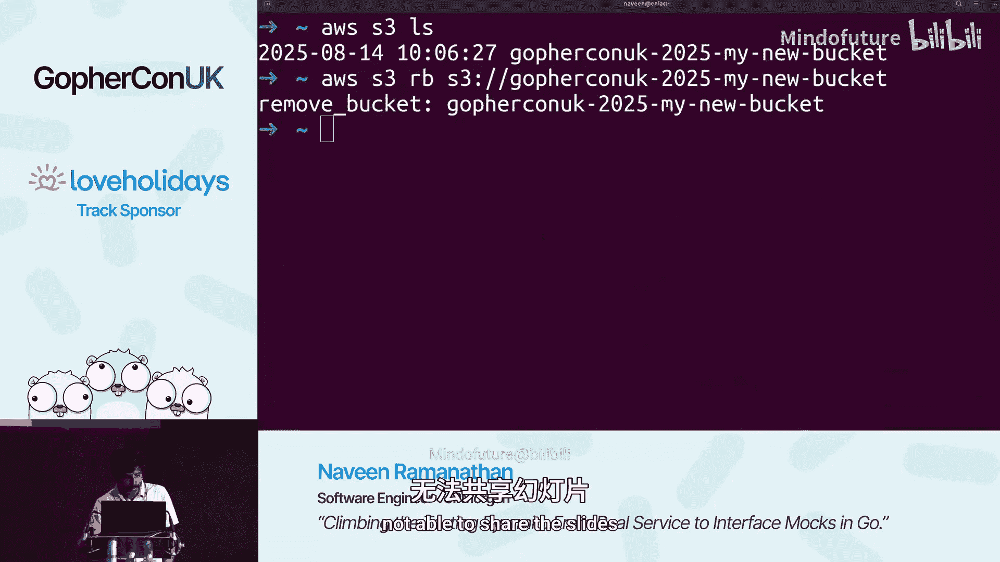
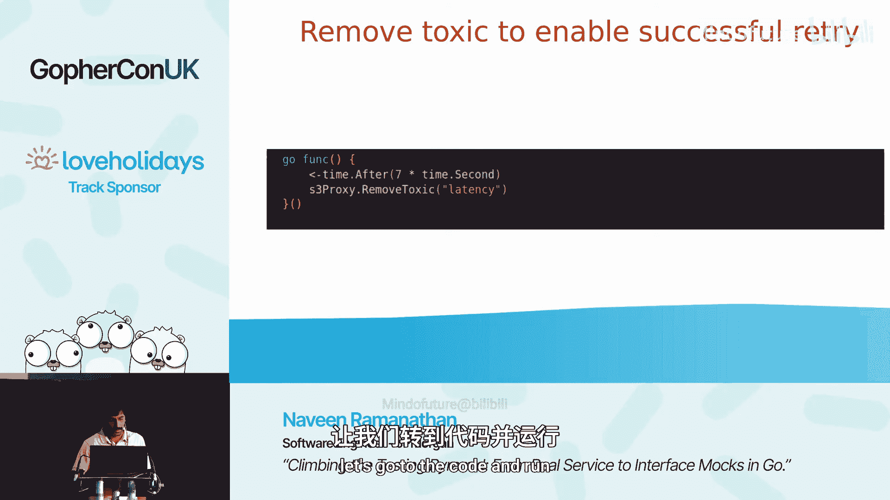
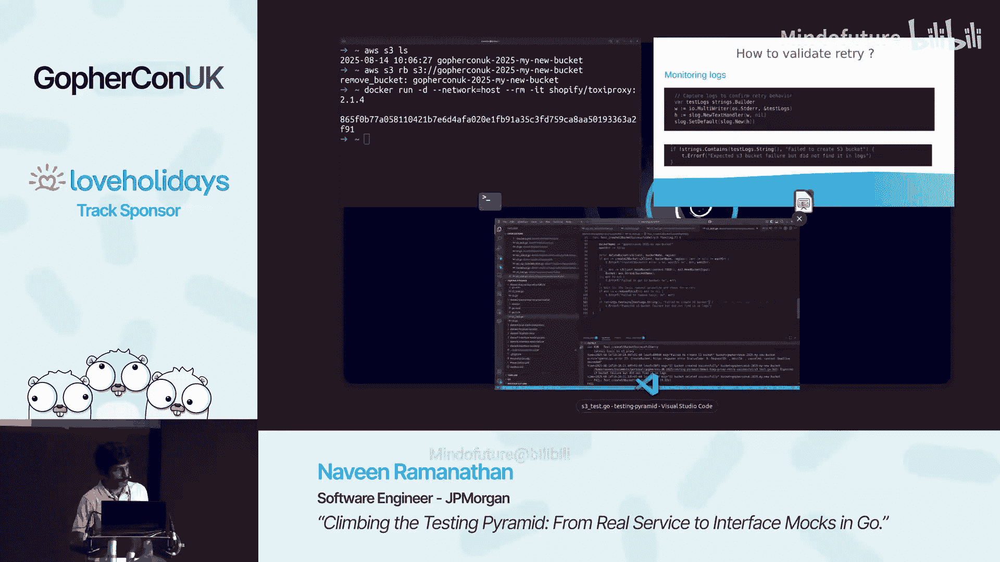
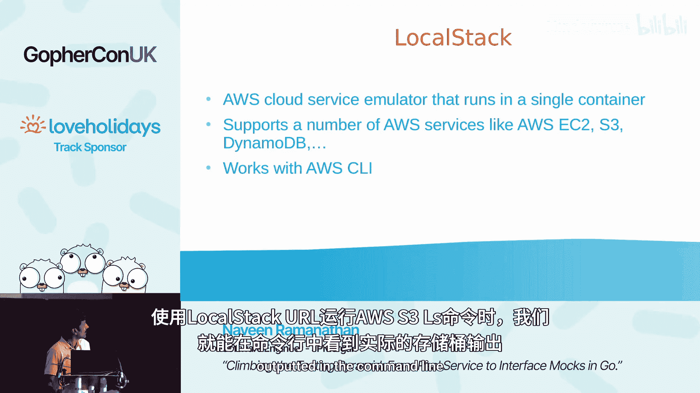
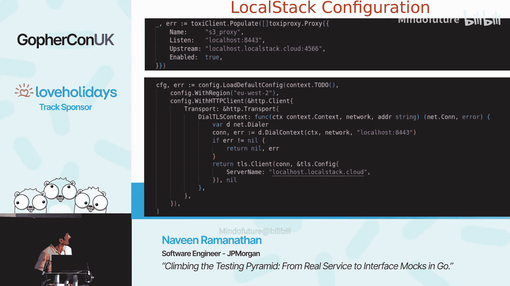
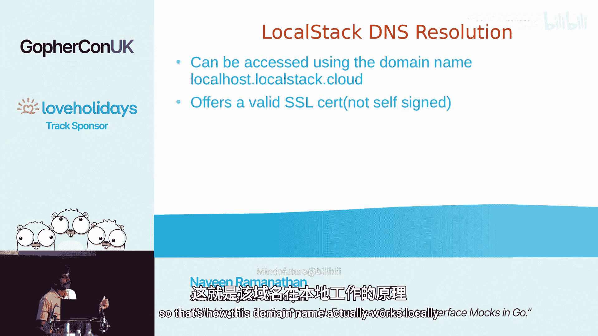
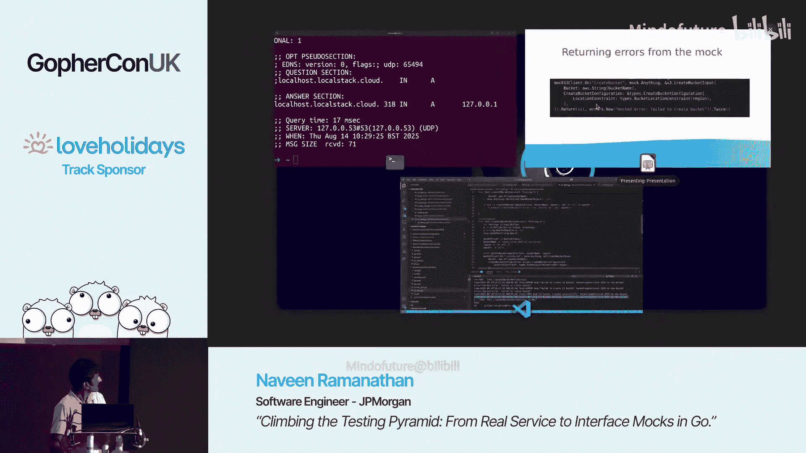

# 003：攀登测试金字塔——从真实服务到接口模拟


## 概述

在本节课中，我们将学习如何测试那些依赖云服务（如 AWS S3）的 Go 代码。测试这类代码充满挑战，例如难以模拟网络故障、存在访问权限限制以及可能产生额外成本。我们将介绍一个分层的“测试金字塔”策略，从最理想的“测试真实服务”开始，逐步向上探索“使用服务模拟器”、“HTTP 模拟”和“接口模拟”等方法，并讨论每种方法的适用场景与权衡。

## 章节 1：测试真实服务

测试金字塔的底层是直接测试真实云服务。这是最理想的情况，因为它能提供最真实的测试环境。

### 示例代码

我们以一个创建 AWS S3 存储桶的函数为例。该函数包含重试逻辑，以应对临时的网络问题。



```go
func createS3Bucket(ctx context.Context, client *s3.Client, bucketName string) error {
    createBucket := func() error {
        _, err := client.CreateBucket(ctx, &s3.CreateBucketInput{
            Bucket: aws.String(bucketName),
        })
        return err
    }
    // 使用指数退避策略进行重试
    return retryWithBackoff(ctx, createBucket)
}
```

对应的测试代码会创建客户端，调用函数，验证存储桶创建成功，并在测试结束后清理资源。

```go
func TestCreateS3Bucket_HappyPath(t *testing.T) {
    ctx := context.Background()
    cfg, _ := config.LoadDefaultConfig(ctx)
    client := s3.NewFromConfig(cfg)

    bucketName := "test-bucket-" + uuid.New().String()
    defer client.DeleteBucket(ctx, &s3.DeleteBucketInput{Bucket: &bucketName})

    err := createS3Bucket(ctx, client, bucketName)
    if err != nil {
        t.Fatalf("Failed to create bucket: %v", err)
    }
    // 验证存储桶存在
    _, err = client.HeadBucket(ctx, &s3.HeadBucketInput{Bucket: &bucketName})
    if err != nil {
        t.Errorf("Bucket was not created successfully")
    }
}
```

### 测试失败路径的挑战

上一节我们介绍了如何测试“成功路径”。本节中我们来看看如何测试“失败路径”，例如测试代码中的重试逻辑。直接测试网络故障或服务暂时不可用的情况非常困难。

## 章节 2：使用代理模拟网络故障



为了测试失败路径，我们可以在代码和云服务之间引入一个网络代理，由代理来注入网络延迟或错误。

以下是实现此方案的关键步骤：

1.  **启动代理**：使用 Toxiproxy 等工具启动一个 TCP 代理容器。
2.  **配置代理**：通过 REST API 配置代理，指定上游服务（如 AWS S3 端点）并添加“毒性”（如延迟）。
3.  **修改客户端**：配置 AWS SDK 的 HTTP 客户端，使其通过代理连接。
4.  **控制测试**：在测试中动态添加和移除“毒性”，以模拟临时故障和恢复。

```go
// 配置代理和添加延迟的示例代码片段
proxyClient := toxiproxy.NewClient("localhost:8474")
proxy, _ := proxyClient.CreateProxy("s3-proxy", "localhost:8443", "s3.amazonaws.com:443")
proxy.Enable()

// 添加 30 秒延迟
latencyToxic, _ := proxy.AddToxic("latency", "latency", "upstream", 1.0, toxiproxy.Attributes{"latency": 30000})

// 配置 AWS 客户端使用代理
cfg, _ := config.LoadDefaultConfig(ctx,
    config.WithHTTPClient(&http.Client{
        Transport: &http.Transport{
            DialContext: func(ctx context.Context, network, addr string) (net.Conn, error) {
                // 连接到代理地址
                return net.Dial(network, "localhost:8443")
            },
            TLSClientConfig: &tls.Config{
                ServerName: "s3.amazonaws.com", // 指定 TLS SNI
            },
        },
    }),
)
client := s3.NewFromConfig(cfg)
```



通过这种方式，我们可以验证当网络出现延迟时，代码的重试逻辑是否按预期工作。

## 章节 3：使用服务模拟器（LocalStack）

当无法或不便直接测试真实服务时（例如由于权限或成本考虑），我们可以使用服务模拟器，如 LocalStack。它能在本地容器中模拟 AWS 服务。



使用 LocalStack 的配置与测试真实服务类似，主要区别在于将上游端点指向本地运行的 LocalStack 容器。

```go
// 将上游指向 LocalStack
proxy, _ := proxyClient.CreateProxy("s3-proxy", "localhost:8443", "localstack.localstack.cloud:4566")
```



同时，需要修改 AWS 客户端的配置，使其信任 LocalStack 使用的证书。



```go
cfg, _ := config.LoadDefaultConfig(ctx,
    config.WithHTTPClient(&http.Client{
        Transport: &http.Transport{
            TLSClientConfig: &tls.Config{
                InsecureSkipVerify: true, // 对于自签名证书，可能需要跳过验证
                // 或者添加 LocalStack 的 CA 证书
            },
        },
    }),
    config.WithEndpointResolver(aws.EndpointResolverFunc(func(service, region string) (aws.Endpoint, error) {
        return aws.Endpoint{URL: "https://localstack.localstack.cloud:4566"}, nil
    })),
)
```

LocalStack 提供了高度的便利性，但它可能无法 100% 模拟所有云服务的行为和 API。

## 章节 4：使用 HTTP 模拟（httptest）

如果找不到合适的服务模拟器，或者需要更精细的控制，我们可以自己编写 HTTP 模拟服务器。Go 标准库的 `net/http/httptest` 包非常适合此用途。

`httptest` 服务器会自动处理 TLS 证书，并提供一个信任该服务器证书的 HTTP 客户端，简化了测试配置。

以下是创建模拟服务器并测试成功路径的示例：

```go
func TestCreateS3Bucket_WithMockServer(t *testing.T) {
    // 启动一个返回 200 OK 的模拟服务器
    mockServer := httptest.NewTLSServer(http.HandlerFunc(func(w http.ResponseWriter, r *http.Request) {
        w.WriteHeader(http.StatusOK)
        // 可以根据请求路径、方法等返回更复杂的响应
    }))
    defer mockServer.Close()

    // 使用 httptest 服务器提供的客户端（已信任服务器证书）
    cfg, _ := config.LoadDefaultConfig(ctx,
        config.WithHTTPClient(mockServer.Client()),
        config.WithEndpointResolver(aws.EndpointResolverFunc(func(service, region string) (aws.Endpoint, error) {
            return aws.Endpoint{URL: mockServer.URL}, nil
        })),
    )
    client := s3.NewFromConfig(cfg)

    // ... 执行测试断言
}
```

同样，我们可以将 Toxiproxy 的上游指向这个 `httptest` 服务器的地址和端口，来测试失败重试逻辑。

## 章节 5：使用接口模拟（Mockery）

当上述方法都不可行时（例如依赖的 SDK 不允许替换 HTTP 客户端，或者维护复杂的 HTTP 模拟服务器成本太高），我们可以采用最后的手段：接口模拟。这遵循 Go 的“接受接口，返回结构体”的原则。

首先，需要将依赖的具体客户端（如 `*s3.Client`）抽象为一个接口。

```go
type S3ClientInterface interface {
    CreateBucket(ctx context.Context, params *s3.CreateBucketInput, optFns ...func(*s3.Options)) (*s3.CreateBucketOutput, error)
    HeadBucket(ctx context.Context, params *s3.HeadBucketInput, optFns ...func(*s3.Options)) (*s3.HeadBucketOutput, error)
    DeleteBucket(ctx context.Context, params *s3.DeleteBucketInput, optFns ...func(*s3.Options)) (*s3.DeleteBucketOutput, error)
}

// 修改函数签名，接受接口
func createS3Bucket(ctx context.Context, client S3ClientInterface, bucketName string) error {
    // ... 实现不变
}
```

然后，在测试中，我们可以传入一个实现了该接口的模拟对象。手动维护模拟对象很繁琐，因此推荐使用自动生成工具如 **Mockery**。

使用 Mockery 生成模拟代码后，测试可以变得非常简洁和强大：

```go
func TestCreateS3Bucket_WithInterfaceMock(t *testing.T) {
    // 创建模拟对象
    mockS3Client := &mocks.S3ClientInterface{}
    // 设置预期行为：前两次调用失败，第三次成功
    mockS3Client.On("CreateBucket", mock.Anything, mock.Anything, mock.Anything).
        Return(nil, errors.New("network error")).Twice()
    mockS3Client.On("CreateBucket", mock.Anything, mock.Anything, mock.Anything).
        Return(&s3.CreateBucketOutput{}, nil).Once()
    // 设置其他方法的预期行为...
    mockS3Client.On("HeadBucket", mock.Anything, mock.Anything, mock.Anything).
        Return(&s3.HeadBucketOutput{}, nil)
    mockS3Client.On("DeleteBucket", mock.Anything, mock.Anything, mock.Anything).
        Return(&s3.DeleteBucketOutput{}, nil)

    err := createS3Bucket(ctx, mockS3Client, "test-bucket")
    // 验证错误和调用次数
    mockS3Client.AssertNumberOfCalls(t, "CreateBucket", 3)
    // ... 其他断言
}
```

这种方法将测试与具体的云服务实现完全解耦，运行速度极快，但缺点是模拟的行为可能与真实服务有差异。

## 总结



本节课中我们一起学习了测试云服务依赖的四种策略，它们构成了一个测试金字塔：
1.  **测试真实服务**：最真实，但受权限、成本和故障模拟难度限制。
2.  **使用服务模拟器**：良好的平衡点，如 LocalStack，但可能存在功能覆盖不全的问题。
3.  **使用 HTTP 模拟**：高度可控，适合复杂逻辑测试，但维护成本较高。
4.  **使用接口模拟**：速度最快，完全解耦，但可能偏离真实行为。


在实践中，没有一种方法可以解决所有问题。通常采用**混合策略**：在可能的情况下优先测试真实服务；对于难以模拟的失败场景，可以结合使用代理；在 CI/CD 流水线或开发者本地环境中，可以依赖模拟器或接口模拟来提高测试速度和稳定性。根据具体的测试需求和约束条件，灵活地在金字塔的不同层级间移动，是构建可靠测试套件的关键。