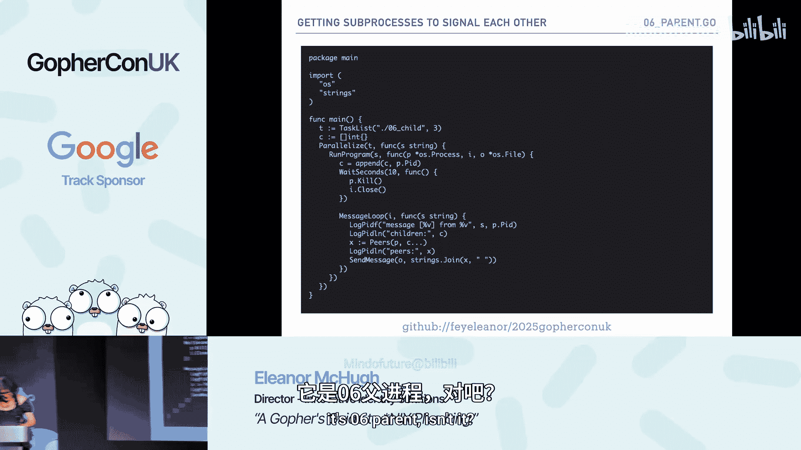
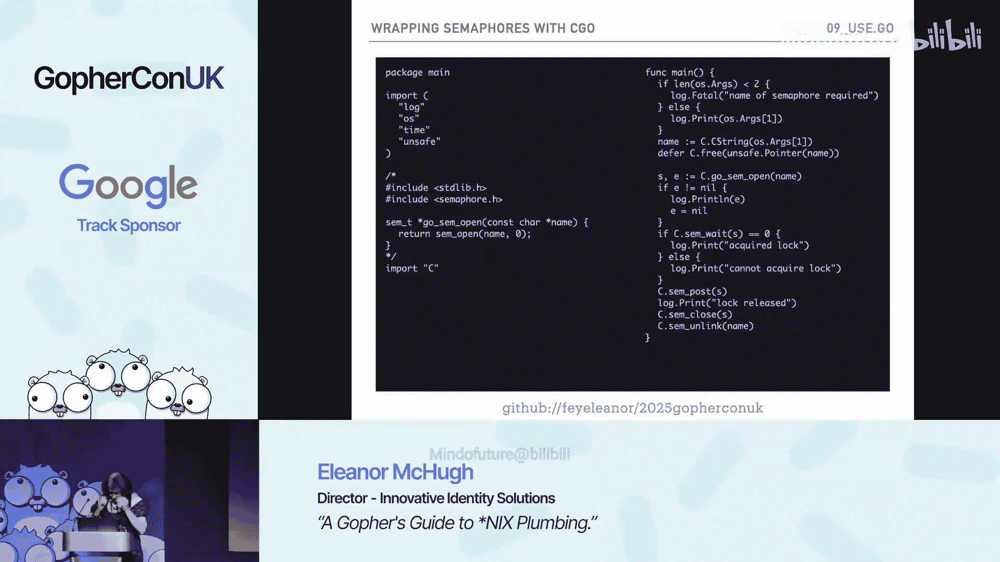
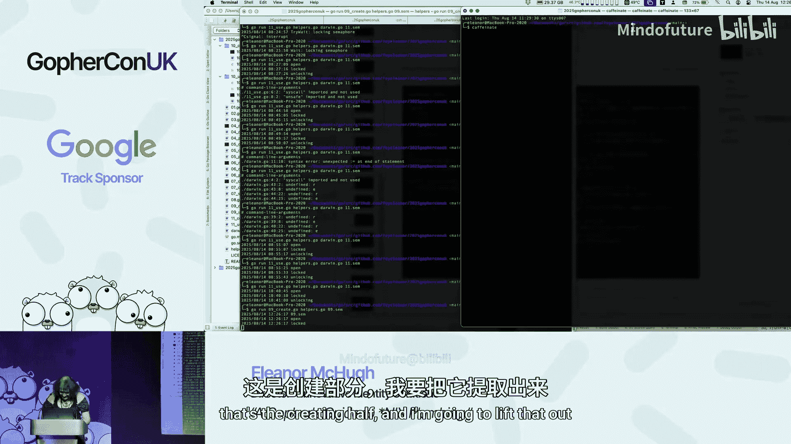
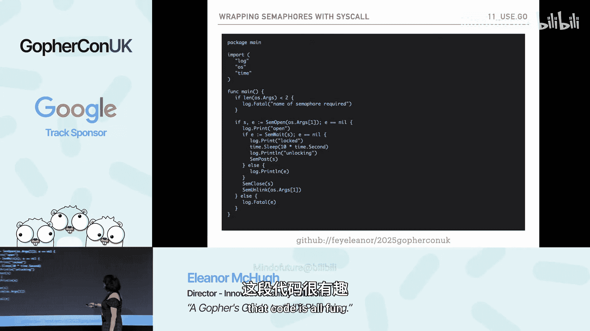
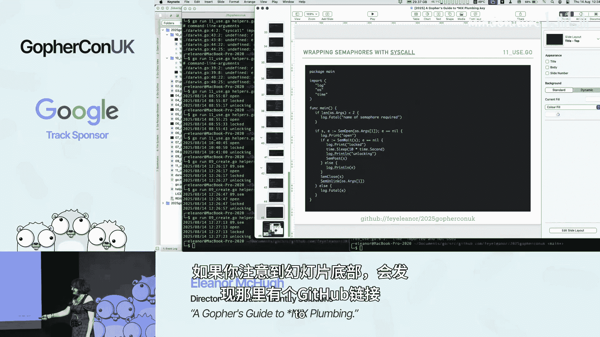

# 004：Unix 进程与管道编程


在本教程中，我们将学习如何使用 Go 语言与 Unix 系统进行底层交互，特别是关于进程创建、信号处理和进程间通信（IPC）。我们将从简单的子进程执行开始，逐步深入到使用管道和信号进行复杂的进程间通信。

## 概述

本节课我们将要学习 Go 语言在 Unix 系统上进行系统编程的核心概念。我们将从创建子进程开始，然后学习如何通过信号与进程交互，最后探索如何使用管道实现进程间的双向通信。这些技术是构建高效、可组合命令行工具和后台服务的基础。

## 1：创建子进程

在 Unix 系统中，一切皆进程。Go 语言通过 `os/exec` 包提供了创建和管理子进程的高级接口。本节中我们来看看如何启动一个简单的子进程并获取其输出。

以下是一个启动 `echo` 命令并读取其输出的基本示例：

```go
package main

import (
    "fmt"
    "os/exec"
)

func main() {
    cmd := exec.Command("echo", "hello golang")
    output, err := cmd.Output()
    if err != nil {
        panic(err)
    }
    fmt.Print(string(output))
}
```

在这个程序中，父进程创建了一个子进程来执行 `echo` 命令。`cmd.Output()` 方法会等待子进程执行完毕，然后一次性返回其标准输出的全部内容。

## 2：手动管理进程属性

上一节我们介绍了使用高级接口创建进程。本节中我们来看看如何使用更低级别的 `os.StartProcess` 函数，它允许我们更精细地控制进程的属性，例如标准输入、输出和错误流。

以下是手动启动进程并设置其文件描述符的步骤：

```go
package main

import (
    "log"
    "os"
    "time"
)

func main() {
    // 准备命令和参数
    argv := []string{"/bin/sh", "-c", "ls -la"}
    // 获取当前进程的文件描述符（stdin, stdout, stderr）
    files := []*os.File{os.Stdin, os.Stdout, os.Stderr}
    // 设置进程属性
    attr := &os.ProcAttr{
        Files: files,
    }
    // 启动进程
    process, err := os.StartProcess(argv[0], argv, attr)
    if err != nil {
        log.Fatal(err)
    }
    // 等待进程结束
    state, err := process.Wait()
    if err != nil {
        log.Fatal(err)
    }
    log.Printf("进程退出状态: %v", state)
}
```

通过 `os.StartProcess`，我们可以指定子进程继承父进程的标准流，或者将其重定向到其他文件或管道。

## 3：进程与信号交互

进程不仅可以通过文件描述符通信，还可以通过信号进行异步交互。信号是发送给进程的简单整数通知。本节我们将学习如何在 Go 中发送和接收信号。

以下是父进程向子进程发送定时信号的示例：

```go
package main

import (
    "log"
    "os"
    "os/signal"
    "time"
)

func main() {
    // 创建子进程（此处省略具体创建代码，参考上一节）
    childProc := createChildProcess()

    // 设置一个定时器，每秒向子进程发送 SIGINT 信号
    ticker := time.NewTicker(1 * time.Second)
    defer ticker.Stop()

    go func() {
        for range ticker.C {
            // 向子进程发送中断信号
            if err := childProc.Signal(os.Interrupt); err != nil {
                log.Printf("发送信号失败: %v", err)
                return
            }
        }
    }()

    // 等待20秒后发送终止信号
    time.Sleep(20 * time.Second)
    childProc.Signal(os.Kill)
    childProc.Wait()
}
```

子进程则需要设置一个信号处理器来接收这些信号：

```go
// 子进程代码示例
func childProcess() {
    sigChan := make(chan os.Signal, 1)
    signal.Notify(sigChan, os.Interrupt, os.Kill)

    for sig := range sigChan {
        log.Printf("接收到信号: %v", sig)
        if sig == os.Kill {
            break // 收到终止信号，退出循环
        }
    }
}
```

## 4：父子进程双向信号通信

上一节展示了单向信号发送。本节中我们来看看如何实现父子进程间的双向信号对话。子进程需要先查询到其父进程的 ID，然后才能向父进程回发信号。

以下是子进程查找父进程 ID 并发送信号的代码：

```go
package main

import (
    "log"
    "os"
    "syscall"
)

func main() {
    // 获取父进程ID
    parentPid := os.Getppid()
    // 通过PID获取父进程对象（注意：Unix上即使进程不存在也可能返回句柄）
    parentProc, err := os.FindProcess(parentPid)
    if err != nil {
        log.Fatal(err)
    }
    // 发送信号0来验证进程是否存在（信号0不执行任何操作，仅检查）
    err = parentProc.Signal(syscall.Signal(0))
    if err != nil {
        log.Printf("父进程不存在: %v", err)
        return
    }

    // 现在可以向父进程发送真正的信号了
    parentProc.Signal(os.Interrupt)
}
```

父进程则需要像之前一样设置一个信号处理器来接收来自子进程的信号。

## 5：使用管道进行进程间通信



信号适用于简单的通知，但对于进程间复杂的数据交换，管道是更强大的工具。管道创建一个单向或双向的字节流通道。本节我们将学习如何在 Go 中创建和使用管道。

以下是创建管道并在父子进程间传递数据的示例：

```go
package main


import (
    "bufio"
    "fmt"
    "io"
    "log"
    "os"
    "os/exec"
)

func main() {
    // 创建一个管道
    reader, writer, err := os.Pipe()
    if err != nil {
        log.Fatal(err)
    }
    defer reader.Close()
    defer writer.Close()

    // 创建子进程，并将其标准输入连接到管道的读取端
    cmd := exec.Command("cat") // cat 命令会回显输入
    cmd.Stdin = reader
    cmd.Stdout = os.Stdout
    cmd.Stderr = os.Stderr

    if err := cmd.Start(); err != nil {
        log.Fatal(err)
    }

    // 父进程向管道的写入端发送数据
    message := "Hello from parent via pipe!\n"
    if _, err := writer.Write([]byte(message)); err != nil {
        log.Fatal(err)
    }
    // 关闭写入端，告知子进程输入结束
    writer.Close()

    // 等待子进程结束
    cmd.Wait()
}
```

在这个例子中，父进程通过管道向子进程 `cat` 发送了一行文本，子进程读取后将其打印到标准输出。

## 6：多进程与环形通信

我们可以将管道的概念扩展，实现多个进程之间的通信，例如形成一个环。每个进程需要知道它应该与谁通信。这通常由父进程进行协调。

以下是父进程创建多个子进程并为其建立对等通信关系的简化逻辑：

1.  父进程创建多个子进程，并为每个子进程创建一对管道（用于输入和输出）。
2.  父进程收集所有子进程的 PID。
3.  父进程通过每个子进程的输入管道，向其发送它需要通信的对等进程的 PID 列表。
4.  每个子进程读取 PID 列表，然后就可以直接向列表中的其他进程发送信号或通过其他 IPC 机制通信。

这个过程的核心是父进程作为协调者，初始化子进程间的通信拓扑。

## 7：使用 CGo 进行系统调用

对于某些高级功能，如操作信号量，可能需要直接调用 C 库函数。Go 通过 CGo 支持与 C 代码的交互。本节我们简要了解如何使用 CGo 调用系统级的信号量函数。

以下是一个使用 CGo 创建和操作 System V 信号量的示例框架：

```go
// 注意：以下代码需要启用 CGo，并且包含对应的 C 代码文件
package main

/*
#include <sys/sem.h>
#include <stdio.h>
// 包装函数，因为 Go 的 CGo 不支持变参函数
int my_sem_open(const char* name) {
    // 调用 sem_open，这里简化了参数
    return sem_open(name, O_CREAT, 0644, 1);
}
*/
import "C"
import "unsafe"

func main() {
    semName := C.CString("/my_semaphore")
    defer C.free(unsafe.Pointer(semName))

    semId, err := C.my_sem_open(semName)
    if err != nil {
        panic(err)
    }
    // ... 使用 semId 进行信号量操作（wait, post等）
}
```

**警告**：使用 CGo 和 `unsafe` 包会绕过 Go 的内存安全保证，应仅在绝对必要时使用，并充分理解其风险。

## 8：纯 Go 系统调用





作为 CGo 的替代，Go 的 `syscall` 和 `golang.org/x/sys/unix` 包提供了对系统调用的更直接的访问。这避免了 C 代码的依赖，但需要处理更多底层细节。

以下是使用 `syscall` 包直接进行信号量系统调用的概念性示例（注意：不同 Unix 系统调用号可能不同）：

```go
package main

import (
    "golang.org/x/sys/unix"
    "log"
)

func semOpen(name string) (int, error) {
    // 这是一个简化的示例，实际系统调用需要更多参数
    // syscall.SYS_SEMOPEN 是系统调用号，需根据系统定义
    r1, _, errno := unix.Syscall(unix.SYS_SEMOPEN,
        uintptr(unsafe.Pointer(C.CString(name))),
        uintptr(flags),
        uintptr(mode),
        uintptr(value),
    )
    if errno != 0 {
        return -1, errno
    }
    return int(r1), nil
}

func main() {
    semId, err := semOpen("/my_direct_sem")
    if err != nil {
        log.Fatal(err)
    }
    log.Printf("信号量ID: %d", semId)
}
```



这种方法提供了最大的控制权，但代码与操作系统内核版本紧密耦合，可移植性差。

## 总结





本节课中我们一起学习了 Go 语言在 Unix 环境下进行系统编程的多个方面。我们从创建简单的子进程开始，逐步深入到通过信号进行进程间异步通知，然后学习了使用管道进行双向数据通信的强大功能。最后，我们探讨了通过 CGo 和直接系统调用与操作系统底层服务交互的高级技术。记住，许多底层技术具有风险，应谨慎用于生产环境，但它们对于理解系统工作原理和构建特定工具至关重要。