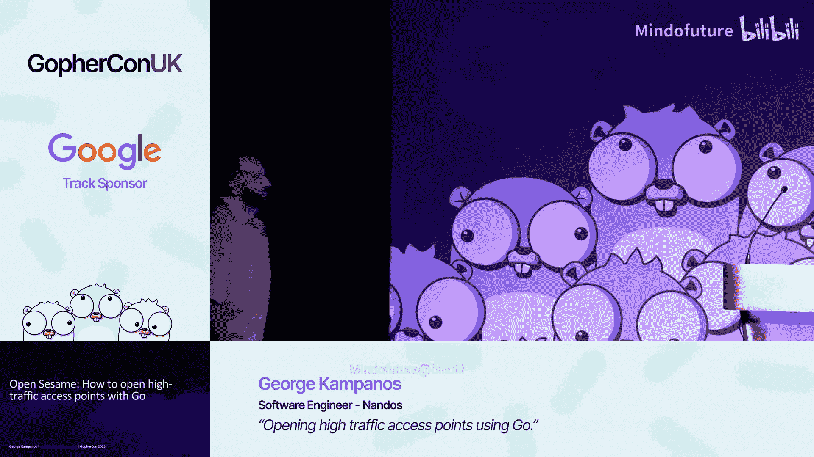
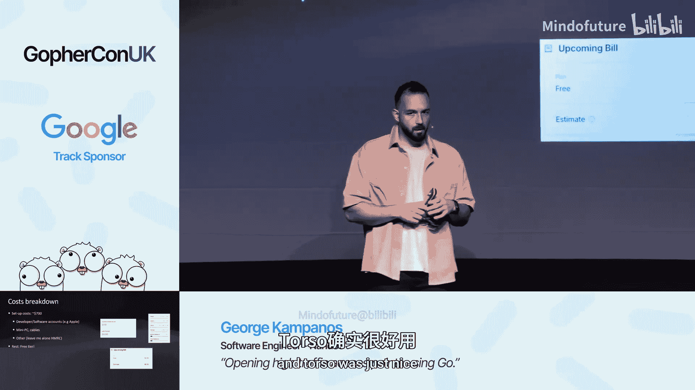

# 006：从 API 到物理门禁的完整实现





在本教程中，我们将跟随 George 的演讲，学习如何使用 Go 语言构建一个完整的健身房会员管理系统。这个系统不仅包括一个 Web API 和移动应用，还涉及到一个物理的旋转门禁，通过扫描二维码来控制门的开关。我们将重点关注如何设计系统架构、处理数据同步、与硬件交互，并在有限的预算和网络条件下实现一个可靠、低成本的解决方案。

---

## 项目背景与需求

George 为家乡希腊的一个小型健身房开发了一套现代化管理系统。健身房老板面临两个主要问题：年轻会员不好意思当面办理会员卡，以及晚班员工无法识别会员身份（因为所有记录都是纸质的）。

经过讨论，他们确定了以下核心需求：
*   需要一个管理后台，用于查看和管理会员信息。
*   需要一个移动应用，让会员可以注册、支付和续费。
*   需要一个与已购旋转门禁集成的方案，通过二维码开门。

---

## 系统架构与 API 设计

上一节我们了解了项目的背景，本节中我们来看看系统的整体架构是如何设计的。

考虑到规模（约2000名会员），系统采用了单体架构（Monolith）。如果未来遇到性能瓶颈，可以再将其拆分为微服务。

项目目录结构如下：
```
root/
├── cmd/
│   └── api/          # API 服务入口
├── internal/         # 内部共享包（数据库、支付等）
├── go.mod
└── ...
```

在 `internal` 目录中，我们使用接口注入（Interface Injection）来解耦依赖，例如支付提供商。这样便于进行单元测试，可以在主程序中使用真实实现（如 Stripe），在测试中则使用模拟对象。

API 是一个简单的 RESTful 服务，提供对数据库的增删改查（CRUD）操作，并集成了 JWT 身份验证。

以下是创建新会员资格请求的处理器（Handler）示例流程：
1.  接收请求上下文。
2.  检查用户角色（仅开发者和管理员可创建）。
3.  解码并验证请求数据。
4.  调用数据库层执行操作。
5.  返回 JSON 响应。

代码结构清晰，每个资源（如会员、会员资格）都有独立的文件，便于未来拆分。

---

## 数据库选择与同步策略

上一节我们介绍了后端的 API 设计，本节中我们来看看如何解决数据存储和同步的核心挑战。

健身房的数据关系明确（会员拥有会员资格），因此选择关系型数据库。关键问题在于：如何将数据库同步到位于“边缘”的门禁设备？

解决方案是 **SQLite**。选择 SQLite 的原因如下：
*   **关系型**：满足数据建模需求。
*   **快速**：作为本地文件操作，无需网络延迟。
*   **免费/轻量**：只是一个文件，非常适合小型企业控制成本。
*   **易于同步**：可以将整个数据库文件同步到门禁设备。

我们使用 `goose` 工具进行数据库迁移。以下是一个创建会员表的迁移示例：
```sql
-- +goose Up
CREATE TABLE members (
    id INTEGER PRIMARY KEY AUTOINCREMENT,
    name TEXT NOT NULL,
    email TEXT UNIQUE NOT NULL
);
-- +goose Down
DROP TABLE members;
```

数据库操作封装在事务中，确保数据一致性。以下是一个通用的事务提交函数：
```go
func commitTransaction(tx *sql.Tx, result sql.Result) error {
    rowsAffected, err := result.RowsAffected()
    if err != nil {
        tx.Rollback()
        return err
    }
    if rowsAffected == 0 {
        tx.Rollback()
        return errors.New("no rows affected")
    }
    return tx.Commit()
}
```

为了测试，我们可以创建内存中的 SQLite 数据库，在每次测试时运行迁移，这有助于在提交代码前发现错误的迁移脚本。

然而，如何将 SQLite 数据库可靠地同步到门禁设备呢？我们引入了 **Turso**（一个托管的 SQLite 服务）。它类似于云端的 PostgreSQL 服务，负责处理主数据库与边缘副本之间的同步。

工作流程如下：
1.  API 将新会员数据写入本地 SQLite 数据库（或直接写入 Turso）。
2.  Turso 服务自动将这些更改同步到位于健身房门禁设备上的 SQLite 副本。
3.  门禁设备上的 Go 程序读取本地数据库副本，验证二维码并发送开门指令。

这种方案的优势是，即使健身房网络中断，现有会员依然可以凭本地数据库验证进入，保证了系统的可用性。同步间隔可以配置（例如30秒），在成本和数据新鲜度之间取得平衡。

---

## 前端应用：管理后台与移动端

上一节我们解决了后端数据同步的问题，本节中我们快速浏览一下为用户和管理员构建的前端界面。

系统包含两个前端应用：
1.  **管理后台（Web）**：供健身房员工管理会员和会员资格。使用 Next.js 和 Daisy UI（基于 Tailwind CSS）构建，通过 JWT 与后端 API 通信。界面支持搜索、查看会员详情、创建新会员资格等操作。
2.  **会员移动应用**：为了让会员能够自助注册和支付，我们开发了跨平台的移动应用。使用 React Native 和 Expo 构建，同样通过 JWT 与 API 交互，并使用 EAS 进行构建和发布。应用包含一个“杀手级功能”——深色模式。

这两个前端应用本质上是后端 API 的视图层，负责向用户展示信息并收集输入。

---

## 核心实现：与物理门禁交互

经过前面几节的铺垫，现在我们终于来到了最有趣的部分：如何使用 Go 控制物理旋转门禁。

门禁是一种“高流量接入点”，类似于地铁闸机。用户扫描二维码即可进入。门禁内部有一块主板，支持 RS-485 通信协议，可以通过发送特定信号（如上、左、右）来控制。

由于健身房布线困难，无法使用网络线连接门禁。解决方案是：
1.  购买一个 RS-485 转 USB 的适配器。
2.  将适配器与一个迷你 PC（安装在门禁内部）的 USB 口连接。
3.  在迷你 PC 上运行 Go 程序，通过 USB 串口向门禁发送指令。

硬件连接完成后，就可以编写 Go 代码了。二维码扫描器连接到迷你 PC 后，会被识别为一个键盘输入设备。Go 程序从标准输入读取扫描到的数据：
```go
scanner := bufio.NewScanner(os.Stdin)
for scanner.Scan() {
    qrData := strings.TrimSpace(scanner.Text())
    // 解析 qrData (JSON)，包含会员ID和会员资格ID
    // 验证逻辑...
}
```

验证逻辑会查询本地 SQLite 数据库，检查会员资格是否有效。这确保了在网络不佳时门禁仍能工作。

最关键的部分是发送开门指令。使用 `go-serial` 库，代码非常简单：
```go
package main

import (
    "github.com/jacobsa/go-serial/serial"
    "log"
)

func openDoor(port string) error {
    options := serial.OpenOptions{
        PortName:        port,
        BaudRate:        9600,
        DataBits:        8,
        StopBits:        1,
        ParityMode:      serial.PARITY_NONE,
        MinimumReadSize: 1,
    }

    conn, err := serial.Open(options)
    if err != nil {
        return err
    }
    defer conn.Close()

    // 指令格式由门禁制造商提供
    openCommand := []byte{0x01, 0x06, 0x00, 0x7D, 0x00, 0x01, 0x1C, 0x3A}
    _, err = conn.Write(openCommand)
    return err
}
```
当验证通过后，调用 `openDoor` 函数，门禁就会打开。整个过程非常直接且令人有成就感。

---

## 部署、监控与成本控制

上一节我们实现了门禁控制的核心代码，本节中我们来看看如何部署整个系统，并进行有效的监控，同时严格控制成本。

**部署策略：**
*   **后端 API**：使用 Fly.io 部署。Fly.io 的“机器”概念和自动启停功能非常适合这种低流量应用，有助于节省成本。配置一个 `fly.toml` 文件即可。
*   **门禁设备**：通过 GitHub Actions 构建 Go 程序为 Linux 可执行文件，然后使用 `magic-wormhole` 等工具手动传输到门禁的迷你 PC 上并重启服务。这部分部署较为手动。

**监控与日志：**
*   **服务器监控**：Fly.io 提供了基本的 Grafana 仪表盘，对于监控 API 性能和负载足够了。
*   **门禁监控**：这是一个独特挑战。我们采用极简的 KISS（Keep It Simple, Stupid）原则。使用 Go 1.21 引入的 `slog` 日志库，配合 `samber/slog-multi` 将日志同时输出到控制台和一个本地文本文件。
    ```go
    func setupLogger(logFilePath string) (*slog.Logger, error) {
        logFile, err := os.Create(logFilePath)
        if err != nil {
            return nil, err
        }
        multiHandler := slogmulti.
            Pipe(slog.NewTextHandler(os.Stdout, nil)).
            Pipe(slog.NewTextHandler(logFile, nil)).
            Handler()
        return slog.New(multiHandler), nil
    }
    ```
    当日志文件积累后，可以取回并用 `less`、`grep` 等工具分析，或者导入到其他可视化系统。我们还建立了一个简单的“事件管理系统”——一个 Discord 频道，门禁扫描记录和错误信息会推送到这里，便于健身房前台实时查看。

**成本控制：**
成本是该项目最重要的考量之一。最终运行成本极低：
*   Fly.io：用量低于免费额度。
*   Turso：付费版（约2美元/月），为了获得自动备份功能。
*   Vercel/Cloudflare Pages：托管静态 Next.js 网站，使用免费计划。
*   Cloudflare：处理企业邮箱转发。
总月度运行成本接近 **0 美元**。初始设置成本（如苹果开发者账号、硬件）约为700美元。



这个项目表明，在资源受限的环境下，通过明智的技术选型（如 SQLite、Go）和利用优秀的免费层云服务，完全可以构建出功能完整、稳定可靠的生产系统。

---

## 总结与问答精要

本节课中我们一起学习了使用 Go 构建一个从云端 API 到物理门禁的完整小型商业系统的全过程。我们涵盖了架构设计、SQLite 数据库的同步策略、与硬件串口通信、极简的部署监控方案以及严格的成本控制。

**演讲问答精要：**
*   **树莓派？** 可以，但出于商业关系选择了本地供应商的迷你 PC。
*   **同步频率？** API 写入后，门禁约30秒同步一次，平衡了成本与用户体验。
*   **灾难恢复？** Turso 付费版提供自动备份和检查点。
*   **安全挑战？** 有人尝试扫描假二维码甚至 WiFi 密码，前台人员可现场干预。
*   **硬件安全？** 主电源由专业电工连接，低压信号线自行连接，安全无忧。
*   **单体架构拆分？** 当前负载很低（CPU使用率10-15%），单体架构运行良好，无需拆分。
*   **重大故障？** 前端 Cookie 处理在部署时出现过问题，后端 Go API 非常稳定。
*   **为何选 Turso 而非 Fly 的 LiteFS？** Turso 的仪表盘和边缘同步体验更佳。
*   **良好网络下的设计？** 可能会探索拆分单体服务，但仍会考虑 SQLite。
*   **二维码安全？** 初期为明文 JSON，后改为对称加密。未来可能探索基于时间的签名令牌。
*   **数据库读写模式？** 单写（API）多读（门禁、通知任务），利用最终一致性。


这个项目展示了 Go 语言在全栈开发中的强大能力，从 Web 后端到底层硬件控制，提供了一致且高效的开发体验。尝试用技术解决身边的具体问题，是非常有益且充满成就感的经历。