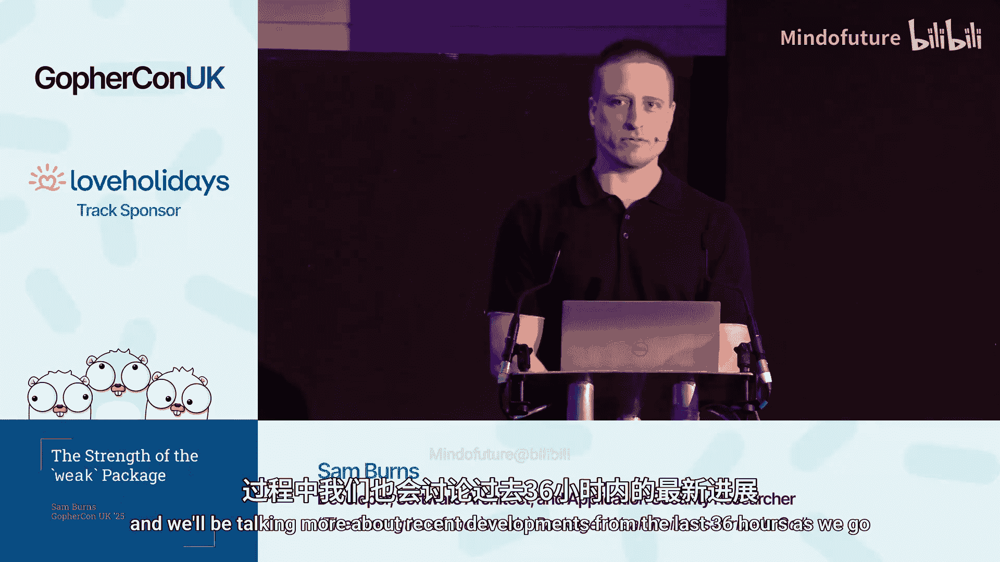

# 007：`weak` 包的优势——弱引用抵达 Go





## 概述

在本节课中，我们将要学习 Go 1.24 版本引入的新特性：`weak` 包。我们将探讨弱引用的概念、Go 语言的垃圾回收机制，以及如何在实际开发中有效地使用弱引用来优化内存管理，例如在缓存和观察者模式中的应用。

## 章节 1：`weak` 包入门指南

上一节我们概述了课程内容，本节中我们来看看 `weak` 包的基本概念。

`weak` 包是 Go 1.24 版本新增的特性。它提供了一种特殊的引用，称为弱引用，这种引用不会阻止垃圾回收器回收其指向的对象。换句话说，它是一种“非拥有”的指针。

核心概念是：弱引用允许你保留一个对象的引用，但不会阻止该对象在不再被强引用时被垃圾回收器回收。

使用弱引用的一个主要原因是防止缓存导致的内存膨胀。它允许你拥有一个内存中的缓存，同时其中的对象仍然可以被垃圾回收，从而实现长运行程序中内存的自动清理。

以下是弱引用的核心行为：
*   弱引用在垃圾回收可达性分析中不被计入。
*   如果你尝试在弱引用指向的对象被垃圾回收后解引用它，它将返回 `nil`。

## 章节 2：Go 中的弱指针如何工作

上一节我们介绍了弱引用的基本概念，本节中我们来看看它在 Go 中的具体实现。

Go 通过 `weak` 包实现弱指针。它利用泛型，可以指向任何类型的对象。

创建一个弱指针需要使用强指针（即普通的 Go 指针）作为参数。以下是一个简单的示例：

```go
package main

import (
    "fmt"
    "runtime"
    "weak"
)

func main() {
    // 假设 ptr 是一个指向堆上对象的强指针
    data := "some data"
    ptr := &data

    // 使用强指针创建弱指针
    wp := weak.Make(ptr)

    // 尝试从弱指针获取值
    if v := wp.Value(); v != nil {
        fmt.Printf("Value: %s\n", *v)
    } else {
        fmt.Println("Value is nil")
    }

    // 移除强引用（例如，让 ptr 离开作用域或赋值为 nil）
    // 为了演示，我们显式地触发垃圾回收
    runtime.GC()

    // 再次尝试从弱指针获取值
    if v := wp.Value(); v != nil {
        fmt.Printf("Value after GC: %s\n", *v)
    } else {
        fmt.Println("Value after GC is collected")
    }
}
```

在这个例子中，我们首先通过 `weak.Make` 从一个强指针创建了一个弱指针 `wp`。然后我们通过 `wp.Value()` 尝试获取其指向的值，并进行 `nil` 检查。在强制垃圾回收后，再次获取值，此时很可能返回 `nil`。

**重要说明**：当你调用 `weak.Value()` 并成功得到一个非 `nil` 的强指针时，这个强指针的存在会立即被垃圾回收器感知，从而保护其指向的对象在当前作用域内不会被回收。这避免了潜在的竞态条件。

## 章节 3：Go 垃圾回收机制

要深入理解弱指针，我们需要了解 Go 的垃圾回收（GC）机制。上一节我们看了弱指针的用法，本节中我们来看看它背后的原理。

Go 使用“标记-清除”算法的追踪式垃圾回收器。

**强引用**会保持对象存活，使其免于被垃圾回收。如果一个对象没有任何强引用指向它，它就符合垃圾回收的条件。

Go 的内存分为堆和栈。每个 Goroutine 有自己的栈，用于存储局部变量。当函数调用结束，其栈帧会被自动清理。堆则用于存储生命周期更复杂或“逃逸”出当前函数作用域的对象。编译器通过“逃逸分析”来决定将变量分配在栈上还是堆上。

垃圾回收主要针对堆内存进行。它采用“三色标记法”：
*   **黑色**：对象已被扫描，确定仍在被使用，是存活的。
*   **灰色**：对象已被确定为存活，但其引用的其他对象（子节点）尚未被扫描。
*   **白色**：对象尚未被扫描，或已被确定为可回收。

垃圾回收器从一组“根节点”（如全局变量、Goroutine 栈上的指针）开始，遍历整个对象图，将所有可达的对象标记为黑色。最终，剩余的白色对象将被回收。

Go 的垃圾回收器是**并发**的。标记阶段的大部分工作和清除阶段可以与用户代码并发执行。只有在标记开始和结束时，会有非常短暂的“停止世界”（STW）暂停，以确定根节点和完成标记。这种设计使得 Go 的 GC 对程序运行的影响较小。

此外，Go 的 GC 是**非分代**且**非压缩**的。它不会像 Java 那样根据对象年龄进行分代收集，也不会在回收后移动内存来消除碎片。

你可以通过 `GOGC` 环境变量来调节 GC 的触发频率，其默认值为 100（表示堆内存增长 100% 后触发新一轮 GC）。

## 章节 4：Go 1.25 与 Green Tea GC

在课程制作期间，Go 1.25 发布了，带来了一个实验性的新垃圾回收器。上一节我们介绍了传统的 GC，本节中我们来看看这个新变化。

Go 1.25 引入了一个名为 **Green Tea** 的可选实验性垃圾回收器。你可以在编译时通过设置环境变量 `GOEXPERIMENT=gctealinline` 来启用它。

Green Tea GC 旨在提升标记阶段的性能，特别是对于存在大量小对象、GC 压力大的应用。其核心优化是将物理地址相邻的小对象分组为“内存跨度”来处理，而非逐个标记，这有助于更好地利用现代 CPU 的内存带宽。

根据初步测试，在 Intel 硬件上，对于 GC 密集型的应用，标记阶段的 CPU 开销可降低 10% 到 40%。在 AMD 等多核内存带宽相对受限的平台上，收益可能更高。

这是一个“直接替换”式的实验功能，如果现有代码能在旧 GC 下工作，那么切换到 Green Tea GC 后也应该能正常工作。你可以尝试启用它并分析对自身应用性能的影响。

## 章节 5：弱指针与其他语言的对比

弱引用并非 Go 独有。上一节我们关注了 Go 的最新进展，本节中我们横向对比一下其他语言。

许多支持垃圾回收的语言都提供了类似弱引用的机制。一个常见的讨论点是，为 Go 添加弱指针是否会使其更像 Java。

在 **Java** 中，你可以通过 `java.lang.ref.WeakReference` 类来创建弱引用，并通过 `get()` 方法获取对象（可能返回 `null`）。

在 **C#** 中，有 `System.WeakReference` 泛型类，通过 `TryGetTarget` 方法来尝试获取目标对象。

它们的核心原则是相同的：提供一种不拥有对象所有权的引用，当对象仅被弱引用指向时，可以被垃圾回收器回收。

## 章节 6：使用案例：弱引用缓存

了解了原理和对比后，我们来看两个具体的应用场景。首先是最常见的用途：实现缓存。

使用弱指针可以构建一个内存缓存，而缓存条目本身不会阻止其缓存的对象被垃圾回收。这意味着你可以拥有一个自动清理未使用条目的缓存，无需手动实现缓存淘汰策略。

以下是实现一个简单弱引用缓存的关键思路：

```go
// 简化的弱缓存示例（非并发安全）
type WeakCache struct {
    cache map[string]weak.Pointer[string]
}

func (wc *WeakCache) Get(key string) *string {
    if wp, ok := wc.cache[key]; ok {
        if v := wp.Value(); v != nil {
            // 缓存命中
            return v
        } else {
            // 键存在，但值已被回收，视为缓存未命中并清理该键
            delete(wc.cache, key)
        }
    }
    // 缓存未命中
    return nil
}

func (wc *WeakCache) Set(key string, value *string) {
    wp := weak.Make(value)
    wc.cache[key] = wp
}
```

**缓存逻辑**：
1.  **命中**：键存在，且弱指针能解引用为有效值。
2.  **未命中（键不存在）**：缓存中没有该键。
3.  **未命中（值已回收）**：键存在，但弱指针返回 `nil`。此时应删除该键，并像处理键不存在一样处理。

这种缓存的优势在于内存高效，缓存不会干扰垃圾回收，也无需复杂的淘汰算法。但代价是每次读取都需要检查 `nil`，并且缓存命中率受垃圾回收频率影响。

## 章节 7：使用案例：观察者模式

另一个有用的场景是实现观察者模式。上一节我们看了缓存，本节中我们看看如何在事件驱动架构中使用弱指针。

在观察者模式中，我们通常不希望观察者（Observer）的存在会阻止被观察主体（Subject）被垃圾回收。使用弱指针可以建立观察者到主体的链接，同时不构成强引用。

```go
// 简化的观察者示例
type Subject struct {
    name string
    // 使用弱指针列表存储观察者，避免观察者阻止Subject被回收
    observers []weak.Pointer[Observer]
}

type Observer struct {
    id string
    // 观察者持有主体的弱引用
    subjectRef weak.Pointer[Subject]
}

func (o *Observer) TryTouchSubject() {
    if s := o.subjectRef.Value(); s != nil {
        fmt.Printf("Observer %s touches subject: %s\n", o.id, s.name)
    } else {
        fmt.Printf("Observer %s: subject is gone (GC'ed)\n", o.id)
    }
}
```

在这个模式中：
*   `Subject` 维护一个观察者的弱指针列表。
*   `Observer` 通过弱指针引用 `Subject`。
*   当 `Subject` 不再被其他强引用指向时，可以被垃圾回收。
*   此后，`Observer` 尝试通过 `TryTouchSubject` 与 `Subject` 交互时，`weak.Value()` 会返回 `nil`，观察者便能知道主体已不存在。

这样，我们就实现了观察者模式，且观察关系不会影响主体的生命周期。

## 章节 8：最佳实践与总结

本节课中我们一起学习了 Go 语言 `weak` 包的使用。最后，我们来总结一些最佳实践。

以下是使用 `weak` 包时需要注意的几点：

*   **始终检查 Nil**：在使用 `weak.Value()` 返回的指针前，必须进行 `nil` 检查。这是使用弱指针最常见的模式。
*   **理解垃圾回收时机**：弱指针的行为依赖于垃圾回收。在测试时，可以使用 `runtime.GC()` 来触发回收以验证逻辑。在生产中，可以通过 `GOGC` 环境变量调节 GC 频率，从而影响弱缓存等行为。
*   **并发安全**：`weak.Pointer` 本身是并发安全的，可以安全地在多个 Goroutine 中传递和使用。但是，你使用弱指针的**数据结构**（例如上面示例中的 `map`）可能需要额外的同步机制（如 `sync.Map` 或互斥锁）来保证并发安全。
*   **评估使用场景**：弱指针不是万能的。如果你发现需要频繁使用 `runtime.KeepAlive` 来防止对象过早被回收，可能需要重新审视弱指针是否适合当前场景。

**总结**：
我们探讨了 Go 1.24 引入的 `weak` 包，它通过弱引用提供了不阻止垃圾回收的对象引用。我们深入了解了 Go 的垃圾回收机制（包括新的 Green Tea GC），并对比了其他语言的类似实现。通过缓存和观察者模式两个具体案例，我们学习了如何利用弱指针来优化内存管理，构建更高效、更健壮的应用程序。记住核心原则：弱引用提供访问，但不提供保护；使用时永远检查 `nil`。


