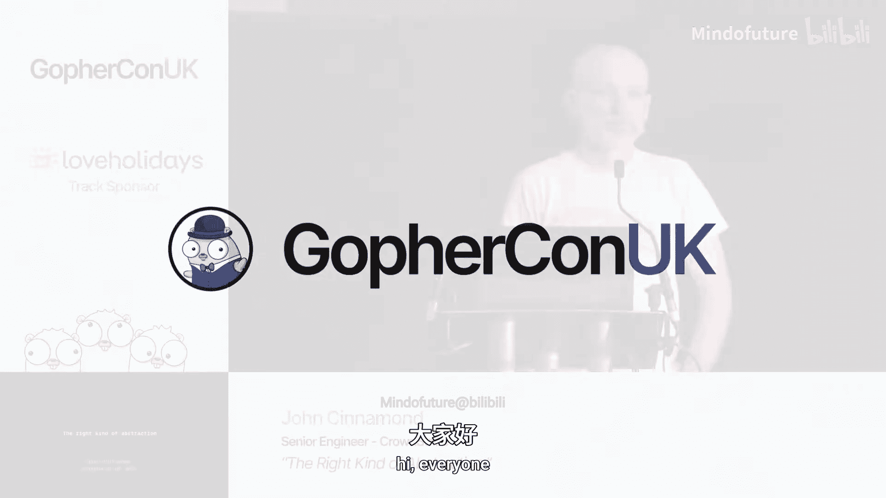

# 009：正确类型的抽象





在本节课中，我们将探讨Go语言中“正确抽象”的概念。我们将分析什么是抽象，为什么有些抽象被认为是“不必要的”，以及如何从哲学和数学的角度来思考和评估抽象的价值。最终，我们将学习一套评估抽象是否适合你的团队和项目的实用框架。

## 什么是抽象？🤔

抽象是一种表示。它是一种刻意省略被表示事物某些细节的表示。

让我们分解一下这个概念。抽象是一种表示，它本身并非事物。它总是对某物的抽象。例如，一个返回产品的网站，你可能需要过滤这些产品。你可能有多种过滤器：按名称过滤、按最高价格过滤、按库存状态过滤。我们可以在此基础上创建一个抽象，用一个接口来表示所有这些过滤器，该接口有一个名为`Check`的函数，它接收一个产品并返回一个布尔值。

**代码示例：**
```go
type Filter interface {
    Check(Product) bool
}
```

这个抽象代表了具体的过滤器实现。如果没有这些具体实现，抽象本身就没有意义。编程中的抽象通常是不定指称，可以指代许多不同的事物。它们也是开放的指称，所指代的内容可以随时间变化。抽象的关键在于它刻意省略了细节，只表示其主体的某个方面或部分。

## 为什么需要抽象？🎯

你可能会问，为什么要省略细节？原因有很多。

*   **避免重复代码**：你可能会发现代码库中多处有重复的代码，通过提取公共部分并省略细节，可以将重复代码移入抽象。
*   **以相同方式使用不同结构**：就像`io.Reader`接口的例子，有许多不同的结构体都能“读取”，但你希望以统一的方式使用它们。
*   **推迟考虑细节**：有时过多的细节会干扰主要目标。例如，回答“我怎么来会议的？”时说“我坐火车来的”，就省略了大量无关细节。
*   **表示领域概念**：抽象可以帮助将代码映射回业务领域概念。
*   **揭示实现模式**：通过省略某些细节，有时能更清晰地看到实现的核心模式。
*   **解决复杂问题**：抽象使我们能够处理复杂问题，而无需一次性在脑海中处理所有细节。

抽象可以基于事物如何运作、做什么或是什么。通常，好的抽象是这些方面的混合。

## 评估抽象的社会成本 👥

软件开发是一种社会活动。开发团队是一个社会群体，拥有自己的习俗、信仰和共享知识。要融入团队，你需要适应这些习俗。随着时间推移，团队文化会趋于保守，改变会变得困难。

因此，在向团队引入抽象时，需要考虑社会成本：
*   它与团队现有的知识和文化契合度如何？
*   它与团队当前处理问题的方式匹配度如何？
*   改变它需要多少工作量？团队是新兴的还是成熟的？
*   引入该抽象的好处是否大于其成本？

错误的抽象会造成很大损害，使代码更难理解、维护或扩展。正如Sandi Metz所说：“**宁愿重复，也不要错误的抽象**”。然而，也不要害怕抽象，正确的抽象极具价值。

## 从哲学角度看抽象：现成在手 vs 在手现成 🛠️

这一概念来自哲学家马丁·海德格尔。我们通常以“现成在手”的方式与物体相遇，即我们关注的是用它们完成什么任务，而不是物体本身。例如，使用锤子时，我们想的是钉钉子，而不是锤子的构造。

当物体损坏时，它就从“现成在手”变为“在手现成”，我们开始关注物体本身。

在代码中，`for`循环对经验丰富的开发者是“现成在手”的，他们关注的是用循环做什么，而不是循环本身。不熟悉的抽象（如泛型、设计模式、单子）往往是“在手现成”的，你会关注抽象本身而非要解决的问题。损坏的抽象（不按预期工作）也会变成“在手现成”。

“在手现成”的抽象通常是糟糕的抽象，因为它们会分散注意力。当然，不熟悉的抽象可以通过学习和实践变得“现成在手”。但记住，这不仅关乎个人，整个团队也需要愿意投入学习。

## 从哲学角度看抽象：分析的、综合的与本质的真假 ✅

哲学家康德区分了分析命题和综合命题。
*   **分析命题**：其真值源于其内容本身，例如“三角形有三条边”。它是必然为真的。
*   **综合命题**：其真值需要外部事实验证，例如“正在下雨”。它是偶然为真的。

此外，还有**本质真理**，它并非由定义决定，而是世界本身如此，例如“所有物质都由原子构成”。科学的目标就是建立趋近本质真理的理论体系。

抽象也有其“真实性”，即它是否真实地代表了某个想法或某段代码。一个好的抽象应该是一个**真实的表示**。考虑之前的过滤器抽象：它是否总是代表每一个可能的过滤器？这取决于“过滤器”在现实中的定义。如果后来需要一个“去重过滤器”，它需要查看所有产品而不仅是单个产品，那么原来的抽象就不再是“本质真实”的，而只是“偶然真实”的，这可能就是一个糟糕的抽象。

好的抽象往往是本质真实的。但要注意，我们认为是本质真实的东西也可能被证明是错误的，所以要勇于根据新知识更新抽象。

## 从数学角度看抽象：代数与识别 🔍

代数是处理抽象系统的数学分支。在编程中，许多有用的抽象来自代数结构，如幺半群、函子、单子。

关键在于，我们通常不是“创造”了这些抽象，而是“识别”出代码中已经存在的模式。例如，如果过滤器可以组合（`join`函数），并且满足结合律和有单位元，那么它就是一个幺半群。我们并没有“做”什么让它成为幺半群，它本来就是。

**代码示例：**
```go
func join(f1, f2 Filter) Filter {
    return func(p Product) bool {
        return f1(p) && f2(p)
    }
}
// 识别出 Filter 和 join 操作构成了一个幺半群
```

编程中的抽象，很多时候是关于理解你的代码并识别其中存在的有用模式。抽象的价值在于它揭示了关于代码的真理，并允许我们将不同事物视为相似事物进行处理。

## 如何找到正确的抽象？🧭

现在，我们可以回答什么才是“正确的抽象”了。答案仍然是：**取决于抽象带来的好处是否大于引入它的成本**。这总是主观且依赖于语境的。

但我们可以提供一个思考框架：
1.  **保持怀疑**：对抽象持怀疑态度，不要因为看起来酷就引入。错误的抽象危害很大。
2.  **明确收益**：你想通过这个抽象解决什么问题？（避免重复、结构化代码、隐藏细节、表达领域概念…）如果不知道收益，就不要做。
3.  **评估社会成本**：它是否符合团队文化？是否值得挑战现有规范？
4.  **评估认知成本**：它是“现成在手”还是“在手现成”？尽量避免会成为干扰（在手现成）的抽象。
5.  **评估真实性**：它是本质真实的表示吗？你是否充分理解要抽象的代码？未来情况变化后它是否依然真实？
6.  **识别而非强加**：这个抽象是源于代码中固有的模式，还是你试图将模式强加于代码？好的抽象通常是**涌现**出来的。

同时，记住**代码是廉价的**。如果你认为找到了一个好抽象，就去尝试实现一个概念验证。通过实践来检验你的想法。

## 总结 📝

本节课我们一起学习了如何在Go语言中思考和选择正确的抽象。

我们首先定义了抽象是一种刻意省略细节的表示。然后探讨了引入抽象的各种原因，并强调了评估**社会成本**的重要性。

接着，我们从哲学中借用了“现成在手”与“在手现成”的概念，指出好的抽象应该让人专注于任务而非工具本身。我们还讨论了“分析真理”、“综合真理”和“本质真理”，认为好的抽象应尽可能接近对代码的**本质真实**表示。

最后，我们从代数中获得启示，即好的抽象往往是对代码中固有模式的**识别**，而非生硬地强加。

总而言之，一个好的抽象通常具备以下特点：有**清晰的收益**、与团队**契合良好**、使用起来**现成在手**（不分散注意力）、是对现实的**本质真实**表示，并且是从代码中**自然涌现**的。找到这样的抽象需要付出努力，需要保持怀疑但充满好奇，并通过实践来验证。但一旦找到，它将帮助你写出更出色的代码。

---


## 问答环节 💬

**问：如何在日常与同事讨论代码时运用这些概念？**
**答**：最关键的是**与团队核对**。即使你喜欢某个抽象，如果它不适合团队，你就是在打一场必输的仗，会让每个人的生活更糟。其次，要意识到抽象是否真的解决了问题，还是仅仅看起来“整洁”。例如，`map/reduce`是很强大的抽象，但在Go社区强行引入可能得不偿失。更重要的是意识到你的抽象将对你、你的团队和代码库产生的各种影响。

**问：为什么Go标准库没有`map`/`reduce`？**
**答**：我认为这主要是**文化原因**，而非技术原因。Go社区从一开始就对来自函数式编程的概念持怀疑态度。在泛型出现之前，实现起来也确实比较困难。这已经固化为一种社区惯例。

**问：你认为Go标准库中最糟糕的抽象（或缺乏抽象）是什么？**
**答**：我想到的不是一个糟糕的抽象，而是一个**抽象缺失**的例子：在`http`包中，你必须手动读取并关闭响应体。这暴露了一个缺失的抽象层，即无法在不关心资源分配和关闭的情况下进行读取操作。

**问：基于你的标准，有没有哪些抽象是被不公平地诋毁的？**
**答**：我的重点不在于具体哪个抽象好或坏，而在于**对待抽象的态度**。抽象的好坏取决于语境。我希望Go社区能更开放地思考抽象，只要它们合适。但我不会具体点名说哪个抽象（比如单子）就一定适合Go。

**问：你提到要考虑引入抽象的社会成本，但你也想改变Go社区对抽象的态度，这不矛盾吗？**
**答**：不矛盾。考虑社会成本意味着**意识到改变所需的代价**，但这不意味着永不改变。有时，即使知道会遭遇阻力，我也会引入某个抽象，因为我相信其收益值得付出努力。这可能是对Go社区的一种温和推动，希望大家更开放、更批判性地思考。同时，也有些抽象我虽然喜欢但不会引入，因为成本太高。关键是**意识到这种成本**，而不是给出一个固定的“是或否”的答案。


