# 010：你好，MCP世界 🚀


在本节课中，我们将要学习什么是模型上下文协议，即MCP。我们将了解其核心概念、架构以及如何开始构建自己的MCP服务器。本教程旨在让初学者能够轻松理解。

## 概述

MCP是由Anthropic开发的一个开放协议，它标准化了应用程序如何向大型语言模型提供上下文。你可以将其理解为AI世界的USB接口或HTTP/REST API，它旨在连接各种工具和系统，使其能够被AI模型理解和调用。

## 核心概念与架构

上一节我们介绍了MCP的基本定义，本节中我们来看看它的核心架构和术语。

MCP架构主要涉及三个核心概念：**主机**、**客户端**和**服务器**。

*   **MCP主机**：任何能够使用MCP协议进行通信的应用程序。例如，VS Code、Google的Gemini Code Assist或Cloud Code都可以作为MCP主机。
*   **MCP客户端**：主机内部用于与单个MCP服务器通信的组件。一个主机可以拥有多个客户端，每个客户端连接一个服务器。
*   **MCP服务器**：提供具体功能（如工具、资源、提示词）的独立服务。

它们之间的通信基于**JSON-RPC**协议，消息在传输层上主要采用两种模式：
*   **标准输入/输出传输**：适用于本地服务器，通过管道进行通信。
*   **流式HTTP传输**：适用于部署在云端的服务器。请注意，早期规范中的HTTP+SSE模式因安全考虑已被弃用。

一个JSON-RPC消息示例如下，它展示了客户端初始化与服务器通信的流程：
```json
{"jsonrpc": "2.0", "id": 1, "method": "initialize", "params": {...}}
{"jsonrpc": "2.0", "id": 1, "result": {...}}
{"jsonrpc": "2.0", "method": "notifications/initialized", "params": {...}}
```
遵循此初始化流程对建立连接至关重要。

## MCP服务器的核心构建块

了解了架构后，我们来看看MCP服务器能提供哪些核心功能。MCP服务器主要暴露三种类型的构建块（有时也称为原语或核心概念）：工具、资源和提示词。

以下是这三种构建块的详细说明：

1.  **工具**：这是最直接的概念。工具赋予AI模型执行操作的能力，可以是一个API调用、一个Shell命令或任何可执行的动作。例如，“搜索航班”、“发送消息”、“创建日历事件”或“进行代码审查”。
    *   **官方描述**：工具使AI模型能够执行操作（服务器实现的函数）。

2.  **资源**：资源用于从各种数据源（如文档、日历、数据库）读取和提取数据。例如，在构建编码助手时，一个代码文件可以被定义为资源，AI可以读取其中的特定代码块。目前许多用户仍倾向于使用工具来实现数据获取功能。

3.  **提示词**：这是一种在服务器端存储和管理提示词模板的便捷方式。它可以替代本地存储的文本文件或笔记，让你能将提示词版本化并部署到任何兼容的MCP主机上。在某些客户端（如Gemini）中，这些提示词会映射为斜杠命令（例如 `/my_prompt`）。

## 实践：工具与提示词示例

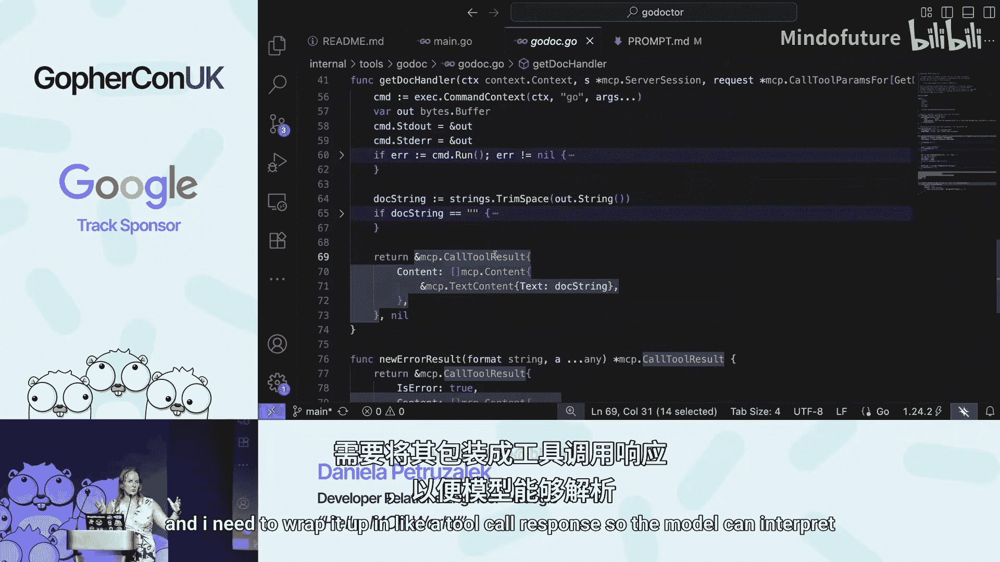

理论需要结合实际，本节我们通过具体例子来看看工具和提示词是如何工作的。


### Go Doctor工具示例

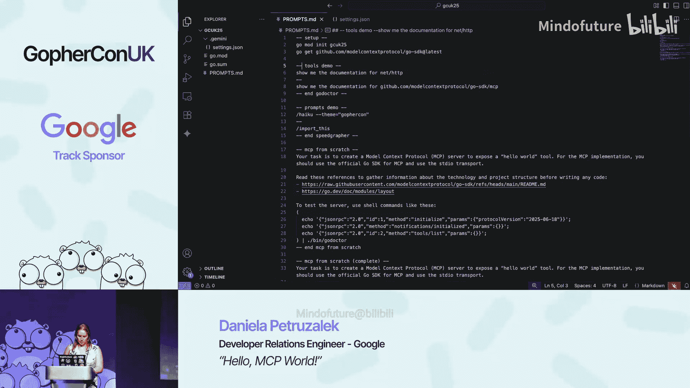

“Go Doctor”是一个用于查询Go语言文档的MCP工具。其目的是在AI编码时，让模型能先查询真实的API文档，而不是臆造不存在的接口，从而提高代码生成的准确性。

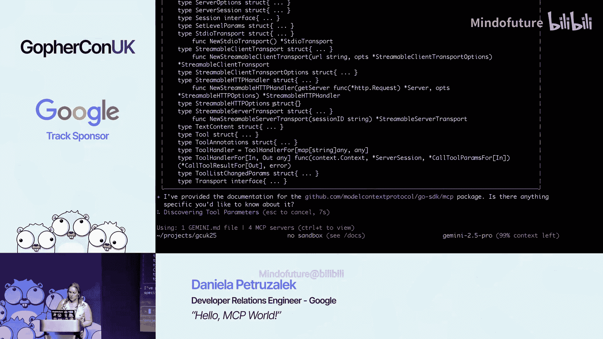

构建一个MCP服务器主要包含两个步骤：
1.  实例化服务器并注册工具。
2.  为工具编写处理函数。

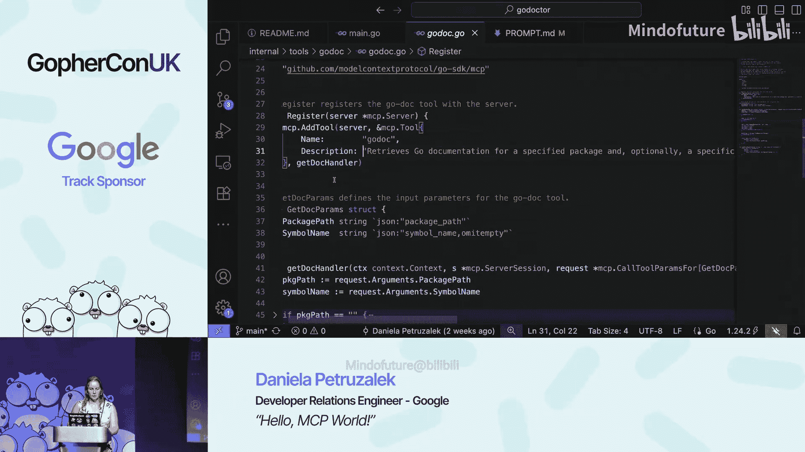

以下是Go Doctor工具的核心代码框架：
```go
// 1. 创建服务器
server := mcpserver.NewServer(mcpserver.Options{
    Transport: transport, // 可以是stdio或http
})

// 2. 注册工具
server.RegisterTool(mcpserver.Tool{
    Name:        "go_doc",
    Description: "Retrieves documentation for Go packages and symbols.",
    // ... 参数定义
}, func(ctx context.Context, request *mcpserver.ToolCallRequest) (*mcpserver.ToolCallResponse, error) {
    // 3. 处理函数：执行 `go doc` 命令
    args := request.Arguments
    // ... 执行命令并封装结果
    return &mcpserver.ToolCallResponse{
        Content: []mcpserver.Content{
            {Type: "text", Text: docOutput},
        },
    }, nil
})
```
在Gemini等客户端中启用该服务器后，当用户询问“`net/http`包的文档”时，AI模型会识别并调用`go_doc`工具，返回真实的文档内容。这凸显了清晰工具描述的重要性，它是模型理解何时使用该工具的关键。

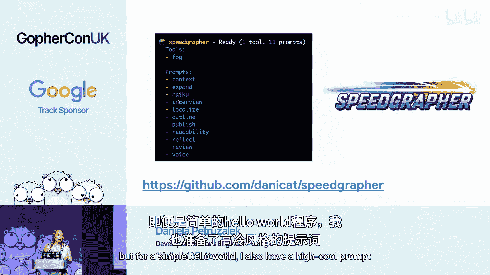

### Speedgrapher提示词示例

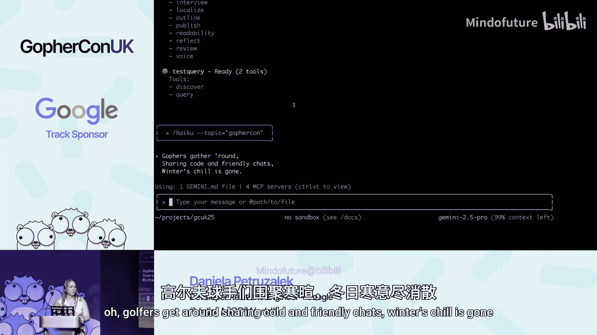

“Speedgrapher”是一个包含多个提示词的MCP服务器，旨在辅助写作和审查。例如，其中包含一个写俳句的提示词。

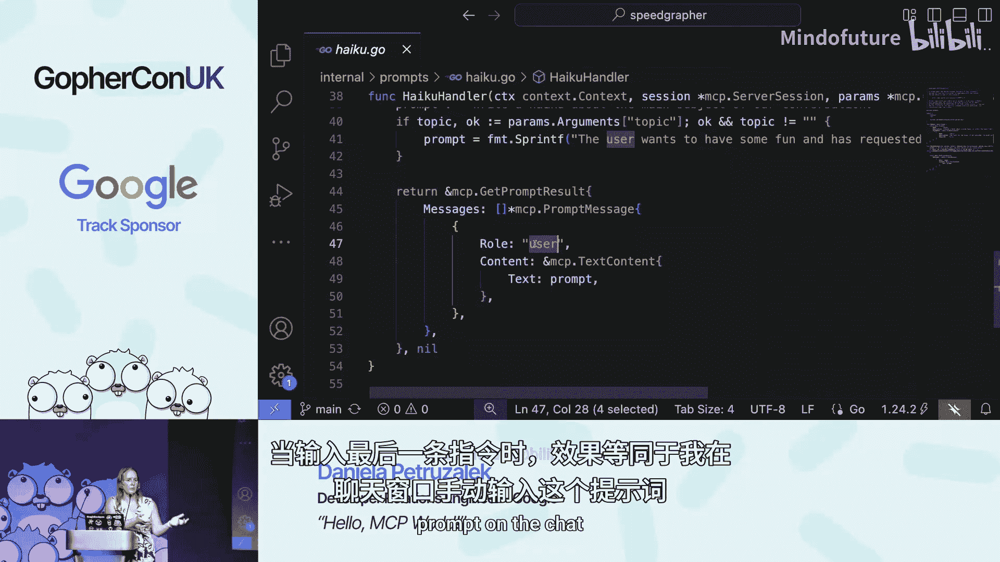

在客户端中，该提示词会显示为一个斜杠命令 `/haiku`。用户输入“/haiku about Gophercon”后，客户端会调用服务器上对应的提示词处理函数。

提示词的注册与工具类似：
```go
server.RegisterPrompt("haiku", mcp.Prompt{
    Description: "Generates a haiku about a given topic.",
    Arguments: []mcp.PromptArgument{{Name: "topic"}},
}, func(ctx context.Context, request *mcp.PromptRequest) (*mcp.PromptResponse, error) {
    topic := "the subject of our conversation so far"
    if len(request.Arguments) > 0 {
        topic = request.Arguments[0]
    }
    // 构建最终发送给模型的提示词
    finalPrompt := fmt.Sprintf("Write a haiku about %s.", topic)
    return &mcp.PromptResponse{
        Messages: []mcp.PromptMessage{{Role: "user", Content: finalPrompt}},
    }, nil
})
```
服务器返回的是一个包含完整提示词的消息，客户端会将其直接发送给AI模型，就好像是用户自己输入的一样。

## 客户端功能与Go生态支持

除了服务器功能，MCP协议也定义了一些客户端功能。同时，Go语言生态也为MCP提供了良好的支持。

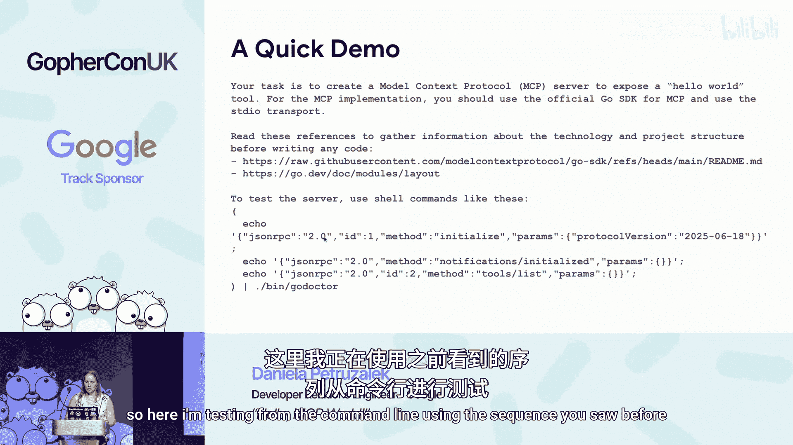

### 客户端功能

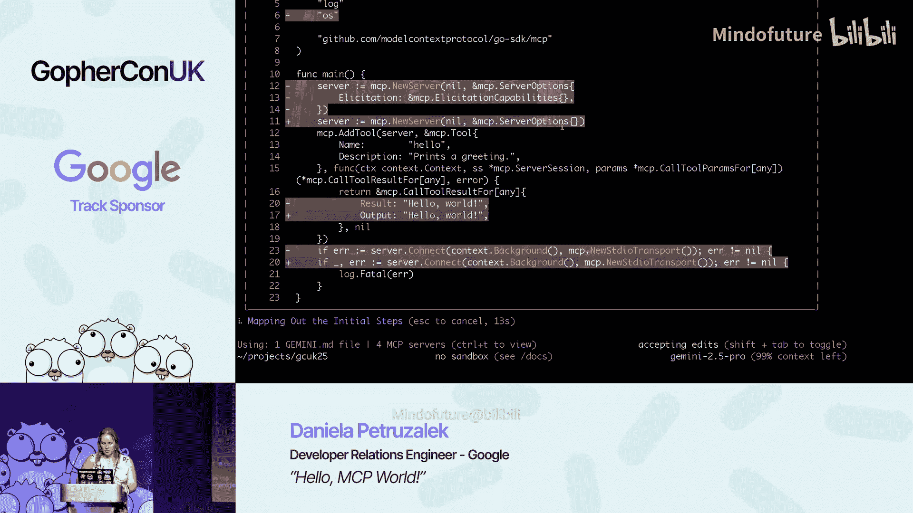

主要有三个客户端功能概念：
*   **采样**：允许服务器将某些任务（如调用LLM生成内容）委托给客户端执行，可以简化服务端的计费和安全性管理。
*   **根目录**：客户端告知服务器其可访问的文件系统目录范围，用于安全隔离。
*   **征询**：允许服务器向客户端请求额外信息或用户确认。

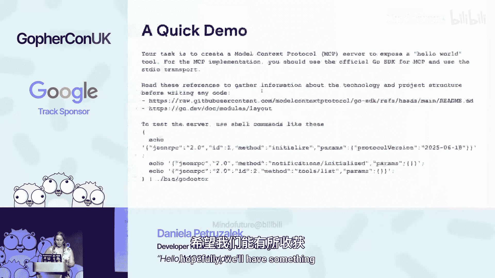

### Go语言SDK与工具


对于Go开发者，需要关注以下进展：
1.  **官方MCP Go SDK**：由Anthropic与Go团队合作开发，吸收了社区其他SDK（如Materia Labs的版本）的优点，提供了更官方和规范化的开发方式。
2.  **Go语言的MCP支持**：旨在通过语言服务器协议（LSP）为Go提供更智能的AI编码辅助，例如暴露`gopls`的诊断、检查等功能作为MCP工具。虽然目前模型主动调用这些工具的体验仍在优化中，但这代表了未来的一个发展方向。

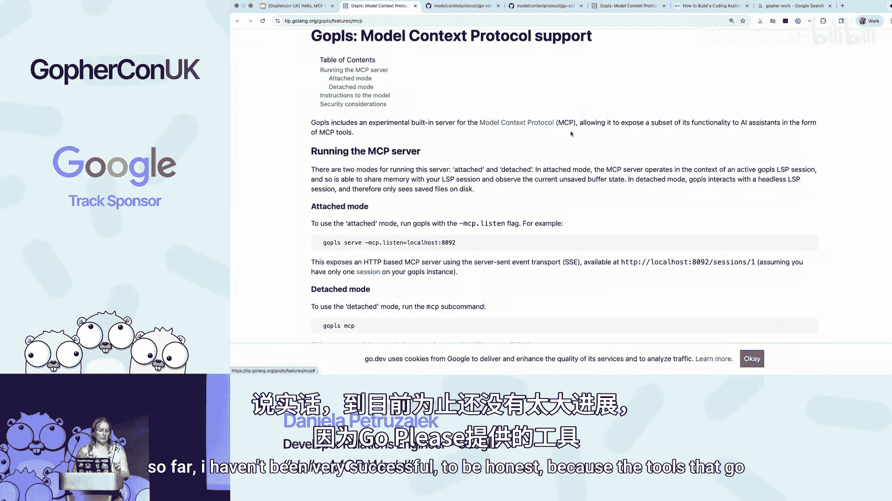

## 社区资源与动手实践

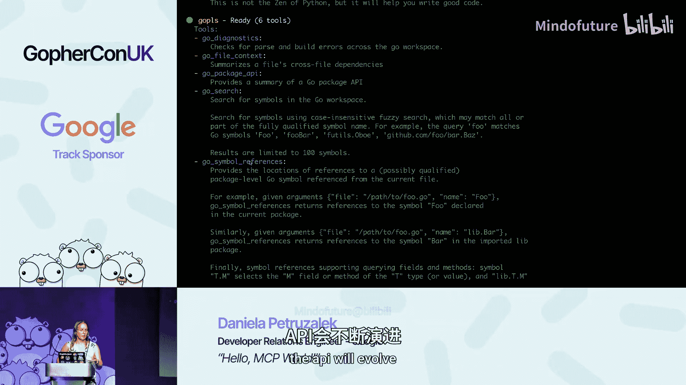

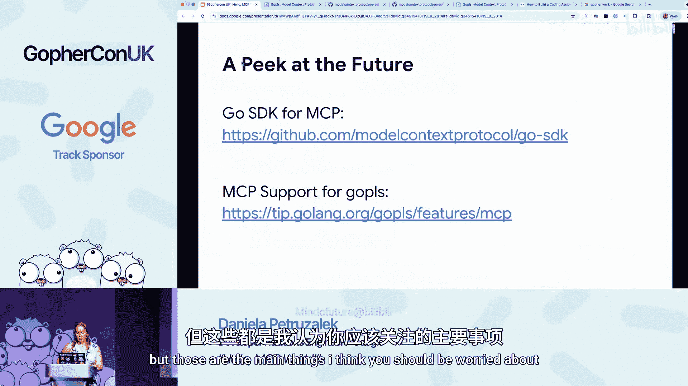

探索社区已有的优秀项目是快速学习的好方法，但最终极的学习方式是亲手构建。

以下是一些有用的社区MCP服务器示例：
*   **Playwright MCP**：用于网页自动化（导航、截图），对前端任务非常有用。
*   **Context7**：一个众包的文档检索MCP服务器，可以查询各种技术文档。

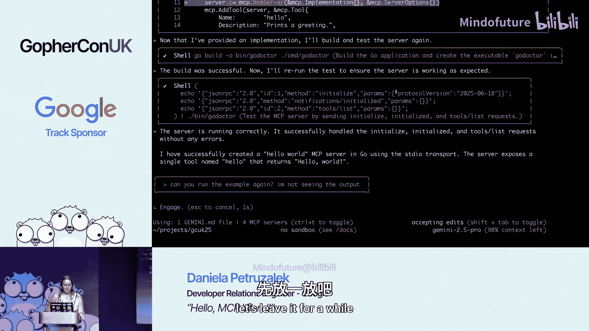

我们鼓励你尝试构建自己的MCP服务器。你可以从复现一个类似“Go Doctor”的简单工具开始，在实践中深入理解工具注册、参数处理和响应格式等细节。记住，清晰的描述和稳健的同步处理（防止服务器过早退出）是成功的关键。

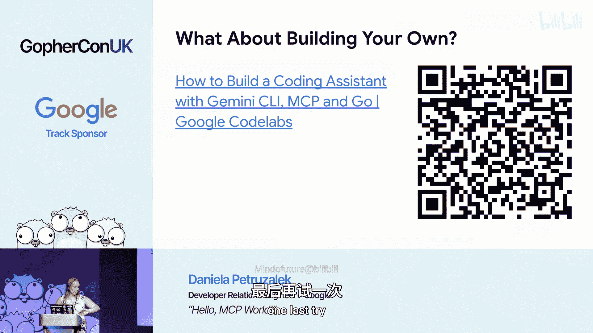

## 总结

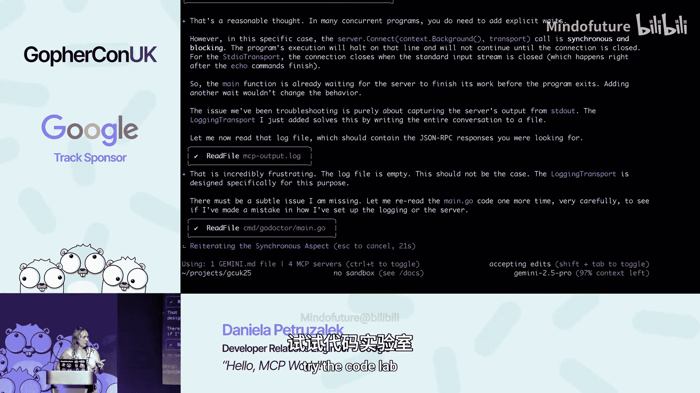

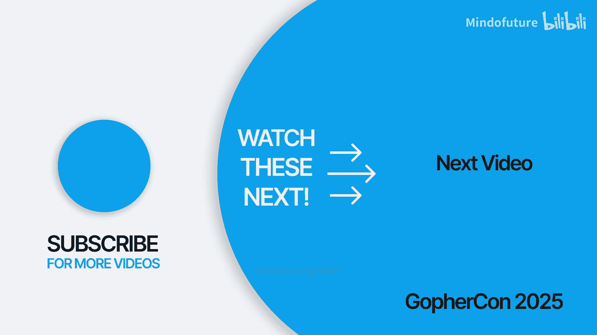

本节课中我们一起学习了模型上下文协议的基础知识。我们了解了MCP作为连接AI与工具的协议，其核心架构包含主机、客户端和服务器。我们深入探讨了服务器提供的三大构建块：**工具**、**资源**和**提示词**，并通过“Go Doctor”和“Speedgrapher”的实例看到了它们如何运作。我们还简要介绍了客户端功能以及Go语言对MCP的生态支持。最后，我们鼓励你利用社区资源和官方SDK，开始动手构建自己的第一个MCP服务器，踏上AI集成开发之旅。