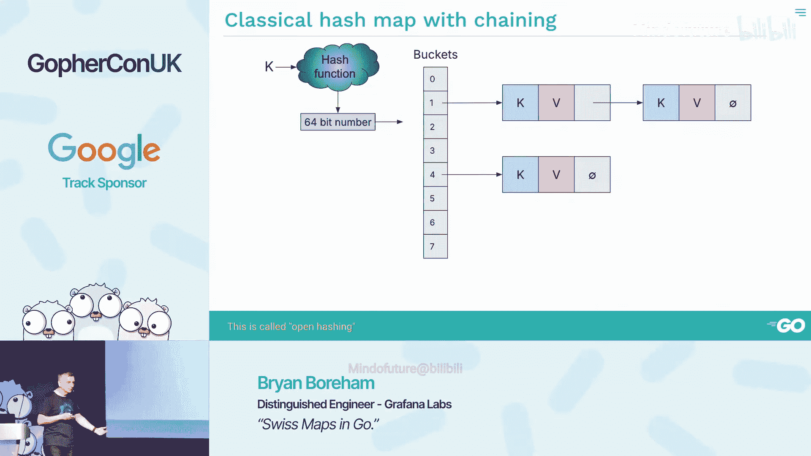
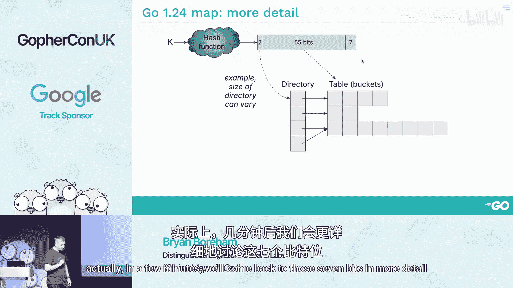
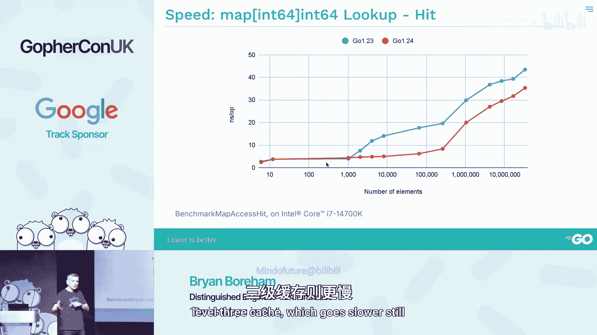

# 014：深入解析 Go 1.24+ 的新哈希表实现


在本节课中，我们将要学习 Go 语言在 1.24 版本中引入的全新哈希表实现——Swiss Maps。我们将探讨其设计原理、性能表现、与旧实现的差异，以及一些需要注意的细节。

## 什么是 Go 中的 Map？




在 Go 语言中，当我们谈论 `map` 时，通常指的是一个键值对集合。我们可以这样声明一个 `map`：
```go
map[KeyType]ValueType
```
例如 `map[string]int`。其核心特性是，我们期望插入、查找和删除操作的时间复杂度为 **O(1)**，即常数时间复杂度。这意味着无论 `map` 中有多少元素，这些操作的速度都应基本保持不变。

## 哈希表的基本原理

那么，如何实现这种常数时间的查找呢？其基本思想是使用哈希函数。

1.  **哈希函数**：我们取一个键（例如一个字符串），通过一个哈希函数进行处理。这个函数会生成一个数字（在 Go 中是 64 位整数）。
2.  **定位桶**：我们使用这个哈希值的一部分来索引一个数组（称为“桶”数组），从而直接定位到可能存储该键值对的“桶”。
3.  **处理冲突**：由于哈希空间远大于桶的数量，不同的键可能被哈希到同一个桶中，这称为“冲突”。有两种主要策略来处理冲突：
    *   **拉链法**：每个桶维护一个链表，所有哈希到该桶的键值对都存储在这个链表中。
    *   **开放寻址法**：如果目标桶已满，则按预定规则（如线性探测）寻找下一个可用的空桶。




上一节我们介绍了哈希表的基本概念，本节中我们来看看 Go 新旧实现的核心区别。

## Go 1.24 之前的 Map 实现




Go 语言自诞生起就内置了 `map`。在 1.24 版本之前，其实现大致如下：
*   数据结构有一个 `map` 头部结构体。
*   所有“桶”都存储在一个大的切片中。
*   每个桶最多可以容纳 8 个键值对。
*   当所有桶都接近填满时，实现会分配一个两倍大小的新桶数组，并逐步将所有元素重新哈希并迁移到新数组中，这个过程称为“扩容”。

## Swiss Maps 的新设计

Go 1.24 引入的 Swiss Maps 在结构上做出了重大改变：

1.  **目录层**：最大的区别是引入了一个额外的间接层，在代码中称为“目录”。不再是单个巨大的桶切片，而是通过一个目录来指向多个较小的桶切片。
2.  **平滑扩容**：旧实现需要一次性分配一个巨大的新桶数组并重新哈希所有元素。Swiss Maps 则不同，桶可以从小（如 1 个桶）开始，逐渐倍增到 1024 个。超过这个数量后，它开始使用目录来间接引用这些桶切片，从而避免了单次巨大的扩容开销。
3.  **哈希过程**：对键进行哈希得到 64 位值。假设目录大小为 4，则取高 2 位来选择使用哪个桶切片（目录项），再用剩余的位来定位该切片内的具体桶。

我们了解了结构上的变化，接下来看看 Swiss Maps 性能提升的关键“黑科技”——元数据。

## 性能关键：元数据与快速匹配

每个桶除了存储键值对外，还附带 8 字节的“元数据”。每个元数据字节对应桶内的一个条目（共 8 个），其中低 7 位存储了键哈希值的低 7 位，最高位用于标记该位置是“空”还是“已删除”。

旧版 Go map 在查找时，需要遍历桶内的 8 个位置，逐个比较哈希值（的片段）。Swiss Maps 采用了一种极其巧妙的方法来一次性比较所有 8 个位置。

假设我们要查找的键，其哈希值低 7 位是 `0x03`。旧方法需要循环 8 次。Swiss Maps 的算法则通过一系列位操作指令实现：
1.  将目标值 `0x03` 复制到 8 字节的每个字节中。
2.  将这个 8 字节数与桶的 8 字节元数据进行异或操作。
3.  对结果进行特定的减法和掩码操作。

**神奇之处**在于，经过这些操作后，**只有匹配项对应的位会被置位**。这样，通过检查一个整数的位状态，就能知道是否有匹配项以及是第几个，而无需循环。

我们可以通过 Go 官方编译器资源查看验证，相关函数（如 `mapaccess2`）的汇编代码确实包含了这些精妙的位操作指令。

然而，这还不是最快的。为了追求极致性能，Swiss Maps 在支持的 CPU 上使用了 SIMD 指令。

## 极速之道：SIMD 指令的应用

SIMD 代表“单指令多数据”，它允许一条指令同时处理多个数据流。现代 CPU 普遍支持 SIMD。

在 Swiss Maps 的上下文中，要同时比较 8 个元数据字节，使用 SIMD 是理想选择。Go 编译器通过一个“后门”来实现：当编译特定包内的特定函数（如 `mapaccess2`）时，如果检测到编译目标支持特定的 SIMD 指令集（通过设置 `GOAMD64=v2` 环境变量），编译器会直接生成对应的 SIMD 汇编指令，而不是普通的位操作 Go 代码。

使用 SIMD 指令后，查找过程简化为：
1.  一条指令将目标值广播到 8 字节。
2.  一条指令同时与 8 字节元数据比较。
3.  一条指令将比较结果压缩为位掩码。

这样，在几个时钟周期内就能完成整个桶的扫描，速度达到硬件极限。

## 性能基准测试分析

理论很美好，实际表现如何？根据 Go 项目自身的基准测试：
*   **查找命中**：对于 `map[int]int64`，当元素数量较多时（例如超过百万），Swiss Maps 的查找速度比 Go 1.23 快接近一倍。对于小 map，差异不大。
*   **查找未命中**：在 map 较大时（如 400 万元素），查找一个不存在的键，Swiss Maps 的优势最为明显。
*   **内存占用**：Swiss Maps 通常有更高的负载因子（桶更满），因此最终内存占用可能更小。但其扩容策略平滑，在特定增长阶段，内存开销可能比旧实现更高。
*   **需要留意**：对于使用 `map[T]struct{}` 实现的集合，由于 Go 编译器内存对齐的细节，Swiss Maps 目前存在一个缺陷，导致其内存占用是旧版本的两倍（Issue #71368）。此问题在 Go 1.25 中仍未修复。

## Go 1.25 中的改进

Go 1.25 进一步优化了 Swiss Maps：
1.  **小 map 性能**：修复了对于非特殊化键类型（如某些自定义类型）的小 map（最多 8 个元素）的性能回归，使其恢复高速。
2.  **优化删除**：在 map 扩容前，会先尝试“修剪”已删除条目留下的“墓碑”空间，更充分地利用内存。
3.  **修复 `maps.Clone`**：Go 1.24 中 `maps.Clone` 函数存在严重的性能回归。Go 1.25 不仅修复了此问题，而且使其性能比 Go 1.23 更快。

## 总结与致谢

本节课中我们一起学习了 Go 1.24 引入的 Swiss Maps 哈希表实现。我们回顾了哈希表的基础，剖析了 Swiss Maps 通过引入目录层实现平滑扩容、利用精妙的位操作和 SIMD 指令实现极速查找的设计。我们也看到了其性能优势，以及目前存在的一些注意事项（如空结构体集合的内存问题）。

最后，需要强调的是，Swiss Maps 是众多工程师智慧的结晶，主要基于 Google 的 Jeff Dean 等人设计的 C++ Swiss Table 概念，并由 Go 团队的 Michael Pratt 等人适配和实现到 Go 语言中。


通过本次学习，你应该对 Go `map` 的内部工作原理和最新进展有了更深入的理解。