# 016：Just Eat如何使用工具在几分钟内部署Go微服务


## 概述

在本节课中，我们将学习Just Eat公司如何利用其内部开发的工具`Gokit`，在几分钟内快速部署Go微服务。我们将了解`Gokit`如何解决微服务规模化过程中的常见问题，并通过构建一个简单的披萨服务示例，展示其核心功能与优势。

---

## 什么是Jet Connect？

Jet Connect是Just Eat内部的一个团队，最初名为“Flight”。它于2013年作为集成平台启动，负责处理从餐厅到杂货店、电子产品等各种合作伙伴的订单和菜单处理。其核心目标是统一来自不同合作伙伴的订单和菜单处理流程。

在早期，一家餐厅可能需要为不同的配送平台（如Delivery、Uber、Just Eat）准备多台iPad。Jet Connect的出现使得餐厅只需一台iPad即可处理所有平台的订单，无需在店内安装额外设备，也无需处理多种不同的数据负载。


在本课程中，我们将频繁提及“POS系统”（销售点系统）。这是一个旨在帮助处理订单和其他商业交易的系统，本质上是我们与合作伙伴交互、告知订单信息的工具。

Just Eat非常喜爱Go语言，许多团队都在使用它。从规模上看，Just Eat拥有约73.1万家合作伙伴，业务遍及17个国家。仅Jet Connect团队就有约50名成员，管理着超过100个Go微服务。


这是一个典型的Just Eat订单流程：用户在某个周五晚上喝了几杯啤酒后下单。我们将订单负载转换为合作伙伴可消费的格式，并充当路由器决定订单的去向。最后，我们将订单注入合作伙伴的POS系统。为了让你对规模有个概念，我们每天处理数千次这样的操作，每年处理的订单超过8亿笔。

---

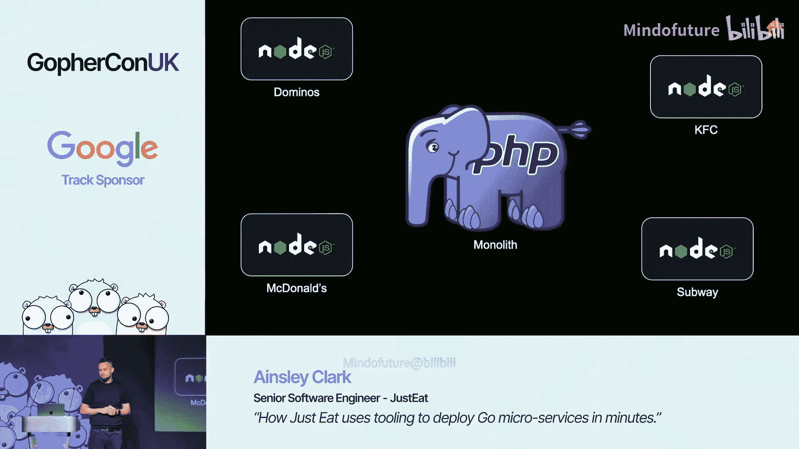

## 发展历程与挑战

上一节我们介绍了Jet Connect的基本情况，本节中我们来看看团队的技术演进历程以及遇到的挑战。

我们最初使用一个PHP单体应用来支撑大部分平台能力，但它存在发布缓慢、遗留代码难以修改、测试套件庞大等问题。随着我们试图快速集成不同供应商，我们将集成部分提取到了TypeScript中。这些TypeScript服务使用gRPC与PHP单体应用交互。

每个TypeScript服务都实现了相同的RPC调用，以便工程师更容易进行开发。我们成立了一个团队，尽可能多地创建这类集成服务。为此，我们创建了一个模板仓库，其中包含了E2E测试、Helm图表、构建部署工作流等，工程师只需fork它就可以开始新项目。这在早期确实帮助我们加速了开发。

然而，这种基于Github模板的想法虽然起步快，但后期维护成了负担。如果我们在模板仓库中发现一个bug，必须将其应用到所有fork出来的仓库中。手动更新150个服务非常痛苦。由于缺乏统一标准，每个仓库的做法各不相同，开发人员很难直接跳到一个集成服务中开始修复问题或添加功能。此外，我们也没有内置端到端测试，这在发布时无法提供足够的信心。

我们需要一种方法来轻松创建和更新这些服务，以适应快速发展的需求。我们想要一种易于分发、易于扩展的东西。我们主要使用TypeScript来处理JSON数据，将其转换为POS系统理解的各种格式。但我们希望使用更严格、更适合云环境的语言。众所周知，Go在这些领域表现出色，因此我们决定转向Go。

但我们需要制定一个计划和一些先决条件，以跟上这些持续的变化。我们想要构建一个工具来帮助我们处理所有这些事情。


---

## Gokit的诞生与目标

上一节我们看到了规模化带来的挑战，本节中我们来看看团队为解决这些问题而构建的工具——Gokit——及其设计目标。

我们希望从这个工具中获得以下能力：
*   我们希望在几秒钟内生成和更新一个仓库。
*   我们希望使用行业标准的文档标记来定义HTTP API，并将其作为工具的一部分，以确保文档是流程中的一等公民。
*   我们希望尽可能少地订阅事件，只需编写处理程序即可。
*   我们希望将所有基础设施细节（如数据库、事件总线和对象存储）尽可能地对工程师隐藏。
*   我们希望自动生成所有CI/CD流程，以便轻松推出更新，不再需要手动处理Helm或进行大规模更新。
*   我们希望所有更改在合并到主分支后都能安全地部署到生产环境。能力测试是其中的重要部分，稍后会详细介绍。
*   我们希望开发人员能够在开发环境中以最少的设置轻松运行这些服务。
*   我们希望以一致的方式抽象化相同的操作，例如创建日志记录器。我们不想要150种创建日志记录器的方法，只想要一种。


于是我们构建了`Gokit`。`Gokit`是我们的微服务开发工具包，它有助于服务的配置、事件供应等许多方面。需要指出的是，Github上已经有一个名为“go kit”的项目，我们只是从名字中汲取了一些灵感，但我们的`Gokit`并非那个项目。

---


## 实战：构建一个披萨服务

上一节我们介绍了Gokit的目标，本节中我们将通过构建一个简单的披萨服务来实际演示Gokit的功能。

我们将为“Bob's Pizzas”这家合作伙伴构建一个披萨服务。以下是我们要构建的大致流程：
1.  事件总线（或上游）将发出一个名为`PizzaOrdered`的新事件到事件总线。
2.  `PizzaOrdered`事件将包含披萨类型、客户详情等信息。
3.  披萨服务将通过HTTP POST请求告知Bob他的订单，Bob开始烹饪。
4.  Bob回复200 OK。
5.  然后我们将一个`PizzaSucceeded`事件发回事件总线，以便上游可以协调处理，甚至可能通知用户。

我们将专注于今天的披萨服务部分。

### 初始化服务

我们通过运行以下命令开始：
```bash
gokit u pizza-service
```
这将为我们搭建大量文件。我们首先会看到一个选择界面，询问我们希望这个服务做什么。我们选择：
*   消费事件（消费`PizzaOrdered`事件）。
*   生产事件（生产`PizzaSucceeded`事件）。
*   需要一个HTTP客户端来通知Bob。

我们还可以选择HTTP服务器、数据库或对象存储，但稍后再讨论这些。选择后，它会即时引导和创建服务文件。


### 项目结构

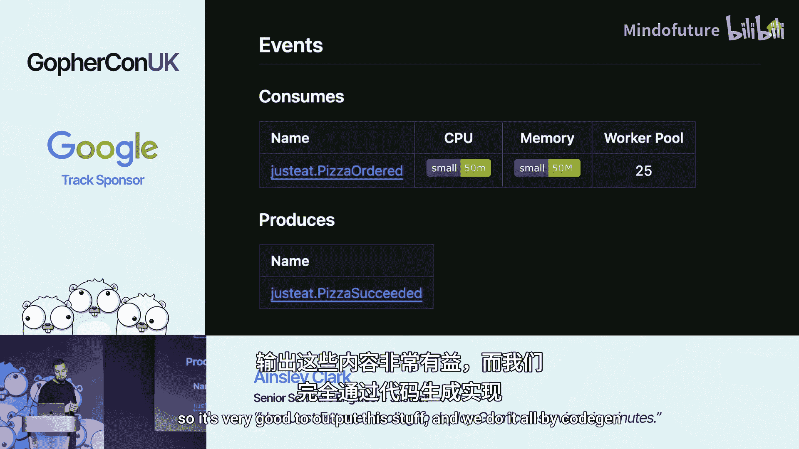

生成的文件结构如下（简化版）：
```
pizza-service/
├── cmd/
│   └── app/
│       └── main.go
├── internal/
│   └── app/
│       └── service.go
└── service.json
```
拥有一致的文件结构非常强大。工程师在查找代码时能确切知道该去哪里。`main.go`是自动生成的，它调用`internal`包中的一个函数`runService`，并传入所有依赖项。我们所有的自定义代码基本上都放在`internal`中，很少修改`internal`之外的内容。

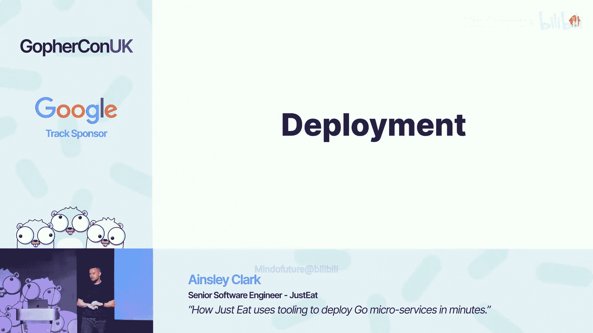

它还创建了一个特殊的文件`service.json`。`service.json`本质上是基础设施即代码（IaC），它告诉Terraform这个服务如何在云中运行。

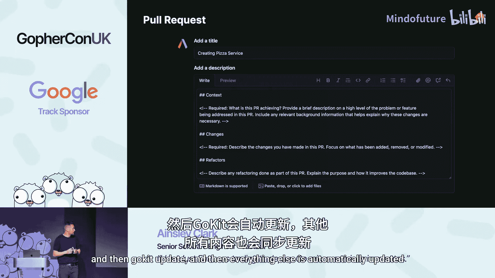

### 编写事件处理器

现在让我们编写代码。在`internal/app/service.go`中，我们有一个`runService`函数。我们请求了三个依赖项（HTTP客户端、事件总线消费者、事件总线生产者），它们已经传递给我们了。

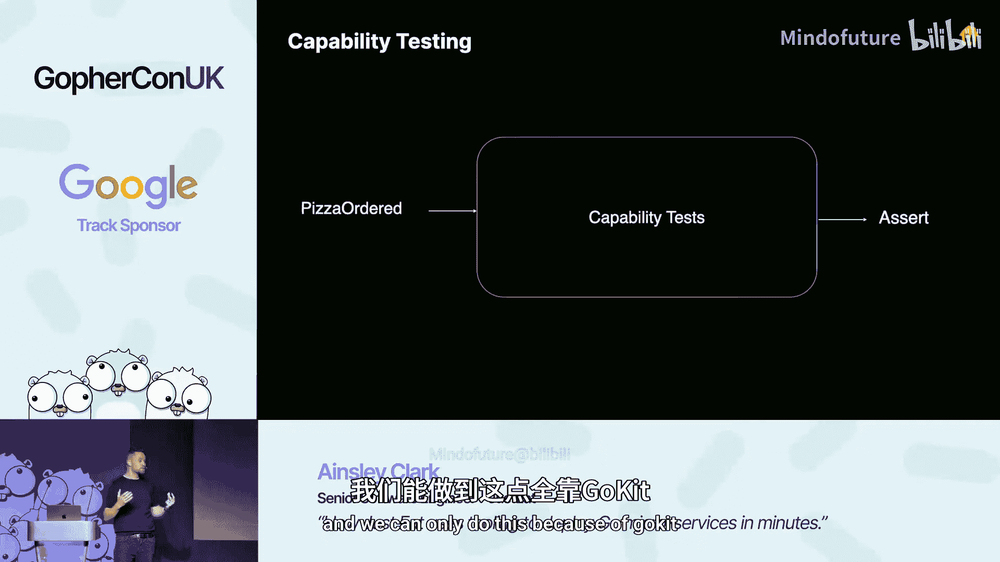

让我们创建一个事件处理器来消费`PizzaOrdered`事件。以下是Just Eat中典型的事件处理器样子：
```go
type PizzaHandler struct {
    client   *gokit.HTTPClient
    producer *gokit.EventProducer
}

func (h *PizzaHandler) Handle(ctx context.Context, event interface{}) error {
    // 将事件转换为正确的类型
    pizzaEvent := event.(*events.PizzaOrdered)

    // 通知Bob他的订单
    resp, err := h.client.Post(ctx, "https://bobs-pizzas.com/order", pizzaEvent)
    if err != nil {
        return err
    }
    defer resp.Body.Close()

    // 发出披萨成功事件
    succeededEvent := &events.PizzaSucceeded{OrderID: pizzaEvent.OrderID}
    return h.producer.Emit(ctx, succeededEvent)
}
```
我们不对事件进行类型检查，因为Gokit在我们调用它时会做一些“魔法”，稍后会看到。

回到我们的`service.go`文件，是时候引导它了。我们创建一个新的处理器，传入我们的客户端和生产者。然后我们调用一个特殊的方法`consumer.On`，并传入对`PizzaOrdered`类型的引用。这样我们就告诉消费者：“对于这个处理器，你要消费这个事件类型”。这就是为什么我们不需要任何类型断言。

使用AST和反射，我们能够遍历这些处理器，查看哪个事件属于哪个消费者，这会产生一些有趣的产物。最后，我们传入我们的处理器。

就这样，我们运行`gokit update`。这将在仓库中执行一些“魔法”，并修改仓库内的一些文件。


现在你可以看到，在我之前提到的`service.json`文件中，通过运行`gokit update`，它在顶部添加了`consumes_topics`键。这是向Terraform发出的信号，用于根据传递的配置来配置Pod。


你可以看到`go.name: justeat.pizza.ordered`被传递进去了。我们能够配置此事件的最小副本数量。如果Bob的生意兴隆，收到大量披萨订单，我们可以在这里增加最小数量。我们也有很好的自动扩展功能。同样，我们可以通过仅仅两行代码进行垂直扩展，通过`pod_resources`键增加CPU和内存（小、中、大、特大等）。这是一个小而强大的对象。

因为Gokit识别出了那个`go.name`，我们能够输出一些非常有用的文档。它显示了该服务消费什么、生产什么。工程师一看就知道这个服务是做什么的。这一切都是通过代码生成完成的。

### 部署与CI/CD

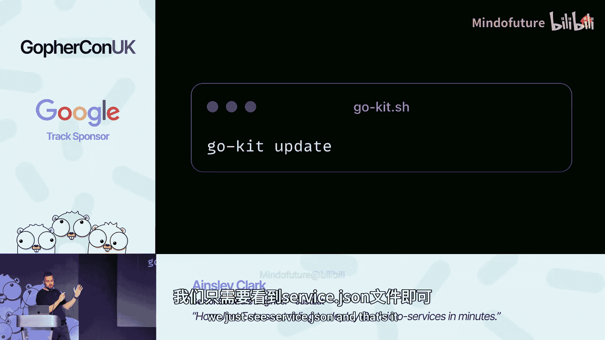

我们希望部署它。我将向你展示Gokit提供的一些额外好处。

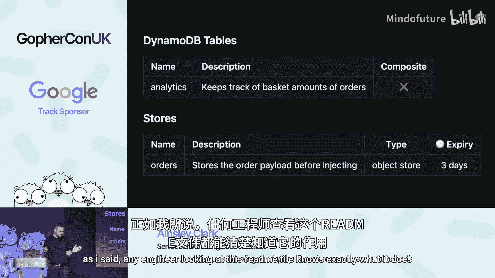

我们为新服务创建一个PR，我们的文档和Github模板已经就位，这要归功于Gokit提供的脚手架。如果我们需要更改这个模板，只需在一个地方修改，然后运行`gokit update`，其他所有内容都会自动更新。

另一个很棒的CI/CD流程是能力测试。其理念是，我们使用Gokit和Docker启动所有服务，这使得拦截整个堆栈的请求变得更加容易。我们基本上在能力测试开始时触发一个事件，然后在最后断言结果。Gokit会为这些请求和事件添加一个随机数（nonce），使我们能够做到这一点。这对于两个服务或我们的披萨服务来说很简单，但我们的许多能力（如菜单推送、订购库存）中间涉及10到20个服务，这样做要容易得多。这让我们在推出新功能时充满信心，因为我们知道没有搞砸任何事情。我们能做到这一点，全靠Gokit。

我们还有漂移检测。我们的一些文件是自动生成的，但我们也有保护措施。如果我们去编辑`service.json`文件而没有运行`gokit update`，CI会检测到并提醒我们。这样可以防止有人试图编辑生成的文件。例如，如果我传递了一个`justeat.my_event`给消费者，但没有运行`gokit update`，CI会说“这不是`service.go`中的主题，它在这里做什么？”，因此我无法合并。这样，生产环境和本地环境之间永远不会出现差异。

Github Action模板也使部署变得非常容易。同样，如果我们需要更新它，只需在一个地方修改，然后运行一次`gokit update`。


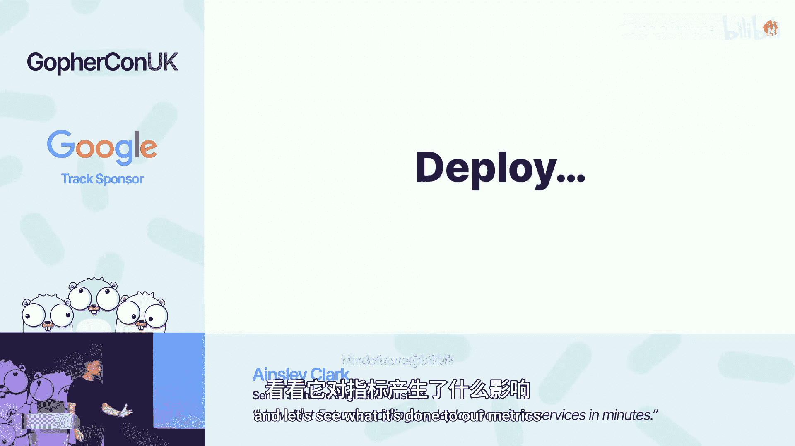

这里我想指出一点：如果Gokit有新版本，而你的服务还在用旧版本，你是无法合并到主分支的。当周四晚上你想快速推出一个PR时，这可能有点烦人。但从长远来看，你自然而然地获得了安全补丁，这是一个额外的好处。

无需做任何额外工作，我们就获得了出色的指标和Grafana仪表板（除了通常的Prometheus指标）。Gokit提供了一些非常有用的指标，例如我们生产和消费的事件等。你可以看到`PizzaSucceeded`事件的事件速率，以及`justeat.pizza.ordered`事件的事件速率。尽管这只是我们通用事件仪表板中的一些面板，但我只是浅尝辄止地展示了我们实际能做的事情。

---

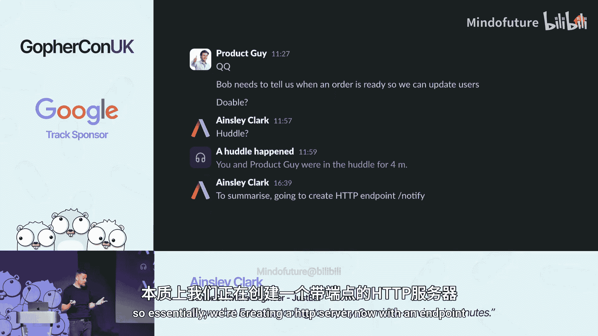

## 深入功能：添加数据库与存储

上一节我们完成了基础服务的部署，本节中我们来看看当业务需求变化时，如何利用Gokit快速扩展服务功能。

假设产品部门的人来找你，说我们需要关于Bob披萨店的分析数据和更多细节。我们需要在告诉Bob之前保存订单的引用，并且需要在数据库中存储平均购物篮总额以进行分析。

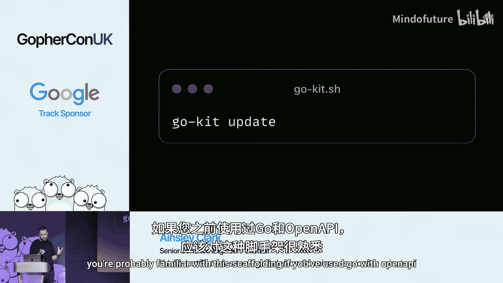

因此，我们需要创建一个DynamoDB表来存储那些购物篮总额，并创建一个S3存储桶来在发送给Bob之前存储订单。

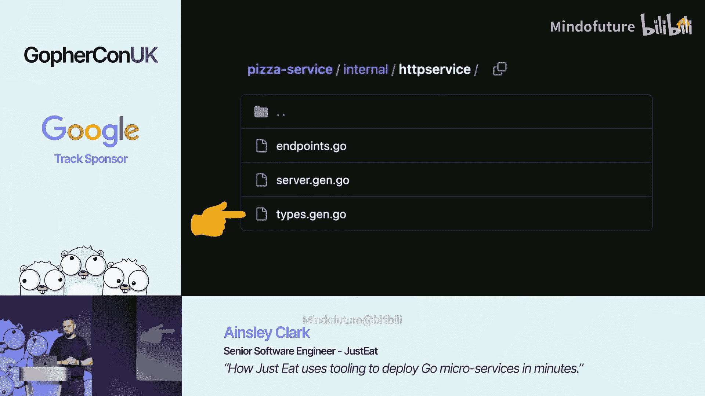

回到我们详细的架构图，我们需要添加一个DynamoDB表来存储订单分析数据，以便按订单ID查询。然后我们需要添加一个S3存储桶来在发送给Bob之前存储订单负载。

我们该怎么做？回到我们的`service.json`文件。我们需要在`resources`键中添加一些数据，这将允许我们拥有存储和数据库。


首先，我们添加一个数据库对象。我们添加名称、描述，还可以添加其他内容，如要持久化到数据库的索引。然后我们在`object_store`下添加一个对象，这样我们就可以有一个存储桶。我们也给它名称和描述。

运行`gokit update`，这将修改`main.go`，修改`runService`函数并传入所有那些依赖项。我们还会获得一些其他指标。在幕后，它会通过添加Terraform模板来配置这些资源。我们通常看不到这些，我们只看到`service.json`，仅此而已。所以对我们来说相当容易。

运行后，你可以看到Readme已经更新，我们有了更多文档，包括描述。开发人员很懒，我们不想写大量文档。所以这对我们来说很完美。正如我所说，任何工程师查看这个readme文件都能确切知道它是做什么的。

回到我们的`service.go`文件，Gokit已经更新了一些东西。首先，它添加了一个数据库，类型是`ReadWriter`。这是Gokit库中存储的一个接口。当我谈到抽象这些模式时，这将是我们使用的方法之一。对象存储也被传入，我们可以向存储桶下载和上传文件。然后我们将它们传递给我们的披萨处理器。

传入`runService`的所有东西通常都是一个接口，这鼓励了通过依赖注入进行易于测试的编码，因为它很容易测试。正如我所说，这是我们在Gokit库中拥有的可重用代码的一个很好的例子。

这并不是说我们会这样做，但如果我们想切换到PostgreSQL，也许DynamoDB太贵了，我们可以在一个地方完成。我们会更新这些`ReadWriter`接口的实现，然后其他一切都会正常工作。所以我们把它抽象出来了，这样可以轻松热交换组件。

回顾我们刚刚编写的处理器，让我们将数据库和存储传入披萨处理器。然后，在告诉Bob他的披萨之后，我们将分析数据写入数据库。接着，我们将订单上传到S3。

我们可以通过运行`gokit run`来测试我们的更改，这将启动DynamoDB Admin和MinIO。这样我们就可以传递事件并检查我们的能力是否正常工作。这让我们在创建PR之前充满信心。


让我们继续创建PR并部署它，看看我们的指标发生了什么变化。你可以看到我们的Grafana面板是如何自动更新的。你可以看到我们的DynamoDB分析数据，包括读取、延迟和其他指标。你还可以在这里看到我们的S3数据显示，包括每个存储桶的操作、延迟和错误。

这还不错，对吧？有人要求我们添加一些功能，我们并没有真正考虑底层基础设施。我们添加了几个JSON键并安装了它们。我知道这个例子很简单，但当我们在处理这些难题时，它确实能发挥作用。我们不必专注于基础设施。

---

## 扩展功能：添加HTTP服务器

上一节我们为服务添加了数据持久化能力，本节中我们来看看如何为服务添加对外API接口。

产品人员又来了（我相信这对你们很多人来说都很熟悉）。Just Eat希望在下单后通知用户，以便用户收到“您的披萨正在路上”的友好通知。因此，Bob需要在他烹饪好披萨时告诉我们。他将通过向我们定义的一个POST端点发送订单ID来实现。本质上，我们现在要创建一个带有端点的HTTP服务器。

回到我们可爱的架构图，Bob将在他烹饪好美味的披萨时告诉我们。因此，他将向我们披萨服务中定义的一个端点发送POST请求，其中包含订单ID。然后我们将告诉上游披萨已准备好，这样用户就可以在他们的应用上看到它。我们将通过发出一个新的`OrderReady`事件来实现。

让我们编辑我们的`service.json`文件以启用那个HTTP服务器。我们将在这里添加一个`http`对象。这将向Gokit发出信号，表明我们需要一个Echo服务器。我们还可以设置我们期望处理程序超时的时间。和往常一样，我们可以定义我们期望此服务使用多少CPU和内存。

Just Eat使用OpenAPI文件来定义API。让我们创建一个端点，以便Bob可以告诉我们披萨准备好了。我们定义一个`/order/notified`路径。我们传入订单ID。如果一切正常，则返回200。我们再次运行`gokit update`，这将通过OpenAPI文件生成一些文件。如果你以前用过Go和OpenAPI，你可能对这种脚手架很熟悉。

我们在`http/service`包下得到了一些新文件。第一个文件`endpoints.go`为我们创建了一个HTTP处理器结构。下一个文件`server.gen.go`是OpenAPI生成的HTTP服务器接口定义。`types.gen.go`定义了所有的请求和响应类型。

它创建了一个我们需要实现的服务器接口。因此，我们需要创建一个实现该`OrderReady`函数的类型，以便我们可以通知上游。

这是一个典型的HTTP处理程序的样子。让我们继续实现那个函数。我们在顶部创建一个共享的日志记录器，其中包含跟踪ID和请求ID，便于调试。同样，这是我们拥有的另一段库代码，使我们能够一遍又一遍地做同样的事情。然后我们绑定请求体以获取订单ID，最后，我们发出我们的`justeat.order.ready`事件以及订单ID。

回到我们的`service.go`文件，让我们考虑那个新的HTTP服务器。你可以看到它自动传入了一个Echo服务器。然后我们通过传入一个实现该服务器接口的类型来注册我们的HTTP处理程序。在这个例子中，就是`HTTPHandler`类型。最后，我们传入事件总线生产者，以便发出`OrderReady`事件。

让我们再次部署它。正如你所看到的，我们获得了一些非常漂亮的HTTP开箱即用指标。我们有每个请求的响应代码，还有平均响应时间。所以，只需在这些模板上花一点时间，你就能获得一些非常强大的仪表板，而无需做任何额外工作。

我们刚刚为产品部门实现了那个功能，再次，不到50行代码。所以产品部门很高兴，你也很高兴。

---


## Gokit带来的益处与总结

在创建了Gokit之后，很容易忘记它对Just Eat的Go工程实践产生了多大的影响。在Gokit存在的六年里，它帮助我们通过一个PR更新了整个服务群。因为Gokit是一个中心化的仓库，要更改某些东西只需一个PR。一次修复，处处修复。这些更改会随着时间的推移自然地合并到主分支中，因为工程师必须运行`gokit update`才能合并到主分支。

我们无需任何干预就能创建行业标准的一流文档。我们通常不写很多文档，但我们写的文档都是以产品为中心的，是关于“这个如何工作”之类的，技术性不强，因为技术细节由Gokit处理。

工程师可以专注于业务问题，而不是部署。这本身就很好，因为设置DynamoDB、设置PostgreSQL、所有那些Terraform东西都需要时间。我们不必做那些。在我们的演示中，我们专注于业务问题。

它帮助我们轻松实现CI/CD更新。Jet Connect最近（大约六个月前）从普通的Github迁移到了Github Enterprise。我们需要更新大量元数据。我们只是在Gokit中做了一次更新，除了URL更改外，一些工程师甚至没有察觉到。所以又好又容易。

我认为这是最好的好处之一。文件夹结构。拥有相同的文件夹结构为我们节省了数小时在仓库中挖掘以寻找正确文件的时间。它使工程师能够轻松地在服务之间进行大的上下文切换，我认为这非常强大。

我们还拥有极其健壮的端到端测试。我觉得在Kevin的演讲之后，我仍然觉得这对Just Eat来说是一个独特的模式，我们进行这些能力测试，确保不会导致任何生产事故，因为我们有庞大的能力测试套件。

但最重要的是，它帮助我们扩展到每月处理数亿订单。


本节课中我们一起学习了Just Eat如何利用Gokit工具包高效地部署和管理Go微服务。我们从Jet Connect团队的挑战出发，探讨了Gokit的设计目标，并通过构建一个披萨服务，实战演示了其快速生成服务、管理事件、集成基础设施、自动化CI/CD以及提供丰富监控的能力。Gokit的核心价值在于将基础设施复杂性抽象化，使开发团队能够专注于核心业务逻辑，从而实现快速、一致且可靠的微服务开发和部署。