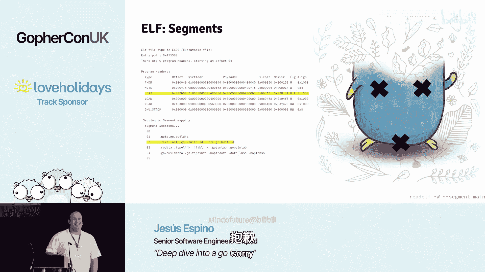

# 019：深入探索 Go 二进制文件


在本节课中，我们将深入探索一个 Go 二进制文件的内部结构。我们将了解 ELF 文件格式的基本组成，分析 Go 编译器生成的各个特定部分，并学习如何查看和解读这些信息。通过本教程，你将明白一个简单的 “Hello, World” 程序为何会生成一个 2.2 MB 的二进制文件，以及其中包含了哪些内容。

## 概述：ELF 文件格式

在深入 Go 二进制文件之前，我们需要理解其底层容器：ELF（可执行与可链接格式）文件。ELF 是 Linux 系统上二进制文件的标准格式。

ELF 文件主要由三部分组成：**头部**、**节** 和 **段**。

*   **头部**：位于文件开头，定义了文件的元数据，例如魔数、目标架构以及最重要的——程序入口点地址。
*   **节**：是二进制文件中连续的、具有特定用途的数据块。例如，`.text` 节存放代码，`.rodata` 节存放只读数据。节主要供链接器、调试器等工具使用。
*   **段**：与节包含相同的数据，但以不同的方式组织。段是操作系统在运行时实际加载到内存并执行的单位。每个段都有权限标志（如可读 `R`、可写 `W`、可执行 `X`）。

你可以使用以下命令查看二进制文件的节和段：
```bash
# 查看节
readelf -S ./your_go_binary

# 查看段（程序头）
readelf -l ./your_go_binary
```

## 通用节分析

上一节我们介绍了 ELF 的整体结构，本节中我们来看看一个典型 Go 二进制文件中包含哪些通用节。以下是 “Hello, World” 程序编译后二进制文件的主要节：

*   **`.text` 节 (604 KB)**：这是最重要的节，包含了所有已编译的机器代码。你可以使用 `go tool objdump` 来反汇编查看其内容。本质上，它就是源代码转换成的二进制指令序列。
*   **`.rodata` 节 (313 KB)**：包含只读数据，主要是字符串字面量、类型定义、接口信息和常量。
*   **`.data` 节 (21 KB)**：包含已初始化的全局变量。
*   **`.bss` 节**：包含未初始化的全局变量。该节在文件中不占实际空间，仅指示运行时需要预留多少内存。
*   **`.symtab` (符号表) 和 `.strtab` (字符串表)**：`.symtab` 节 (55 KB) 存储程序中所有符号（函数、变量等）的引用和元数据。`.strtab` 节则存储这些符号的名称字符串。两者结合，工具才能显示有意义的函数名。
*   **`.shstrtab` 节 (3336 bytes)**：存储所有节名称的字符串表。
*   **DWARF 调试信息 (622 KB)**：这是一个庞大的节，包含了源代码行号、变量位置等详细信息，供调试器使用。它约占整个二进制文件的三分之一。

## Go 特定节分析

除了通用节，Go 编译器还会生成一些特有的节，这些是构成 “Go 二进制文件” 身份的关键。

*   **`.note.go.buildid` (300 bytes)**：包含构建此二进制文件的元数据，例如使用的 Go 版本 (`go1.25`) 和构建标识。
*   **`.typelink` 节 (约 2 KB)**：这是一个**偏移量数组**，指向 `.rodata` 节中定义的所有类型信息。它按类型名称排序，以便 `reflect` 包能使用二分查找快速定位类型。
*   **`.itablink` 节 (128 bytes)**：与 `.typelink` 类似，但存储的是指向接口表 (`itab`) 的**地址**数组，同样按名称排序。
*   **`.gopclntab` 节 (490 KB)**：这是最关键的节之一。它的职责是将**程序计数器** 映射回源代码信息（文件名、行号、函数名）。Go 的栈追踪、性能分析工具 `pprof` 都依赖于此。其结构包含函数名表、文件名表、PC 值表等，通过一系列索引关联起来。
*   **`.noptrdata` 和 `.noptrbss` 节**：与 `.data` 和 `.bss` 类似，但其中包含的变量保证不持有任何指针。因此，垃圾回收器可以跳过对这些区域的扫描，以提高效率。
*   **`.go.buildinfo` 和 `.go.phpsinfo`**：包含构建信息和用于安全验证（如 FIPS）的元数据。

## 段与内存布局

了解了节的用途后，我们来看看它们是如何被分组到段中，以便操作系统加载和执行的。以下是二进制文件中的主要段及其权限：

*   **可执行段 (`LOAD`，标志 `R E`)**：包含 `.text`、`.note.go.buildid` 等节。这是唯一具有执行 (`X`) 权限的段，CPU 将执行这里的指令。
*   **只读数据段 (`LOAD`，标志 `R`)**：包含 `.rodata`、`.typelink`、`.itablink`、`.gopclntab` 等节。这些数据在运行时不可修改。
*   **可读写数据段 (`LOAD`，标志 `R W`)**：包含 `.data`、`.bss`、`.noptrdata`、`.noptrbss`、`.go.buildinfo` 等节。存放全局变量和运行时数据。

## 实用知识与技巧

现在我们对二进制文件的构成有了全局认识，本节分享一些相关的实用知识和技巧。

*   **精简二进制文件**：并非所有节都是运行时必需的。使用 `strip` 命令可以移除不被任何段引用的节（主要是调试信息和符号表）。
    ```bash
    strip ./your_go_binary
    ```
    这能将 “Hello, World” 二进制文件从 2.2 MB 减小到 1.5 MB。
*   **信息泄露**：二进制文件中可能包含你未曾留意的信息。例如，`.gopclntab` 节中的文件名表可能包含你本地编译环境的绝对路径（如 `/home/yourusername/...`）。使用 `strings` 或 `readelf` 命令可以查看这些信息。
*   **栈追踪的奥秘**：即使使用 `strip` 移除了 `.symtab`，Go 程序依然能打印出完整的函数名和行号，这完全依赖于 `.gopclntab` 节。
*   **反射的实现**：`reflect` 包通过查找 `.typelink` 节来根据类型名快速获取类型信息。因为 `.typelink` 是排序的，所以可以使用高效的二分查找。


## 总结与资源




本节课中我们一起学习了 Go 二进制文件的内部结构。我们从 ELF 格式的基础讲起，逐步分析了通用节（如 `.text`、`.rodata`）和 Go 特有的节（如 `.gopclntab`、`.typelink`），理解了它们如何被组织成具有不同权限的段。我们还探讨了如何精简文件、注意潜在的信息泄露，以及一些运行时特性（如栈追踪和反射）是如何依赖这些二进制数据的。

如果你想进一步探索，可以参考以下资源：
*   **Go 源码**：链接器 (`cmd/link`) 的源码是终极参考，尽管阅读起来有一定挑战。
*   **`debug/gosym` 包**：提供了读取 `.gopclntab` 信息的官方 API。
*   **`garble` 工具**：如果你关心代码混淆，防止函数名、路径等信息泄露，可以使用这个工具。但请注意，这会使栈追踪信息变得难以解读。
*   **设计文档**：搜索 “`gopclntab` design document” 可以找到其原始设计思想（文档可能较旧）。


通过本教程，希望你现在看到 `readelf` 的输出时，不再觉得那是一堆无意义的数字，而是一幅描绘程序如何被构建、组织和运行的清晰蓝图。