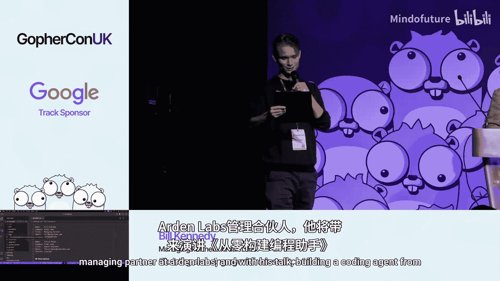
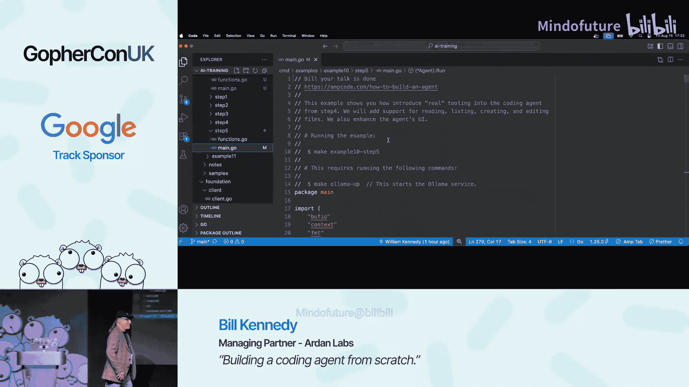

# 020：构建一个编码代理




在本节课中，我们将学习如何从零开始构建一个简单的编码代理。我们将使用 Go 语言，通过 Oama 本地运行一个大型语言模型（LLM），并实现与模型的对话、工具调用等核心功能。通过这个实践项目，你将理解现代 AI 编码助手背后的基本工作原理。

---

## 概述与准备工作

首先，我们需要设置开发环境并理解基本概念。我们将使用 Oama 来本地运行一个 LLM 模型，并编写一个 Go 客户端与之通信。

**核心工具与模型**：
*   **Oama**: 一个用于本地运行多种 LLM 模型的工具。
*   **模型**: 本节课使用 OpenAI 的 `GPT-4o-latest`（一个 200 亿参数的模型）。你需要一台内存较大的机器（例如 128GB）来流畅运行。

**关键概念**：
*   **上下文窗口**: 模型一次能处理的文本量，以 **Token** 为单位。一个 Token 大约相当于 0.75 个英文单词。我们将上下文窗口设置为 64K Token 以避免在演示中超出限制。
*   **推理**: 模型在给出最终答案前的内部“思考”过程。本节课使用的模型支持将推理内容单独返回。
*   **工具调用**: 代理的核心能力之一，模型可以请求调用外部函数（工具）来获取信息或执行操作。

---

## 第一步：建立基础对话循环 🛠️

上一节我们介绍了项目的基本设置，本节中我们来看看如何实现与 LLM 最基础的对话循环。这是所有后续功能的基础。

首先，我们创建一个简单的 Go 程序，它能够接收用户输入，发送给 LLM，并流式地打印出模型的回复。

**定义代理结构体与运行循环**：
```go
type Agent struct {
    client *sse.Client
    getUserMsg func() string
}

func (a *Agent) Run() {
    // 初始化对话历史
    conversation := []map[string]any{}
    // 系统提示词（后续添加）
    // conversation = append(conversation, map[string]any{...})

    for {
        // 1. 获取用户输入
        userInput := a.getUserMsg()
        // 2. 将用户输入加入历史
        conversation = append(conversation, map[string]any{
            "role":    "user",
            "content": userInput,
        })

        // 3. 构建请求体（使用灵活的 map[string]any，类似 MongoDB 的 BSON）
        reqDoc := map[string]any{
            "model":       MODEL,
            "messages":    conversation,
            "max_tokens":  MAX_TOKENS,
            "temperature": 0.1, // 降低随机性，使推理更稳定
            "stream":      true,
        }

        // 4. 发起 SSE 请求，接收流式响应
        chunkCh := make(chan sse.ChatCompletionChunk)
        go a.client.ChatCompletion(reqDoc, chunkCh)

        var responseContent strings.Builder
        // 5. 处理返回的数据块
        for chunk := range chunkCh {
            if len(chunk.Choices) > 0 {
                delta := chunk.Choices[0].Delta
                // 收集内容
                if delta.Content != "" {
                    fmt.Print(delta.Content)
                    responseContent.WriteString(delta.Content)
                }
                // 收集推理内容（如果有）
                if delta.Reasoning != "" {
                    fmt.Print(delta.Reasoning)
                }
            }
        }

        // 6. 将模型回复加入历史，以便进行多轮对话
        if responseContent.Len() > 0 {
            conversation = append(conversation, map[string]any{
                "role":    "assistant",
                "content": responseContent.String(),
            })
        }
    }
}
```
这个循环构成了我们代理的核心：提问 -> 获取回复 -> 更新历史 -> 再次提问。

---

## 第二步：优化输出与处理推理 🤔

现在我们已经有了一个可以对话的代理，但输出格式混乱，且没有正确处理模型的“推理”内容。本节我们将优化显示，并将推理与正式回答分离。

**分离推理与回答的逻辑**：
我们需要识别并单独处理推理内容。对于本节课使用的模型，推理内容可能在专门的 `reasoning` 字段中，也可能包裹在内容的 `<think>` 标签内。

以下是处理逻辑的核心代码片段：
```go
// 在处理每个数据块 (chunk) 时
delta := chunk.Choices[0].Delta

// 处理推理内容
if delta.Reasoning != "" {
    // 模型通过 reasoning 字段返回推理
    fmt.Print("[推理] " + delta.Reasoning)
    isReasoning = true
} else if strings.Contains(delta.Content, "<think>") {
    // 模型通过 <think> 标签返回推理
    fmt.Print("[推理] " + extractThinkContent(delta.Content))
    isReasoning = true
} else if delta.Content != "" {
    // 处理正式的回答内容
    if isReasoning {
        // 推理结束，开始正式回答
        fmt.Println("\n[回答]")
        isReasoning = false
    }
    fmt.Print(delta.Content)
    responseContent.WriteString(delta.Content) // 只将正式回答加入历史
}
```
**关键点**：推理内容**不应**被存入对话历史。这既能节省 Token（降低成本），也能避免无关的“思考过程”干扰模型后续的上下文理解。

经过优化后，对话界面会清晰很多：
```
用户> 请用 Rust 写一个 Hello World 程序。
[推理] 用户要求用 Rust 编写 Hello World。我需要回忆 Rust 的基本语法。`fn main()` 是入口点，`println!` 是宏...
[回答]
fn main() {
    println!("Hello, world!");
}
```

---

## 第三步：实现工具调用机制 ⚙️

代理的强大之处在于它能调用外部工具。本节我们将学习如何定义工具，并让模型在需要时请求调用它们。

**定义工具**：
首先，我们需要以模型能理解的格式（遵循 OpenAI 的 `function calling` 规范）描述一个工具。

```go
// 这是一个获取天气的示例工具定义
weatherTool := map[string]any{
    "type": "function",
    "function": map[string]any{
        "name":        "tool_get_weather",
        "description": "获取指定城市的当前天气信息。",
        "parameters": map[string]any{
            "type": "object",
            "properties": map[string]any{
                "location": map[string]any{
                    "type":        "string",
                    "description": "城市名称，例如 'London' 或 'New York'。",
                },
            },
            "required": []string{"location"},
        },
    },
}
```
**工具描述至关重要**：清晰、准确的 `description` 和参数描述能极大帮助模型判断何时以及如何调用该工具。

**在请求中提供工具列表**：
每次向模型发送请求时，都需要附上当前可用的工具列表。
```go
reqDoc := map[string]any{
    "model":    MODEL,
    "messages": conversation,
    "tools":    []map[string]any{weatherTool}, // 加入工具定义
    "tool_choice": "auto", // 让模型自行决定是否调用工具
}
```

**处理模型的工具调用请求**：
模型不会直接执行工具，而是会返回一个“工具调用请求”，由我们的代码来执行。

```go
// 在处理响应数据块时，检查是否有工具调用
if len(delta.ToolCalls) > 0 {
    // 1. 将“模型请求调用工具”这一事实加入历史，这是保持上下文连贯的关键
    conversation = append(conversation, map[string]any{
        "role": "assistant",
        "tool_calls": delta.ToolCalls,
    })

    // 2. 执行工具
    toolResults := executeToolCall(delta.ToolCalls)

    // 3. 将工具执行结果加入历史
    conversation = append(conversation, map[string]any{
        "role": "tool",
        "tool_call_id": toolResults.ID,
        "content":      toolResults.Content,
    })

    // 设置标志位，表示正处于工具调用流程中，下一轮循环应直接将结果发送给模型，而非等待用户输入
    isInToolCall = true
}
```
**工具执行结果需要结构化返回**，这有助于模型理解。通常返回一个包含状态和数据的 JSON。
```json
{
  "status": "success",
  "data": {
    "temperature": 22,
    "condition": "晴朗"
  }
}
```

---

## 第四步：集成多个工具与优化代理 🧩

现在我们已经掌握了单个工具调用的原理，本节我们将把多个工具集成到代理中，并优化整体架构，使其更易于扩展。

**创建工具接口与注册机制**：
为了便于管理多个工具，我们定义一个统一的工具接口和注册中心。

```go
// 工具接口
type Tool interface {
    Call(params map[string]any) (map[string]any, error)
}

// 工具注册表
type ToolRegistry struct {
    tools map[string]Tool
    docs  []map[string]any // 对应的工具定义文档，用于发送给模型
}

func (tr *ToolRegistry) Register(name string, tool Tool, doc map[string]any) {
    tr.tools[name] = tool
    tr.docs = append(tr.docs, doc)
}

// 在代理中嵌入工具注册表
type Agent struct {
    client   *sse.Client
    getUserMsg func() string
    registry *ToolRegistry
    isInToolCall bool
}
```

**实现更多实用工具**：
遵循“一个工具做好一件事”的 Unix 哲学，我们添加几个对编码有帮助的工具。

以下是核心工具列表及其简要说明：

1.  **读取文件工具 (`tool_read_file`)**:
    *   **描述**: 读取指定路径文件的内容。
    *   **参数**: `file_path` (字符串，必需)。
    *   **实现**: 使用 Go 的 `os.ReadFile`。

2.  **搜索文件工具 (`tool_search_files`)**:
    *   **描述**: 在指定目录下搜索包含特定模式的文件。
    *   **参数**: `directory` (字符串，必需), `pattern` (字符串，必需)。
    *   **实现**: 使用 `filepath.WalkDir` 遍历目录。

3.  **编辑代码工具 (`tool_edit_code`)**:
    *   **描述**: 在源代码文件中添加、替换或删除行。
    *   **参数**: `file_path` (字符串，必需), `operations` (操作列表，必需)。
    *   **实现**: 读取文件、按操作修改行、写回文件。

**优化工作流与上下文管理**：
*   **工作流控制**: 通过 `isInToolCall` 标志位控制循环。在工具调用过程中，代理会自动将工具结果发送给模型进行下一步推理，而不会中途等待用户输入。
*   **上下文窗口管理**: 当对话历史消耗的 Token 接近上限时，需要实施淘汰策略。一个简单的方法是丢弃最早的部分对话（系统提示除外）。更高级的方法包括对历史进行总结浓缩。

---

## 第五步：实战演示与总结 🎬

让我们将所有这些部分组合起来，看看我们的玩具代理能做什么。

**演示场景**：
1.  **搜索文件**: “你能展示所有文件名中包含 ‘example’ 的文件吗？”
    *   代理推理后，调用 `tool_search_files` 工具，列出文件。
2.  **读取并总结文件**: “请给我 `example10/step5/main.go` 文件的简要总结。”
    *   代理调用 `tool_read_file` 读取文件内容，然后模型根据内容生成总结。
3.  **编辑文件**: “在你刚才总结的那个文件顶部，添加一行注释：`// Bill, your talk is done.`”
    *   代理调用 `tool_edit_code` 工具，指定添加行的操作，成功修改文件。

通过这个流程，你可以看到代理如何链式地使用多个工具来完成一个复杂任务。

---

## 总结

本节课中我们一起学习了从零开始构建一个编码代理的核心步骤：

1.  **建立基础通信**: 设置 Oama，编写 Go 客户端，实现与 LLM 的基本对话循环。
2.  **处理推理与优化交互**: 区分模型的推理过程和最终输出，优化用户体验并合理管理对话历史。
3.  **实现工具调用**: 学习如何定义工具、在请求中提供给模型，并处理模型返回的工具调用请求和执行结果。
4.  **架构扩展与集成**: 通过接口和注册模式集成多个工具，并管理复杂的工作流状态。
5.  **实战应用**: 看到了一个具备文件读取、搜索和编辑能力的简单编码代理的运行效果。



**重要启示**：
*   构建一个**生产级**的 AI 编码助手（如 Cursor、GitHub Copilot）需要巨大的工程投入。
*   我们构建的只是一个**玩具**，但它清晰地揭示了其核心原理：**LLM 推理 + 工具调用 + 上下文管理**。
*   提示词工程、工具设计、上下文优化更像一门**艺术**，需要大量实验和调整。


这个项目是一个绝佳的起点。鼓励你克隆代码，尝试创建自己的工具，并深入理解 AI 代理背后的工作机制。