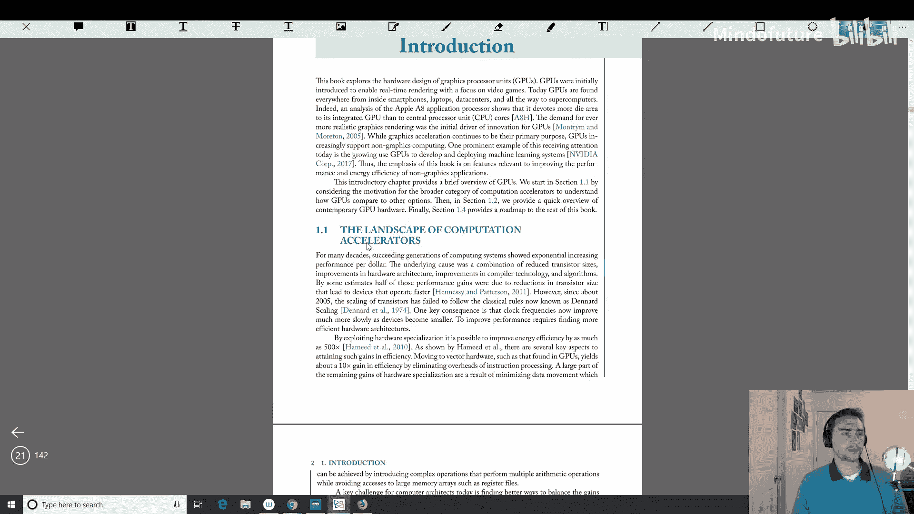
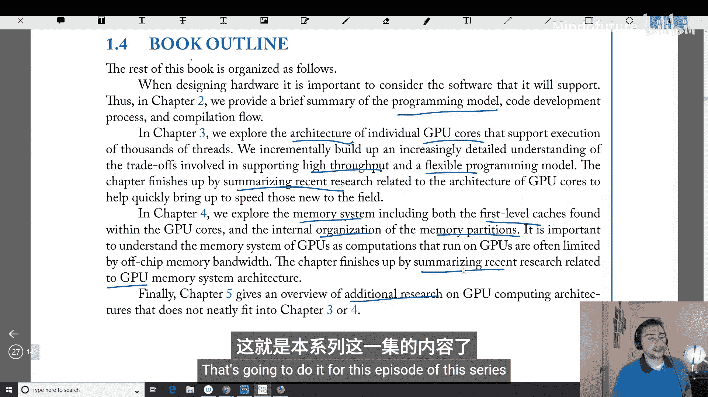

# 001：引言 🚀

在本节课中，我们将介绍本系列将要学习的书籍《通用GPU架构》，并深入探讨GPU的非图形计算方面。这是计算机架构合成讲座的一部分，其中包含许多优秀内容。

## 概述

我们将探讨GPU架构的基础知识。许多人熟悉GPU，但关于其底层架构的优秀参考资料并不多。首先，我们需要思考GPU兴起的背景，以及它们在机器学习等工作负载中备受关注的原因。同时，我们也会探讨GPU是否会取代CPU的问题。

## 背景：并行时代的到来

上一节我们提到了GPU兴起的背景，本节中我们来看看推动这一转变的具体技术因素。

2005年左右，一个重要的变化发生了：登纳德缩放定律开始失效。登纳德缩放定律是我们依赖以获得代际性能提升的关键，它关系到我们能否在电压减半的同时使频率翻倍。但到了2005年左右，频率提升变得异常困难，我们遇到了所谓的“功耗墙”。这个定律可以追溯到1974年。

当晶体管难以继续缩小、时钟频率难以提升时，我们该怎么办？一个重要的方法是利用并行性。CPU主要利用指令级并行性，即通过重排序缓冲区等技术找出指令间的依赖关系，发掘固有的并行性。但并行性存在于不同层面，例如数据级并行性和任务级并行性。

因此，我们进入了并行时代。大约在2005年，多核处理器开始兴起，并成为当今的主流趋势，每代处理器的核心数量都在增加。

## 能效与向量硬件

上一节我们讨论了并行性的重要性，本节中我们来看看如何通过硬件设计来提升能效。

2010年左右，如果我们无法提升时钟频率，如何满足新硬件对能效的需求？很大程度上依赖于转向向量硬件，即进行并行计算。即使是CPU也集成了向量硬件，例如MMX扩展和SSE硬件，它们专门用于协助并行计算。

GPU是这种并行计算的绝佳来源，它们是大规模并行处理器。然而，提升性能不仅仅是发掘固有的并行性，另一个关键点是**最小化数据移动**。如果我们有大量需要处理的数据，而缓存和内存容量有限，我们就需要确保数据在正确的时间出现在正确的位置。

## 架构师的挑战：专用性与灵活性

计算机架构师面临的一个关键挑战是：如何在利用专用硬件带来的效率增益与支持广泛程序所需的灵活性之间取得平衡。我们不仅需要设计出非常快的硬件，还不能在出现需要加速的新应用时就将其淘汰，即使新应用与旧应用略有不同。

但这并不意味着专用硬件会消失。一个典型的例子是谷歌的张量处理单元，它是谷歌的机器学习加速器，在矩阵乘法等任务上表现出色。然而，与TPU等专用硬件相比，GPU有一个有趣的特点：GPU是图灵完备的，或者说拥有图灵完备的编程模型。这意味着GPU可以运行任意应用程序，而TPU等则限制更多。因此，GPU更加灵活。当新一代应用出现时，它不需要新的硬件，因为GPU足够通用，可以运行与之前模型显著不同的新模型。TPU则远不如GPU灵活。

这里存在一个权衡。因为GPU更灵活，所以在某些特定任务上，其性能肯定不如TPU。但对于能够充分利用GPU硬件的软件，GPU的效率可以比CPU高出一个数量级。不过，这并不意味着所有任务在GPU上都会表现更好，我们稍后会详细讨论这一点。

## GPU硬件基础

那么，GPU会完全取代CPU吗？答案很可能是否定的。从根本上说，GPU和CPU做的是两件不同的事，它们为不同的目标进行了优化。

一个常见的类比是：CPU像跑车，速度非常快，但可能只能载两个人；GPU像巴士，速度相对较慢，但可以载20或30人。它们从根本上用于不同的任务。

如果我们有高度串行、依赖关系复杂、控制流复杂的代码，CPU可能是最佳选择。而对于那些依赖关系少、可以并行运行的大量任务，GPU通常是更好的选择。例如，线性代数运算在GPU上表现就非常出色。

因此，GPU更多地被视为协处理器，而非CPU的替代品。通常的模式是，CPU启动GPU上的工作，然后管理数据传输。GPU通常有自己的内存，你需要显式地将数据复制到GPU的本地内存，或者使用某种统一内存管理接口。GPU的内存与CPU的内存物理上是分开的。

## CPU与GPU的分工

另一个GPU与CPU分离的重要原因是，有些任务从根本上更适合在CPU上执行。其中之一是与I/O设备交互。例如，从文件读取数据到GPU。从CPU的角度看，这很合理，因为我们通常在单线程中工作，可以打开文件并读取其内容。而在GPU上，我们通常从大量线程集合的角度思考问题。让GPU上的1000个线程都去打开同一个文件，这种想法是奇怪且不合理的。不过，已经有大量研究致力于为GPU提供文件系统支持，以及寻找更合理的方式让GPU直接进行I/O操作，例如将所有线程的请求合并为一个打开文件的请求。

## 典型的CPU-GPU系统设计

既然CPU不会消失，那么典型的CPU-GPU系统设计是怎样的呢？主要有两种类型。

第一种可能是最常见或最熟悉的：CPU及其关联的内存，以及GPU及其图形内存。GPU的本地内存通过某种总线与CPU连接。在很多情况下，GPU通过PCI Express总线连接到CPU。

另一种方式是CPU和GPU集成在一起，例如AMD的APU模型。这里提到的GPU并非指英特尔芯片上的集成显卡，而是特指APU中集成的更强大的GPU。特别是在共享同一物理内存方面，这变得非常有趣，尤其是在内存管理方面，如果你希望CPU和GPU可能访问相同的数据。

通常，我们称左边的为独立GPU，右边的为集成GPU。右边的设计典型如AMD的Bristol Ridge APU或移动GPU。高通的移动GPU称为Adreno GPU。

## 内存类型的差异

在考虑内存时，并非所有内存都是相同的。CPU的DRAM通常针对低延迟访问进行优化，而GPU的DRAM则针对高吞吐量进行优化。因此，在规格表中，你会看到CPU使用DDR4内存，而最新的GPU则使用GDDR内存，后者专门为图形和高带宽设计。对于低功耗移动设备，还有针对低功耗优化的DRAM。

## 执行流程

那么，在这些模型中的实际执行流程是怎样的呢？目前，一切从CPU开始。就像任何普通的C应用程序一样，你编译一个应用程序并在CPU上执行它。

通常，CPU上的部分负责调用一些GPU库来在GPU上分配内存。很多时候，你需要在CPU上分配内存，然后将其复制到GPU上分配的内存中。因此，这里存在数据复制。这对于APU架构或集成在同一芯片上、共享内存的情况来说，是一个有趣的研究领域，因为可能不需要这种复制。

CPU部分的应用协调数据的移动。很多时候，你需要显式地进行内存复制。但也有大量研究致力于实现数据的自动传输和GPU与CPU之间的实际分页，这最初是在英伟达的Pascal架构中引入的。

这是通过虚拟内存处理的，通常也称为统一内存，即你看到一个统一的地址空间。在集成在同一芯片上的系统中，有趣之处在于，你不需要程序员控制从CPU内存到GPU内存的复制。然而，在集成系统上直接共享内存会带来一些更微妙的问题，这通常与缓存一致性有关。当涉及GPU上许多线程同时访问许多数据时，缓存一致性会变得相当混乱。

## GPU工作启动与内核

当然，在完成内存管理之后，我们必须告诉GPU执行某些操作。这通常通过驱动程序完成。GPU必须知道要做什么，因此你必须指定要运行的代码。我们通常将其称为**内核**。不要与Linux内核混淆，你可以将其想象为：你有一个主要应用程序，其中有一个执行大量操作的大外层循环，而在内部，你有一个计算密集的内层循环，你希望对其进行优化。这个程序的核心部分就是你希望加速并利用其并行性的部分，因此我们称之为内核。它只是程序中你希望利用其并行性的一小部分。

除了指定运行什么代码，你还需要指定其他事项，例如线程数量。与Linux系统上可能生成10或12个线程不同，在GPU上，我们通常谈论的是启动数千到数万个线程。当然，你还需要指定在GPU上分配的数据位于何处。

驱动程序必须进行大量的转换和管理工作，将其翻译并放置到GPU可访问的位置，以便GPU知道需要检查哪个位置以获取数据。然后，驱动程序还必须告诉GPU有新的工作需要完成，即CPU分配给它的任务。

## 现代GPU核心架构

现在我们已经了解了整体系统视图，让我们更深入地探讨现代GPU本身。我们将主要用两个不同的名称来指代它们：在英伟达，这些核心被称为**流式多处理器**；在AMD，它们被称为**计算单元**。这两个名称指的是非常相似，甚至几乎相同的东西。

GPU有不同的执行模型，即**SIMT**执行模型，它代表单指令多线程。我们将有一条指令，例如加法指令，但32个线程将在各自的数据上执行加法操作，或者按照它们对数组的索引方式执行。

GPU上的每个核心通常可以运行大约1000个线程，一般是1024个线程。在单个核心上执行的线程可以通过暂存器内存进行通信，并使用快速屏障操作进行同步。在核心内部，通常有一种称为暂存器内存的东西，在英伟达GPU中称为共享内存。你可以将其视为用户管理的缓存。如果你确切知道需要什么数据，并且希望获得最佳局部性，你可以直接将其加载进来，而不必担心它被其他请求逐出。

当然，它还有其他组件，例如指令和数据缓存，它们主要充当带宽过滤器。因为有如此多的线程同时运行，你不能持续地冲击内存系统。如果压力过大，任何系统都无法良好工作。因此，通过拥有缓存，它们或多或少起到了过滤器的作用。

在核心上运行的大量线程用于隐藏访问内存的延迟。与CPU相比，这是GPU的一个基本部分。因为GPU有如此多的线程和如此多的工作可供选择，即使需要访问内存获取数据，由于我们有成千上万的线程，我们实际上可以隐藏部分延迟，虽然不是全部，但可以做得相当不错。

## GPU的布局与高计算吞吐量

让我们看看GPU的一般布局。通常，我们会有一个流式多处理器核心集群，几个核心通过某种互连网络分组在一起。它们会被分配给一个特定的内存分区，该分区对应物理内存的特定部分。由于这里有互连，我们仍然可以访问所有内存，但这些分区将物理内存分割开来。

那么，我们如何维持高计算吞吐量呢？为了维持高计算吞吐量，还必须与高内存带宽相平衡。理解我们不仅可以并行处理大量任务，还要如何与GPU架构的其他层级（尤其是内存系统）相平衡，这一点非常重要。

在GPU中，这种并行性是通过包含多个内存通道提供的。通过拥有多个内存通道，我们获得了更高的内存带宽，这不仅是因为我们使用了GDDR而不是DDR。正如我们所说，这与最后一级缓存的一部分相关联，在当今的GPU中，这就是L2缓存。在英伟达GPU中，会有L1缓存、L2缓存，然后是内存通道和后备内存。

这并不是说没有其他可能的组织方式，例如英特尔的Xeon Phi，它直接与GPU竞争超级计算市场，它将最后一级缓存与核心分布在一起。

## GPU与CPU性能对比

当谈论CPU时，我们当然是在与最先进的技术进行公平比较，即高度并行工作负载上的超标量乱序执行CPU。GPU往往胜出的原因是，GPU的很大一部分面积用于算术逻辑单元，而用于控制逻辑的面积较少。需要记住的是，GPU没有分支预测等功能，也没有乱序执行。与CPU相比，GPU要简单得多。但它们以拥有极端数量的ALU来换取这一点，远超传统CPU。

但最重要的是要记住，存在一个平衡点，有些区域多核CPU表现更好，而有些区域大规模多线程的GPU表现更好。从这张图中我们可以清楚地看到，这里有一个多核区域。当我们开始增加线程数量时，会看到这里有一个下降。这个下降点代表了我们需要理解的权衡：CPU拥有非常高的频率、出色的串行处理能力、推测执行、分支预测和更高的时钟频率；而如果我们有大规模多线程数据，我们真正关心的是计算密度，我们只需要ALU，像分支预测这样的功能对我们帮助不大。但这里存在一个区域，即这个低谷，在这个区域中，CPU上利用指令级并行性的传统方法无法给我们带来更多性能，而我们拥有的线程数量又超过了CPU能有效支持的范围，但还没有达到大规模多线程的程度。如果将其放在GPU上，我们无法很好地利用可用带宽。因此，我们必须意识到这个低谷的存在，并决定如果我们处于这个低谷，是否应该通过某种方式优化代码，使其更适合CPU，或者它确实是并行的，我们只需要更努力地将其推向右侧，启动数百万个线程，真正利用其并行性。这些都是我们需要思考的问题。

在CPU上，我们会增加线程到一定程度，但缓存无法再支持这么多线程。每个线程最终都会破坏其他线程的缓存。因此，我们看到了性能下降。所以，根据平台的不同，并行性并不总是好事。同样，由于没有足够的线程，我们无法很好地隐藏片外延迟。

## 能效考量

随着登纳德缩放定律的终结，能效当然是当今市场的一大驱动力，有许多研究致力于设计更节能的方案。我们当然也不希望访问消耗大量能量的非常大的内存结构。因此，在谈论GPU和数千个线程时，我们必须考虑到这一点。在实际建模中，许多研究人员使用一个名为GPGPU-Sim的模拟器，它包含一个名为GPUWatch的能耗模型。

我们可以看到，在进行操作时，例如加法，只需要极少的皮焦耳能量；甚至从32KB SRAM访问32位数据也只需要大约5皮焦耳。但是，当我们从DRAM访问32字节数据时，突然需要640皮焦耳，大约是加法操作所需能量的64000倍。这确实会累积起来。因此，这强调了我们对功耗的担忧，尤其是对数据移动的担忧，特别是需要访问DRAM时。

## GPU的历史背景

当然，我们应该谈谈GPU的背景，GPU并非凭空出现，它们有历史。早在20世纪60年代，计算机和计算机图形学刚刚兴起时，GPU就开始起步。早期GPU的许多驱动因素当然是动画渲染。

早期的显卡始于IBM的单色显示适配器，它只支持文本。然后我们逐渐发展到2D和3D加速。在谈论早期3D技术时，记住英伟达的GeForce 256总是很重要的。然而，最终我们开始通过顶点着色器和像素着色器为GPU提供一些可编程性，这更多是图形方面的内容。

当时的人们非常聪明，他们说：“我有这个并行硬件，为什么不尝试用它做些不同的事情呢？如果我不太关心图形呢？”于是，人们找到了非常有趣的方法，将线性代数映射到着色器上，将矩阵数据映射到纹理中并应用着色器，基本上是利用图形处理器进行通用计算。我们谈论的不是通用GPU的时代，而是严格的图形处理器时代。人们找到了一些巧妙的方法开始在其上进行线性代数等运算。

这真正推动了市场。人们如此广泛地进行这种操作，以至于像英伟达这样的公司表示：“如果你们想要这个，我们非常乐意提供。”例如，最终在GeForce 8系列中，出现了一些创新，例如能够从着色器写入任意内存地址以及暂存器内存。我们开始释放内存系统。然后在Fermi架构中启用了读写数据的缓存，现在我们开始接近更现代的架构。

还有其他创新，例如AMD的Fusion架构，将CPU和GPU集成在同一芯片上，并实现动态并行性，例如GPU自身启动工作。通常我们讨论的是CPU启动GPU上的工作，但如果GPU在某些情况下可以启动自己的工作呢？当然，最近引入并在Turing架构中进一步优化的功能包括张量核心，专门针对特定的非图形相关加速。

## 本系列后续内容

那么，在本系列中我们还将涵盖哪些内容呢？如果我们打算使用GPU，我们必须知道GPU运行什么。我有另一个专门关于CUDA编程的系列，但我们也将在本系列中详细讨论编程模型，不仅针对英伟达GPU，也针对AMD GPU，我们会发现它们非常相似，即使它们的语言差异很大。

当然，然后我们必须深入探讨真正酷的部分，即探索架构。具体来说，首先是GPU核心及其如何执行数千个线程。然后我们需要了解如何构建这种架构以提供高吞吐量和灵活的编程模型。我们还将介绍一些与GPU架构相关的最新研究，特别是针对核心本身的研究。

之后，在第4章中，我们将讨论GPU内存系统，主要是核心内的缓存，例如GPU核心内的L1缓存，以及一些更内部的组织结构，内存分区。当然，就像讨论核心一样，我们将总结一些与GPU架构相关的最新研究。

最后，我们将讨论一些当代的研究问题，以及我在GPU架构方面的工作，以及当前GPU架构领域人们正在关注的一些重大未解决问题。

本节课中我们一起学习了GPU架构的引言部分，包括其历史背景、基本概念、与CPU的对比、系统设计以及本系列后续内容的概览。