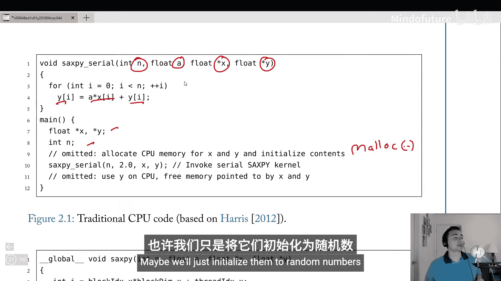
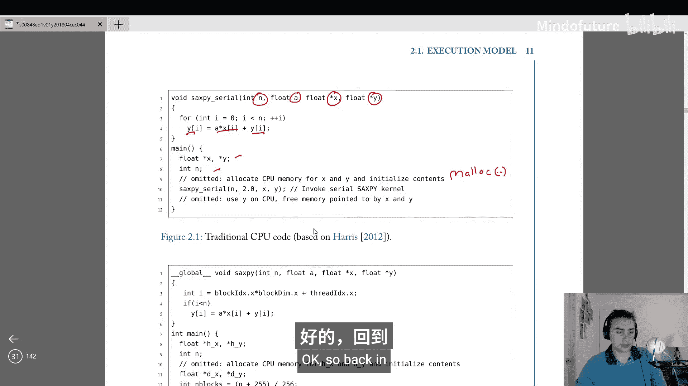
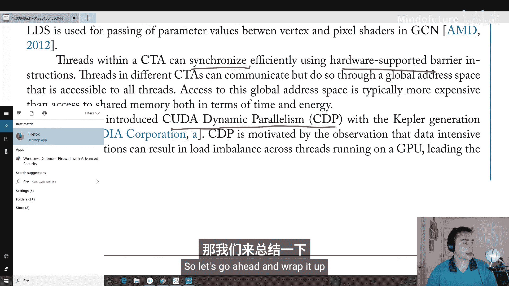
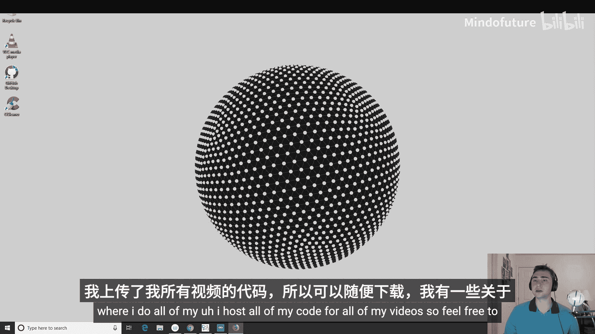
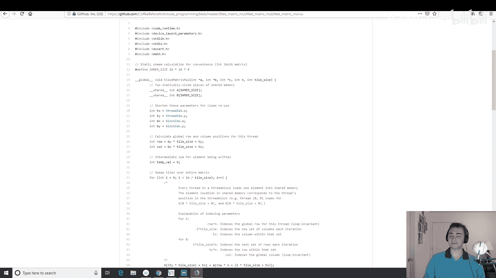

# 002：编程模型（第一部分） 🚀

在本节课中，我们将深入探讨GPU的编程模型。理解编程模型是学习GPU硬件架构的基础，因为编程方式直接依赖于底层硬件，而硬件设计也受到编程方式的影响。我们将从基础概念开始，逐步了解如何编写GPU程序。

## 概述

上一节我们从宏观视角了解了GPU的基本概念和历史。本节我们将聚焦于GPU的编程模型，学习如何通过API（如CUDA和OpenCL）来利用GPU的大规模并行计算能力。

## 执行模型基础

GPU采用宽SIMD（单指令多数据）硬件来挖掘应用程序中的数据级并行性。这意味着我们可以同时对不同的数据片段进行操作，因为它们之间没有依赖关系。

然而，我们实际上是通过CUDA（NVIDIA）或OpenCL（AMD）等API来编程这些硬件的。它们提供了一种类似MIMD（多指令多数据）的编程模型，允许程序员向GPU启动大量标量线程。

每个标量线程都可以遵循独立的执行路径。但在运行时，这些线程并非完全独立调度。它们被分组为**线程束**（NVIDIA称Warp，含32线程）或**波前**（AMD称Wavefront，含64线程），这些组内的线程以锁步方式执行相同操作。这种执行模型称为SIMT（单指令多线程）。

在SIMT模型下，我们仍可以拥有标量线程的视角，但需要通过**活动掩码**来指定线程束中哪些线程在某一时刻是活跃的。因此，编程时应考虑整个线程束在同时做什么，尽量避免**线程束分化**，即同一线程束内的线程执行不同操作。





## GPU程序执行流程

一切始于CPU。CPU负责启动GPU代码的执行。

对于**独立GPU**（拥有独立显存），典型流程如下：
1.  **分配GPU内存**：使用类似 `cudaMalloc` 的函数在GPU上分配内存。
2.  **数据传输**：由于内存物理分离，需要使用 `cudaMemcpy` 等函数将数据从CPU内存复制到GPU内存。
3.  **启动内核**：告知GPU要执行哪个内核函数。

对于**集成GPU**（与CPU共享物理内存，常见于移动设备或AMD APU），由于内存共享，无需单独分配和复制内存，只需直接启动内核。

## 内核与线程组织

内核通常由成千上万个线程组成。每个线程执行相同的程序，但可以有不同的控制流（例如，通过if-else语句）。

程序员通过定义**网格**和**线程块**来组织这些线程。
*   **线程块**：线程的集合。有维度限制，会被调度到GPU的流多处理器上执行。
*   **网格**：所有线程块的集合。

为了充分利用GPU，我们通常需要启动大量线程。线程块在幕后会被分解为线程束或波前，但程序员看到的是线程块和网格。

以下是如何计算需要启动的线程块数量的一个例子。假设每个线程块有256个线程，要处理 `n` 个元素：
```c
int numBlocks = (n + 255) / 256;
```
这里 `(n + 255) / 256` 确保了即使 `n` 不是256的整数倍，我们也能启动足够多的线程块来覆盖所有元素，多余的线程可以通过条件判断使其不工作。

内核启动使用三重尖括号语法指定网格大小（线程块数量）和块大小（每个线程块的线程数）：
```c
saxpy<<<numBlocks, 256>>>(n, 2.0, d_x, d_y);
```

## SAXPY示例：从串行到并行

SAXPY是一个基础线性代数运算：`Y = a * X + Y`。我们通过它来对比CPU串行和GPU并行编程。

**CPU串行版本**核心是一个循环：
```c
for (int i = 0; i < n; i++) {
    y[i] = a * x[i] + y[i];
}
```

**GPU并行版本**的核心是内核函数。它没有循环，每个线程根据其全局索引处理一个数据元素：
```c
__global__ void saxpy(int n, float a, float *x, float *y) {
    int i = blockIdx.x * blockDim.x + threadIdx.x;
    if (i < n) {
        y[i] = a * x[i] + y[i];
    }
}
```
*   `__global__` 声明这是一个由CPU调用、在GPU上执行的函数（内核）。
*   `blockIdx.x`：当前线程块在网格x维度的索引。
*   `blockDim.x`：每个线程块在x维度的线程数（即块大小）。
*   `threadIdx.x`：当前线程在线程块x维度的索引。
*   `int i`：计算出的当前线程的全局索引，用于对应要处理的数据元素。
*   `if (i < n)`：防止为凑整而启动的多余线程访问越界内存。

## 性能优化概念

GPU编程中，程序员可以进行一些手动优化以提升性能。

**共享内存/局部数据存储**：GPU拥有速度极快的片上内存，NVIDIA称为共享内存，AMD称为局部数据存储。这是一种程序员可管理的**暂存器内存**。如果程序员能预知哪些数据会被频繁重用，可以手动将这些数据加载到共享内存中，从而获得极低的访问延迟（约几个时钟周期）。这类似于一个用户管理的L1缓存。

**线程块内同步**：在同一个线程块（或称为协作线程数组CTA）内，线程可以通过 `__syncthreads()` 这样的屏障操作进行同步。所有线程必须到达这个同步点，才能继续执行。这在协同使用共享内存时非常必要。

**动态并行**：NVIDIA的CUDA动态并行特性允许GPU内核在运行时启动新的内核，而不仅仅依赖于CPU来启动工作，这增加了编程的灵活性。

## 总结

本节课我们一起学习了GPU编程模型的基础知识。我们了解到，一个典型的GPU应用始于CPU进行内存分配和数据传输。然后，我们将问题（如SAXPY）映射到一个由线程块组成的网格上。在内核中，每个线程通过内置变量计算出自己在网格中的位置，并据此处理对应的数据。此外，我们还探讨了通过共享内存进行手动数据管理以优化性能，以及线程块内同步和动态并行等高级概念。




理解这些编程模型是后续深入学习不同GPU硬件架构细节的关键。在接下来的课程中，我们将探讨GPU的指令集架构及其在不同代际间的演变。





---
*注：本教程内容基于公开的GPU编程知识整理，示例代码为概念演示。更深入的实践建议参考《Programming Massively Parallel Processors》等专业书籍或相关课程。*