# 004：SIMT核心 - 第一部分 🧠

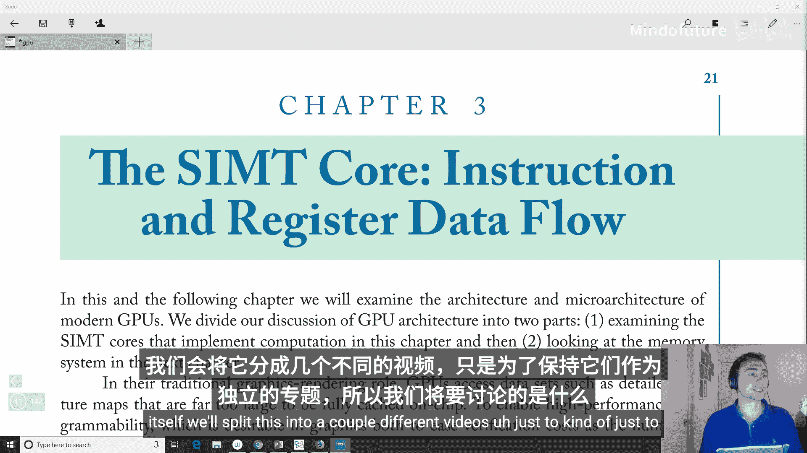

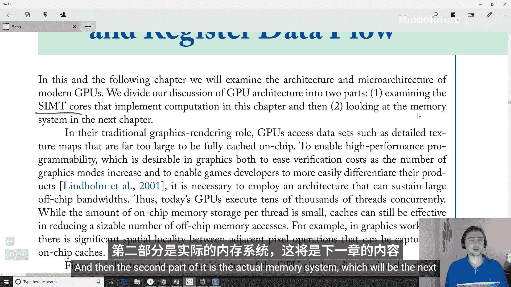

在本节课中，我们将开始探讨GPU的实际微架构，从SIMT核心入手。SIMT（单指令多线程）是GPU并行编程模型的核心硬件实现。我们将首先聚焦于SIMT核心本身，特别是其前端调度机制，而内存系统部分将留到下一章讨论。

## 概述

GPU架构源于图形处理需求，需要处理巨大的纹理贴图数据，这些数据通常无法完全放入片上缓存。为了获得高性能，GPU架构设计必须能够维持高内存带宽，因此采用了GDDR甚至HBM等高带宽内存。同时，GPU需要并发执行成千上万个线程，这对缓存设计提出了挑战，因为大量线程可能访问分散的数据，难以有效利用局部性。然而，缓存仍然有效，例如在图像模糊等图形工作负载中，像素处理具有空间局部性，缓存可以过滤流量，减轻内存系统下层的拥塞。

本章的核心是理解单个SIMT核心的工作原理，它通常分为一个SIMT前端和一个SIMD（单指令多数据）后端。其调度主要涉及三个循环：指令获取循环、指令发射循环和寄存器访问调度循环。

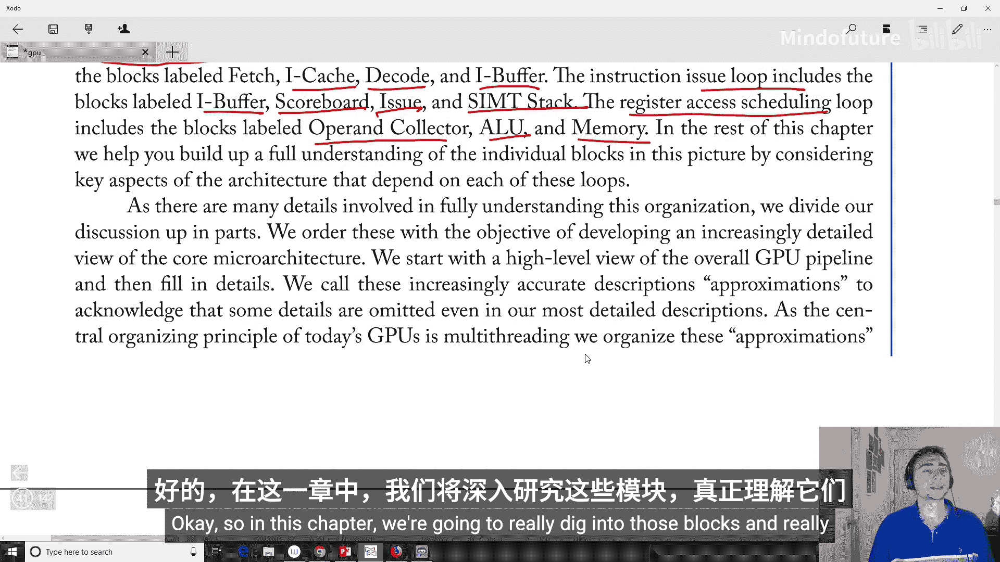

## SIMT核心组织架构

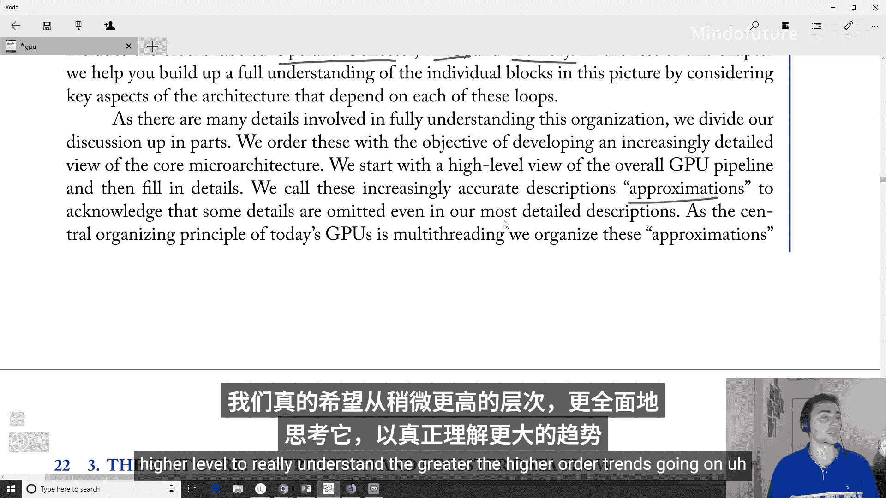

下图展示了SIMT核心的基本组织架构，清晰地划分了SIMT前端和SIMD数据通路。

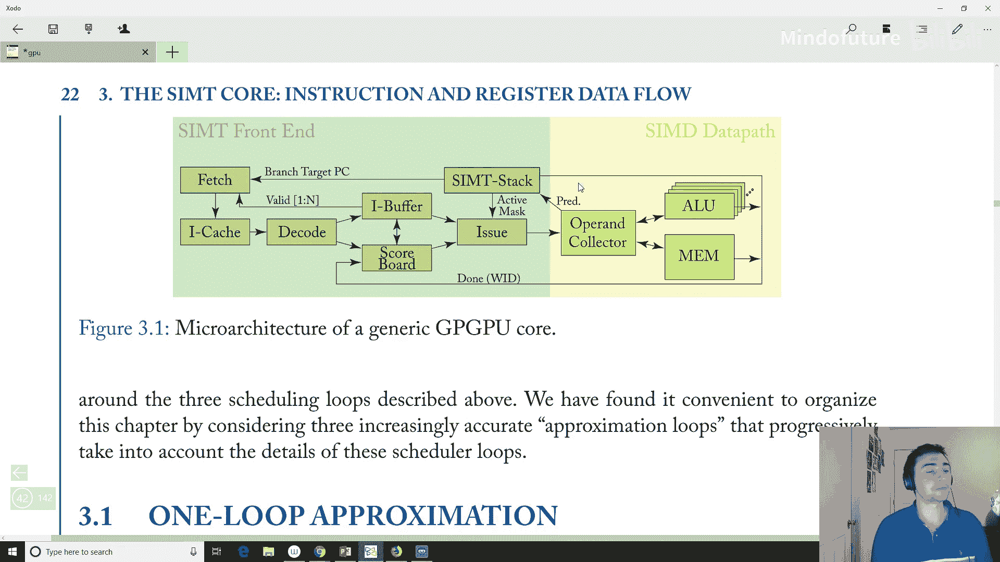

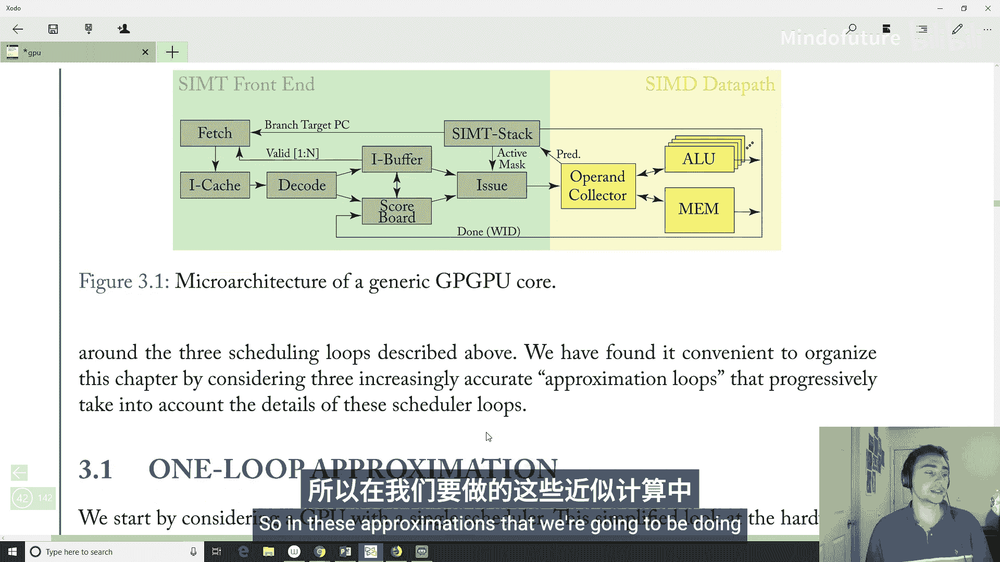

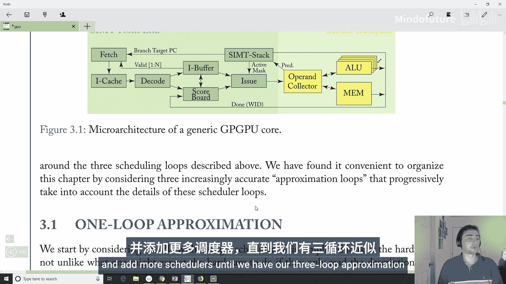


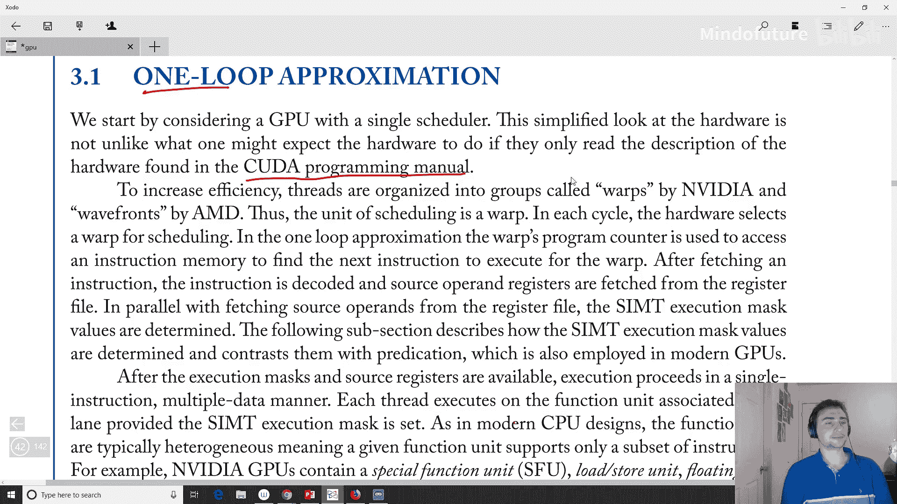

*   **SIMT前端**：包含指令缓存（I-Cache）、解码逻辑、指令缓冲区（I-Buffer）、记分牌（Scoreboard）、发射逻辑以及**SIMT堆栈**。它负责获取指令、解码、管理依赖关系，并确定每个周期哪些线程是活跃的。
*   **SIMD数据通路**：包含操作数收集器（Operand Collector）、ALU（算术逻辑单元）和内存单元（用于加载/存储操作）。操作数收集器负责调度对寄存器文件的读取，以避免端口争用，然后将数据送入执行单元。

为了由浅入深地理解，我们将采用逐步逼近的描述方式，从最简单的单循环模型开始。

## 单循环近似模型

首先，我们从一个简化的视角出发，假设只有一个调度循环在工作。这类似于CUDA编程手册中向程序员抽象出的视图，但作为架构师，我们需要关心其下的硬件细节。

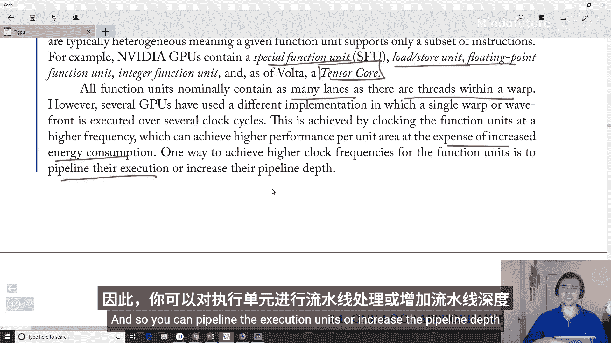

在这个模型中，调度的基本单位是**线程束**（Warp，NVIDIA）或**波前**（Wavefront，AMD），即一组（例如32或64个）始终一起执行同一条指令的线程。

以下是每个周期内发生的基本步骤：

1.  **选择线程束**：硬件从线程块包含的多个线程束中选择一个进行调度。
2.  **获取指令**：使用被选中线程束的程序计数器（PC）访问指令内存，获取下一条要执行的指令。
3.  **解码指令**：解码指令，确定其操作类型以及需要使用的源寄存器。
4.  **获取操作数**：从寄存器文件中读取源操作数的值。这一步会用到操作数收集器，我们稍后会详细讨论。
5.  **确定活跃掩码**：并行于寄存器读取，硬件需要确定当前指令的**SIMT执行掩码**。这个掩码定义了线程束中哪些线程在当前控制流路径下是活跃的、应该执行该指令。
6.  **执行指令**：在SIMD执行单元上执行指令。这些功能单元（如ALU、FPU、Tensor Core、Load/Store单元）通常是宽向量单元，宽度与线程束中的线程数匹配（例如32宽）。为了提高时钟频率和能效，这些单元也可以被设计得更窄并采用流水线化。

接下来，我们将深入探讨这个模型中最关键的部分：SIMT执行掩码和分支处理。

## SIMT执行掩码与分支处理

SIMT模型允许程序员将每个线程视为独立的标量线程，这意味着不同线程可能进入不同的控制流路径（例如，有的线程执行`if`分支，有的执行`else`分支）。硬件如何用“单指令”来处理这种“多线程”的分支行为呢？答案是**SIMT执行掩码**和**SIMT堆栈**的组合。

现代GPU并非单纯依靠谓词（Predication）来实现，而是结合了传统谓词和**SIMT堆栈**来高效处理两个关键问题：嵌套控制流和完全跳过某些线程不执行的控制流路径。

为了说明这一点，让我们看一个具体的例子。考虑以下CUDA代码片段及其对应的PTX虚拟指令集表示：

```c
// CUDA C 示例
do {
    // 块 A
    t1 = ...; t2 = ...; t3 = load(...); t4 = 0;
    if (t3 != t4) { // 外层 if-else
        // 块 B
        t5 = load(...);
        if (...) { // 内层 if-else
            // 块 C
            x += ...;
        } else {
            // 块 D
            y += ...;
        }
        // 块 E
        i++;
    } else {
        // 块 F
        z += 3;
    }
    // 块 G
} while (i < n);
```

在CPU上，单个线程会顺序执行并做出分支决策。但在GPU上，一个包含4个线程的线程束会以锁步方式开始执行块A中的所有指令。当遇到外层 `if (t3 != t4)` 时，问题就出现了：可能只有部分线程的条件为真，需要进入块B，而其他线程需要进入块F。

硬件通过SIMT执行掩码来标记哪些线程是活跃的。例如，进入外层if时，掩码可能变为 `1110`（假设第4个线程条件为假）。只有掩码为‘1’的线程会执行块B中的指令。当这些活跃线程再遇到内层if时，掩码可能会进一步分裂，例如变为 `1100`。

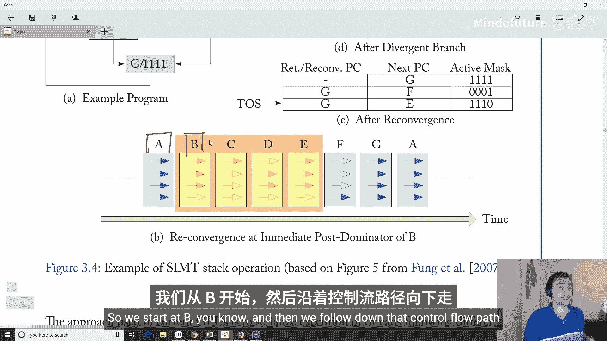

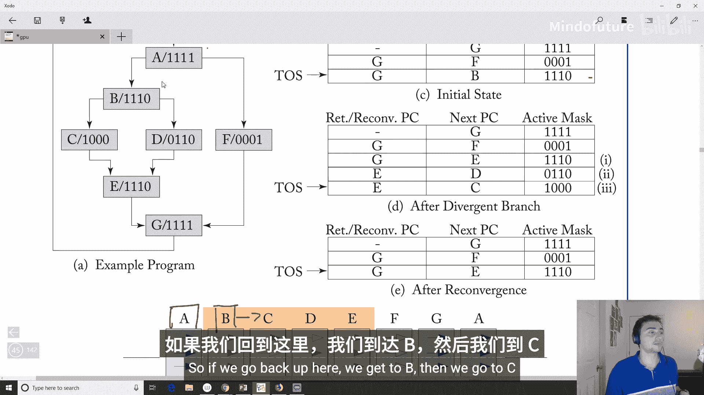

**重新汇聚点**是控制流分裂后，所有线程能够再次保证以锁步方式一起执行的位置。通常，这是引起分支的指令的**直接后支配节点**。在上例中，块E是内层if-else的重新汇聚点，块G是外层if-else的重新汇聚点。

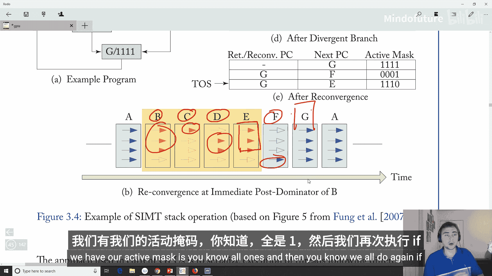

## SIMT堆栈工作原理

SIMT堆栈是管理这种掩码分裂与重新汇聚的核心硬件结构。堆栈中的每个条目通常包含：一个**重新汇聚PC**（即所有线程应重新汇合后继续执行的地址）和一个**活跃掩码**（表示哪些线程属于该条目的控制流路径）。

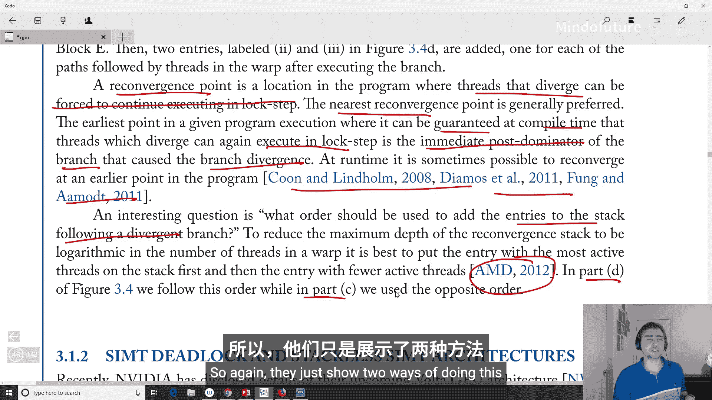

以下是处理流程：

1.  **初始状态**：所有线程活跃，执行块A。遇到外层分支时，创建两个堆栈条目，分别对应路径B（掩码`1110`，重新汇聚于G）和路径F（掩码`0001`，重新汇聚于G）。通常，硬件会先执行活跃线程数多的路径（多数路径优先）。
2.  **执行与嵌套**：假设先执行路径B（PC指向B，掩码`1110`）。执行到内层分支时，再次分裂。当前栈顶条目（对应路径B）的重新汇聚点G被保留，然后为新的内层分支创建两个新条目，例如路径C（掩码`1000`，重新汇聚于E）和路径D（掩码`0110`，重新汇聚于E）。
3.  **重新汇聚**：硬件执行当前栈顶条目（例如路径C）。当执行到其重新汇聚点E时，弹出该栈顶条目。然后，下一个栈顶条目（路径D）变为当前执行路径。执行完路径D并到达重新汇聚点E后，再次弹出。此时，栈顶又回到了外层路径B的条目，但其PC现在指向了重新汇聚点E之后（即块E内的指令）。继续执行直到到达该条目的重新汇聚点G。
4.  **执行另一路径**：到达G后，弹出路径B的条目。现在栈顶是路径F的条目，开始执行路径F（掩码`0001`）。执行完后到达重新汇聚点G，弹出该条目。此时堆栈为空，所有线程再次完全汇聚，继续执行块G之后的代码（如`while`循环判断）。

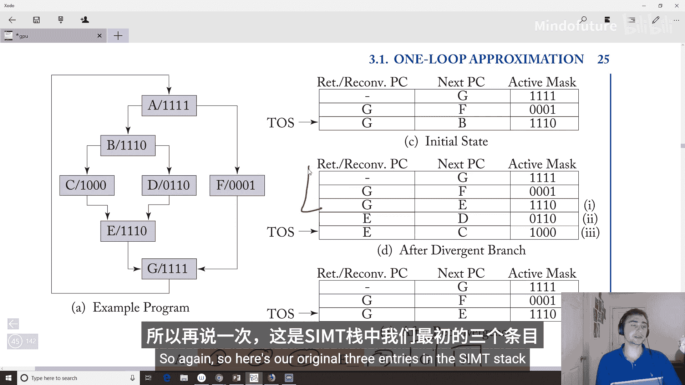

通过这种堆栈机制，GPU以串行化的方式执行了不同的控制流路径，同时在程序员视角下，每个线程仍然保持了独立的控制流逻辑。

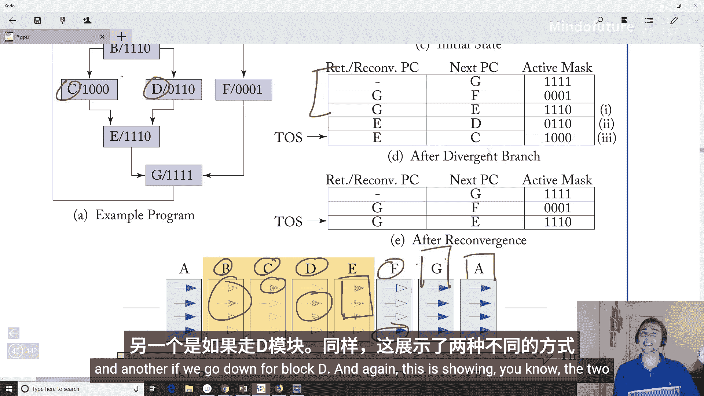

## 总结

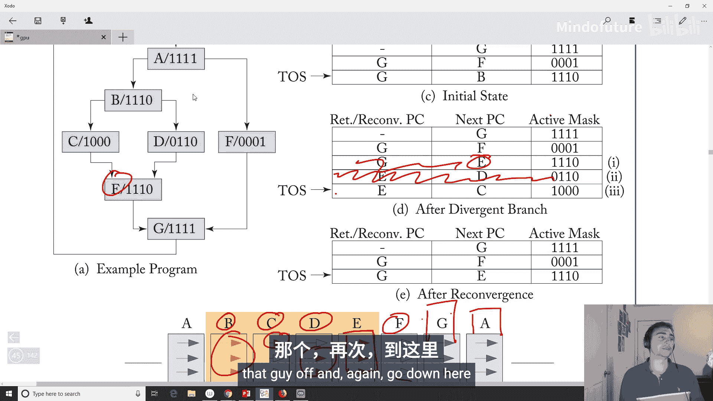

本节课我们一起学习了GPU SIMT核心架构的第一部分。我们首先概述了SIMT核心的整体组织，将其分为负责取指、解码和线程调度的前端，以及负责数据计算和存取的后端。然后，我们通过一个简化的单循环模型，介绍了线程束调度的基本步骤。

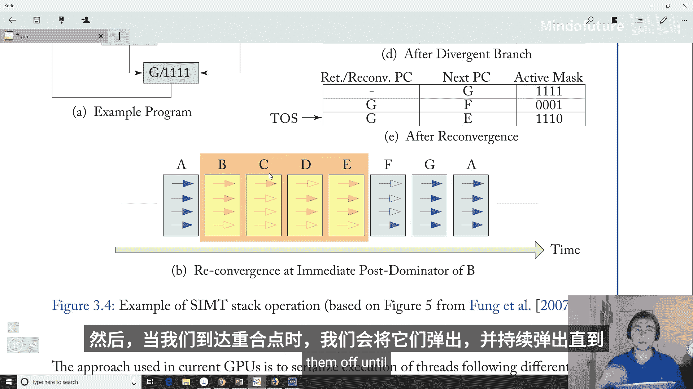

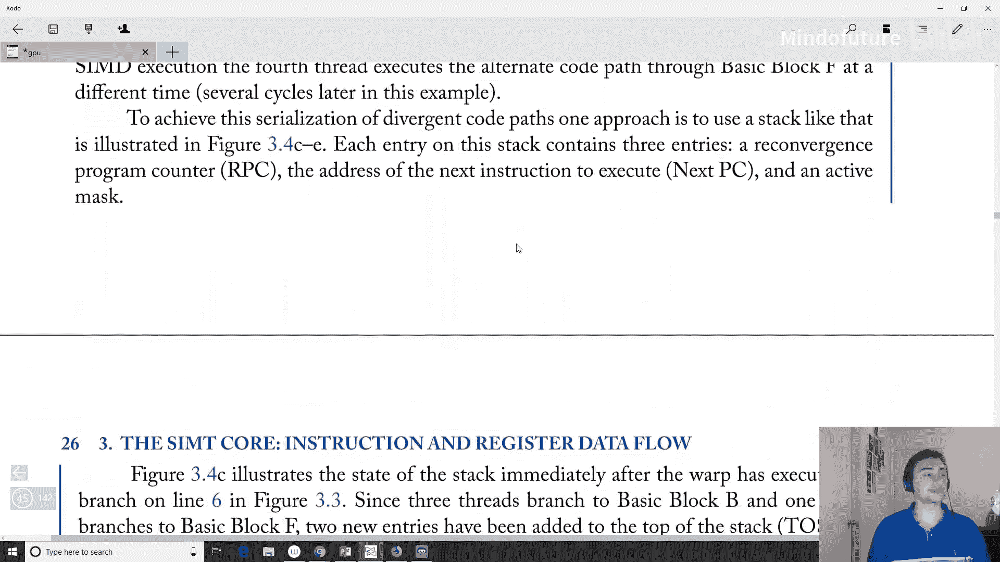

本章的重点是理解了GPU如何处理线程级分支。我们探讨了**SIMT执行掩码**的关键作用，它标识了线程束中哪些线程在当前指令下是活跃的。更重要的是，我们深入分析了**SIMT堆栈**的工作原理，它是硬件管理控制流分裂与重新汇聚的核心机制，通过维护重新汇聚点和活跃掩码，使得以锁步方式执行的硬件能够高效地模拟出独立线程的复杂分支行为。

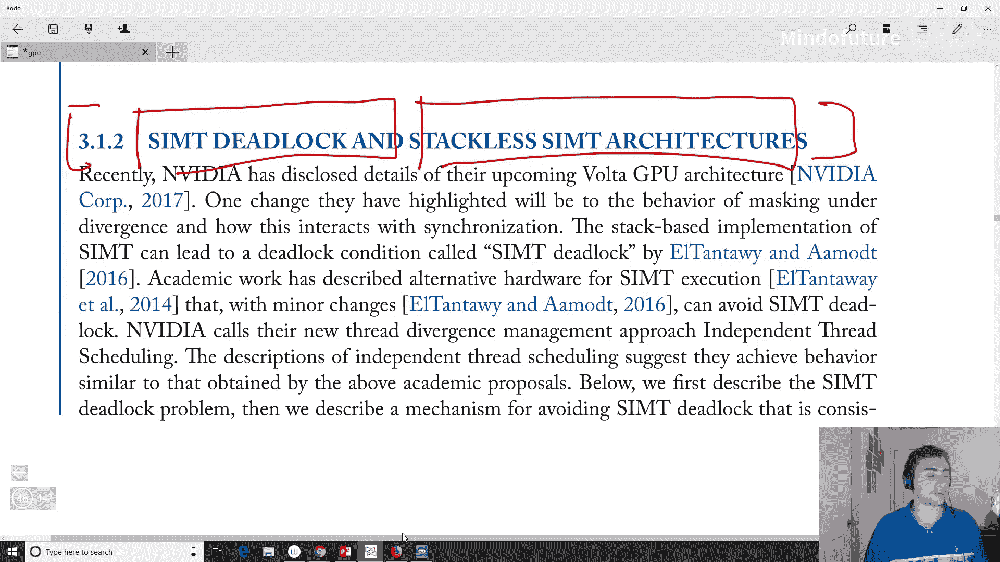


在下一章中，我们将继续探讨SIMT核心的其他调度循环，并深入了解内存系统。同时，我们也会简要提及现代架构中关于SIMT死锁和无需堆栈的SIMT架构等更高级的话题。