# 006：双循环近似 🚀

在本节课中，我们将要学习GPU核心架构的“双循环近似”模型。上一节我们介绍了单循环近似，它基于程序员的视角，通过多个线程束的切换来隐藏长延迟指令。本节中，我们将通过引入指令级依赖跟踪，来改进我们对底层GPU架构的理解，从而减少隐藏延迟所需的线程束数量，并允许从同一线程束中发射多条指令。

## 单循环近似的局限性

单循环近似模型的核心是线程束调度器根据程序计数器选择下一个要发射指令的线程束。然而，这个模型存在一个关键问题：它**没有跟踪指令间的数据依赖关系**。

这意味着，在单循环近似中，我们必须等待一个线程束的当前指令执行完毕，才能从该线程束发射下一条指令。因为调度器不知道下一条指令是否依赖于前一条指令的结果。

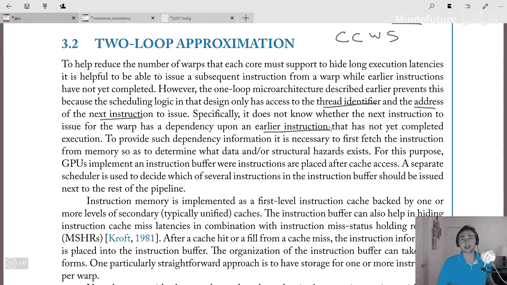

这导致了一个问题：为了隐藏长延迟指令（例如访存操作），我们必须在单个核心上维持**大量活跃的线程束**，以便在某个线程束等待时，调度器可以切换到其他线程束。虽然GPU本身是海量多线程的，但为每个线程束保存大量状态（如寄存器、程序计数器等）会消耗巨大的芯片面积和功耗。

## 双循环近似的核心思想

双循环近似旨在解决上述问题。其核心思想是：**如果我们能跟踪指令间的依赖关系，就可以用更少的线程束来隐藏延迟，并允许从同一线程束中发射多条指令**。我们只需要确保在发射指令前，其所有依赖都已满足。

为了实现这一点，GPU引入了**指令缓冲区**和**独立的指令调度器**。

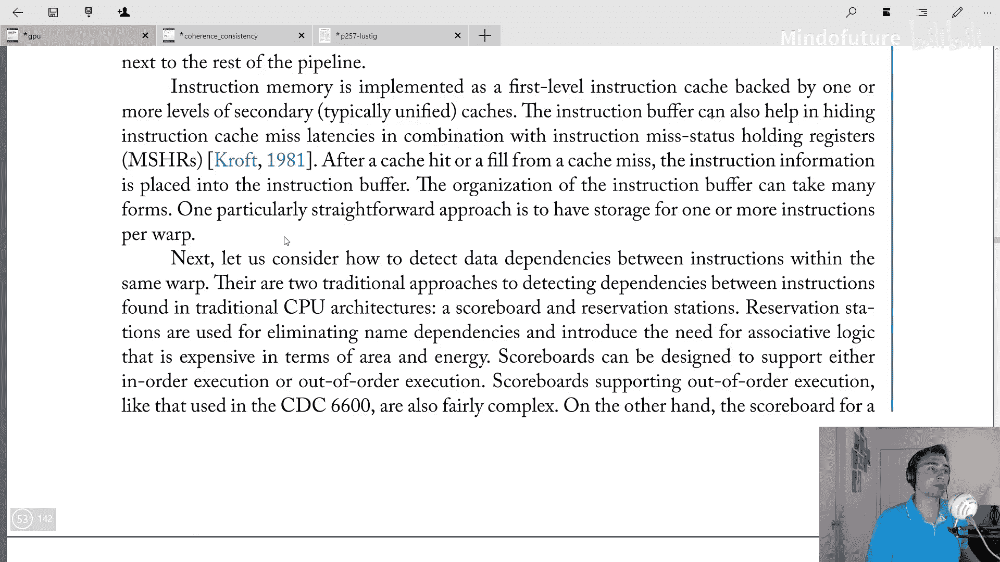

*   **指令缓冲区**：从指令缓存获取的指令会先存放在这里。
*   **指令调度器**：负责检查指令缓冲区中的指令，判断哪些指令的依赖已解决，从而可以发射到流水线的后续阶段。

指令内存通常由一级指令缓存和更高级别的统一缓存支持。指令缓冲区有助于隐藏指令缓存未命中的延迟，可以看作是缓存层次结构中的又一层。

在缓存命中或未命中填充后，新的指令信息会被放入指令缓冲区。指令缓冲区的组织形式多样，但最直接的方法是**为每个线程束预留一个或多个指令的存储空间**。

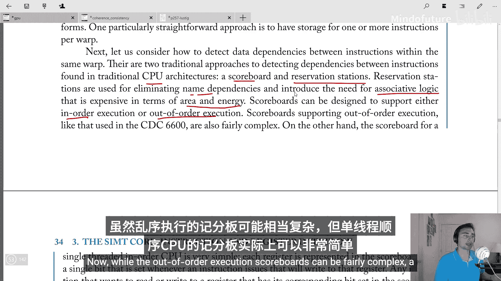

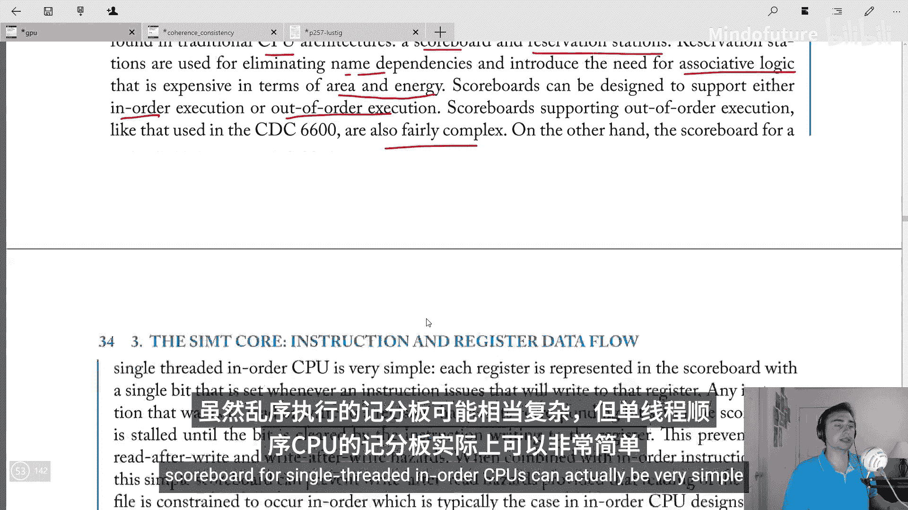

## 依赖检测：记分牌

在CPU中，检测数据依赖主要有两种经典方法：**记分牌**和**保留站**。保留站用于消除名称依赖，但需要复杂的关联逻辑，在面积和能耗上代价高昂。这对于追求极致计算密度、设计倾向于简单化的GPU来说是个问题。

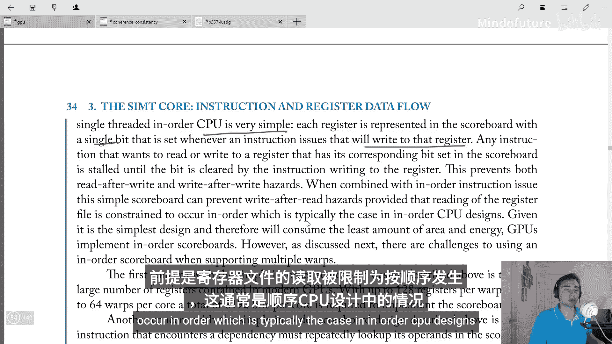

记分牌则支持有序或乱序执行。虽然乱序执行的记分牌可能很复杂，但**用于单线程有序CPU的记分牌可以设计得非常简单**。

在简单的有序记分牌中，每个寄存器由一个比特位表示。当一条将要写入该寄存器的指令发射时，对应的比特位被置位。后续指令在发射前，会检查其源操作数寄存器对应的记分牌比特位。如果比特位被置位（表示存在未完成的写操作），则指令必须等待，直到该比特位被清除（写操作完成）。这可以防止**写后读**和**写后写**冒险。结合有序发射，只要寄存器的读取是按序进行的，这种简单的记分牌也能防止**读后写**冒险。

由于其设计简单、面积和能耗低，这种方案对GPU很有吸引力。因此，GPU实现了**有序记分牌**。

## GPU实现记分牌的挑战

然而，将CPU的简单记分牌直接移植到GPU上会面临挑战，根源在于GPU的**海量多线程**特性。

以下是两个主要挑战：

1.  **巨大的状态开销**：由于海量多线程，每个线程束（32线程）可能拥有多达120个寄存器。如果一个核心支持多达64个线程束，那么实现记分牌就需要跟踪 `64 warps * 120 registers = 7680` 个比特位（约8Kb）。这本身就是一个不小的开销。
2.  **读端口爆炸**：在简单的记分牌设计中，如果指令遇到依赖，它需要不断查询记分牌以检查依赖是否解除。在单线程设计中，这复杂度尚可。但在多线程有序处理器中，来自多个线程的指令可能都在等待更早的指令完成。如果所有这些指令都必须每个周期探测记分牌，将需要大量的读端口。例如，64个线程束，每个指令最多4个操作数，如果所有线程束每个周期都探测记分牌，将需要 `64 warps * 4 operands = 256` 个读端口。这个数字非常惊人，实现成本极高。

一种简单的规避方法是限制可参与调度的线程束数量。但这又与我们利用海量多线程来隐藏延迟的初衷相悖，形成了一个矛盾。

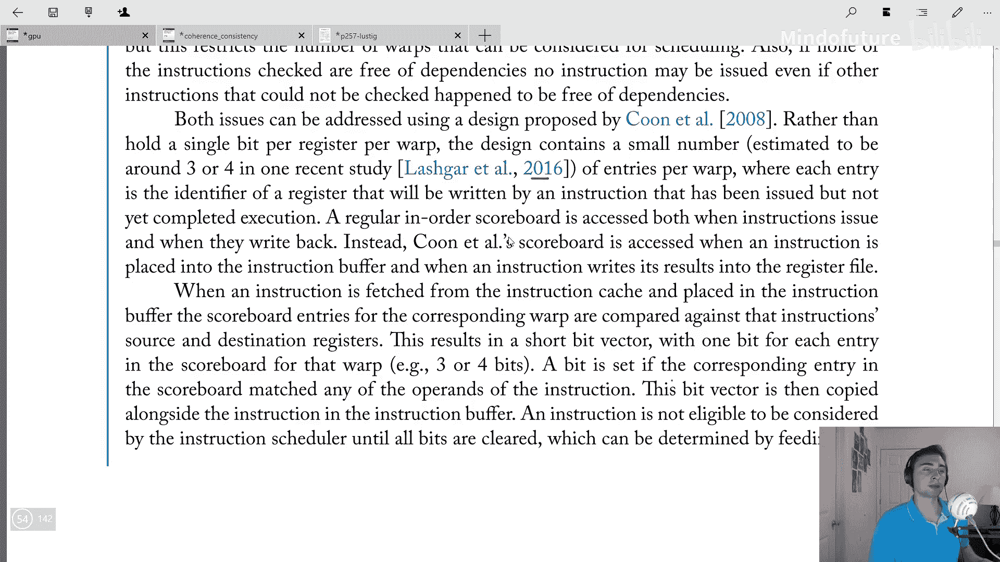

## 解决方案：基于每线程束的简化记分牌

2008年提出的一种设计可以同时解决状态开销和读端口问题。该设计的核心思想是：

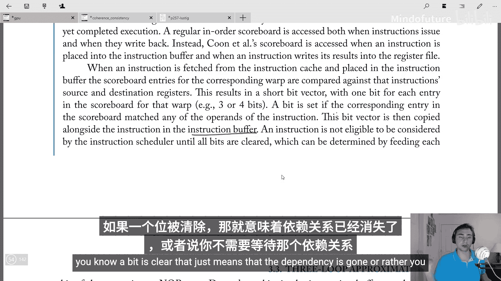

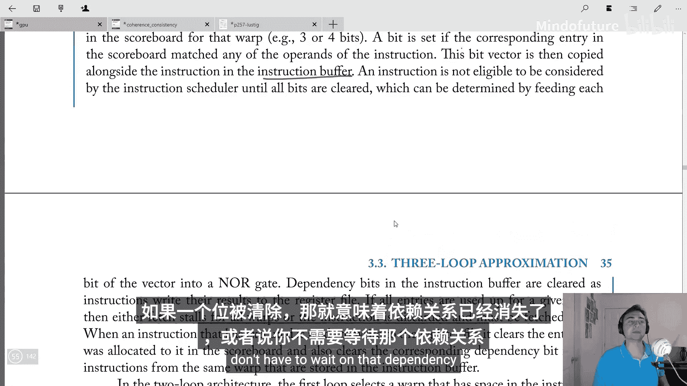

**不再为每个线程束的每个寄存器保留一个比特位，而是为每个线程姆维护一个小的条目表（研究表明约3-4个条目）。每个条目记录一条已发射但尚未执行完成的指令将要写入的寄存器标识符。**

以下是该方案的工作流程：

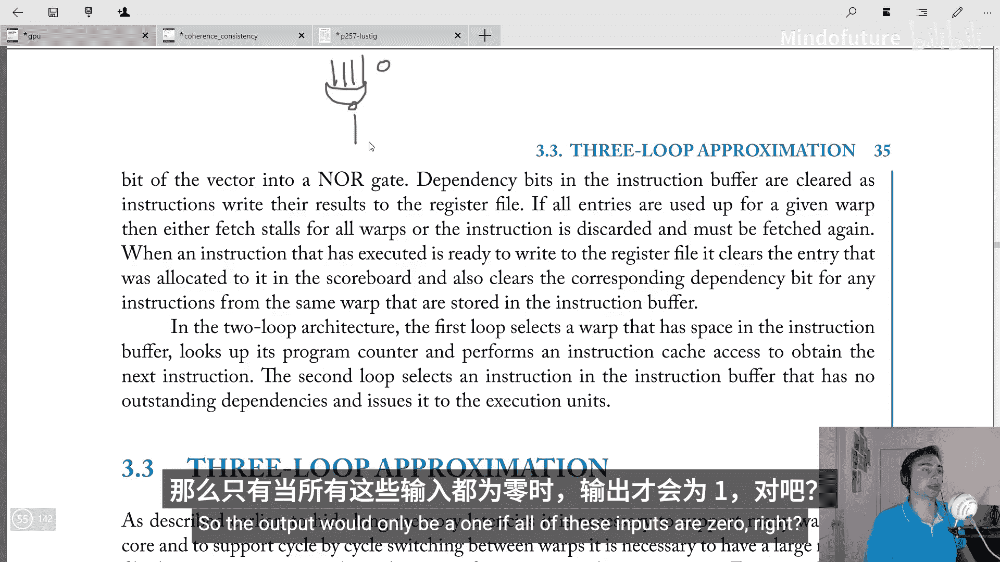

1.  **指令入缓冲时检查依赖**：当指令从指令缓存取出并放入指令缓冲区时，会将该线程姆记分牌中的条目与指令的源寄存器和目的寄存器进行比较。这会产生一个短的比特向量（例如3或4位），每一位对应记分牌中的一个条目。如果指令的某个操作数与记分牌中的某个条目匹配（即存在依赖），则对应的比特位被置位。这个比特向量会与指令一起编码并存放在指令缓冲区中。
2.  **调度条件**：一条指令只有在它的整个依赖比特向量全为0（即所有依赖都已解除）时，才有资格被调度器考虑发射。这可以通过一个简单的**或非门**电路高效实现：只有当所有输入位都为0时，输出才为1，表示指令就绪。
3.  **依赖解除与更新**：当一条执行完成的指令准备将结果写回寄存器文件时，它会清除在记分牌中为它分配的条目。同时，它还需要**清除指令缓冲区中所有属于同一线程束、且依赖比特向量中对应位被置位的指令的相应依赖位**。
4.  **条目耗尽处理**：如果某个线程姆的记分牌条目已全部用完，那么要么暂停所有线程姆的指令获取，要么丢弃当前无法分配条目的指令，后续需要时重新获取。

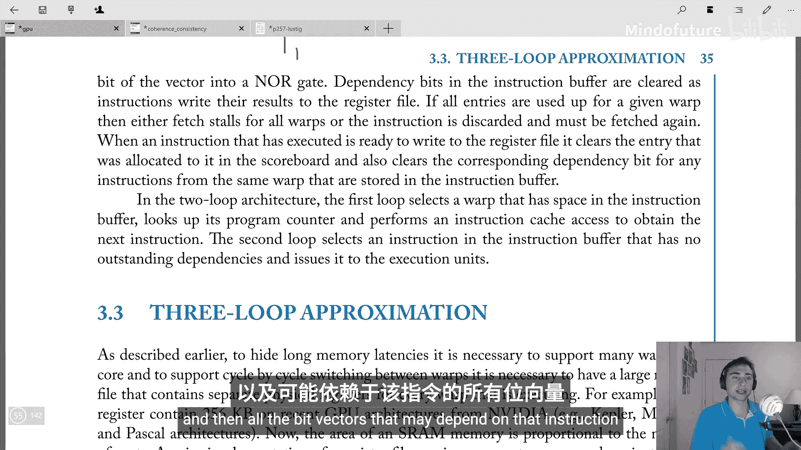

## 双循环架构总结

在双循环近似架构中，两个“循环”或调度层次如下：

*   **第一循环（线程束调度/指令获取）**：选择那些在指令缓冲区中有空间的线程姆，根据其程序计数器访问指令缓存，以获取下一条指令并放入指令缓冲区。
*   **第二循环（指令调度）**：检查指令缓冲区中的所有指令，找出那些依赖已解除、有资格执行的指令。这些指令可以来自同一个线程姆。调度器从中选择指令发射到执行单元。

这种设计的关键优势在于，它解决了单循环近似中**一个线程姆一次只能发射一条指令**，从而需要大量线程姆的问题。现在，我们可以减少所需的线程姆数量，并能够从同一个线程姆中发射多条指令，只要它们之间的依赖得到满足。

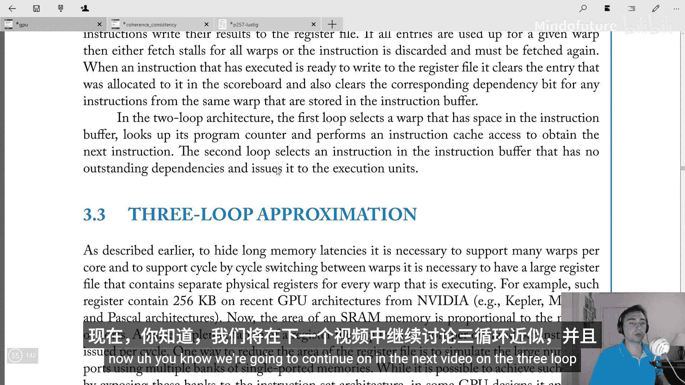

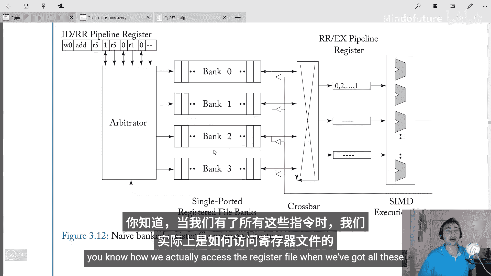

## 课程总结

本节课中我们一起学习了GPU核心架构的“双循环近似”模型。我们首先回顾了单循环近似的局限性，即无法跟踪指令依赖，导致需要大量线程姆来隐藏延迟。接着，我们引入了通过指令缓冲区和记分牌实现依赖跟踪的双循环模型。我们探讨了将CPU简单记分牌移植到GPU时，因海量多线程特性而面临的巨大状态开销和读端口挑战。最后，我们详细介绍了一种基于每线程姆简化条目表的记分牌设计方案，它有效地解决了这些问题，允许更高效的指令级并行和线程束管理。

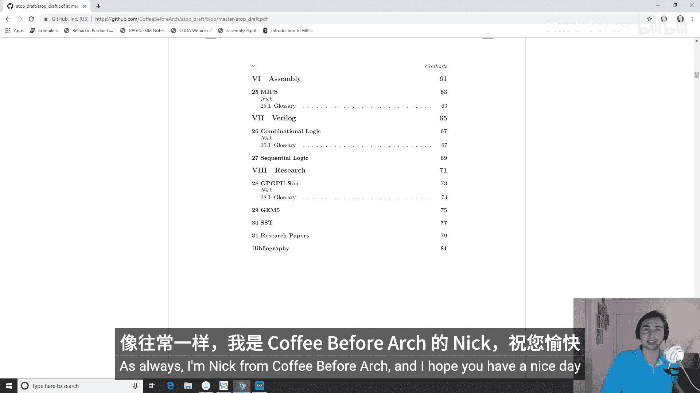

在下一节中，我们将继续探讨“三循环近似”，并深入了解当存在多条就绪指令时，GPU如何高效地访问寄存器文件等有趣主题。