# 007：SIMT核心 - 第四部分

在本节课中，我们将学习GPU调度模型中的“三循环近似”的第三个循环，即寄存器文件访问调度。我们将探讨为何简单的寄存器组设计会导致严重的组冲突，并介绍一种更高效的解决方案——操作数收集器。

## 概述

在前两节中，我们介绍了GPU调度模型的前两个循环：第一个循环从线程束中选择指令，第二个循环从指令缓冲区中选择已就绪的指令。本节我们将进入第三个循环，探讨如何调度对寄存器文件的访问，以解决因大量线程束导致的寄存器文件端口需求和组冲突问题。

## 简单的组化寄存器文件及其问题

为了隐藏长内存延迟，GPU需要维持大量活跃的线程束。这导致了巨大的寄存器文件需求，例如在Kepler、Maxwell和Pascal架构中，寄存器文件大小约为256KB。

一种简单实现寄存器文件的方法是：为每个周期、每条发射指令的每个操作数提供一个端口。但这会导致端口数量过多，不切实际。

因此，我们采用组化设计，使用多个单端口存储体来模拟大量端口。然而，简单的组化设计会引发组冲突问题。

以下是简单的组化寄存器文件微架构示意图：

```
指令解码 -> 寄存器号 -> 仲裁器 -> 寄存器组 -> 流水线寄存器 -> 执行单元
```

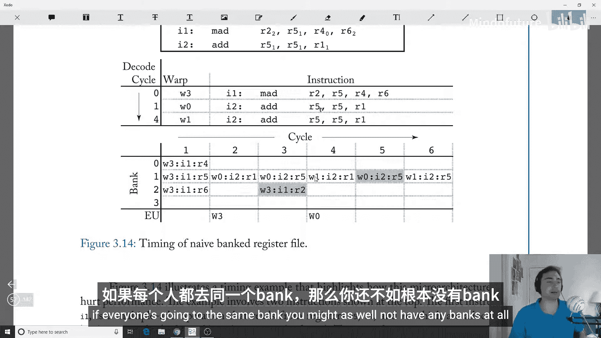

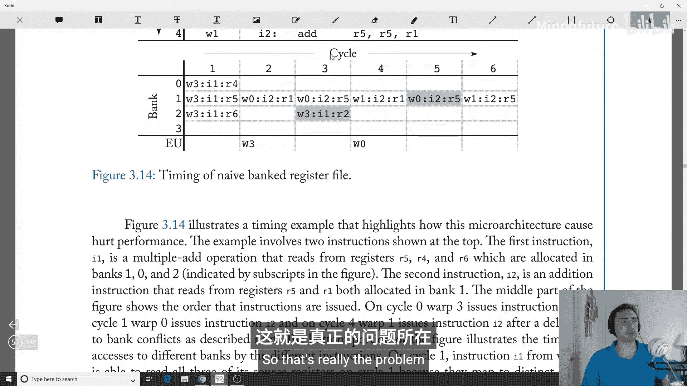

在简单的组化布局中，我们使用取模运算来映射寄存器到组。例如，对于4个组，映射规则为：`寄存器号 % 4`。

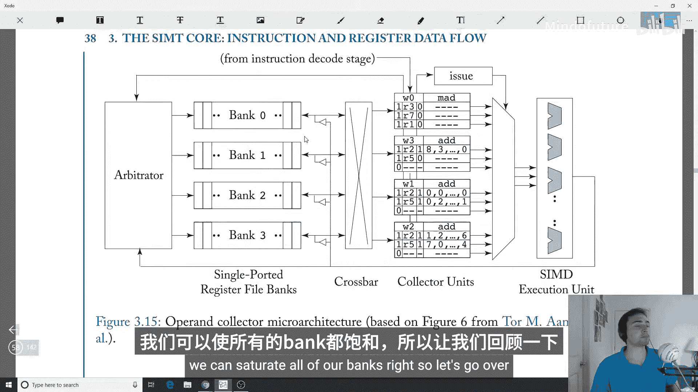

*   Warp 0: R0 -> Bank 0, R1 -> Bank 1, R2 -> Bank 2, R3 -> Bank 3, R4 -> Bank 0, ...
*   Warp 1: R0 -> Bank 0, R1 -> Bank 1, R2 -> Bank 2, R3 -> Bank 3, R4 -> Bank 0, ...

这种设计的局限性在于，它容易在同一线程束内和不同线程束间产生组冲突，导致寄存器读取停滞，利用率低下。

## 操作数收集器的引入

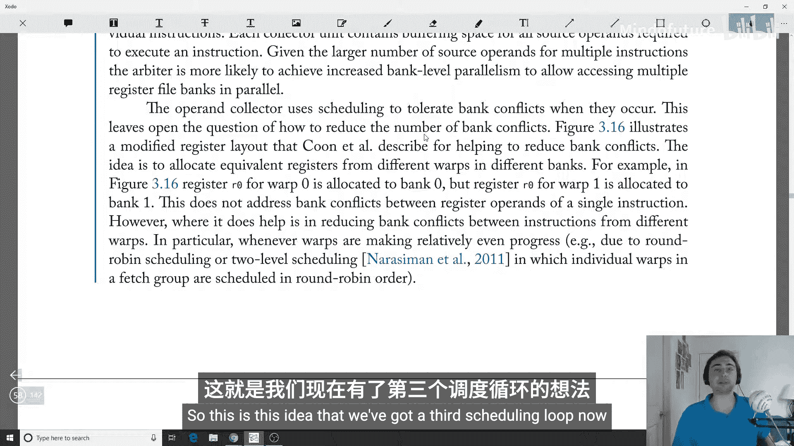

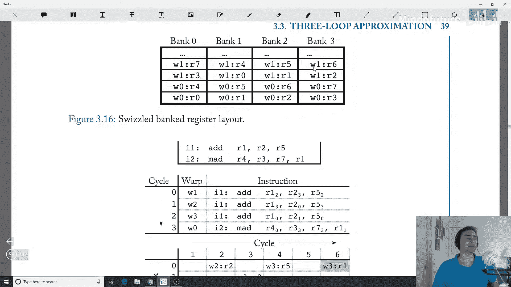

为了解决上述问题，现代GPU设计很可能采用了“操作数收集器”的概念。

我们用收集器单元取代了简单的流水线寄存器。当指令进入寄存器读取阶段时，会被分配一个收集器单元。多个指令可以同时在不同的收集器单元中收集它们的源操作数。

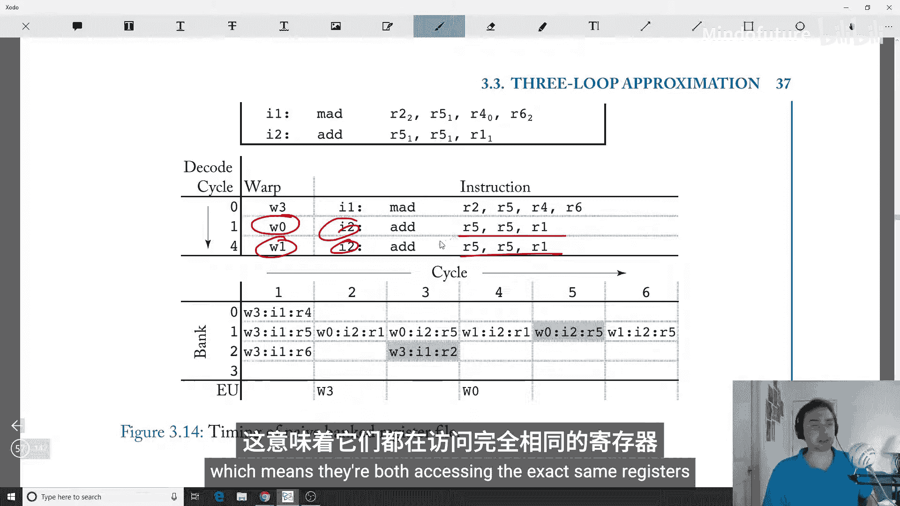

这种设计的关键优势在于：
*   **提高吞吐量**：即使某些指令因组冲突而延迟，其他指令的操作数读取可以继续进行，从而提高了整体吞吐量。GPU是面向吞吐量的机器，短暂的延迟是可接受的。
*   **增加组级并行性**：仲裁器现在可以从多个指令的众多源操作数中进行选择，更有可能找到可以并行访问不同组的操作数，从而更充分地利用所有存储体。
*   **容忍组冲突**：操作数收集器通过调度读取操作来容忍偶尔发生的组冲突，这是第三个调度循环的核心。

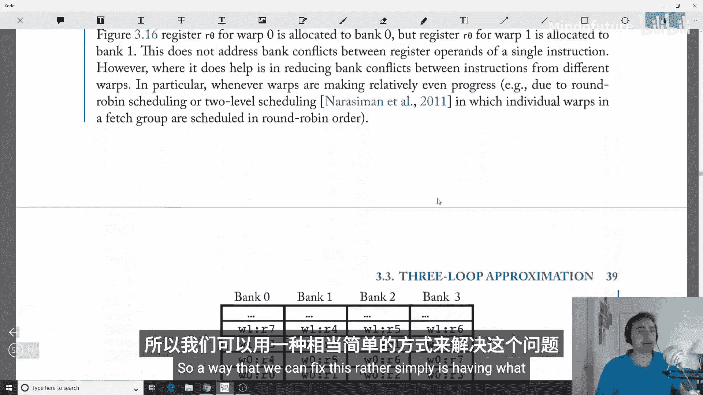

## 优化的寄存器布局：交错组化

除了引入收集器，我们还可以优化寄存器到组的映射方式，以进一步减少冲突。

简单的取模布局（`寄存器号 % 4`）在**线程束间**容易产生冲突。当多个线程束执行相同或相近的代码时，它们会访问逻辑上相同的寄存器号，这些寄存器会被映射到同一个物理组，导致严重的线程束间组冲突。

解决方案是采用“交错组化”布局。其核心思想是为不同线程束的寄存器映射引入一个偏移量。

*   Warp 0: `R0 -> Bank 0`, `R1 -> Bank 1`, `R2 -> Bank 2`, `R3 -> Bank 3` (标准取模)
*   Warp 1: `R0 -> Bank 1`, `R1 -> Bank 2`, `R2 -> Bank 3`, `R3 -> Bank 0` (偏移+1)
*   Warp 2: `R0 -> Bank 2`, `R1 -> Bank 3`, `R2 -> Bank 0`, `R3 -> Bank 1` (偏移+2)

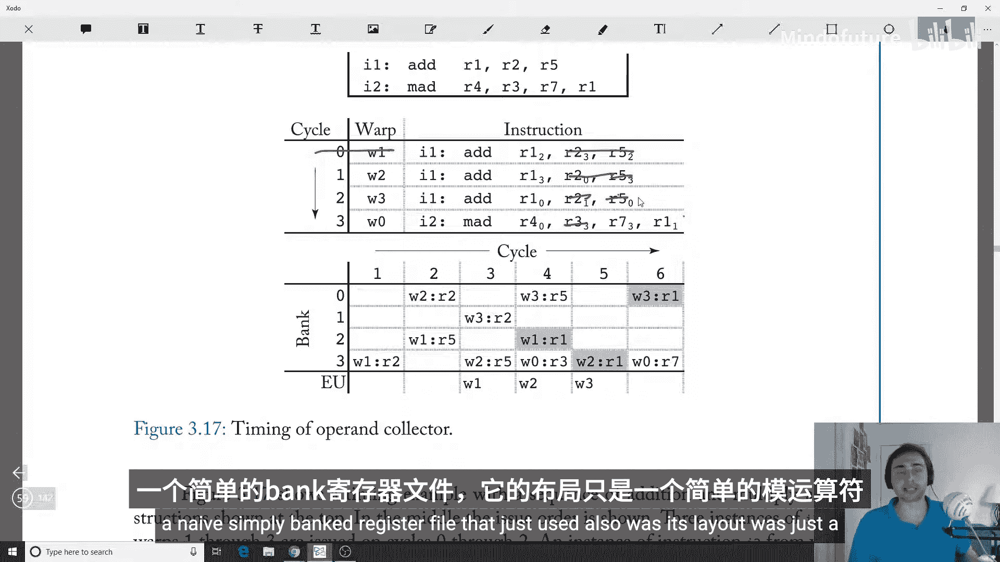

这样，即使所有线程束都在访问`R0`，它们也会被分散到不同的组（Bank 0, 1, 2），从而实现了线程束间的组级并行，显著缓解了冲突。

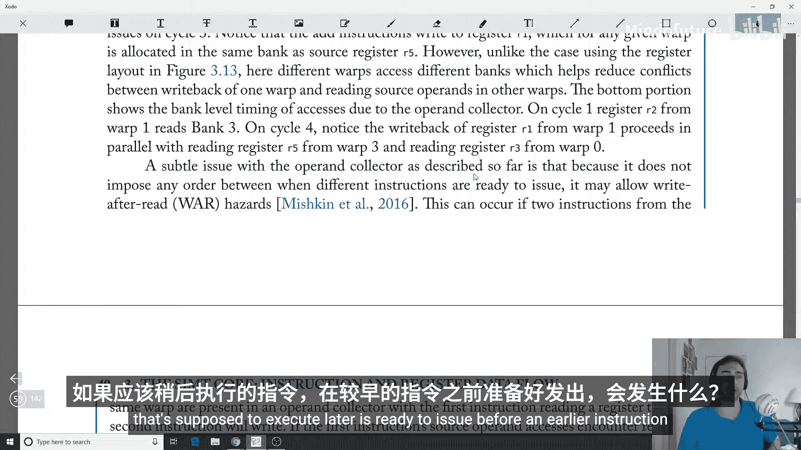

## 潜在问题与解决方案：写后读冒险

使用操作数收集器时，一个潜在问题是**写后读（Read After Write, RAW）冒险**。由于指令的操作数读取可能因组冲突而延迟，一条较晚的指令可能比一条较早的指令更早收集齐操作数并准备执行。如果允许这种情况发生，会破坏程序的正确性。

研究提出了几种解决方案来控制这种冒险：

1.  **提交时释放（Release on Commit）**：每个线程束最多只能有一条指令处于执行状态。这保证了指令顺序，但会严重降低性能（在某些情况下几乎减半）。
2.  **读取时释放（Release on Read）**：每个线程束最多只能有一条指令在操作数收集器中收集操作数。这释放了收集器资源，性能影响较小（在所研究负载中小于10%）。
3.  **布隆过滤器（Bloom Filter）**：使用一个小型的布隆过滤器来跟踪未完成的寄存器读取。这是一种更精细的跟踪机制，性能开销最小（小于几个百分点）。

此外，实践中的解决方案可能更复杂。例如，NVIDIA的Maxwell架构引入了**读依赖屏障**，这很可能通过特殊的控制指令（在SASS代码中看到的元数据指令）来管理依赖关系，避免特定指令的写后读冒险。

## 总结

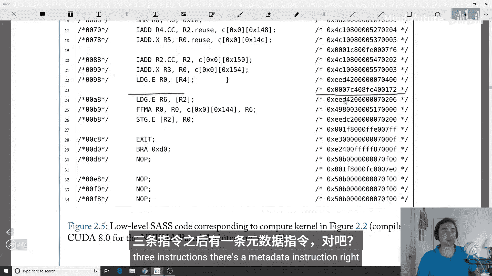

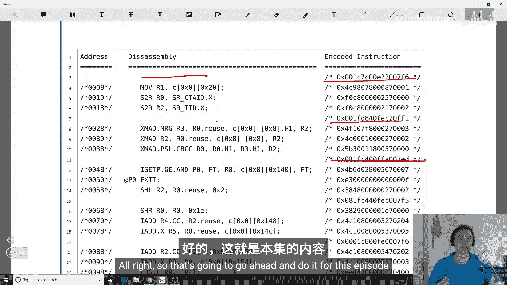

本节课我们一起学习了GPU SIMT核心中调度模型的第三个循环——寄存器文件访问调度。

我们首先分析了简单组化寄存器文件设计的问题，即严重的组冲突导致资源利用率低下。接着，我们引入了**操作数收集器**的概念，它通过允许来自多个指令的操作数读取重叠，提高了吞吐量和组级并行性。然后，我们介绍了**交错组化寄存器布局**，通过为不同线程束引入偏移映射，有效减少了线程束间的组冲突。最后，我们探讨了使用操作数收集器时可能出现的**写后读冒险**问题，并概述了几种控制该冒险的解决方案。


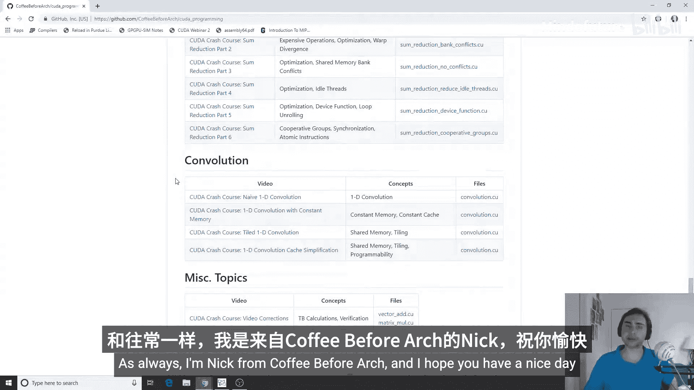

通过这三个调度循环（线程束调度、指令就绪调度、寄存器访问调度），GPU能够高效地管理成千上万个线程，最大化硬件利用率，从而实现其强大的并行计算能力。