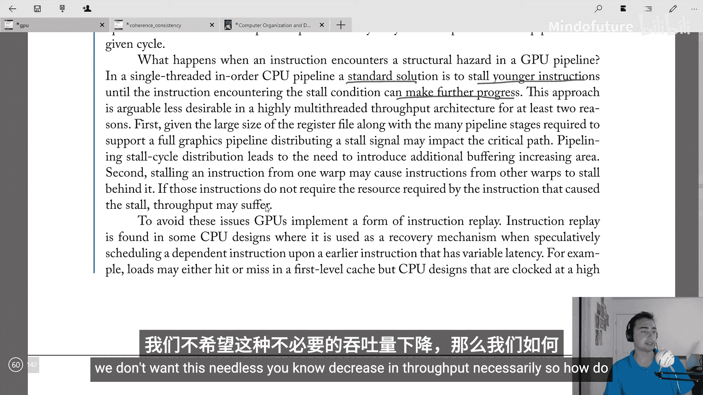
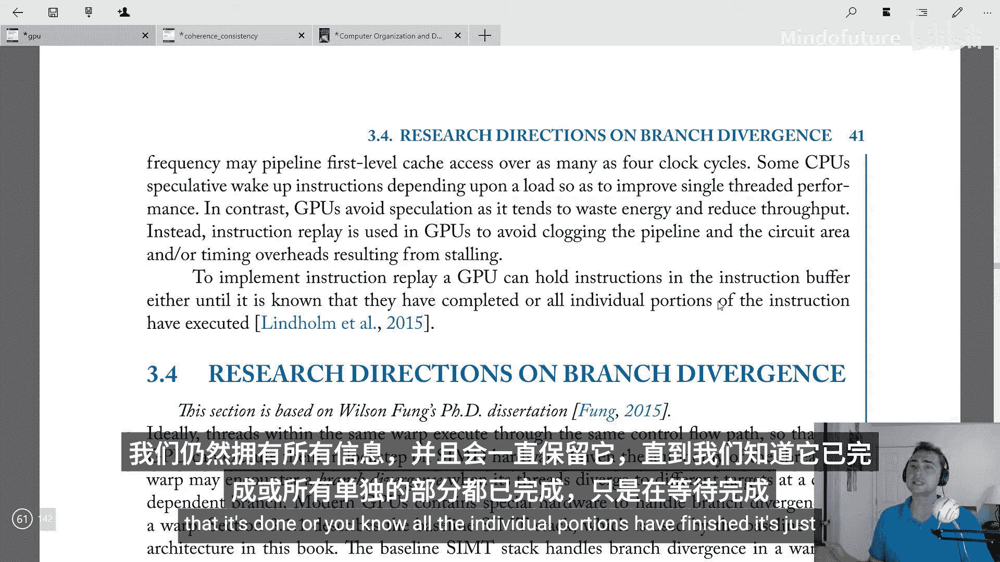
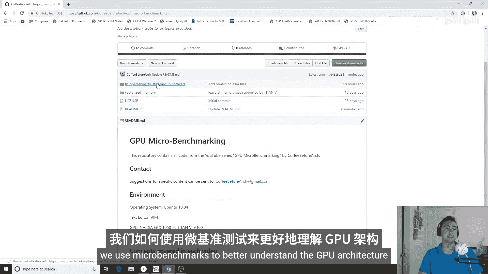
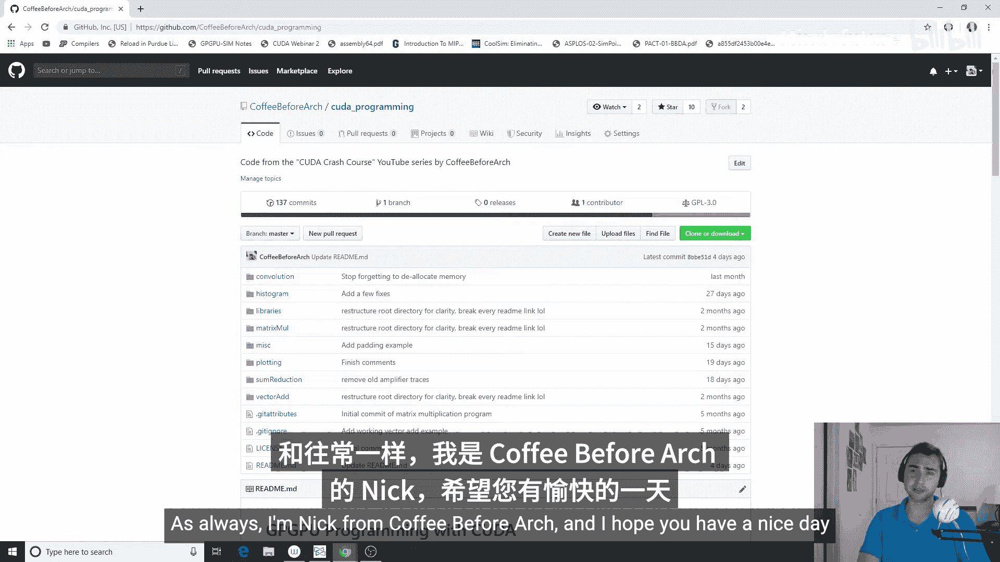

# 008：指令重放 🚀

在本节课中，我们将学习GPU如何处理流水线中的结构冒险。我们将探讨为何传统的“停顿”方法在GPU中并不理想，并介绍GPU采用的“指令重放”策略。

上一节我们讨论了寄存器读取调度，本节中我们来看看当指令在流水线中遇到资源冲突时，GPU如何应对。

## 结构冒险的来源

GPU流水线中存在多种导致结构冒险的原因。例如，在寄存器读取阶段，可能会耗尽运算单元或收集器单元。此外，内存系统也是结构冒险的常见来源。虽然我们尚未深入探讨内存系统，但可以理解，一个由线程束执行的内存指令可能需要分解为多个独立操作，每个操作在特定周期都可能占用流水线的一部分资源。

## 传统CPU的解决方案：停顿

在标准CPU流水线中，处理结构冒险的常见方法是停顿后续指令。具体做法是，当一条指令遇到资源冲突时，暂停所有更年轻的指令，直到冲突条件解除，该指令能够继续执行为止。

然而，这种方法在GPU中存在两个主要问题：
1.  **关键路径影响**：GPU拥有大型寄存器文件和众多支持完整图形流水线的阶段。分发停顿信号可能会影响关键路径，进而可能影响图形处理等具有服务质量期限的任务的帧率。
2.  **吞吐量损失**：停顿一个线程束的指令，可能导致其他不依赖该冲突资源的线程束指令也被迫停顿，从而造成不必要的吞吐量下降。

## GPU的解决方案：指令重放

为了避免停顿带来的流水线阻塞、电路面积增加或时序开销，GPU采用了“指令重放”策略。这个概念在CPU中同样存在，通常用作推测执行的恢复机制。例如，CPU可能推测性地调度一条依赖于具有可变延迟的加载指令，如果加载未命中缓存，就需要重放该依赖指令。

但在GPU中，我们通常没有推测执行。GPU依赖大规模多线程来隐藏延迟。因此，指令重放在GPU中的主要目的是避免资源冲突导致的效率低下。

以下是GPU实现指令重放的一种可能方式：
GPU可以将指令保留在指令缓冲区中，直到确认该指令已完全执行完毕，或者其所有独立部分都已执行完成。这样，当指令因结构冒险而无法继续时，无需停顿整个流水线，只需在资源可用时，从缓冲区中重新取出该指令并再次尝试发射即可。

本节课中我们一起学习了GPU处理结构冒险的策略。我们了解到，与CPU采用停顿机制不同，GPU更倾向于使用指令重放来避免流水线阻塞和吞吐量损失。其核心思想是将遇到资源冲突的指令暂时保存在缓冲区中，待资源可用时再重新发射，从而维持高吞吐量。

下一节，我们将探讨与SIMT核心相关的研究方向与现状。