# 009：Warp Compaction

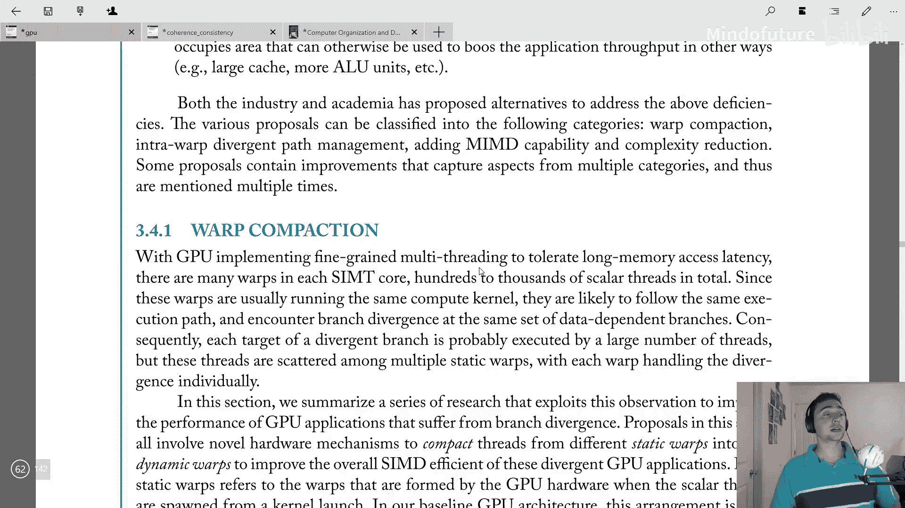

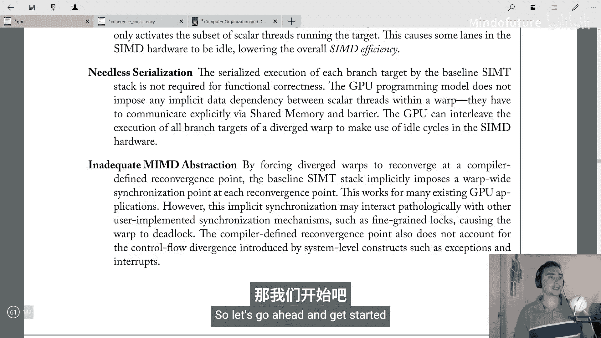

在本节课中，我们将学习GPU架构中处理分支发散问题的一个重要研究方向：**Warp Compaction**。我们将探讨其核心思想、面临的问题以及学术界和工业界提出的多种解决方案。

## 概述

上一节我们介绍了GPU处理分支发散的基础硬件机制。本节中，我们来看看如何通过**Warp Compaction**技术来优化分支发散带来的性能问题。其核心思想是重新组织线程，以提高SIMD执行单元的利用率。

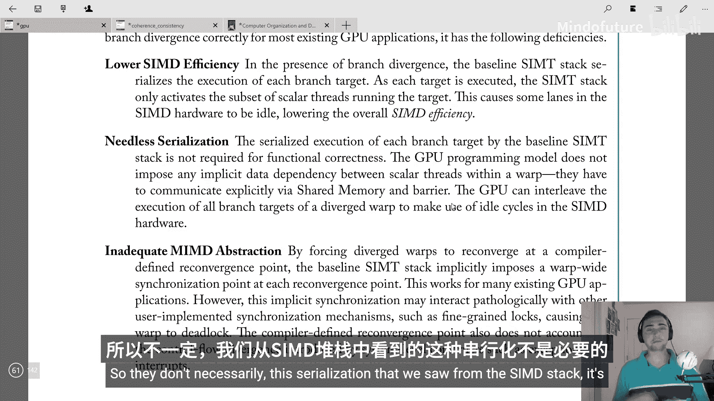

## 分支发散的问题

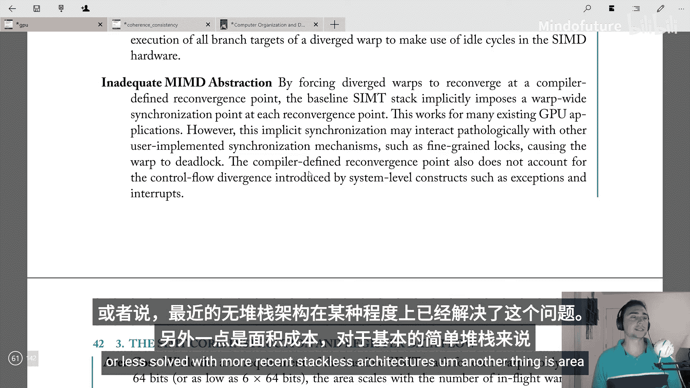

理想情况下，一个Warp中的所有线程应执行完全相同的控制流路径。但由于线程的自主性，它们可能走向不同的分支，这就产生了**分支发散**。现代GPU包含特殊硬件（如SIMT栈）来处理分支发散，但基线方案存在一些问题。

以下是SIMT栈基线方案的主要问题：

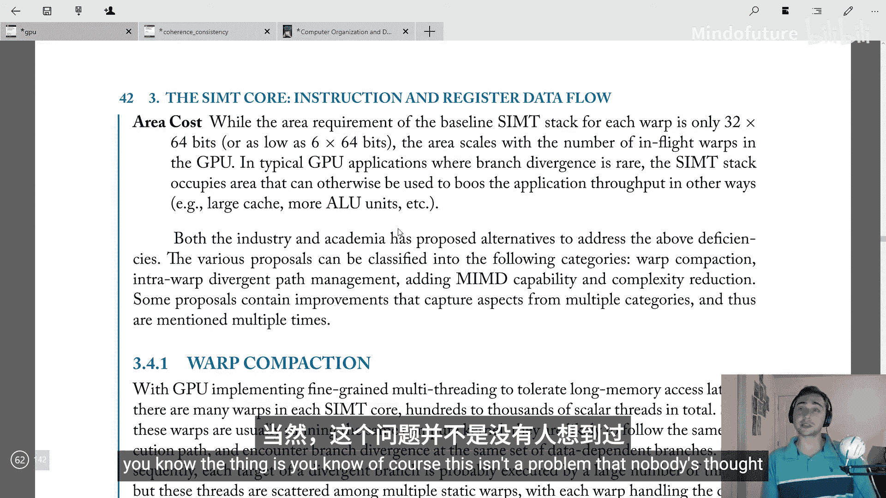

1.  **降低SIMD效率**：当发生分支发散时，基线SIMT栈会串行执行每个分支目标。在最坏情况下，一个Warp中可能只有单个线程活跃，导致SIMD硬件利用率极低。
2.  **不必要的串行化**：这种串行化对于功能正确性并非必需。GPU编程模型并未在标量线程之间强加隐式数据依赖，它们需要通过共享内存和屏障进行显式通信。因此，GPU可以交错执行发散Warp的所有分支目标，以利用SIMT硬件的空闲周期。
3.  **不充分的MIMD抽象**：基线SIMT栈强制发散的Warp在编译器定义的**重汇聚点**重新汇聚，这相当于在每个重汇聚点隐式地强加了一次Warp范围内的同步。虽然这对许多现有应用有效，但这种隐式同步可能带来问题，例如在细粒度锁场景下导致死锁。
4.  **面积开销**：每个Warp的SIMT栈需要存储空间（如32x64位）。在典型GPU应用中，分支发散并不常见，这些存储空间本可用于提升应用吞吐率，例如增大缓存或增加ALU单元。

## Warp Compaction 的核心思想

GPU通过**细粒度多线程**来容忍长延迟内存访问。这意味着大量线程同时运行以掩盖延迟。由于这些Warp通常运行相同的计算内核，它们很可能遵循相同的执行路径，并在大致相同的时间点遇到分支发散。

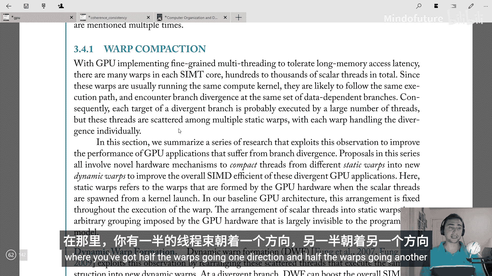

因此，即使单个Warp内部发生发散，**跨Warp观察**，每个分支目标仍可能由大量线程执行。这些线程只是分散在多个静态Warp中，每个Warp单独处理自身的发散。

Warp Compaction 的关键洞察在于：我们可以重新排列这些来自不同静态Warp、但执行相同指令的线程，将它们**打包**成新的**动态Warp**，从而减少活跃线程的分散程度，提高整体SIMD效率。

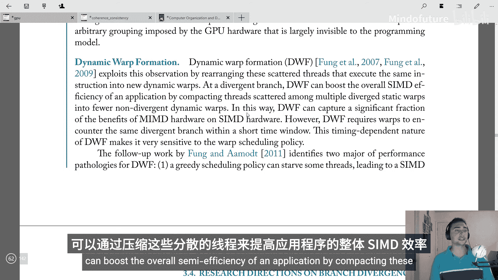

*   **静态Warp**：由GPU硬件在启动内核时，根据连续线程ID形成的Warp。这是程序员直观理解的Warp组织形式。
*   **动态Warp**：在运行时通过重新组织线程（例如，将不同静态Warp中执行相同路径的线程组合在一起）形成的Warp。

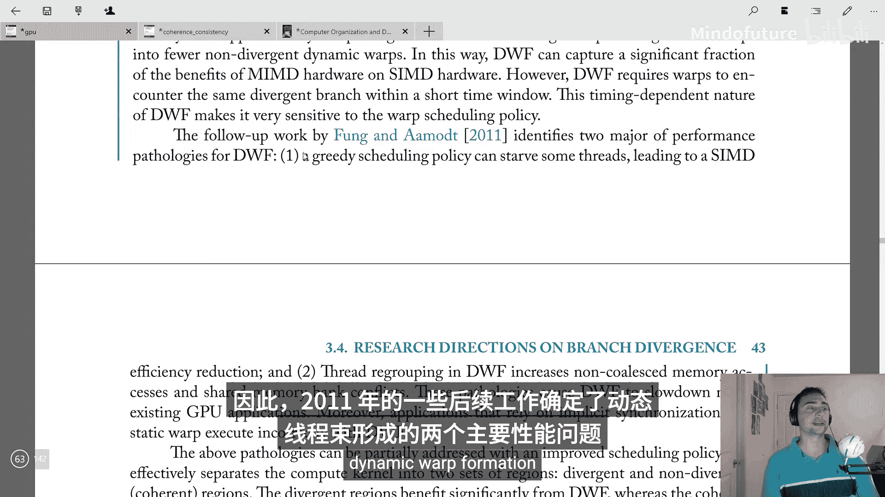

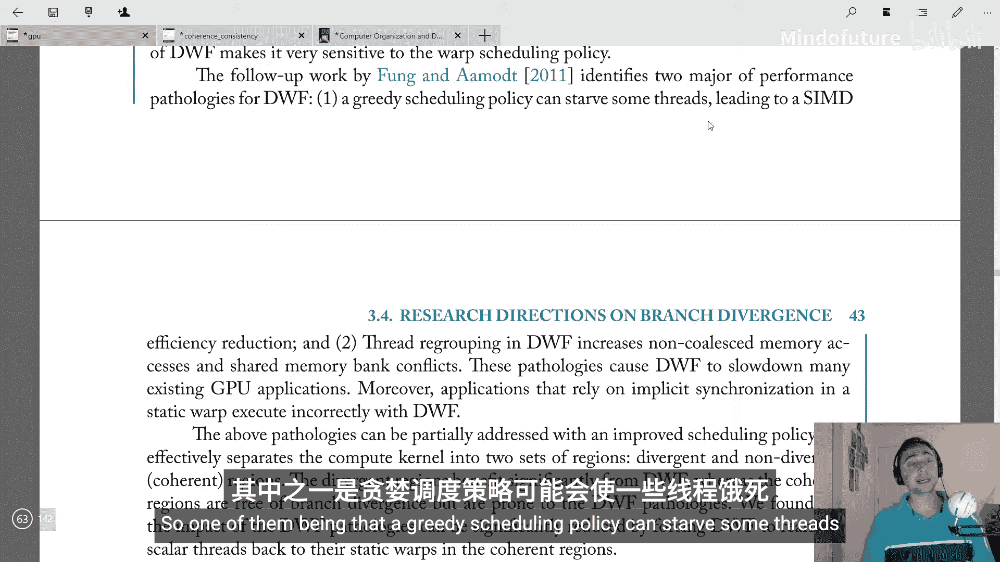

## 硬件Warp Compaction技术

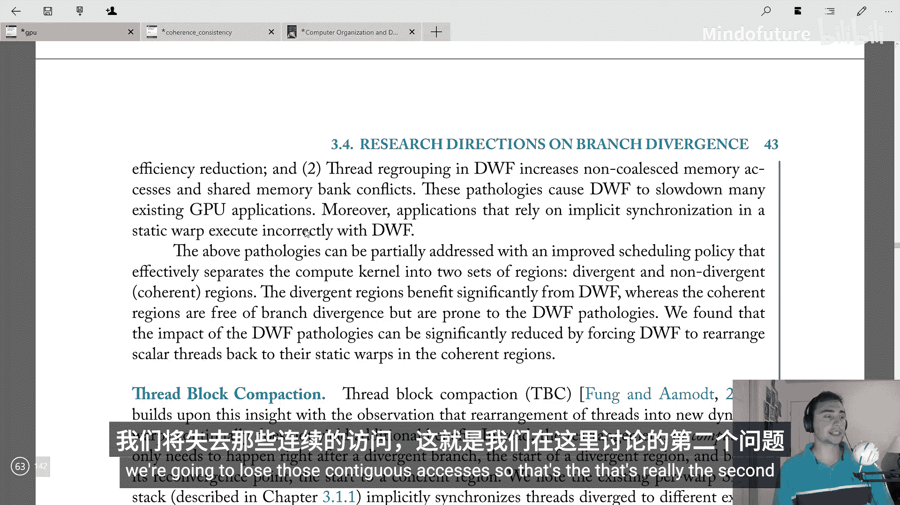

以下是一系列利用上述观察来提升遭受分支发散的应用性能的硬件研究。

### 动态Warp形成 (2007-2009)

这是早期尝试，核心思想是重新排列那些执行相同指令但分散在不同Warp中的线程，形成新的动态Warp，以消除发散。

后续研究（2011年）指出了动态Warp形成的两个主要性能病理：

1.  **贪婪调度策略可能导致线程饥饿**，从而降低SIMD效率。
2.  **线程重组会增加非合并内存访问和共享内存体冲突**。程序员通常按照线程连续访问内存的假设来优化，而动态重组打乱了这种连续性，可能导致访存模式恶化。

### 线程块压缩 (2011)

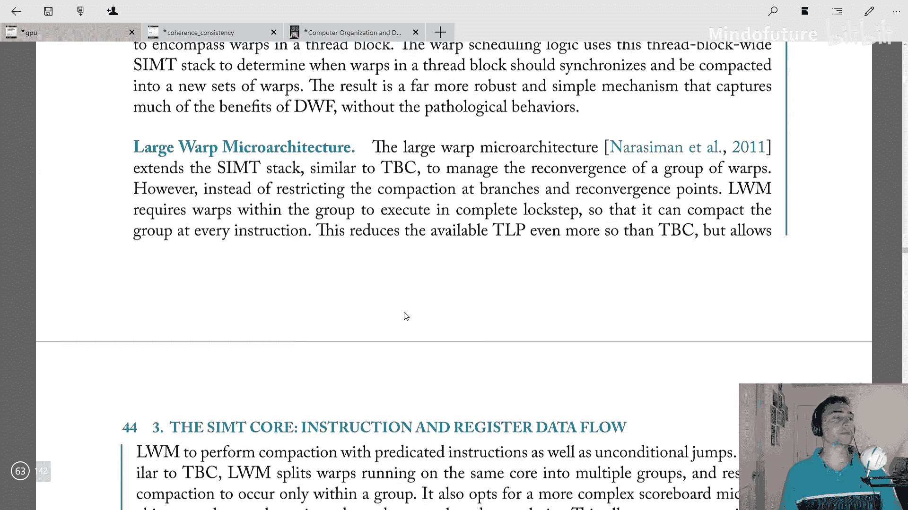

TPC技术建立在动态Warp形成的基础上。它观察到持续不断地重组线程并不能带来额外收益，重组只需要在**发散分支之后**（发散区域开始）和**重汇聚点之前**（一致区域开始）进行。

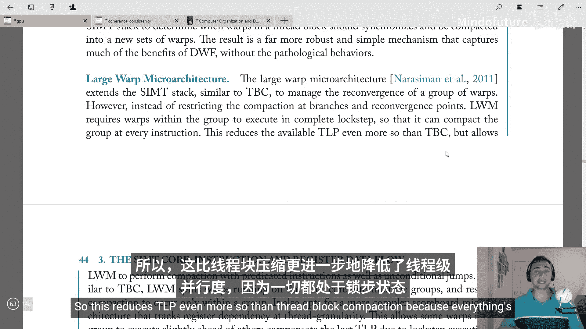

TPC扩展了原有的**每Warp SIMT栈**，使其管理**同一核心内同一线程块的所有Warp**，强制它们在发散分支和重汇聚点进行同步和压缩。这相当于将SIMT栈的管理范围从单个Warp扩大到了一个线程块。

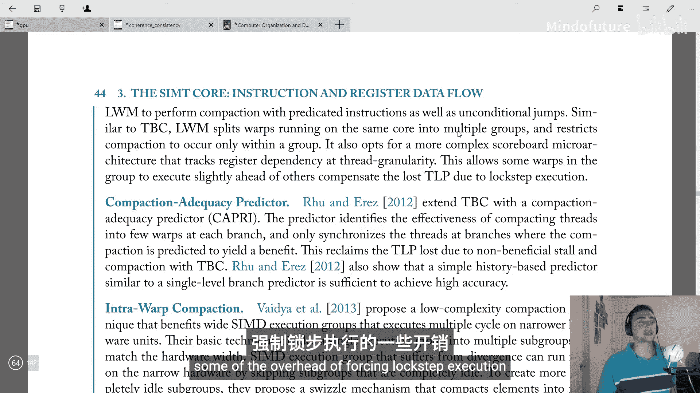

然而，在每个发散分支同步所有Warp进行压缩会大大减少可用的线程级并行度。因此，TPC采取折中方案，**将压缩限制在单个线程块内**。由于GPU应用通常在单个核心上并发执行多个线程块，当一个线程块的Warp为压缩而同步时，其他线程块可以继续执行，从而重叠压缩开销。

### 大Warp微架构 (2011)

LWM架构也扩展了SIMT栈来管理一组Warp的重汇聚。但它要求组内的Warp**完全锁步执行**，以便能在每条指令处进行压缩。这比TPC更进一步减少了TLP。

为了补偿锁步执行带来的TLP损失，LWM采用了更复杂的记分牌微架构，以线程粒度跟踪寄存器依赖，允许组内某些Warp略微领先于其他Warp执行。

### 压缩充分性预测器 (2012-2013)

该工作扩展了线程块压缩，引入了一个**预测器**。其目标是智能地判断在某个分支点进行线程压缩是否能带来收益，并只在这些预测有益的分支点同步线程。这可以避免因无益的压缩停顿而损失的TLP。研究表明，一个简单的、类似于单级分支预测器的历史预测器就能达到足够的准确度。

### 内部Warp压缩 (2013)

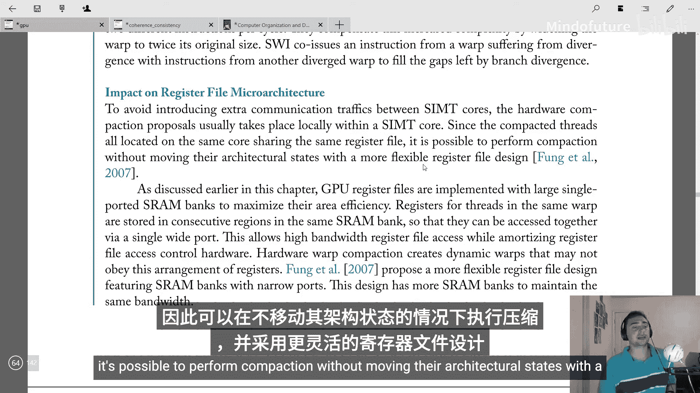

该技术针对在**窄硬件单元**上执行**宽SIMD执行组**的场景。它将一个执行组划分为多个与硬件宽度匹配的子组。一个遭受发散的SIMD执行组可以通过**跳过完全空闲的子组**来在窄硬件上更快地运行。

为了创建这些完全空闲的子组，需要增加一个**混洗机制**，在发散点将元素打包到更少的子组中。

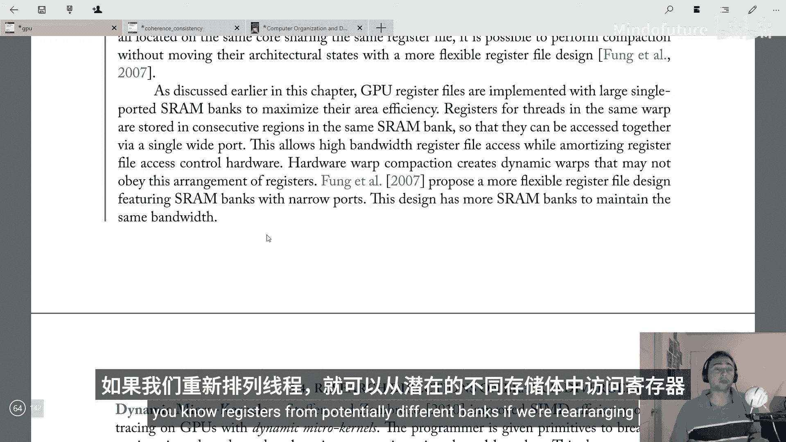

### 同时Warp交错 (2012)

SWI扩展了GPU SIMT前端，使其每个周期能发射**两条不同的指令**。它通过将Warp大小加倍来补偿增加的复杂度。SWI将一个遭受发散的Warp的指令与另一个发散Warp的指令**协同发射**，以填补分支发散留下的空缺。

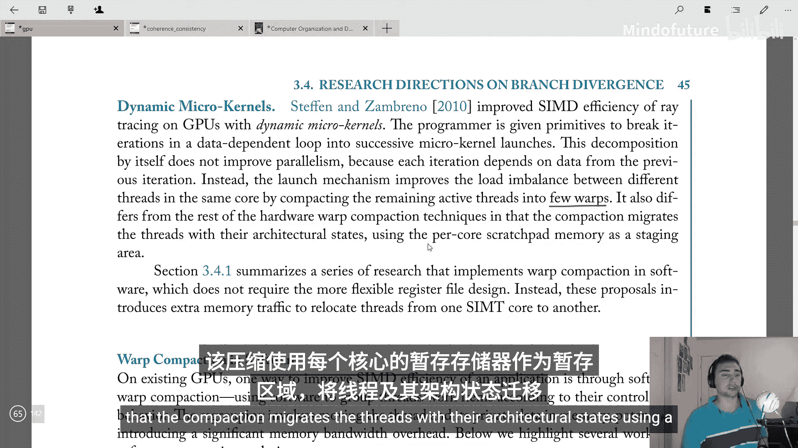

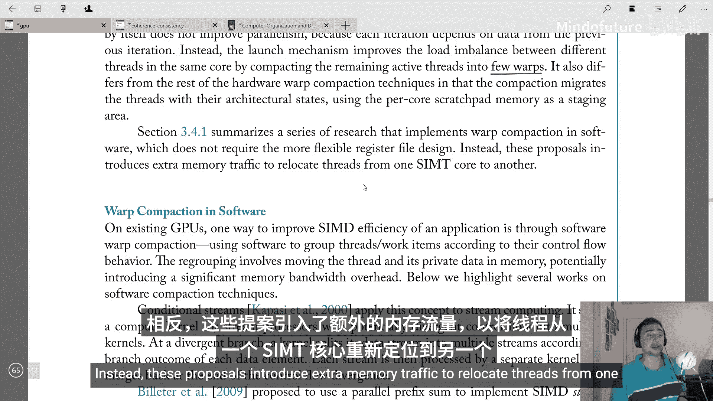

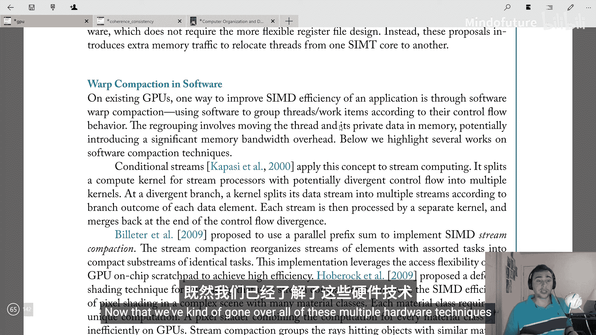

## 寄存器文件设计的挑战

硬件压缩提案通常在SM核心本地进行，以避免引入额外的核心间通信流量。由于被压缩的线程都位于同一核心并共享同一寄存器文件，因此可以通过更灵活的寄存器文件设计来执行压缩，而无需移动其架构状态。

典型的寄存器文件使用**大容量单端口SRAM体**来最大化面积效率。同一Warp的线程寄存器连续存储在同一SRAM体中，以便能一起访问。但Warp压缩创建的动态Warp不遵守这种连续排列，并且可能包含来自不同Warp的线程，这些线程本应存储在不同体中。

*   **2007年的工作**提出了更灵活的寄存器文件设计，采用更多、端口更窄的体来维持相同带宽，以支持动态Warp的寄存器访问。
*   **2010年关于动态微内核的工作**则使用每核心暂存内存作为中转区，通过迁移线程及其架构状态来实现压缩。

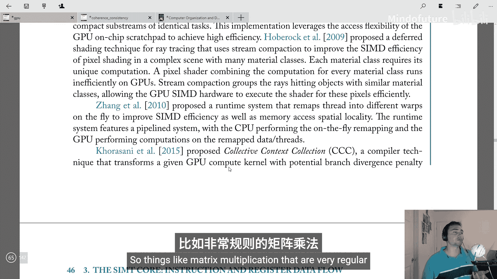

## 软件Warp Compaction技术

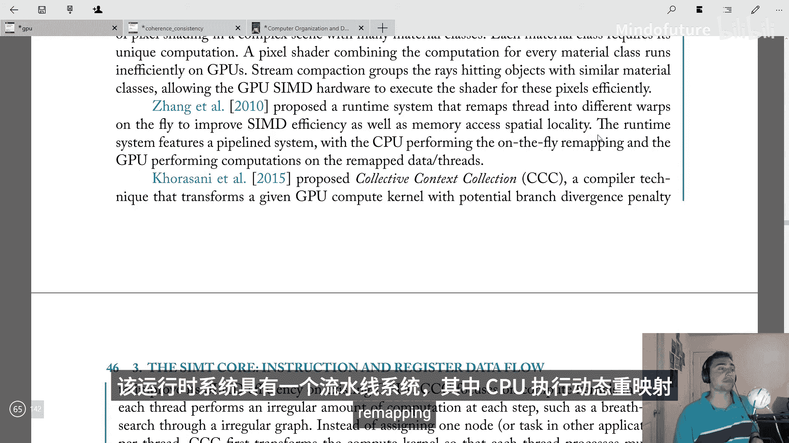

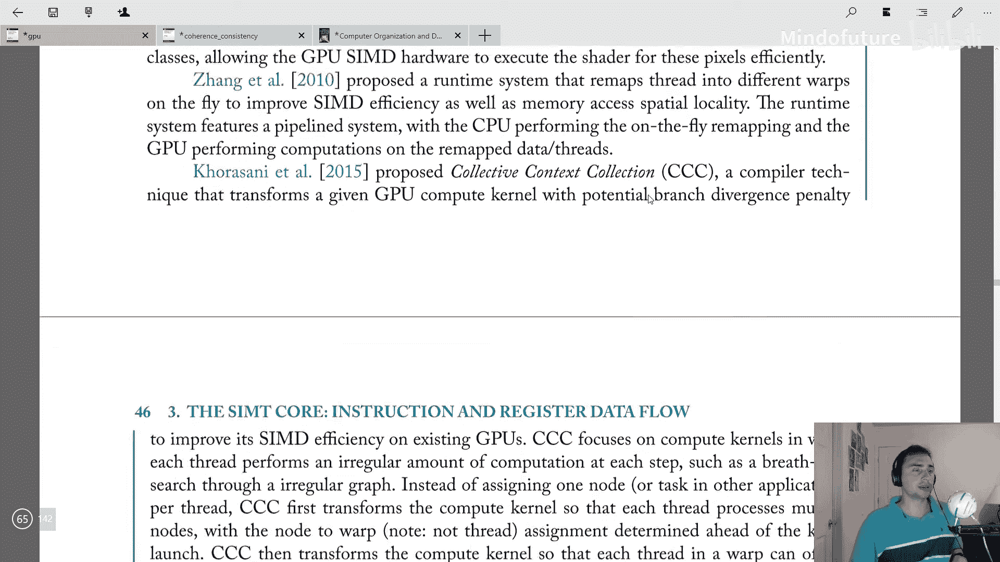

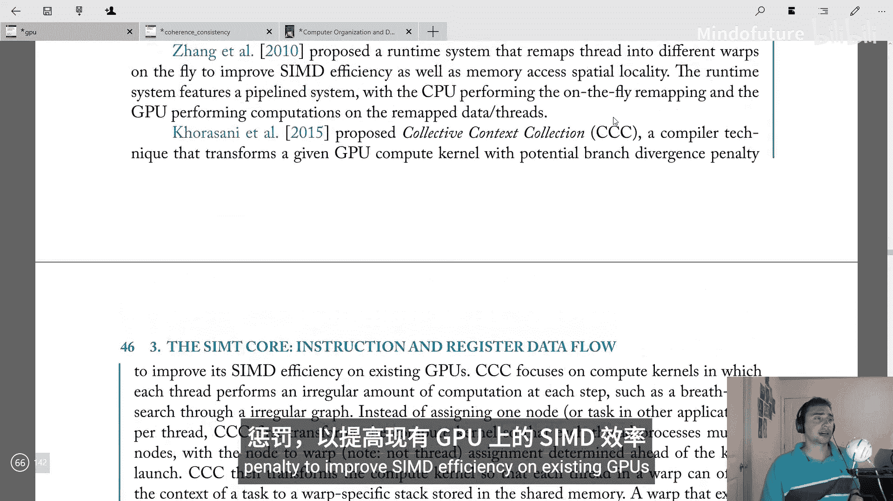

以下研究在软件层面实现Warp压缩，无需修改硬件寄存器文件设计，但可能引入额外的内存流量来在线程间迁移数据。

*   **早期流计算 (2000)**：在GPGPU时代之前，就将此概念应用于流处理器。它将一个可能发散的核函数在发散分支处根据每个数据元素的分支结果，将其数据流拆分为多个流，分别由不同的核函数处理，最后在控制流发散结束时合并。
*   **并行前缀和实现流压缩 (2009)**：使用并行前缀和算法来识别具有相同任务的元素流，并将其压缩为紧凑的子流。该实现利用了GPU片上暂存内存的访问灵活性。
*   **延迟着色技术 (2009)**：用于光线追踪，使用流压缩来提高具有多种材质类别的复杂场景中的像素着色SIMD效率。它将击中相似材质类别的光线分组处理。
*   **运行时线程重映射系统 (2010)**：提出一个运行时系统，动态地将线程重新映射到不同的Warp中，以改善SIMD效率和内存访问的空间局部性。该系统采用流水线设计，CPU负责动态重映射，GPU负责在重映射后的数据和线程上执行计算。
*   **集体上下文收集 (2015)**：一种编译器技术，专注于优化那些每个线程在每个步骤执行不规则计算量的核函数（例如，在不规则图上进行广度优先搜索）。它通过让每个线程处理多个节点，并使用存储在共享内存中的Warp特定栈来卸载任务上下文，实现工作负载平衡。

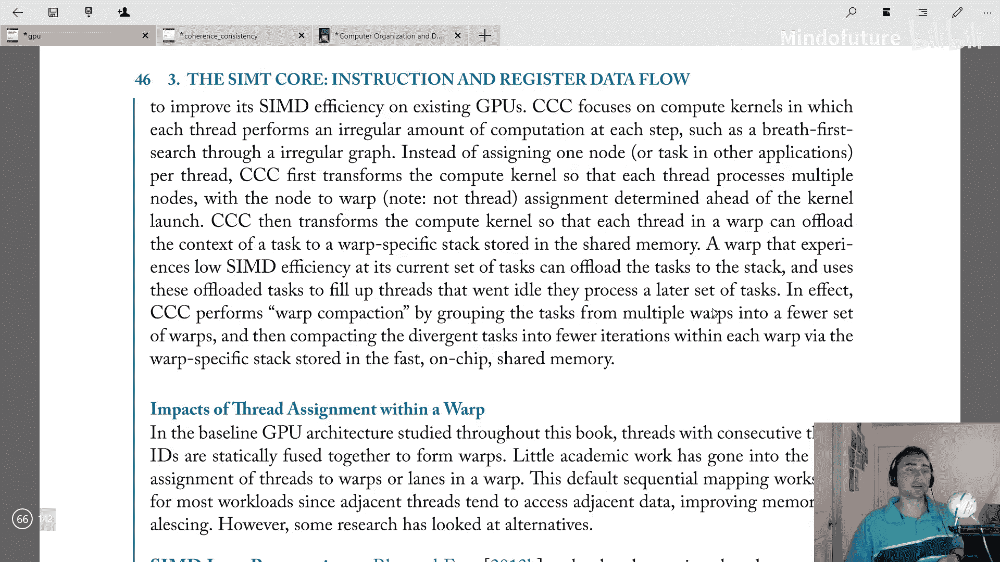

## 线程分配的影响

在基线GPU架构中，具有连续线程ID的线程被静态融合形成Warp。这种默认的顺序映射对于大多数工作负载（尤其是规则应用）效果很好，因为相邻线程倾向于访问相邻数据。

但对于不规则应用，情况并非如此。2013年的一项工作指出，顺序映射对于Warp压缩技术是次优的。一个关键限制是：当线程被分配到新Warp时，它们不能被分配到不同的**通道**，否则寄存器文件状态将不得不移动到向量寄存器的不同通道。

该工作观察到程序结构会使某些控制流路径偏向特定的SIMD通道，这种偏向使得压缩变得困难，因为选择相同路径的线程往往位于同一通道，从而无法合并。因此，他们提出了几种不同的线程映射排列方式，以消除这些程序性偏向，提高压缩率。

另一项2013年（引用了2009年工作）的研究利用了**SIMD数据路径宽度并不总是等于Warp宽度**的事实（例如，SIMD宽度为16，Warp大小为32）。它观察到，当发生发散时，如果一个连续的SIMD宽度线程组被屏蔽，则该指令可以仅在一个周期内发射，跳过被屏蔽的通道。他们称之为**周期压缩**。然而，如果被屏蔽的线程不连续，则基本技术不会带来任何性能提升，因此需要类似前面提到的混洗压缩技术。

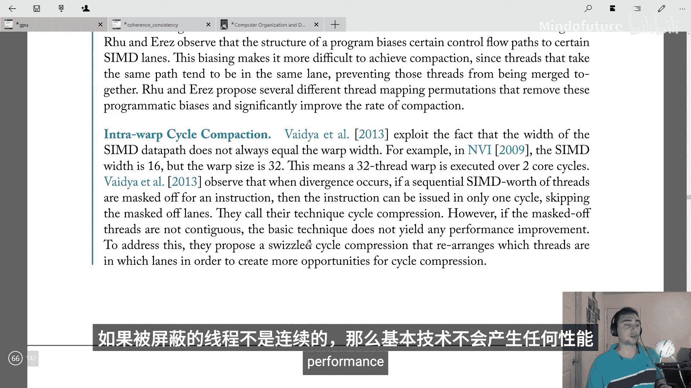

## Warp标量化

2014年的一项工作认为，当Warp内的线程操作**相同数据**时，SIMT编程模型是低效的。为此提出了多种解决方案，包括在流水线中增加一个**标量单元**，用于处理编译器或程序员可以预先识别为标量的工作。AMD的GCN架构就包含了用于此目的的标量流水线。最新的NVIDIA架构（如Turing）也引入了标量流水线。

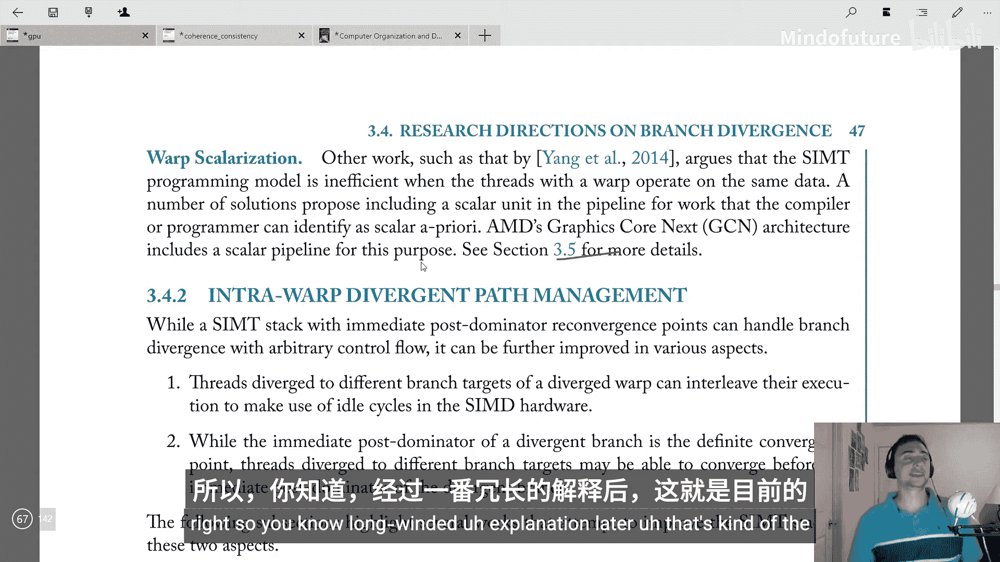

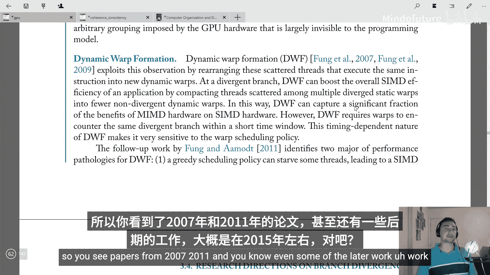

## 总结

本节课我们一起学习了**Warp Compaction**这一重要研究方向。我们首先回顾了分支发散带来的问题，然后深入探讨了其核心思想：通过硬件或软件手段，重新组织执行相同路径的线程，以提高SIMD效率。我们介绍了从早期动态Warp形成到后来的线程块压缩、预测器、内部压缩等多种硬件方案，也了解了软件层面的实现策略及其对寄存器文件设计带来的挑战。最后，我们还探讨了线程分配策略和Warp标量化等相关优化。这些研究大多集中在GPU架构的早期发展阶段，如今已成为该领域成熟的技术体系。

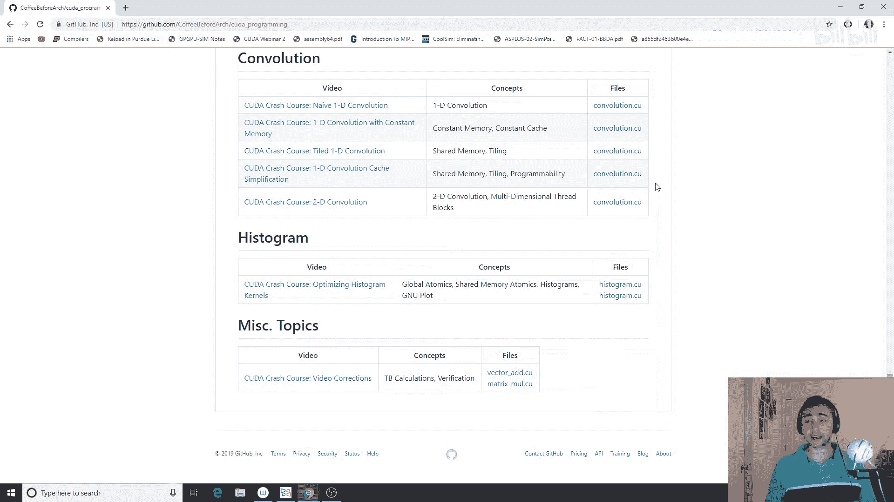

下一节，我们将开始探讨第二个重要主题：**Intra-Warp Divergent Path Management**。