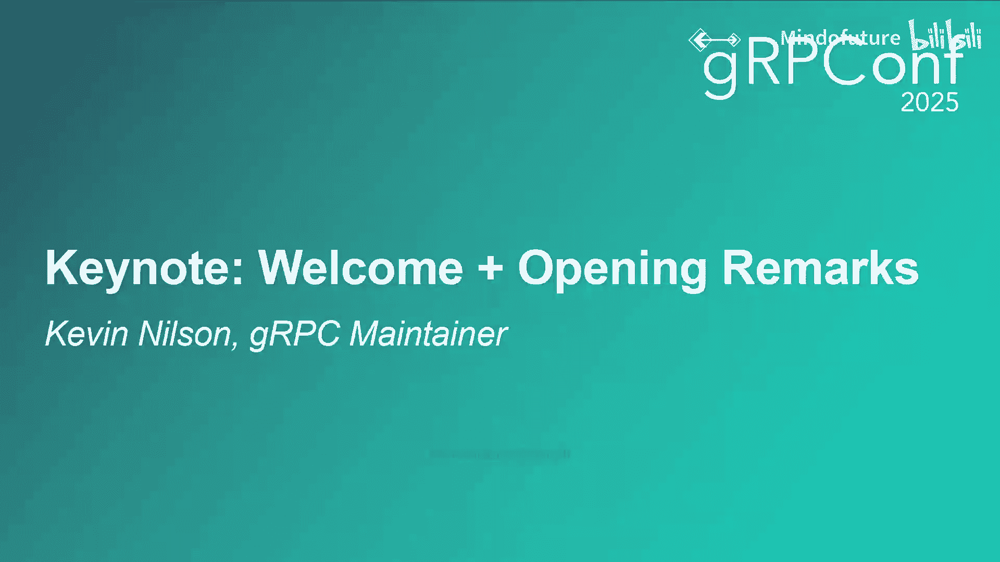
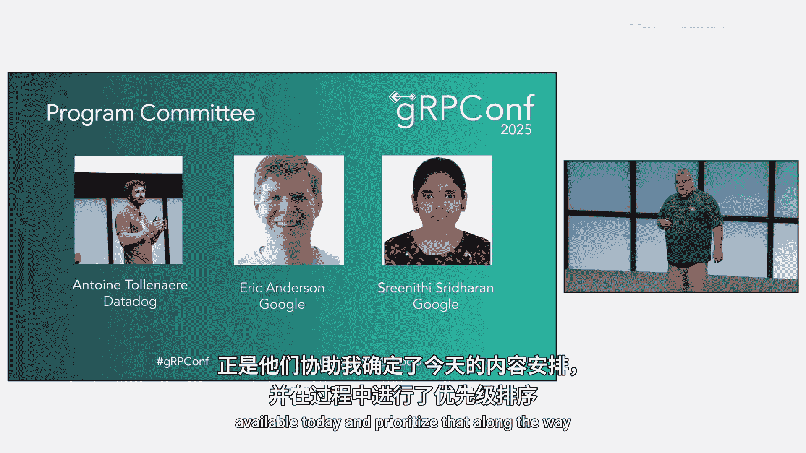
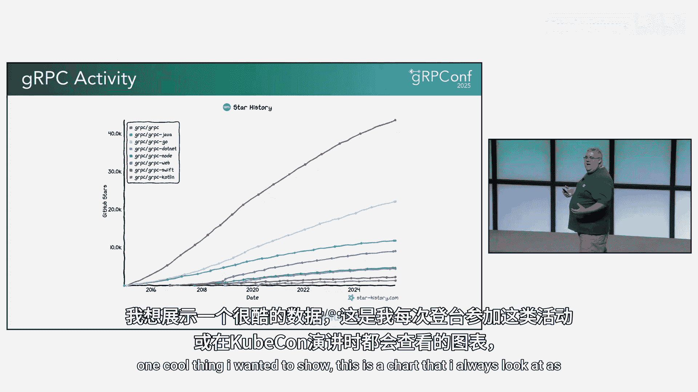
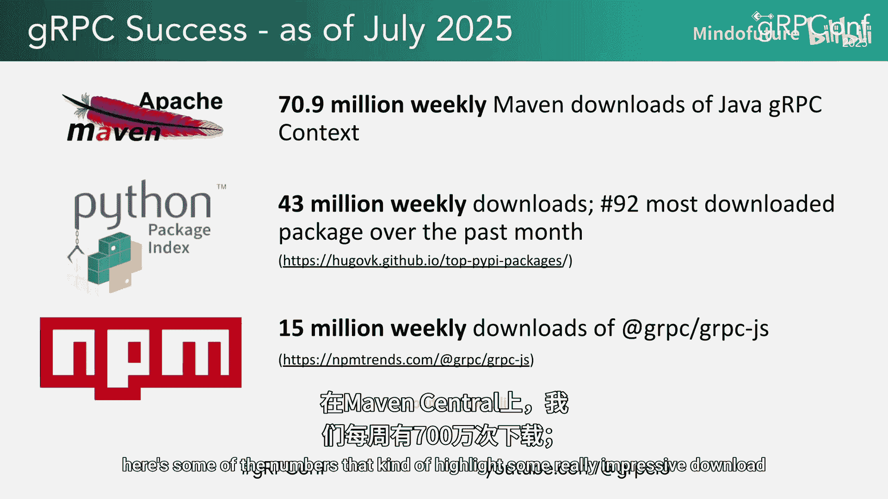
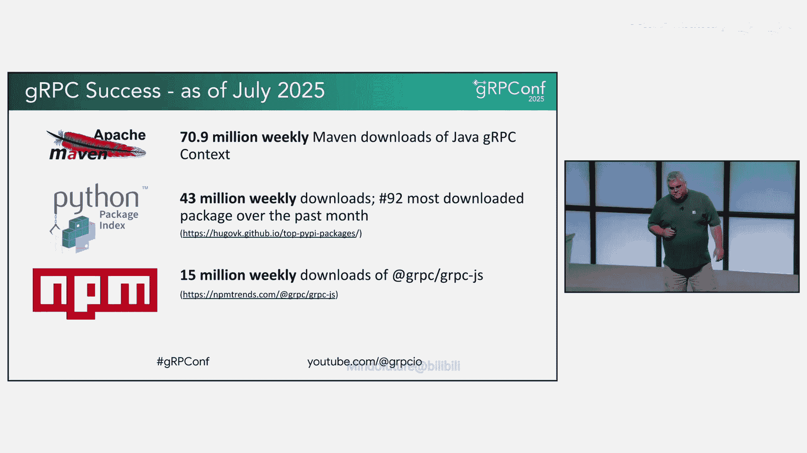
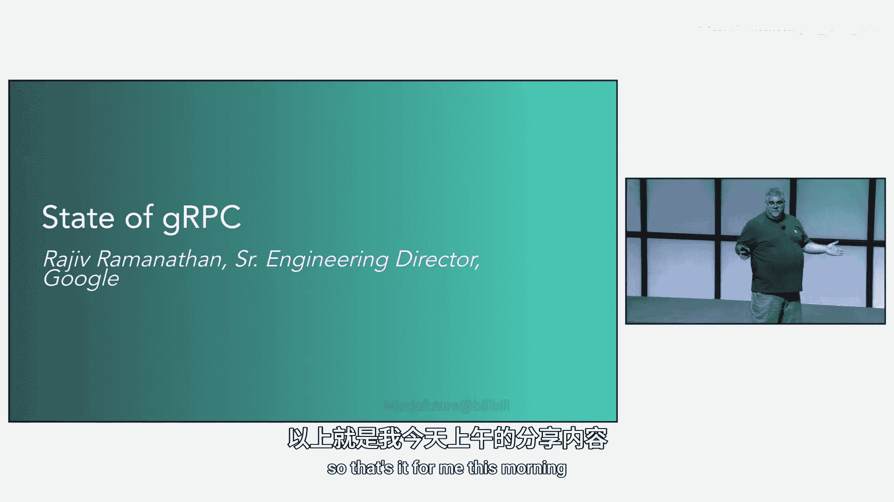

# 001：欢迎与开幕致辞 🎤

在本节课中，我们将学习gRPC Conf 2025开幕致辞的核心内容，了解gRPC项目的现状、社区动态以及未来的发展方向。

大家好，欢迎来到gRPC Conf。我是Kevin Nelson，今晚的主持人。我是gRPC指导委员会的新成员，同时也是本次会议的程序主席，负责筛选我们所有的精彩演讲。

说到演讲，我们邀请了来自许多优秀公司的演讲者，包括Apple、Cloudflare、Mastercard、Netflix、WSO2、LinkedIn、Reddit等众多公司。能再次来到这里，真的非常令人兴奋。

## 社区互动与回顾

上一节我们介绍了本次会议的基本情况，本节中我们来看看社区的参与情况。

首先，我想了解一下大家的参与情况。去年对gRPC而言是非常重要的一年，我们庆祝了其十周年纪念。令人兴奋的是，gRPC依然保持着强大的生命力，我们今天将为大家介绍许多超级激动人心的新内容。现在，我们即将迎来它的第十一个年头。

我想感谢所有到场的各位。我知道大家都和我一样，日程繁忙，有很多事情要处理，能来到这里实属不易。希望我们精心准备的内容能让大家今天有所收获，享受学习过程，并结识gRPC团队的优秀成员。

以下是关于参会者背景的几个问题：
*   有多少人来自本地湾区？
*   有多少人来自加州以外的美国其他地区？
*   有多少人是第一次参加gRPC Conf？
*   有多少人参加了之前在底特律的会议？

接下来，我想了解大家使用的编程语言情况：
*   有多少人在使用gRPC Java或Kotlin？
*   有多少人在使用Python？
*   有多少人在使用.NET/C#？
*   有多少人已经在使用Rust？这是我们今天超级兴奋的新内容，我们正在进行早期预览，并准备了相关的代码实验室。这是几年前在gRPC Conf和KubeCon上从社区听到的需求，我们为此组建了团队并努力开发。
*   有多少人在使用超过一种语言？超过两种？超过三种？有没有使用超过四种的多语言开发者？

## 致谢与项目进展

在进入正题之前，我要感谢一些人。

首先，感谢Google Cloud作为钻石赞助商，提供了场地、食物、T恤、背包等所有支持。我和gRPC团队都非常感激Google的帮助，让今天的活动得以举办。

其次，感谢CNCF（云原生计算基金会）。gRPC团队要感谢CNCF，我们在项目发展和本次会议筹备中得到了CNCF许多人的大量支持。我们正在申请CNCF毕业阶段，这是CNCF项目生命周期的最高阶段，标志着项目达到了最高水平的成熟度、采用率和社区支持。在此过程中，我们与CNCF紧密合作，并在其帮助下，彻底重写了我们的治理结构，创建了新的gRPC指导委员会来帮助推动gRPC的未来方向。我们将在下周内向CNCF TOC提交毕业申请。今天下午3点15分，Richard Bellville将上台详细介绍我们的治理变革，如果你对此感兴趣或有任何反馈，欢迎前往聆听。

接下来，感谢程序委员会的Antoine、Eric和Trinniy，他们帮助我决定和优先安排了今天的内容。

我还要感谢组织委员会的Kathy、Cellia、Cheryl和Stay，他们在过去九个月里筹备会议，安排场地、食物等所有细节。特别感谢Kathy在各方面的大力支持。

gRPC项目成立了新的指导委员会来帮助指引方向。如果你看到这些成员，请随时向他们提出你的想法。他们今天都在现场，这是一群长期参与和贡献于gRPC的人，正在帮助我们确定发展方向，满足用户需求。祝贺并欢迎台上的各位：Antoine、April、Craig、Gina、我自己、Mark和Pur。

此外，今天有超过30名gRPC团队成员到场，他们来自Google、Apple、LinkedIn、Datadog、Microsoft等公司。

最后，我想表彰两位来自社区的杰出贡献者。Lucofranco在我们Rust实现的早期提供了巨大帮助。我们与他合作，共同开发了即将作为gRPC官方支持语言发布的Rust版本。另一位是来自Datadog的Antoine，他为Go代码库做出了大量重大贡献，大约一年前我们晋升他为维护者。

## 参与渠道与资源更新

上一节我们感谢了各方支持，本节中我们来看看如何与gRPC社区互动并获取最新资源。

我想提醒大家几个关键的链接和渠道，以便了解更多信息并与gRPC团队互动。

以下是主要的参与渠道：
*   **文档**：访问 `grpc.io`。
*   **Google群组**：`groups.google.com/forum/#!forum/grpc-io`。这是与其他gRPC用户交流的好地方，可以分享想法、提问或讨论有趣的用法。
*   **YouTube频道**：我们收到了反馈，开发者越来越多地从YouTube获取文档。因此我们投入了大量精力，创建了许多视频内容。
*   **Meetup**：我们在Sunnyvale（谷歌园区）和班加罗尔有线下聚会，也有虚拟聚会。欢迎加入。
*   **社交媒体**：我们的公告（如gRPC Conf消息）会发布在X（原Twitter）上。

正如之前提到的，我们根据大家的反馈，对开发者指南进行了大量改进。

以下是资源更新的具体内容：
*   新增了6个之前没有的新用户指南。
*   增加了许多新示例。
*   本周发布了新的代码实验室，采用了更易使用的新格式，包括Rust的新实验。今天全天都会有代码实验室活动，如果你是gRPC新手或想尝试新语言，这是一个很好的起点。
*   最后，如前所述，我们制作了大量新的YouTube视频。今天的活动视频将发布在CNCF YouTube频道以及gRPC团队的YouTube频道上。今年晚些时候在班加罗尔举行的活动内容也会发布。

## 项目增长与数据

我想展示一个我总是在这种活动或KubeCon演讲前查看的图表，它反映了我们的发展趋势。

我们的主代码库（图中红色部分）清晰地显示，gRPC持续增长，保持其重要性，用户数量随时间不断增加。这对于一个拥有11年历史、经历了11年错误修复和性能改进的项目来说，是一个很好的迹象。感谢大家帮助gRPC项目取得今天的成就。

以下是一些令人印象深刻的下载统计数据：
*   **Maven Central（Java）**：每周700万次下载。
*   **Python**：每周4300万次下载。
*   **NPM**：每周1500万次下载。

这些数字非常惊人，我们很高兴看到它们持续增长，并且每年都在不断攀升。

本节课中我们一起学习了gRPC Conf 2025的开幕致辞，了解了gRPC社区的活力、项目的最新进展（包括向CNCF毕业的申请、新治理结构、Rust支持等），以及丰富的学习资源和持续增长的项目数据。

我的部分到此结束，稍后我会回来。现在，有请Google高级总监Rajeiv，他将谈谈我们今天看到的gRPC发展现状与激动人心的前景。

谢谢。